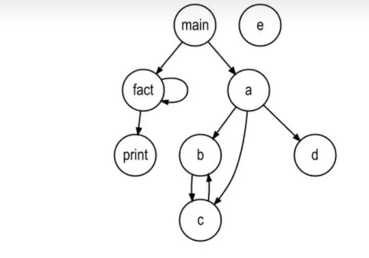
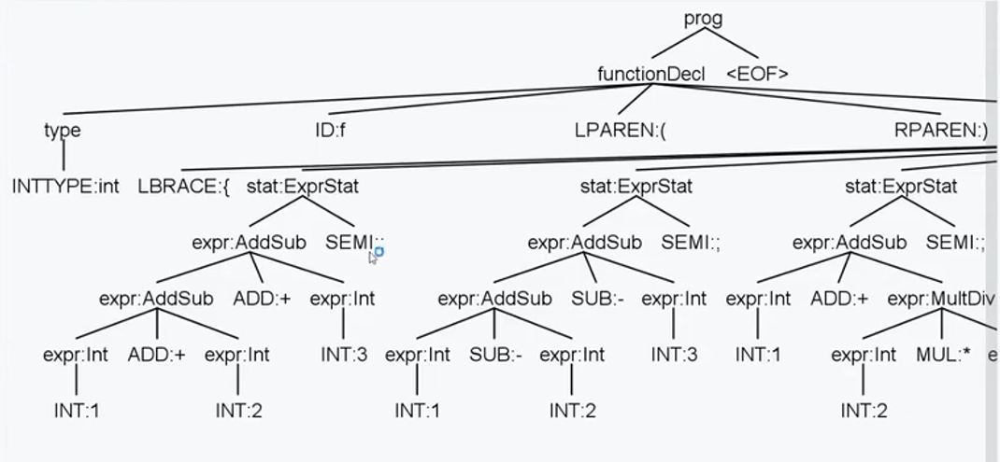
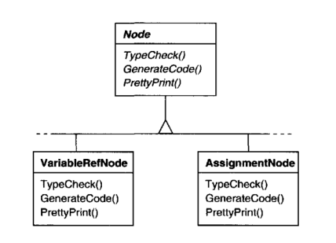
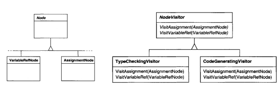
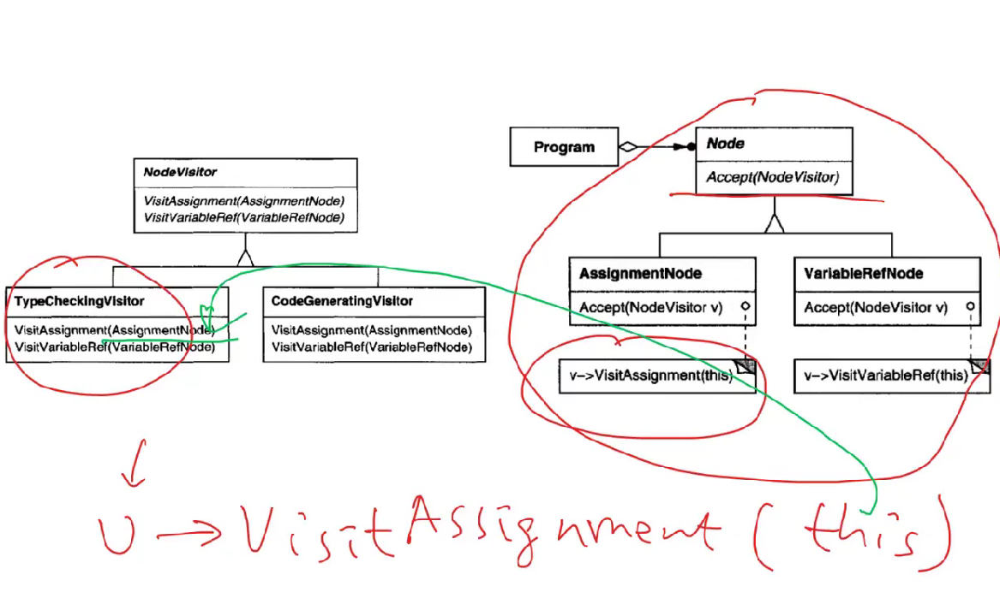
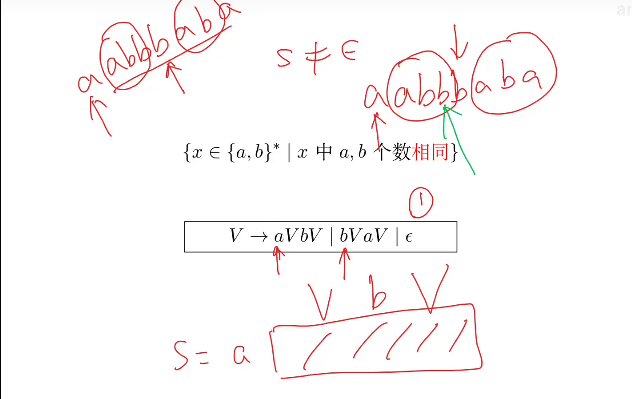
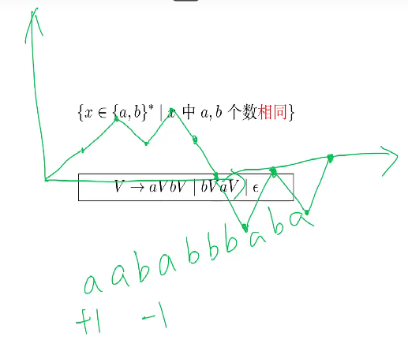
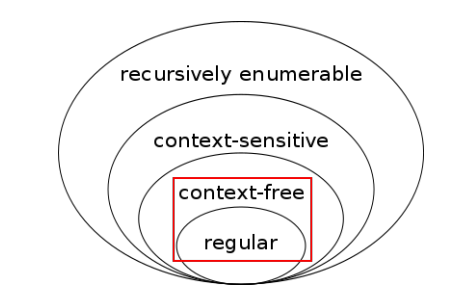
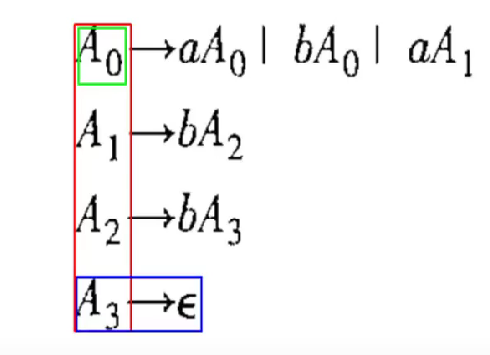
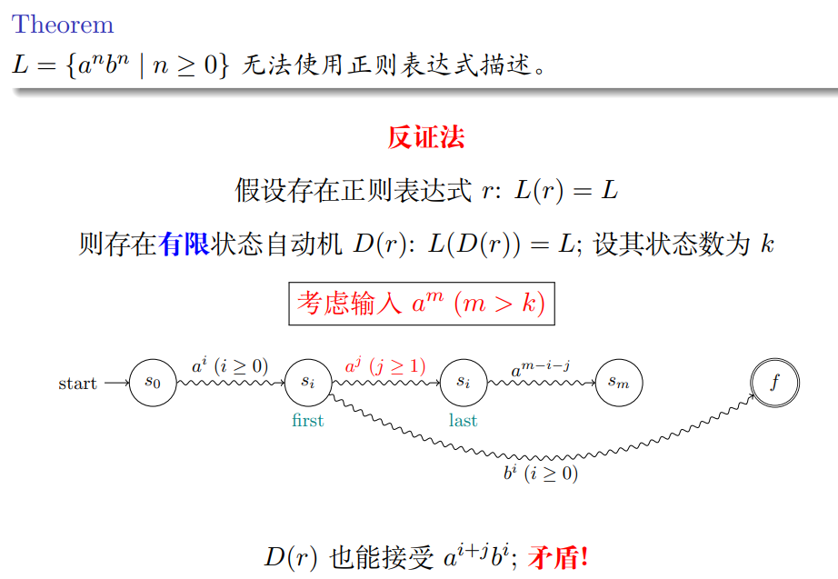

# ch06

2023.3.29



## 监听器模式

时机问题：监听enter还是exit

CallGraphListener.java

```java
public class CallGraphListener extends CymbolBaseListener {
  private Graph graph = new Graph();
  String currentFunctionName = null;

  @Override
  public void enterFunctionDecl(CymbolParser.FunctionDeclContext ctx) {
    currentFunctionName = ctx.ID().getText();
    graph.addNode(currentFunctionName);
  }

  @Override
  public void enterCall(CymbolParser.CallContext ctx) {
    String callee = ctx.ID().getText();
    graph.addEdge(currentFunctionName, callee);
  }

  public Graph getGraph() {
    return this.graph;
  }
}
```


## 计算器

### 功能：

+-*/（）改变优先级

block函数体，暂时只关心表达式语句



### 在DFS过程中计算子节点的值

监听器模式问题：每一个事件方法，返回值都为void，但是计算器需要返回值

**退出相应节点的时候计算值**

**退出表达式语句时，表示值已经计算完毕，可以直接打印**

#### 解决方案

* 抛弃listener转向visitor

* 不能使用全局变量这种方法，ANTLR4使用标注语法分析树Annotated Parse Tree

##### 标注语法分析树Annotated Parse Tree

将值直接存储在节点上，（标注）

hashmap， key为node， value为标注值

hashmap: PaeseTreeProperty\<Type>

##### override：

CalcListener.java

```java
public class CalcListener extends CymbolBaseListener {
  private ParseTreeProperty<Integer> values = new ParseTreeProperty<>();

  @Override
  public void exitExprStat(CymbolParser.ExprStatContext ctx) {
      //退出表达式节点
      //打印表达式结果，值等于子节点值
    System.out.println(ctx.expr().getText() + 
                       " = " + values.get(ctx.expr()));
  }

  @Override
  public void exitAddSub(CymbolParser.AddSubContext ctx) {
      //左节点+/-右节点
      //是+还是-已经标注
      //左节点和右节点也有标注
    int lvalue = values.get(ctx.lhs);
    int rvalue = values.get(ctx.rhs);

    if (ctx.op.getType() == ADD) {
      values.put(ctx, lvalue + rvalue);
    } else {
      values.put(ctx, lvalue - rvalue);
    }
  }

  @Override
  public void exitParens(CymbolParser.ParensContext ctx) {
     //(expr) expr
     //形同去括号，从子节点中取出放到括号节点
     //expr为子节点
    values.put(ctx, values.get(ctx.expr()));
  }

  @Override
  public void exitNegate(CymbolParser.NegateContext ctx) {
      //从子节点取值，取负号，标记
    values.put(ctx, -values.get(ctx.expr()));
  }

  @Override
  public void exitInt(CymbolParser.IntContext ctx) {
     //把值取出来，放到相应节点
     //ctx当前节点
    values.put(ctx, Integer.valueOf(ctx.INT().getText()));
  }

  @Override
  public void exitPower(CymbolParser.PowerContext ctx) {
      //幂运算
      //同理
    int lvalue = values.get(ctx.lhs);
    int rvalue = values.get(ctx.rhs);

    values.put(ctx, Integer.parseInt(String.valueOf
                                     (Math.pow(lvalue, rvalue))));
  }

  @Override
  public void exitMultDiv(CymbolParser.MultDivContext ctx) {
      // * or /
    int lvalue = values.get(ctx.lhs);
    int rvalue = values.get(ctx.rhs);

    if (ctx.op.getType() == MUL) {
      values.put(ctx, lvalue * rvalue);
    } else {
      values.put(ctx, lvalue / rvalue);
    }
  }
}
```

测试程序

Calculator.java

```java
package calc;

import org.antlr.v4.runtime.CharStream;
import org.antlr.v4.runtime.CharStreams;
import org.antlr.v4.runtime.CommonTokenStream;
import org.antlr.v4.runtime.tree.ParseTree;
import org.antlr.v4.runtime.tree.ParseTreeWalker;

import java.io.FileInputStream;
import java.io.IOException;
import java.io.InputStream;
import java.nio.file.Path;

import calc.listener.CalcListener;
import cymbol.CymbolLexer;
import cymbol.CymbolParser;

public class Calculator {
  public static void main(String[] args) throws IOException {
    InputStream is = new FileInputStream(Path.of("src/main/antlr/cymbol/cymbol-calculator.txt").toFile());
//    InputStream is = new FileInputStream(Path.of("src/main/antlr/cymbol/cymbol-calc-stat.txt").toFile());
    CharStream cs = CharStreams.fromStream(is);
    CymbolLexer lexer = new CymbolLexer(cs);
    CommonTokenStream tokens = new CommonTokenStream(lexer);

    CymbolParser parser = new CymbolParser(tokens);

    // for CalcListener and cymbol-calculator.txt
    ParseTree tree = parser.prog();
    ParseTreeWalker walker = new ParseTreeWalker();
    CalcListener calcListener = new CalcListener();
    walker.walk(calcListener, tree);

//    for CalcVistor and cymbol-calc-stat.txt
//    ParseTree tree = parser.block();
//    CalcVisitor caclVisitor = new CalcVisitor();
//    caclVisitor.visit(tree);
  }
}
```


## 访问者visitor

自己遍历语法分析树，自己掌握遍历过程

更加灵活和复杂



#### 任务：

* 类型检查

* 代码生成

* 打印

##### 缺点：

* 在每一个节点里都要有一个相应的实现，合起来才是一个整体

* 如果我想要新增一个任务，我就必须修改每一个类，并添加任务方法，在软件工程中修改旧代码不符合设计理念



visitor：

将node类结构和在类上的方法解耦合

如果想要新增，就新增一个对应方法的visitor，解决了上述的两个缺点，创建一个新的类即可

##### 两个类结构：

一个是tree上的node结构，一个是能够访问node的visitor

##### 两个类的互动：



**<u>双重分派</u>来确定具体调用的是哪一个方法**

accept方法接受一个visitor，实现 : v->visitAssignment(this)，v即是接受的visitor

如果v的类型是TypeCheckingVisitor，那么调用的就是TypeCheckingVisitor的visitor

this的类型就是AssignmentNode，拿到的就是AssignmentNode

所以visitAssignment就拿到了AssignmentNode对象，就可以通过AssignmentNode访问对象的其他方法

参考资料：

《设计模式 可复用面向对象软件的基础》


## 理论：上下文无关文法Context-Free Grammar (CFG)

### 定义

Definition (Context-Free Grammar (CFG); 上下文无关文法) 

上下文无关文法 G 是一个四元组 G = (T, N, S, P): 

* T 是终结符号 (Terminal) 集合, 对应于词法分析器产生的词法单元

* N 是非终结符号 (Non-terminal) 集合

* S 是开始 (Start) 符号 (S ∈ N 且唯一) 

* P 是产生式 (Production) 集合 

* 

  A ∈ N → α ∈ (T ∪ N) ∗ 

* 头部/左部 (Head) A: 单个非终结符 

* 体部/右部 (Body) α: 终结符与非终结符构成的串, 也可以是空串 ϵ

### 上下文敏感文法Context-Sensitive Grammar (CSG)

开始符能否展开，取决于上下文

例子：

S → aBC

S → aSBC 

CB → CZ

 CZ → WZ 

WZ → WC 

WC → BC 

aB → ab //B能否展开为ab取决于B前的a

bB → bb 

bC → bc 

cC → cc

#### ANTLR4使用BNF拓展泛式

[Extended] Backus-Naur form ([E]BNF)

三为图灵奖得主

John Backus (1924 ∼ 2007) 1977 (FORTRAN)

Peter Naur (1928 ∼ 2016) 2005 (ALGOL60) 

Niklaus Wirth (1934 ∼) 1984 (PLs; PASCAL)

##### 语义: 上下文无关文法 G 定义了一个语言 L(G)

### 推导 (Derivation)

推导即是将某个产生式的左边替换成它的右边 每一步推导需要选择替换哪个非终结符号, 以及使用哪个产生式

E =⇒ −E : 经过一步推导得出 

E +=⇒ −(id + E) : 经过一步或多步推导得出 

E ∗=⇒ −(id + E) : 经过零步或多步推导得出

##### Leftmost (最左) Derivation / Rightmost (最右) Derivation ：

每一步都选择最左或者最右展开

##### 句型 Definition (Sentential Form) 

如果 S ∗=⇒ α, 且 α ∈ (T ∪ N) ∗ , 则称 α 是文法 G 的一个句型。

推导过程中的每一个中间结果叫句型

##### 句子 Definition (Sentence)

如果 S ∗=⇒ w, 且 w ∈ T ∗ , 则称 w 是文法 G 的一个句子。

只有终结符构成的，叫句子

##### Definition (文法 G 生成的语言 L(G))

文法 G 的语言 L(G) 是它能推导出的**所有句子**构成的集合。

 w ∈ L(G) ⇐⇒ S ∗=⇒ w

#### 关于文法 G 的两个基本问题:

*  Membership 问题: 给定字符串 x ∈ T ∗ , x ∈ L(G)? 
*  L(G) 究竟是什么

##### 例子

* 字母表 Σ = {a, b} 上的所有**回文串** (Palindrome) 构成的语言：

S → aSa S → bSb S → a S → b S → ϵ

* {b n a mb 2n | n ≥ 0, m ≥ 0}

S → bSbb | A

A → aA | ϵ

* {x ∈ {a, b} ∗ | x 中 a, b 个数相同}

V → aVbV | bVaV | ϵ



必定存在一个b，使得前后的ab个数相同（符合V的要求）

如何证明绿色箭头值的b一定存在？

画一个横纵坐标的图示方法：

a：+1（往上走）；b：-1（往下走）

可以方便的找到与x轴交叉的b



* {x ∈ {a, b} ∗ | x 中 a, b 个数不同}

上下文无关文法没有定义集合减法

S → T | U 

T → VaT | VaV

U → VbU | VbV 

V → aVbV | bVaV | ϵ

#### 为什么不使用优雅、强大的正则表达式描述程序设计语言的语法?

正则表达式的表达能力严格弱于上下文无关文法

每个正则表达式 r 对应的语言 L(r) 都可以使用上下文无关文法来描述



**正则表达式可以表达的：r = (a|b) ∗ abb**

NFA直接读出上下文无关文法：

为每个状态设置一个非终结符



**正则表达式不可以表达的：**

L = {a<sup>n</sup>b<sup>n</sup> | n ≥ 0} 无法使用正则表达式描述。



m>k，至少存在两个状态是同一个状态

第一次遇到si和最后一次遇到si，消耗j个a

##### Pumping Lemma for Context-free Language

L = {a <sup>n</sup> b<sup> n</sup> c<sup> n</sup> | n ≥ 0}无法用上下文无关文法表示，能用上下文敏感文法表示