# ch07

 LL(1) 语法分析器

构建语法分析树: 自顶向下 vs. 自底向上

只考虑无二义性的文法 这意味着, 每个句子对应唯一的一棵语法分析树

自顶向下的、 递归下降的、 基于预测分析表的、 适用于LL(1) 文法的、 LL(1) 语法分析器

## 自顶向下构建语法分析树

* 根节点是文法的起始符号 S 
* 每个中间节点表示对某个非终结符应用某个产生式进行推导 (Q : 选择哪个非终结符, 以及选择哪个产生式) 
* 在推导的每一步, L**L**(1) 总是选择最左边的非终结符进行展开
* **L**L(1): 从左向右读入词法单元
* 叶节点是词法单元流 w$ 仅包含终结符号与特殊的文件结束符 $ (EOF)

### 递归下降

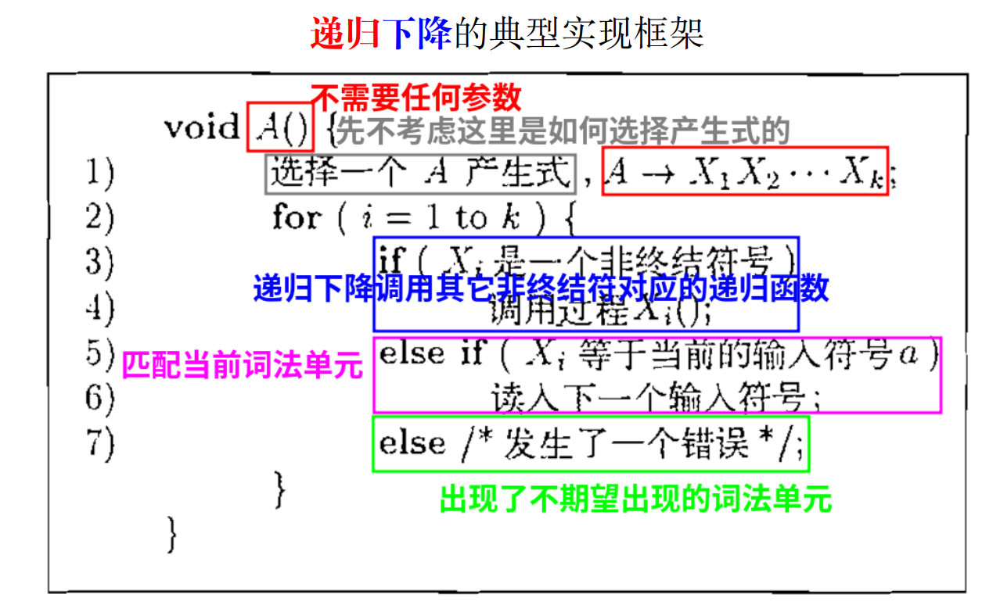

递归下降是LL(1)语法分析器常用的实现方式

为每个非终结符写一个递归函数 内部按需调用其它非终结符对应的递归函数, 下降一层

为了实现额外的任务，可以加参数和返回值

#### 实现过程

* 先选择一个A的产生式，1-k
* for循环处理每个X~1~ ~ X ~k~
* X为非终结符，调用X对应的递归函数
* X为终结符
  * X~i~=a 匹配上当前的词法单元
  * X~i~！=a 出现错误

### 优缺点

#### 优点

算法简单

#### 缺点

能处理文法（上下文无关文法）的种类很少

如果不能处理，改造文法复杂

### 演示递归下降过程

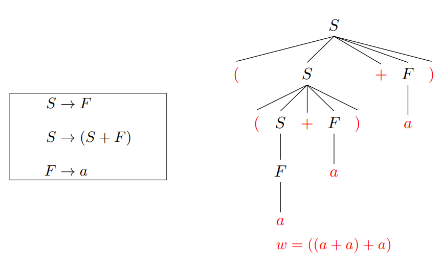

每次都选择语法分析树最左边的非终结符进行展开

#### 同样是展开非终结符 S, 为什么前两次选择了 S → (S + F), 而第三次选择了 S → F?

因为它们面对的当前词法单元不同

#### 使用==预测分析表==确定产生式

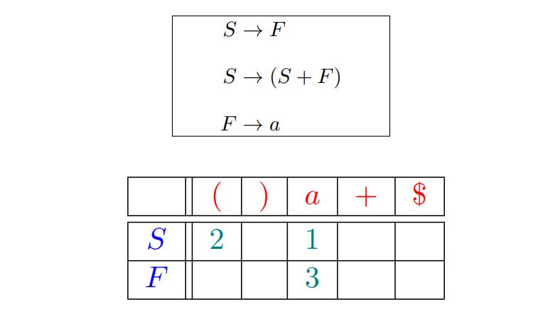

指明了每个**非终结符**在面对不同的**词法单元或文件结束符**时, 该选择哪个**产生式** (按编号进行索引) 或者**报错** (空单元格)

* 只有第二条会产生小括号，如果读入字符是（，就只能选第二条
* 第三次是F，面对的读入字符是a，所以只会选择3

### LL(1) 文法Definition ：

如果文法 G 的预测分析表是无冲突的, 则 G 是 LL(1) 文法。

无冲突: 每个单元格里只有一个产生式 (编号)

对于当前选择的**非终结符**, 仅根据输入中**当前的词法单元** (LL(1)) 即可确定需要使用哪条**产生式**

### 递归下降的、预测分析实现方法

#### 框架：

假定**预测分析表**已经被构建出来了

```c
procedure match(t)
 if token = t then
 token ← next-token()
 else
 error(token, t)
     
procedure S()
 if token = ‘(’ then
 match(‘(’)
 S()
 match(‘+’)
 F()
 match(‘)’)
 else if token = ‘a’ then
 F()
 else
 error(token, {‘(’, ‘a’})

procedure F()
 if token = ‘a’ then
 match(‘a’)
 else
 error(token, {‘a’})

```

### 计算给定文法 G 的预测分析表

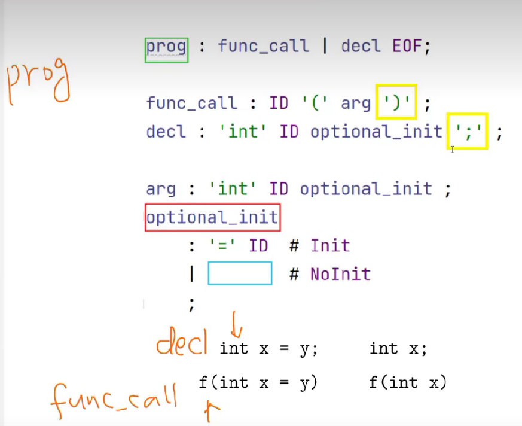

* 选择decl展开因为只有这样才能在后面产生int
* 选择func_call是因为只有这样才能产生ID这个终结符

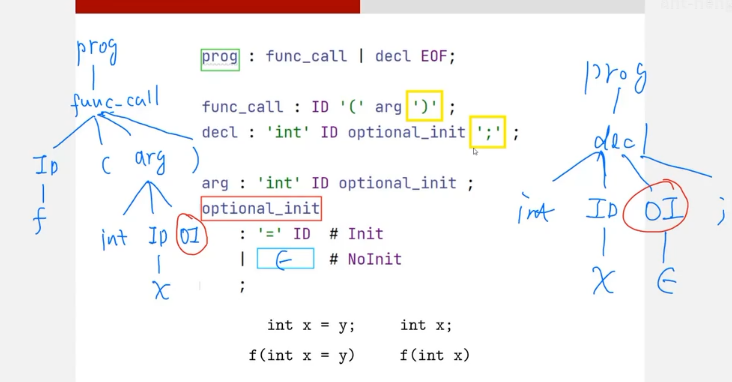

#### 什么时候选择非终结符的ε产生式

只有在这个非终结符的后面的这个终结符可能是我想要的终结符的情况下，才可以选择将其变无

如果有一个终结符，而且这个终结符有一个产生式，变成ε，或者经过很多步推导可以生成ε，后面的非终结符使我们接下来要匹配的终结符，接下来要匹配的终结符最好就是当前指针要指向的终结符

要看这个非终结符有哪些终结符跟在后面


#### First(α) 集合 Definition

**First(α) 是可从 α 推导得到的句型的==首终结符号==的集合**

对于任意的 (产生式的右部) α ∈ (N ∪ T) ∗ : 

First(α) = { t ∈ T ∪ {ϵ} | α ∗=⇒ tβ ∨ α ∗=⇒ ϵ } .  （*==>指经过任意步推导）β是任意非终结符和终结符的集合，可能为空

考虑非终结符 A 的所有产生式 A → α1, A → α2, . . . , A → αm, 如果它们**对应的 First(αi) 集合互不相交**, 则只需查看当前输入词法单元, 即可确定选择哪个产生式 (**或报错**)

例：

First(prog) = {'int', ID}

**First是想知道，如果选择了某种特定的展开方式，会产生哪些首终结符，有没有可能是指针指向的字符**


#### Follow(A) 集合 Definition 

**Follow(A) 是可能在某些句型中紧跟在 A 右边的终结符的集合**

对于任意的 (产生式的左部) 非终结符 A ∈ N : 

​	Follow(A) = { t ∈ T ∪ {$} | ∃s. S ∗=⇒ s ≜ βAtγ } .

β和γ是任意非终结符和终结符的集合，可能为空

如果退出来A这个非终结符，而且后面是终结符，t ∈ Follow(A)， t有可能是\$（s是开始符号，而$是输入右端的结束标记）

考虑产生式 A → α, **如果从 α 可能推导出空串 (α ∗=⇒ ϵ), 则只有当当前词法单元 t ∈ Follow(A), 才可以选择该产生式**(意味着A会消失)


#### 计算算法

##### 先计算每个符号 X 的 First(X) 集合

```c
procedure first(X)
 if X ∈ T then ▷ 规则 1: X 是终结符
 	First(X) = X
 for X → Y1Y2 . . . Yk do ▷ 规则 2: X 是非终结符
     //Y的首终结符包含于X的首终结符
     //Y如果变成ε不代表X也会变成ε
 	First(X) ← First(X) ∪ {First(Y1) \ {ϵ}}  
 	for i ← 2 to k do
        //看ε能不能由Y1推出来
 		if ϵ ∈ L(Y1 . . . Yi−1) then
 			First(X) ← First(X) ∪ {First(Yi) \ {ϵ}}
	//看完1~k
	//L(Y1 . . . Yk)表示Y1~Yk都能退出ε
 	if ϵ ∈ L(Y1 . . . Yk) then ▷ 规则 3: X 可推导出空串
 		First(X) ← First(X) ∪ {ϵ}
```

不断应用上面的规则, 直到每个 First(X) 都不再变化 **(不动点!!!)**

##### 再计算每个符号串 α 的 First(α) 

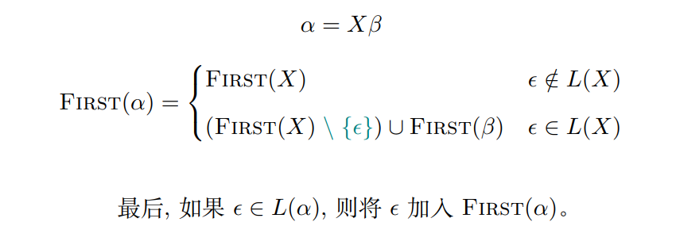

##### 例子

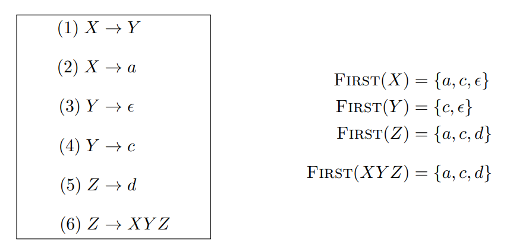


##### 为每个非终结符 X 计算 Follow(X) 集合

```c
 procedure follow(X)
 	for X 是开始符号 do ▷ 规则 1: X 是开始符号
 		Follow(X) ← Follow(X) ∪ {$}
 	for A → αX do ▷ 规则 2: X 是某产生式右部的最后一个符号
        //所有能跟在A后的终结符都可能跟在S后面
 		Follow(X) ← Follow(X) ∪ Follow(A)
 	for A → αXβ do ▷ 规则 3: X 是某产生式右部中间的一个符号、
        //X是某个产生式中间的符号
        //β能推出来的终结符一定能跟在X后面
        //ε不一定在X后面
 		Follow(X) ← Follow(X) ∪ (First(β) \ {ϵ})
 		if ϵ ∈ First(β) then
			 Follow(X) ← Follow(X) ∪ Follow(A)
```

不断应用上面的规则, 直到每个 Follow(X) 都不再变化 **(不动点!!!)**

##### 例子

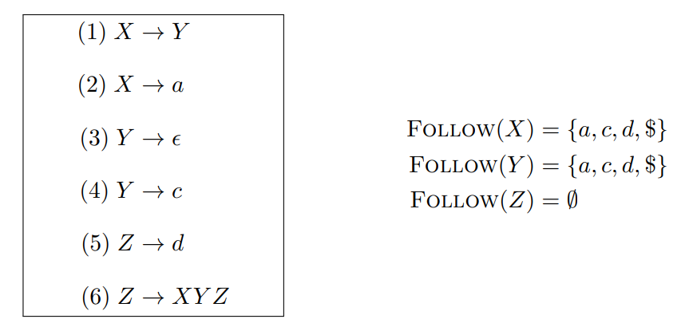

FL(X)先看F(Y)，再看F(Z)，再看ε是否属于F(XYZ)

FL(X)⊆FL(Y)  F(Z)⊆FL(Y)，再看Z能不能产生ε，不能，FL(Y)结束

FL(Z)⊆FL(Z) FL(Z)=∅

### 根据First 与 Follow 集合计算给定文法 G 的预测分析表

对应每条产生式 A → α 与终结符 t, 如果 

* t ∈ First(α)  

* α ∗=⇒ ϵ ∧ t ∈ Follow(A)  //α被变为ε消掉

则在表格 [A,t] 中填入 A → α (编号)。

##### 例子

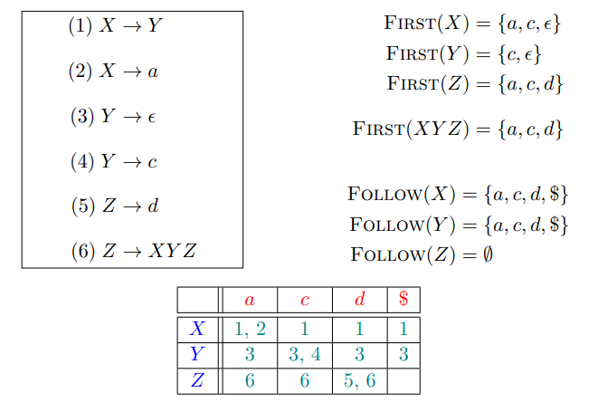

(Y,3)出现冲突，该文法不是LL(1)文法

### LL(1) 文法 Definition

如果文法 G 的==预测分析表==是无冲突的, 则 G 是 LL(1) 文法。

### LL(1) 文法不能够处理的

当前要展开A，看到t这个词法单元，可以选择一个没有冲突的、唯一的产生式，但不意味着接着走下去不会出错

* t ∈ First(α) (1)

* ϵ ∈ First(α) ∧ t ∈ Follow(A) (2)

当下的选择未必正确, 但 “你别无选择”。

### 总结LL(1) 语法分析器

* L : 从左向右 (left-to-right) 扫描输入 

* L : 构建最左 (leftmost) 推导 
* 1 : 只需向前看一个输入符号便可确定使用哪条产生式

### LL(0)

输入什么都不看，闭着眼的语法分析器:

只包含一个字符串的文法

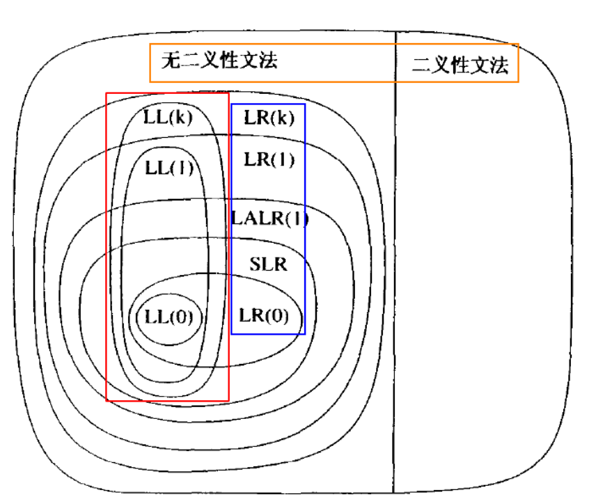

### 非递归的预测分析算法（非重点，现在一般写递归的，模块性强）

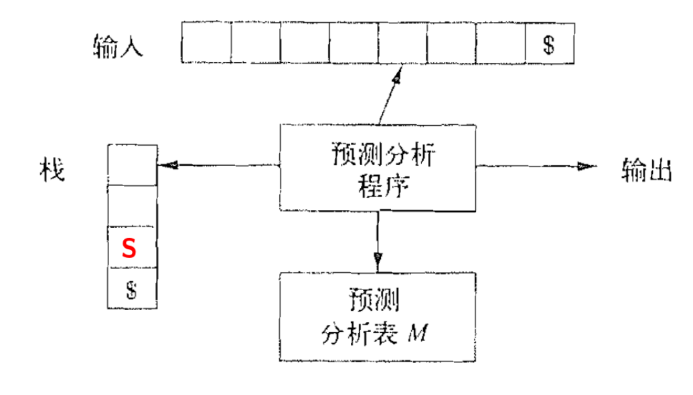

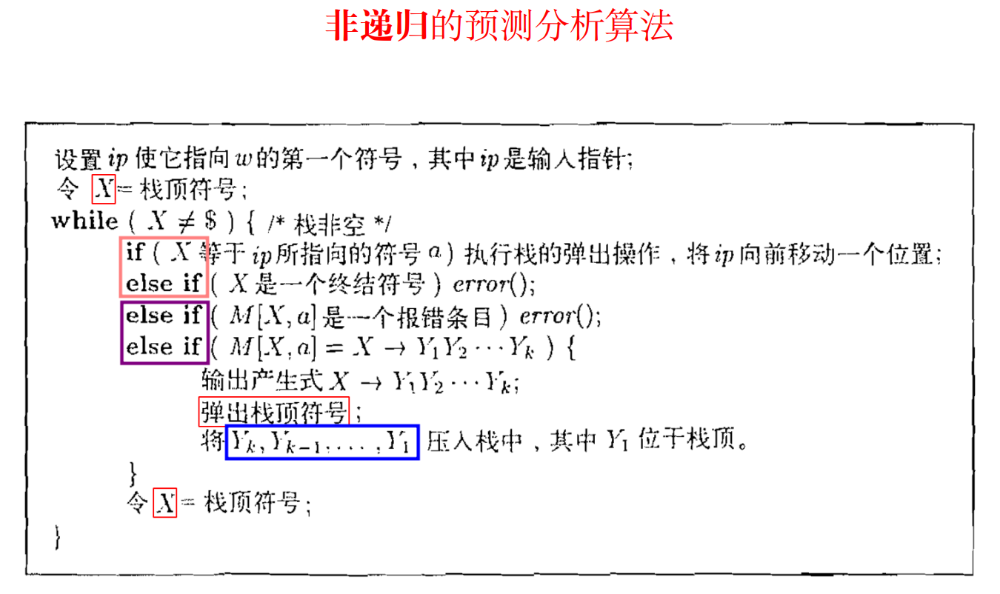

### 不是LL(1)文法的改造文法办法

* **消除左递归** 
* **提取左公因子**

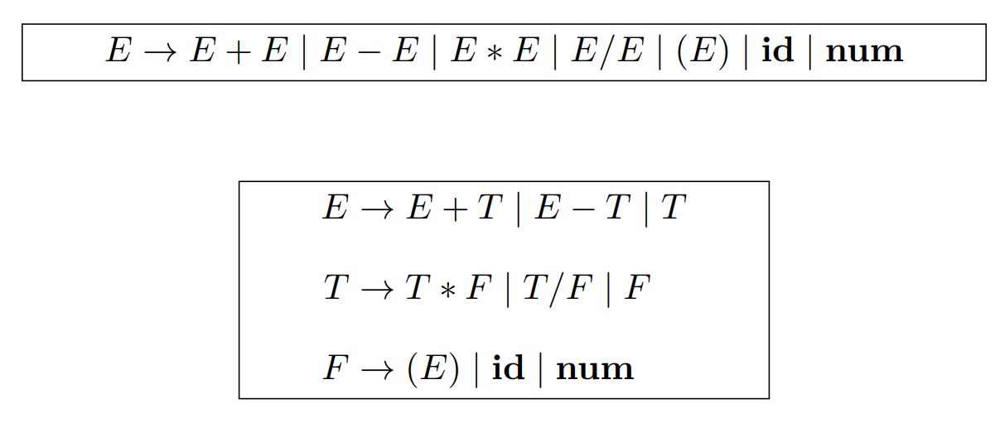

左递归改完是左递归

E 在不消耗任何词法单元的情况下, 直接递归调用 E, 造成死循环

解决方案：

左递归改为右递归

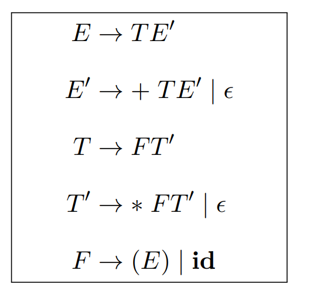

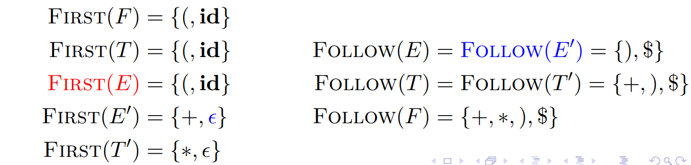

### 直接左递归 (Direct Left Recursion)消除左递归

#### 例子：

* A → Aα | β

* A → βA′

  A ′ → αA′ | ϵ

#### 范式

* A → Aα1 | Aα2 | . . . Aαm | β1 | β2 | . . . βn
* 其中, βi 都不以 A 开头

改为：

* A → β1A ′ | β2A ′ | · · · | βnA′ 

  A ′ → α1A ′ | α2A ′ | · · · | αmA ′ | ϵ

### 间接左递归 (Indirect Left Recursion)消除左递归

单看每一条产生式都没有左递归

* S → Ac | c 

  A → Bb | b 

  B → Sa | a
  
  * S =⇒ Ac =⇒ Bbc =⇒ Sabc：构成了左递归

改间接左递归比较麻烦，绕了一圈回到自己，消除需要满足这样的性质：

如果对满足这样条件的产生式：

A~i~ → A~j~α =⇒ i < j

即：如果右部第一个为非终结符，则要求i < j

即：每推一步，产生出来的非终结符的编号越来越大，所以不可能绕回自己，不可能产生左递归


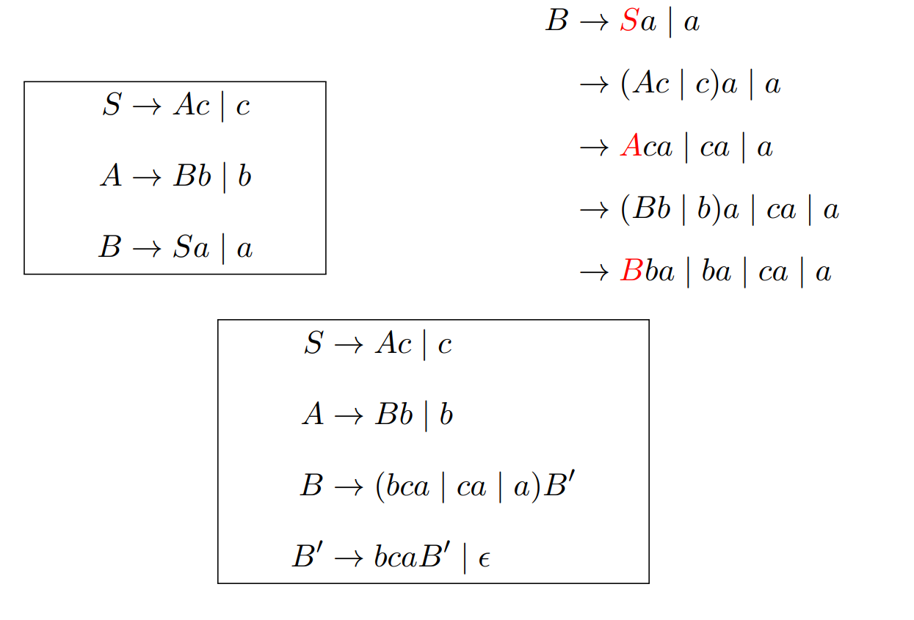

* 产生直接左递归：可以按照之前的方式处理了
* 算法要求: 
  * 文法中不存在环 (形如 A ∗=⇒ A 的推导) 
  * 文法中不存在 ϵ 产生式 (形如 A → ϵ 的产生式)

间接左递归的处理在工程上不是必须的：很多实用的文法不会有间接左递归，为了少量的文法在工程上实现一个理论可行的东西是不明智的

### 提取左公因子 (Left-Factoring)

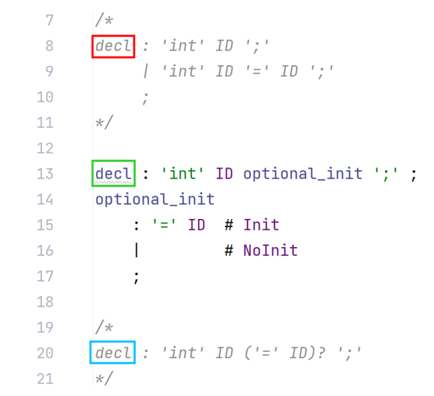

**ANTLR 4 可以处理有左公因子的文法，不需要自己提取**

提取公共部分'int' ID

如果提取完是空就空着

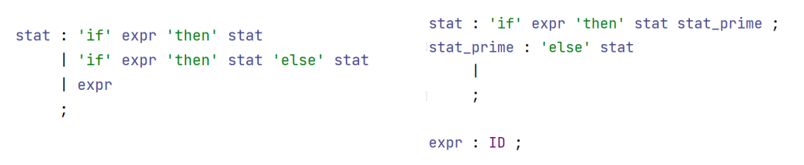

很明显, **提取左公因子无助于消除文法二义性**