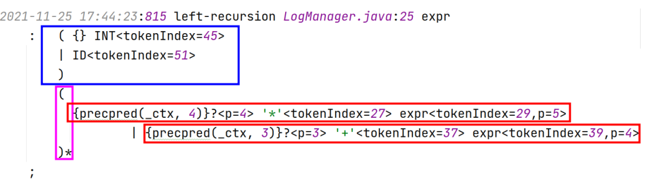
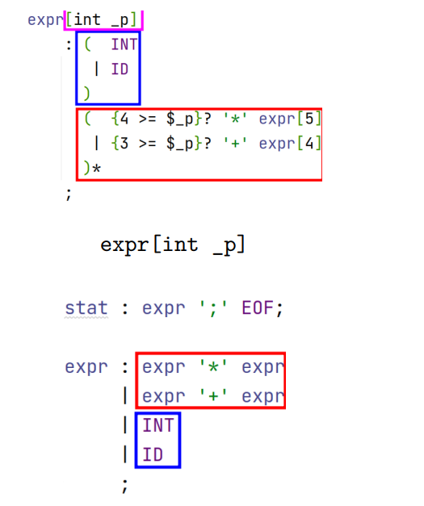
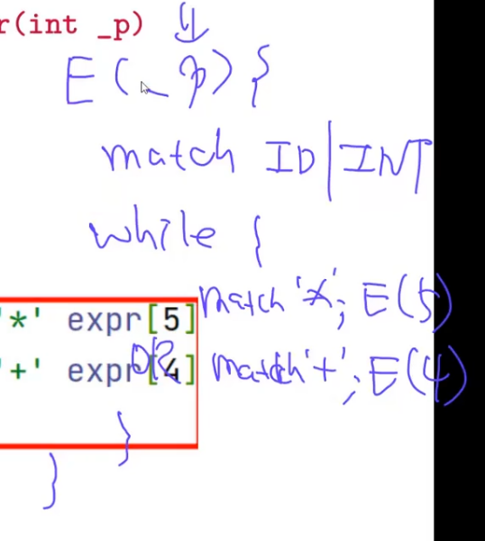

# ch08-parser-allstar

* ANTLR 4 自动将类似 expr 的**左递归规则重写成非左递归形式** 
* ANTLR 4 提供**优秀的错误报告功能**和**复杂的错误恢复机制** 
* ANTLR 4 使用了一种名为 **Adaptive LL(∗)** 的新技术
* ANTLR 4 **几乎能处理任何文法** (**二义性文法✓ 间接左递归✗**)

## ANTLR 4 如何处理直接左递归与优先级的

写在前面就是优先级

antlr4 LRExpr -Xlog   生成(.log)文件，即可查看直接左递归文法修改后的样子

简化后：把递归改成循环

4、3、5都是优先级

初始的优先级是倒着从下往上ID: 1、int: 2、expr * ：3、expr +: 4

每match一次就是往下走一层，优先级就要高

如果我想要展开加法，优先级就得大于3

### 优先级上升算法（期末考试要考，画语法树）

一旦进入加法，优先级升为4，因为乘法优先级比加法高，希望乘法的展开在加法后面，乘法更加靠近叶子、更深，所以优先级至少要比加法高；同时避免了加法的右结合（例如1 + 2 + 3）

当递归指针直到2后面的+，无法展开，所以递归结束，返回到E[0]（E[0]处在while循环，因为发生调用了所以优先处理E[4]），然后匹配+，然后递归调用E[4]，E[4]匹配3，结束返回，结束E[0]循环

实现了左结合，并且优先级上升

**根本问题: 究竟是在 expr 的当前调用中匹配下一个运算符, 还是让 expr 的调用者匹配下一个运算符。**

#### 例子：

例子1：

1 + 2 * 3

1 * 2 + 3

但是不是所有左递归优先级都是上升

* 前置运算符：右结合：  -(-(-x))  
* 后置运算符：左结合：( ( ( x!)! )! )
* **左结合的含义：1 + 2 + 3中 1 + 2 要先展开：调用的优先级参数要上升**
* **右结合：调用的优先级参数要不变**

例子2： -a!!

* 优先级：
  * \- : 4 ;  
  * ! : 3 ;  
* \- 想要 实现右结合：不是左递归，所以改写的时候在上面和ID一起，优先级不变
* ！是一元运算符，所以没有E[]
* +左结合，优先级应该上升

例子：-a + b!

* E[4]返回时返回到第一个()的结尾，进入while循环，**返回上一层调用前的时候注意返回后指针指向代码段在哪(返回的地址)**

例子3：

^是右结合，所以展开时调用优先级不变

* For left-associative operators, the right operand gets one more precedence level than the operator itself

* For right-associative operators, the right operand gets the same precedence level as the current operand.

## ANTLR 4 如何进行错误报告与恢复的

### 报错

* LexerNoViableAltException是词法错误：识别到了一个不在词法规约中的字符

* NoViableAltException是文法错误：要对某个非终结符展开的时候，如果有多个备选分支，但是分析后都不能用
  * 输入流中的当前词法单元与当前规则所期望的词法单元不匹配

* InputMismatchException是文法错误：选择了某个备选分支，开始分析时，期望是t这个词法单元，但是指针指向的是a，t != a，想匹配的词法单元不是我想要的
  * 剩余输入不符合当前规则的任何一个备选分支

《ANTLR 4 权威指南》第 9.2 节: 修改和转发 ANTLR 的错误消息

如果想要更加详细的信息：覆写接口方法

### 恢复

#### 恐慌/应急 (Panic) 模式: 

假装成功、调整状态、继续进行

#### 四项基本原则: 

##### (1) 特殊情况, 特殊处理 

如果下一个词法单元符合预期, 则采用 **“单词法符号移除 (single-token deletion)”** 或 **“单词法符号补全 (single-token insertion)” 策略”**

* 单词法符号移除

符号移除：多出一个符号，接下来的符号是期望的，就把多出来的移除

​	

* 单词法符号补全

符号补全：缺一个类名，补全

**单词法：只处理一个单词的情况**

##### (2) 一般情况, 统一处理 

采用 **“同步-返回 (sync-and-return)”** 策略, 使用 **“重新同步集合 (resynchronization set)”** 从当前规则中恢复

例子：

Following({expr, atom}) = { ˆ , ]} 

Following({expr}) = {]}

输入为一对中括号[]：

* ANTLR4能识别，并且补全中间缺少的应该有的内容
* 正常匹配expr和atom：因为没有别的可选项
* int与]不匹配，持续往后扫描，**抛弃一些符号，直到找到一个想要的词法单元**：**即following({expr, atom})集合**，要么是^要么是]，找到了就表明可以恢复
* 这个例子没有抛弃任何符号
* 从atom恢复到expr这一层，下面期望^，但指向的符号是]，所以**扔一些词法单元，直到找到following({expr})== {]}**
* 这一层也没有抛弃任何词法单元
* 从expr恢复到group，group需要]，匹配上了，完成恢复过程
* 恢复：当前符号不是我想要的，哪些符号是我想要的：假设能够匹配成功atom，期望一个幂运算的符号^，假设能够匹配成功expr，期望一个]或)（ 但是‘)’是不可能的，因为前面已经匹配成功‘]’，已经选定了第一条规则 ），这时候正好下一个字符是]，于是匹配掉了，后面的内容就可以正常匹配了
* **恢复是一层一层完成的**
* 蚂蚁蚂蚁的恢复解释：丢弃词法单元直到碰到当前 Following 集合中的某个词法单元，然后从当前规则中恢复，也就是返回上一层，继续分析。比如，在 `【】` 例子中，atom 期望 INT/ID，与 ] 不匹配，则不断丢弃输入中的词法单元，直到遇到 ^ 或者 ]。对于这个例子，恰巧当前词法单元就是 ]，所以并没有丢弃任何词法单元，就能从 atom 中恢复，返回到 expr 层。expr 期望看到 ^，与 ] 也不匹配，则不断丢弃词法单元直到遇到 ]。这里同样也没有丢弃任何词法单元，就能从 expr 中恢复，返回到 group 层。group 期望看到 ]，与当前词法单元匹配，成功恢复。

Follow (静态) 集合与 Following (动态) 集合的区别：

* 这是一个正在进行时的集合
* 就当前来看，一定是选择了某个备选分支才到现在，所以是动态的概念

##### (3) 统一处理, 精细控制 

如何从子规则中优雅地恢复出来?

如果循环出错：跳过当前的（即continue），但是继续循环

Class-Subrule-Start.txt **(“单词法符号移除**”) 

Class-Subrule-Loop.txt (**“另一次 member 迭代”**) 

Class-Subrule-End.txt (**“退出当前 classDef 规则”**)

具体实现不讲，可以自行阅读代码

##### (4) 自定义错误处理策略

* 比如, (已知语法正确) 关闭默认错误处理功能, 提高运行效率  
* 比如, (出错代价太大) 在遇到第一个语法错误时, 就停止分析

第 9 章: 错误报告与恢复：有点乱

### ALL(*)文法

例子1：

这不是 LL(1) 文法，也不是 LL(k) 文法 (∀k ≥ 1)

对任意可能输入，这是一个LL(*)文法，因为没有办法通过向前看一个固定数量（常数）的字符来确定选用哪个展开式，即LL(K)

但是ANTLR4能解决，因为和输入有关，是动态的视角，只根据当前的字符串

bc或者bd选择哪一个生成式：

bc选第一条，因为c只能由第一条产生

### 文法用图示表示：增强迁移网络ATN

* 起始状态：Ps
* 接受状态：P's
* 如果A和c都能匹配，说明第一条备选分支能被选择
* **因为A不是终结符，所以A也有ATN**
* **Incrementally and dynamically** build up a **lookahead DFA** that **map lookahead phrases to predicated productions**.
* ANTLR4识别文本的时候，是在增量式的、动态式的构建一个DFA，叫向前看DFA
  * 为每个非终结符都构建一个向前看DFA

假设要匹配的文本是bc和bd

状态转移是由输入字符驱动的

向前看DFA的**作用**，把当前输入的前缀（够判断使用哪一条展开式的前缀）映射到对应的备选分支上，如果前两个字符为bc，就选第一条，前两个字符为bd，就选第二条

构建完DFA后，就跟LL(1)一样了

#### 向前看DFA核心思想

▶ Launch subparsers at a decision point, one per alternative productions. 

▶ These subparsers run in pseudo-parallel to explore all possible paths. 

▶ Subparsers die off as their paths fail to match the remaining input. 

▶ Ambiguity: Multiple subparsers coalesce together or reach EOF. 

▶ Resolution: The first production associated with a surviving subparser.

* 多个分析器同时探测多个备选分支
* 同步：输入1个词法，各个分析器调整自己的状态，循环
* 死亡：如果探测器期望的词法单元和当前的词法单元不匹配，分析不下去了，分支就die了
* 有歧义：
  * 如果有多条分析器在分支上都走到了输入被消耗完的情况，意味着，根据当前的输入无法决定使用哪个备选分支，即**有歧义**
  * **有歧义**的另一种情况：如果多条分支在分析某个input的时候，走到了同一个状态，接下来路径也必定一样，意味着当前输入也无法确定到底是哪个
* 正常的情况：有且仅有一条路径成功活到某个节点，即选择这个分支

#### 例子讲解

以bc和bd为输入

展开S非终结符

* D0：三元组：第一个分量是所处状态的符号，第二个分量表示正在探索第几条分支
  * 一些状态是等价的、无法区分的：A是非终结符，展开S，等价于展开A：S可能生成哪些橘子取决于A能展开成哪些词法单元，S依赖于A，所以ps和Pa无法分开，因为Pa和Pa.1和Pa.2无法分开，所以这四个状态相同
  * p1和p3和null：p1：A的递归调用结束后返回的指针
* D’：只在Pa.2上有b：P7是由Ps1来的，ε转移到P‘a，上下第二组返回到p1和p3
* f1：看到c，于是只有第一条还活着
* f2：看到d，于是只有第二条活着
* 只有第二次bd看到d，f2状态才被构建 

然后可以选择哪个备选分支，接下来就是常规处理

**转移，然后ε转移求闭包、不动点，整个过程和从NFA生成DFA的子集构造法一模一样：**

通过一个符号move一步，构建黑体粗体所写的正确状态，然后再由这些状态通过一个闭包去生成等价的状态

不同的是：NFA构造DFA过程中，只是通过ε转移去扩展新的状态，但在这，碰到非终结符，要调用非终结符对应的子网络

**语法分析暂时告一段落：LL语法已学，LR语法未学**