# ch10-semantics-ag

为什么需要引入新的文法

Regular Expression (词法分析)：正则表达式

Context-Free Grammar (语法分析)：正则表达式不够用，上下文无关文法

语义分析：类型检查，属性文法 (Attribute Grammar): 为上下文无关文法赋予语义

* 语义：类型检查、变量使用前是否定义等
* 在上下文无关文法如何表达语义：属性（面向对象中的属性）
* 构建语法分析树的时候如何计算属性：除了需要嵌入属性，还要嵌入一些计算属性的动作

## 属性文法 (Attribute Grammar)

KNUTH发明

ANTLR4权威指南 第十章：属性和动作

目标：**(交互式)** 迷你计算器 Expr.g4

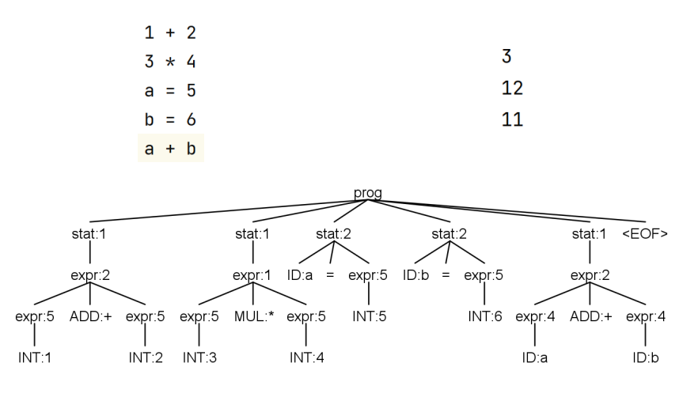

把表达式的结果保存到变量中，然后使用

交互式：Warfram Mathematica 13.0

### Offline 方式计算属性值: 已有语法分析树 (calc)

之前的写法

先构建语法分析树，不进行属性求值，通过深度优先遍历再遍历一遍

按照从左到右的深度优先顺序遍历语法分析树 

* 关键: 在合适的时机执行合适的动作，计算相应的属性值：overrride enter和exit方法

### Online 方式计算属性值：分析中顺带算出值

把计算动作嵌入语法分析树的构建过程中，在语法分析过程中实现属性文法 

B → X**{a}**Y：{a}是动作，action

语义动作嵌入的位置决定了何时执行该动作 

#### 基本思想: 

一个动作在它左边的所有文法符号都处理过之后立刻执行

ANTLR会在生成parser文件的时候，将{a}这段代码插入

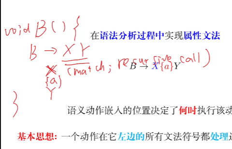

ExprAG.g4

~~~java
grammar ExprAG;

@header {
package ag;
import java.util.*;
}

@parser::members {
  Map<String, Integer> memory = new HashMap<>();

  int eval(int left, int right, int op) {
    switch (op) {
      case ADD : return left + right;
      case SUB : return left - right;
      case MUL : return left * right;
      case DIV : return left / right;
      default : return 0;
    }
  }
}

prog : stat+ ;

stat : expr     { System.out.println($expr.val); }
     | ID '=' expr  { memory.put($ID.text, $expr.val); }
     ;

expr returns [int val]
: l = expr op = ('*' | '/') r = expr { $val = eval($l.val, $r.val, $op.type); }
     | l = expr op = ('+' | '-') r = expr { $val = eval($l.val, $r.val, $op.type); }
     | '(' expr ')'                  { $val = $expr.val; }
     | ID                            { $val = memory.getOrDefault($ID.text, 0); }
     | INT                           { $val = $INT.int; }
     ;

ADD : '+' ;
SUB : '-' ;
MUL : '*' ;
DIV : '/' ;

ID : [a-z] ;
INT : [0-9] ;
WS : [ \t\r\n] -> skip;
~~~

* 对expr：需要等lexpr(）和rexpr()都计算完，然后才能操作，所以代码插在最后
  * eval()是封装后的运算函数
  * 访问变量用$
  * 对ID：取出值，如果之前没有赋值过，就用默认值，设定为0：memory.getOrDefault($ID.text, 0)        缺省值为0
* 对stat：
  * expr分支：已经计算完val，可以sout输出
  * 对ID：用一个hashmap，把算出来的val存到对应的ID的key上
    * hashmap没有定义过，所以需要告诉ANTLR**头文件，写在@header {}**
    * 还需要**定义**一个member**成员变量**叫memory，**写在members {}**
    * 如果**只需要member放在parser，写@parser::members {}**，否则默认parser、lexer都放一个

写完之后用ANTLR生成默认.java文件

test.txt

~~~txt
1 + 2
3 * 4
a = 5
b = 6
a + b
~~~

ExprAGTest.java

~~~java
package ag;

import org.antlr.v4.runtime.CharStream;
import org.antlr.v4.runtime.CharStreams;
import org.antlr.v4.runtime.CommonTokenStream;
import org.antlr.v4.runtime.tree.ParseTree;
import org.testng.annotations.AfterMethod;
import org.testng.annotations.BeforeMethod;
import org.testng.annotations.Test;

import java.io.FileInputStream;
import java.io.IOException;
import java.io.InputStream;
import java.nio.file.Path;

public class ExprAGTest {
  InputStream is = System.in;

  @BeforeMethod
  public void setUp() throws IOException {
    is = new FileInputStream(Path.of("src/test/antlr/ag/expr.txt").toFile());
  }

  @Test
  public void testExprAG() throws IOException {
    CharStream input = CharStreams.fromStream(is);
    ExprAGLexer lexer = new ExprAGLexer(input);
    CommonTokenStream tokens = new CommonTokenStream(lexer);

    ExprAGParser parser = new ExprAGParser(tokens);
    parser.prog();
  }
}
~~~

### 交互式需要怎么实现？

修改main函数

ExprAGInteractiveTest.java

~~~java
package ag;

import org.antlr.v4.runtime.CharStream;
import org.antlr.v4.runtime.CharStreams;
import org.antlr.v4.runtime.CommonTokenStream;

import java.io.BufferedReader;
import java.io.IOException;
import java.io.InputStream;
import java.io.InputStreamReader;

public class ExprAGInteractiveTest {
  public static void main(String[] args) throws IOException {
    InputStream is = System.in;
    BufferedReader br = new BufferedReader(new InputStreamReader(is));

    String expr = br.readLine();
    int line = 1;

    ExprAGParser parser = new ExprAGParser(null);
    parser.setBuildParseTree(false);

    while (expr != null) {
      CharStream input = CharStreams.fromString(expr + "\n");
      ExprAGLexer lexer = new ExprAGLexer(input);
      lexer.setLine(line);
      lexer.setCharPositionInLine(0);

      CommonTokenStream tokens = new CommonTokenStream(lexer);
      parser.setInputStream(tokens);
      parser.stat();

      expr = br.readLine();
      line++;
    }
  }
}

~~~

### Definition (综合属性 (Synthesized Attribute)) 

节点 N 上的综合属性只能通过 N 的子节点或 N 本身的属性来定义。

依赖是自底向上的，这种属性称为综合属性

比如val，越是顶端的val越依赖下方的val计算的结果来完成自己的计算

对于综合属性，要插入的代码都是放在产生式的最后

### Definition (继承属性 (Inherited Attribute))

节点 N 上的继承属性只能通过**N 的父节点、N 本身和 N 的兄弟节点**上的属性来定义。

不能依赖于子节点，可能是从父节点或者兄弟节点继承过来的

如果依赖子节点，就需要等到子节点全部处理完才能做自己的处理，那就变成综合属性了

#### 例子

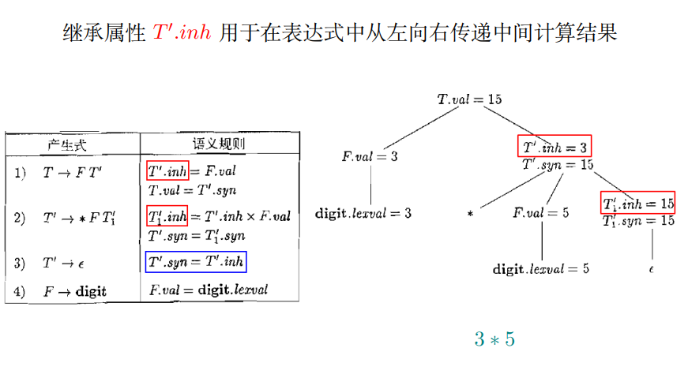

* T -> F * F *F * ......
* 输入为 3 * 5 * 7
* 语法分析树

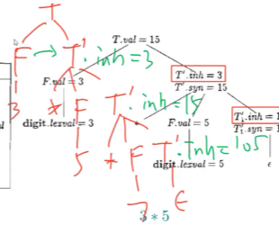

* 结构是不对称的，*在右子树上，如果我想计算的话，就得从左子树拿到F的值
* 只看继承属性inh：得出来的语法分析树见上
* 第二个综合属性syn：是一个向下的递归调用，到达底部就结束计算，得到最终值返回，自底向上传递计算结果

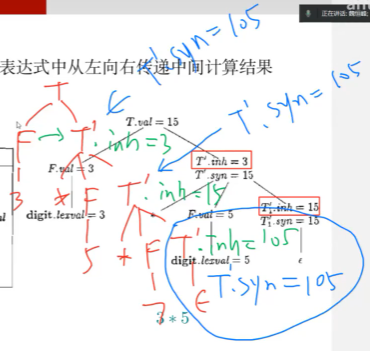

在右递归文法下实现了左结合

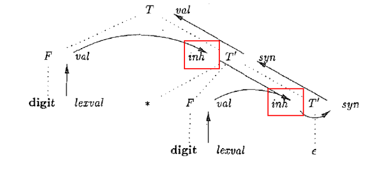

**信息流向:** 先从左向右、从上到下传递信息, 再从下到上传递信息

**先用继承属性，把信息从树的左侧传递到右侧，然后还是继承属性，从右上传递到右下，把继承过来的信息做一些动作，交给综合属性，用综合属性自底向上传递给根节点**

### 类型相关的例子：

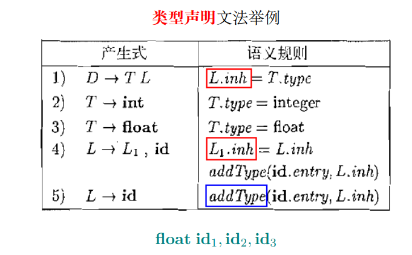

L~1~只是为了区分左侧的L和右侧的L，是相同的终结符

语义规则展示了我们所关心的类型的属性

#### 语法分析树

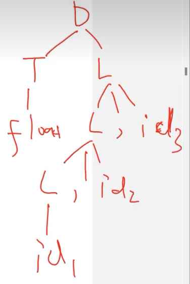

* 目标：想确认id1，id2，id3的类型

* 问题：T能拿到L的类型，但是L不知道，因为L在右半的语法分析树上
* 解决方案：将T拿到的类型，作为L递归调用的参数传进去
* 所以语义规则中第一条L.inh是从左兄弟节点计算来的inheritage
* 第四条L~1~.inh是从父节点继承的，type作为参数往下传递
* addType是id已经继承了类型，把ID赋上类型信息

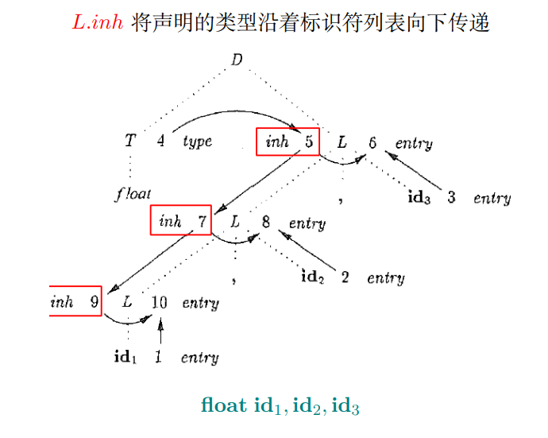

* 先从左往右，再从上往下

### 在ANTLR4中的实现

VarDeclAG.g4

~~~java
grammar VarsDeclAG;

@header {
package ag.type;
}

decl : type vars[$type.text] ;
type : 'int'        # IntType
     | 'float'      # FloatType
     ;
// Unfortunately, ANTLR 4 does not support this:
// "rule vars is left recursive but
// doesn't conform to a pattern ANTLR can handle"
// 左递归的规则加参数，就不能处理了
// See https://stackoverflow.com/q/76062088/1833118

//vars[String typeStr]
//     : vars[$typeStr] ',' ID
//         { System.out.println($ID.text + " : " + $typeStr); }
//     | ID
//         { System.out.println($ID.text + " : " + $typeStr); }
//     ;

// A dummy rule
vars[String typeStr] : ID;

ID : [a-z]+ ;
WS : [ \t\r\n]+ -> skip ;
~~~

VarsDeclStarAG.g4

```java
grammar VarsDeclStarAG;

@header {
package ag.type;
}

decl : type vars[$type.text] ;
type : 'int'        # IntType
     | 'float'      # FloatType
     ;
// 可以用克林闭包解决左递归：等于自己写一个左递归的改写
// 不是左递归就可以加参数了
// 动作需要写到紧跟ID 的地方，不能放在*的最后
vars[String typeStr]
     : ID { System.out.println($ID.text + " : " + $typeStr); }
       (',' ID { System.out.println($ID.text + " : " + $typeStr); })*
     ;

ID : [a-z]+ ;
WS : [ \t\r\n]+ -> skip ;
```

#### 规则参数

* 允许非终结符带一个**规则参数**：vars[String typeStr]
* 在生成函数的时候，var所对应的函数会多一个参数String typeStr
* 文法的其他地方，一旦涉及到调用这个var，参数都得放进去
* type vars[$type.text]，意思是type所匹配到的字符串
* 用$引用

## 语法制导定义SDD

### Definition 

(语法制导定义 (Syntax-Directed Definition; SDD))

SDD 是一个上下文无关文法和**属性**及**规则**的结合。

每个文法符号都可以关联多个属性

每个产式都可以关联一组规则：可能需要不止一个动作，可能需要一组动作或者一组规则来约束它的值

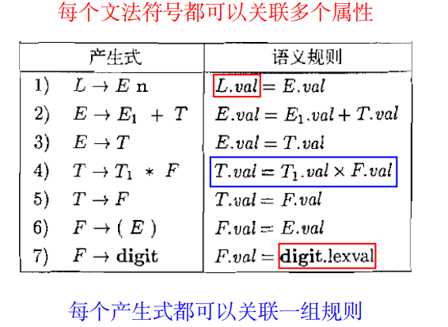

SDD能够**唯一确定**每个语法分析树上非终结符的属性值

SDD **没有**规定以什么方式、什么顺序计算这些属性值

### 注释 (annotated) 语法分析树: 

显示了各个属性值的语法分析树

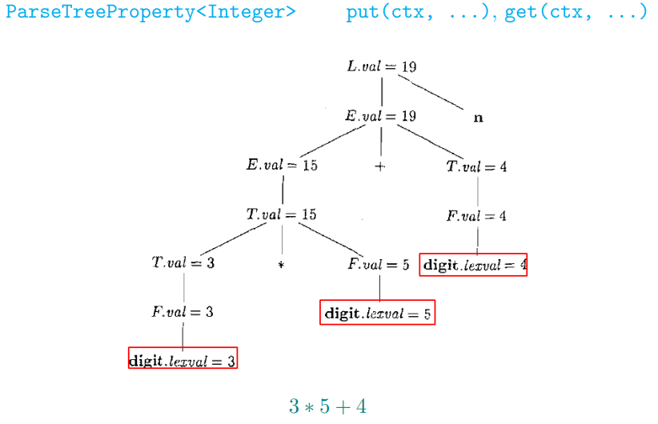

### S 属性定义 (S-Attributed Definition)

Definition (S 属性定义 (S-Attributed Definition)) 

如果一个 SDD 的每个属性**都是综合属性**, 则它是 S 属性定义。

### 依赖图

依赖图用于确定一棵给定的语法分析树中各个属性实例之间的**依赖关系**

**S 属性定义**的依赖图刻画了属性实例之间**自底向上的信息流动**


此类属性值的计算可以在**自顶向下**的 **LL 语法分析过程中**实现

在 LL语法分析器中, 递归下降函数 A **返回** 时, 计算相应节点 A 的综合属性值

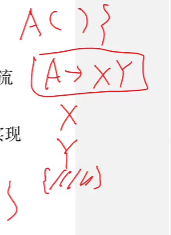

### L 属性定义 (L-Attributed Definition)

Definition (L 属性定义 (L-Attributed Definition)) 

如果一个 SDD 的每个属性

(1) 要么是综合属性, 

(2) 要么是继承属性, 但是它的规则满足如下限制: 

​	对于产生式 A → X~1~X~2~ . . . X~n~ 及其对应规则定义的继承属性 Xi .a, 则这个规则只能使用 

​	(a) 和**产生式头 A**关联的**继承**属性; 

​	(b) 位于**Xi 左边**的文法符号实例 X1、X2、. . . 、Xi−1 相关的**继承**属性 或**综合**属性; （只能依赖左兄弟节点的属性）

​	(c) 和**这个 Xi 的实例本身相关的继承属性或综合属性**, 但是在由这个 Xi 的全部属性组成的依赖图中**不存在环**。 

则它是 L 属性定义。

* 不能依赖A 的综合属性因为A的综合属性需要等子节点的计算，如果子节点又依赖A的综合属性，就会**形成环**，无法安排计算顺序
* 不能依赖右侧节点属性是因为右侧节点此时还没有构建完成，所以不能依赖
* 核心点是不能产生循环依赖，即产生环

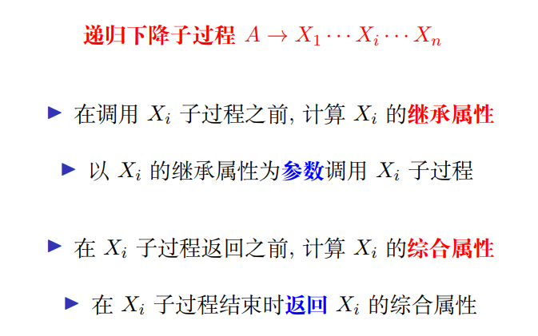

### Definition (后缀表示 (Postfix Notation))

(1) 如果 E 是一个**变量或常量**, 则 E 的后缀表示是 E 本身; 

(2) 如果 E 是**形如 E1 op E2** 的表达式, 则 E 的后缀表示是 **E′~1~E′~2~op**, 这里 E′~1~ 和 E′~2~ 分别是 E~1~ 与 E~2~ 的后缀表达式; 

(3) 如果 E 是**形如 (E1)** 的表达式, 则 E 的后缀表示是 E1 的后缀表示。

* **后缀表达式不需要括号来表示优先级**

#### 例子1

(9 ∗ 5) + 2 =⇒ 95 ∗ 2+ 

9 ∗ (5 + 2) =⇒ 952 + ∗

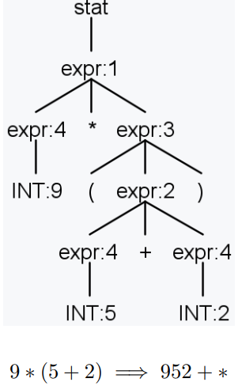

##### 属性文法实现

* 首先考虑使用哪种属性：综合属性
* **表达综合属性：返回值**
* 实际上写的是一个S属性文法

PostfixExprAG.g4

```java
grammar PostfixExprAG;

@header {
package ag;
}

stat : expr {System.out.println($expr.postfix); } ;

expr returns [String postfix]
  : l = expr op = '*' r = expr { $postfix = $l.postfix + $r.postfix + $op.text; }
  | l = expr op = '+' r = expr { $postfix = $l.postfix + $r.postfix + $op.text; }
  | '(' expr ')'               { $postfix = $expr.postfix; }
  | INT                        { $postfix = $INT.text; }
  ;

INT : [0-9]+ ;
WS : [ \t\r\n]+ -> skip ;
```

#### 例子2

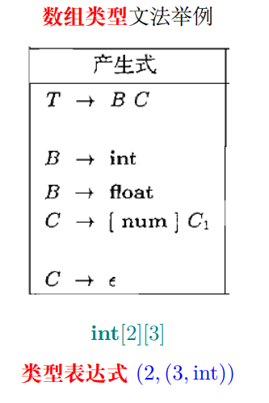

* 输入：int\[2][3]
* 输出：类型表达式(2,(3, int))
* 综合属性已经不够用了

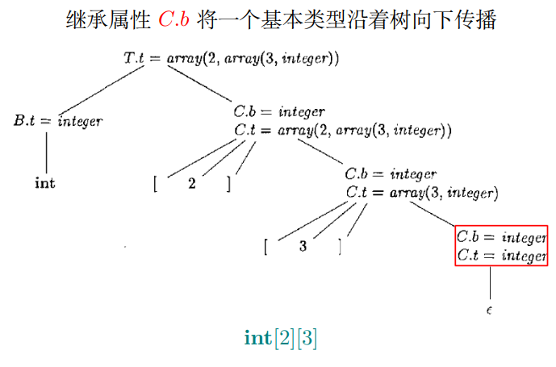

综合属性 **C.t** 收集最终得到的类型表达式，一路向上返回，返回过程中构造想要的类型表达式

ArrayTypeAG.g4

```java
grammar ArrayTypeAG;

@header {
package ag.type;
}

// OR: type ID ('[' INT ']')* ';'
arrDecl : basicType ID arrayType[$basicType.text]
    { System.out.println($ID.text + " : " + $arrayType.array_type); } ';' ;

arrayType[String basic_type]
    returns [String array_type]
    : '[' INT ']' arrayType[$basic_type]
        { $array_type = "(" + $INT.int + ", " + $arrayType.array_type + ")"; }
    |                       { $array_type = $basic_type; }
    ;

basicType : 'int' | 'float' ;

ID : [a-z]+ ;
INT : [0-9]+ ;
WS : [ \t\n\r]+ -> skip ;
```

* array_type是综合属性
* basic_type是继承属性

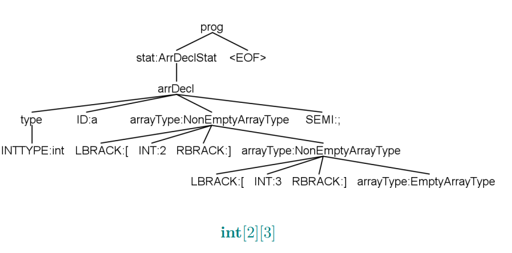

#### 数组声明、数组引用、类型检查

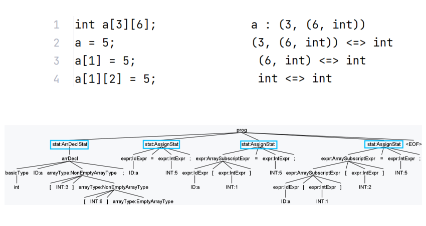

4行对应4棵子树

ArrayAG.g4

```java
grammar ArrayAG;

@header {
package ag.type;
import java.util.*;
}

//符号表
@parser::members {
private Map<String, String> typeMap = new HashMap<>();
}

prog : stat* EOF ;

stat : varDecl
        { String id = $varDecl.ctx.ID().getText();
          System.out.println(id + " : " + typeMap.get(id)); }
     | arrDecl
        { String id = $arrDecl.ctx.ID().getText();
          System.out.println(id + " : " + typeMap.get(id)); }
     | lhs = expr '=' rhs = expr ';'
        { System.out.println($lhs.type + " <=> " + $rhs.type); }
     ;

varDecl : basicType ID ';'
    //变量名放入符号表：简化了重复定义报错的环节
    { typeMap.put($ID.text, $basicType.text); } ;
basicType : 'int' | 'float' ;

// OR: type ID ('[' INT ']')* ';'
arrDecl : basicType ID arrayType[$basicType.text]
    //变量名放入符号表：简化了重复定义报错的环节
  { typeMap.put($ID.text, $arrayType.array_type); } ';' ;

arrayType[String basic_type]
    returns [String array_type]
  : '[' INT ']' arrayType[$basic_type]
     { $array_type = "(" + $INT.int + ", " + $arrayType.array_type + ")"; }
  |  { $array_type = $basic_type; }
  ;

// primary = expr '[' subscript = expr ']'
expr returns [String type]
    //拿到id的类型
    : ID { String expr_type = typeMap.get($ID.text); }
//每多看到一个[]就需要脱掉一层type，所以动作应该在while循环里
      ('[' INT ']'
        {
            //拿到下标：第一个,和最右边的)
          int start = expr_type.indexOf(',');
          int end = expr_type.lastIndexOf(')');
            //拿到完整的type，剥离一层
            //substr左闭右开
          expr_type = expr_type.substring(start + 1, end);
        }	) + { $type = expr_type; }//type即是返回的综合属性，将局部变量的值赋给返回值
    | ID    { $type = typeMap.get($ID.text); }//符号表里用string拿类型
    | INT   { $type = "int"; }
    ;

ID : [a-z]+ ;
INT : [0-9]+ ;
WS : [ \t\n\r]+ -> skip ;
```

## 类型检查

《实用编程语言理论基础》

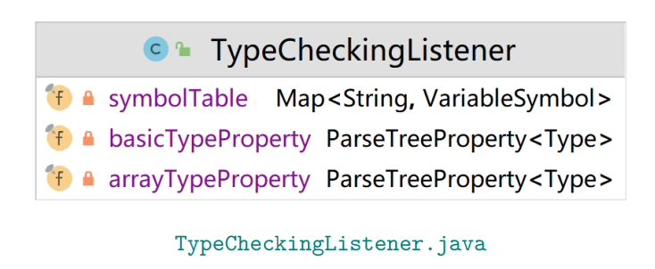

TypeCheckingListener.java

```java
package ag.type;

import org.antlr.v4.runtime.tree.ParseTreeProperty;

import java.util.HashMap;
import java.util.Map;

import symtable.BasicTypeSymbol;
import symtable.Type;
import symtable.VariableSymbol;

public class TypeCheckingListener extends ArrayBaseListener {
  private final Map<String, VariableSymbol> symbolTable = new HashMap<>();
  private final ParseTreeProperty<Type> arrayTypeProperty = new ParseTreeProperty<>();
  private final ParseTreeProperty<Type> basicTypeProperty = new ParseTreeProperty<>();

  /**
   * Pass the basic type from top to bottom
   */
  @Override
  public void enterArrDecl(ArrayParser.ArrDeclContext ctx) {
    String typeName = ctx.basicType().getText();
    Type basicType = new BasicTypeSymbol(typeName);
    basicTypeProperty.put(ctx, basicType);
  }

  @Override
  public void enterNonEmptyArrayType(ArrayParser.NonEmptyArrayTypeContext ctx) {
    basicTypeProperty.put(ctx, basicTypeProperty.get(ctx.parent));
  }

  @Override
  public void enterEmptyArrayType(ArrayParser.EmptyArrayTypeContext ctx) {
    basicTypeProperty.put(ctx, basicTypeProperty.get(ctx.parent));
  }

  /**
   * Below: construct the array type from bottom to top
   */

  @Override
  public void exitEmptyArrayType(ArrayParser.EmptyArrayTypeContext ctx) {
    arrayTypeProperty.put(ctx, new ArrayType(0, basicTypeProperty.get(ctx.parent)));
  }

  @Override
  public void exitNonEmptyArrayType(ArrayParser.NonEmptyArrayTypeContext ctx) {
    int dimension = Integer.parseInt(ctx.INT().getText());
    Type subArrayType = arrayTypeProperty.get(ctx.arrayType());

    Type arrayType = new ArrayType(dimension, subArrayType);
    this.arrayTypeProperty.put(ctx, arrayType);
  }

  @Override
  public void exitArrDecl(ArrayParser.ArrDeclContext ctx) {
    Type arrayType = arrayTypeProperty.get(ctx.arrayType());
    arrayTypeProperty.put(ctx, arrayType);

    String arrayName = ctx.ID().getText();
    symbolTable.put(arrayName, new VariableSymbol(arrayName, arrayType));
  }

  @Override
  public void exitArrDeclStat(ArrayParser.ArrDeclStatContext ctx) {
    System.out.println(ctx.arrDecl().ID().getText() + " : " + arrayTypeProperty.get(ctx.arrDecl()));
  }

  /**
   * Below: type reference and inference
   */
  @Override
  public void exitIdExpr(ArrayParser.IdExprContext ctx) {
    arrayTypeProperty.put(ctx, symbolTable.get(ctx.ID().getText()).getType());
  }

  @Override
  public void exitIntExpr(ArrayParser.IntExprContext ctx) {
    arrayTypeProperty.put(ctx, new BasicTypeSymbol("int"));
  }

  @Override
  public void exitVarDecl(ArrayParser.VarDeclContext ctx) {
    String varName = ctx.ID().getText();
    String typeName = ctx.basicType().getText();
    Type type = new BasicTypeSymbol(typeName);

    symbolTable.put(varName, new VariableSymbol(varName, type));
  }

  // type inference
  @Override
  public void exitArraySubscriptExpr(ArrayParser.ArraySubscriptExprContext ctx) {
    arrayTypeProperty.put(ctx,
        ((ArrayType) arrayTypeProperty.get(ctx.primary)).subType);
  }

  /**
   * Below: assign
   */
  @Override
  public void exitAssignStat(ArrayParser.AssignStatContext ctx) {
    Type lhs = arrayTypeProperty.get(ctx.lhs);
    Type rhs = arrayTypeProperty.get(ctx.rhs);
    System.out.println(lhs + " <=> " + rhs);
  }
}
```

 VarsTypeListener.g4

```java
package ag.type;

import org.antlr.v4.runtime.tree.ParseTreeProperty;

public class VarsTypeListener extends VarsDeclBaseListener {
  private final ParseTreeProperty<String> types = new ParseTreeProperty<>();

  @Override
  public void enterDecl(VarsDeclParser.DeclContext ctx) {
    types.put(ctx, ctx.type().getText());
  }

  @Override
  public void enterVarsList(VarsDeclParser.VarsListContext ctx) {
    types.put(ctx, types.get(ctx.parent));
  }

  @Override
  public void enterVarsID(VarsDeclParser.VarsIDContext ctx) {
    types.put(ctx, types.get(ctx.parent));
  }

  @Override
  public void exitIntType(VarsDeclParser.IntTypeContext ctx) {
    types.put(ctx, ctx.getText());
  }

  @Override
  public void exitFloatType(VarsDeclParser.FloatTypeContext ctx) {
    types.put(ctx, ctx.getText());
  }

  @Override
  public void exitVarsList(VarsDeclParser.VarsListContext ctx) {
    System.out.println(ctx.ID().getText() + " : " + types.get(ctx));
  }

  @Override
  public void exitVarsID(VarsDeclParser.VarsIDContext ctx) {
    System.out.println(ctx.ID().getText() + " : " + types.get(ctx));
  }
}
```

Offline (ParseTreeWalker)： 先生成语法分析树，再加listener

* 好写，直接写在.java文件里
* 但是性能差

Online (Attribute Grammar)：把属性和动作嵌入文法，ANTLR会在构建时执行

* 写起来困难，写在g4
* 但是性能上好

Online (addParseListener)：

* 让处理的java代码和g4文件区分开，但是在Listener添加的时候用add函数加，在生成parser时，会将listener代码嵌入
* 缺点是支持不了太复杂的代码
* 需要遵守额外的规则

https://github.com/antlr/antlr4/blob/master/doc/faq/general.md#what-is-the-difference-between-antlr-3-and-4

### 我们推荐哪一种？

* ANTLR4不推荐属性文法，推荐OFFLINE
* 易用性比性能更加重要
* 解耦合文法和java代码：文法可以复用

### 例子3

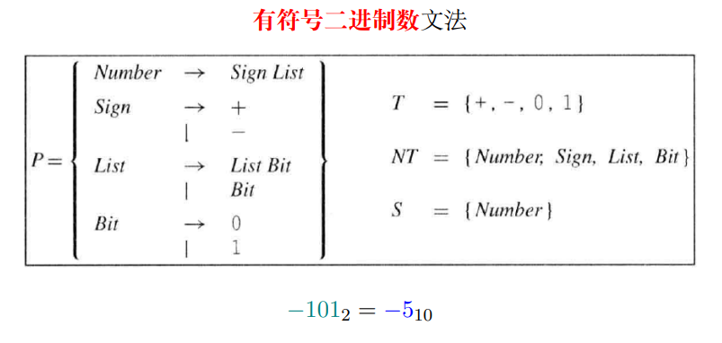

* 实际上是在做位数的运算，第几位就是权重，我们需要每个bit的position

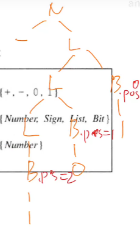

* 使用的是**继承属性**，初始化position=0，每一次递归产生一个bit，bit.position = position，产生一个L，这个L的position需要+1
* 还需要一个返回值val，**综合属性**

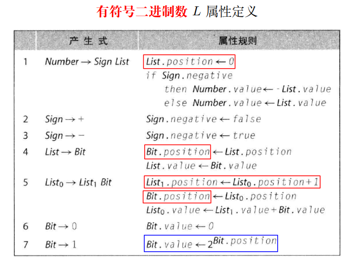

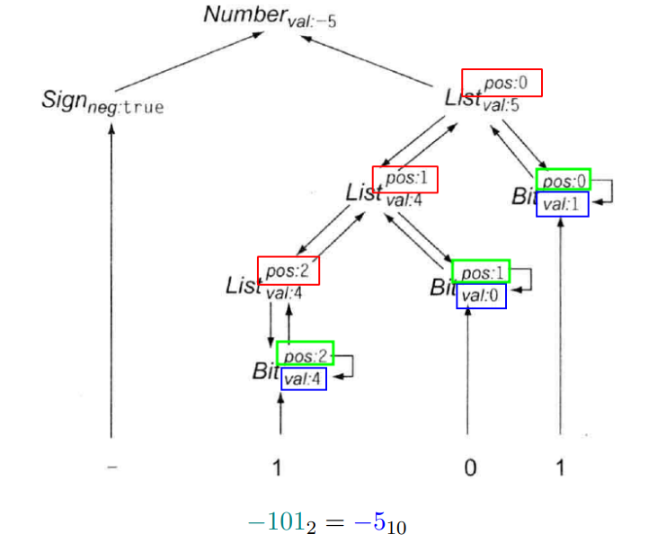

去年考试的题目：拓展：后面有小数点的进制换算

## Definition (语法制导的翻译方案 (Syntax-Directed Translation Scheme; SDT)) 

SDT 是在其产生式体中嵌入语义动作的上下文无关文法。

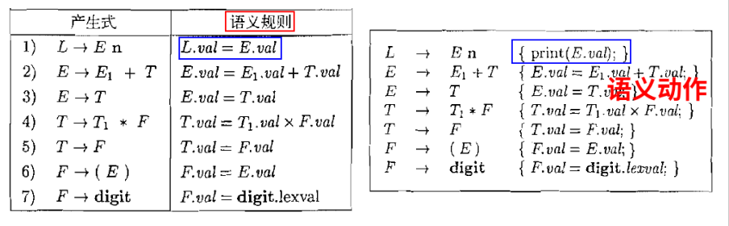

* SDD：我有规则来约束属性之间的关系，但是没说我具体什么时候执行
* SDT：如果需要控制规则对应的动作的执行时机，就需要控制{}嵌入的位置

如何将带有语义规则的 SDD 转换为带有语义动作的 SDT

语义动作嵌入在什么地方? 这决定了何时执行语义动作。

### 对于S 属性定义：后缀翻译方案

后缀翻译方案: 所有动作都在产生式的最后

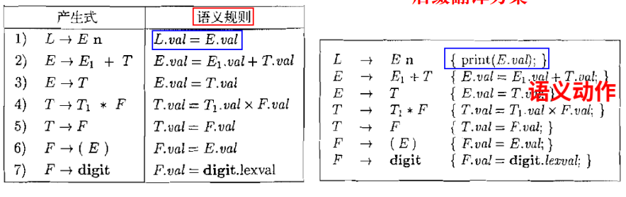

### L 属性定义 与 LL 语法分析

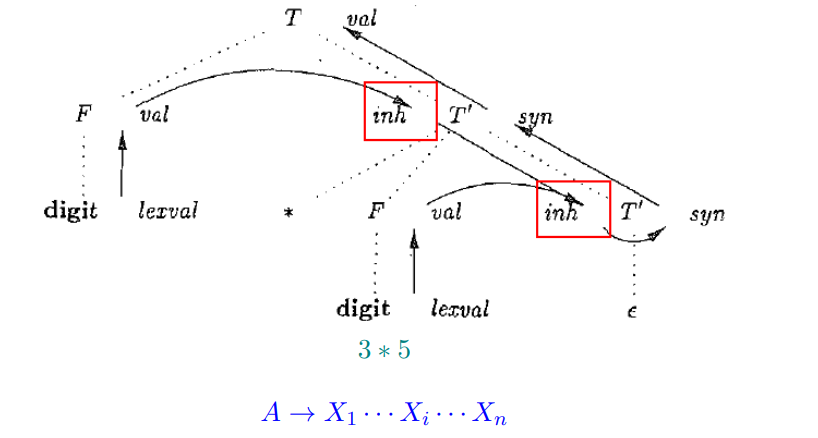

原则: **从左到右**处理各个 Xi 符号 对每个 Xi , **先计算继承属性**, **后计算综合属性**

递归下降子过程 A → X1 · · · Xi · · · Xn 

▶ 在调用 Xi 子过程之前, 计算 Xi 的继承属性 

▶ 以 Xi 的继承属性为参数调用 Xi 子过程 

▶ 在 Xi 子过程返回之前, 计算 Xi 的综合属性 

▶ 在 Xi 子过程结束时返回 Xi 的综合属性

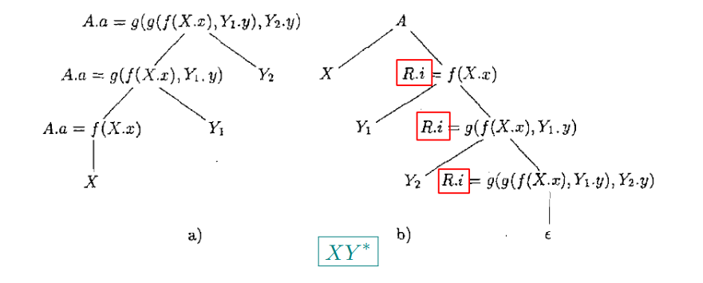

#### （左递归) S 属性定义 

A → A1Y 

A.a = g(A1.a, Y.y) 

A → X 

A.a = f(X.x)

#### (右递归) L 属性定义

A → XR	 R.i = f(X.x); 	A.a = R.s 

R → Y R1	 R1.i = g(R.i, Y.y); 	R.s = R1.s 

R → ϵ 	R.s = R.i

**原则: 继承属性在处理文法符号之前, 综合属性在处理文法符号之后**