# ch11-llvm-ir-中间代码生成

## LLVM介绍

[LLVM官网：The LLVM Compiler Infrastructure Project](https://llvm.org/)

与gcc相比，LLVM的模块化更好

Low Level Virtual Machine：x no

获得了ACM Software System Award 2012


## LLVM IR (Intermediate Representation)

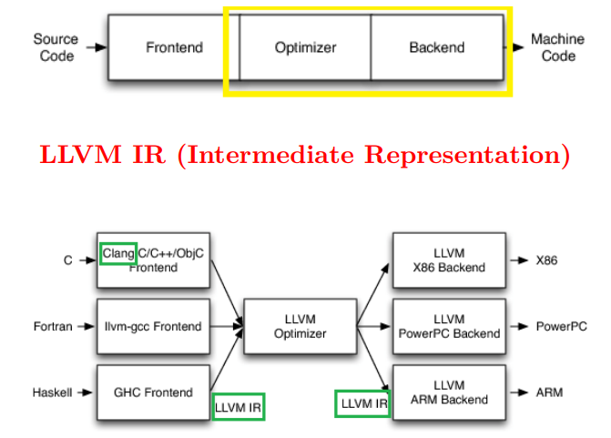

经过前端之后形成了中间表示：不一定是代码，也可能是有向图之类的

生成中间表示就可以做优化了

然后针对不同平台生成不同的代码

“IR 设计的优秀与否决定着整个编译器的好坏” ——《华为方舟编译器之美》

8 章技术内容, 其中 4 章介绍 Maple IR, 另外 4 章基于 Maple IR

### IR: Intermediate Representation定义

LLVM IR: 带类型的、介于高级程序设计语言与汇编语言之间

### 结构

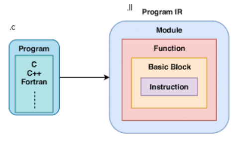

* .ll文件的外层和module对应
* .ll文件本身就是一个module
* 一个module有多个函数
* 一个函数由多个**基本块**构成
* 一个**基本块**由**指令**构成

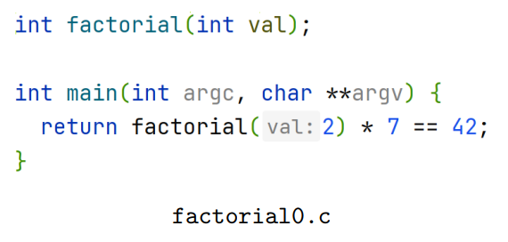

## 不开优化

```powershell
clang -S -emit-llvm factorial0.c -o f0-opt0.ll
```

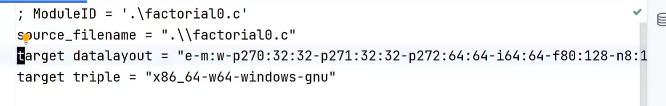

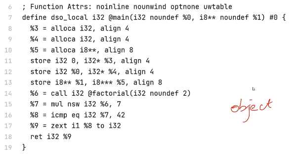

* -S -emit-llvm：只生成ll中间代码，不生成目标文件

* -o f0：不开优化

* target的意思是:虽然现在只是ll中间文件，但是后面需要生成目标文件。
  和目标平台相关，支持的数据类型不同

  x86还是ARM

* %x是虚拟的寄存器：x是变量名：所以抄袭的时候只改变量名是没用的

* @是全局变量， %是局部变量

* i32：类型为int，32位

* alloc：分配空间

* align 4：要求按照4byte对齐

* store：往内存存信息，

  0存入%3，%3的类型是i32的指针，即i32*

  %0（传入的第一个参数）的信息放入%4

  %1的类型是i8**，所以%5的类型是i8\*\*\*

* 调用函数call：全局函数@factorial，参数是i32，值是2

  调用结果放到%6中

* mul：相乘

* nsw：（no signed wrap）整型数相乘，有溢出风险，nsw表示不会出现有符号的溢出的行为

* icmp：专门做整型数的compare

  比较的结果放入%8，类型是i1

* zext：zero-extension，零拓展（高位补0），return要求i32，类型不符
* 

### Static Single Assignment (SSA)静态单赋值

SSA静态单赋值:任何变量,最多只能赋一次值，(存入%7) :

* 好处：当我使用变量的时候，我明确知道在哪定义，可以建立直接连接
* 坏处：需要很多寄存器；本例子中寄存器都是软件的虚拟的

## 一级优化

```powershell
clang -S -emit-llvm factorial0.c -o f0-opt1.ll -O1 -g0
```

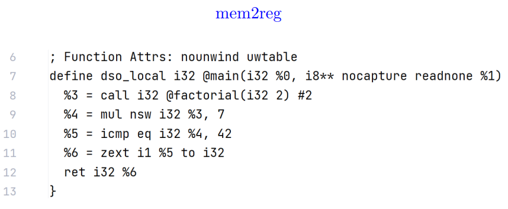

* 不先分配空间，而是直接用寄存器计算

## 分支语句

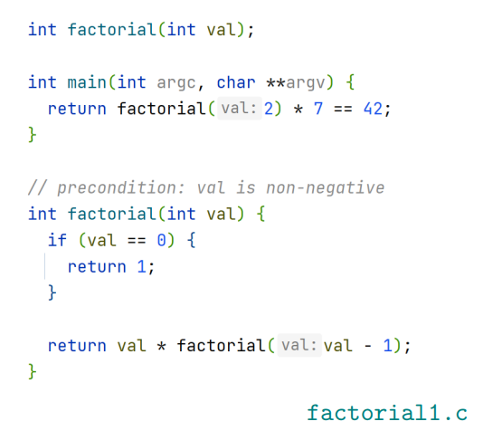

### 函数调用图

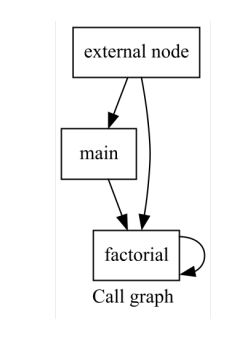

### 控制流图 Control Flow Graph (CFG)

https://en.wikipedia.org/wiki/Frances_Allen

一个函数内部的指令的控制流关系

#### Definition (CFG）

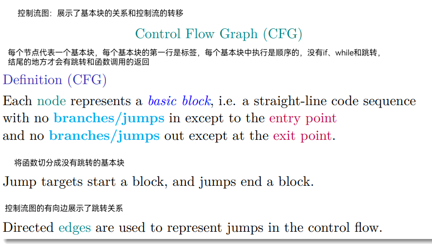

### 例子1

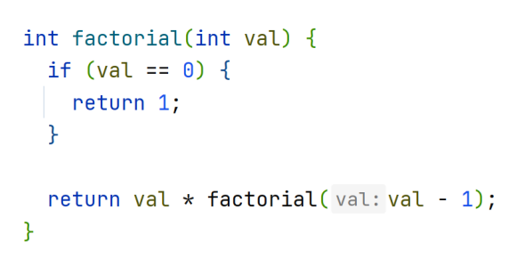

%2: store the return value (in different branches)

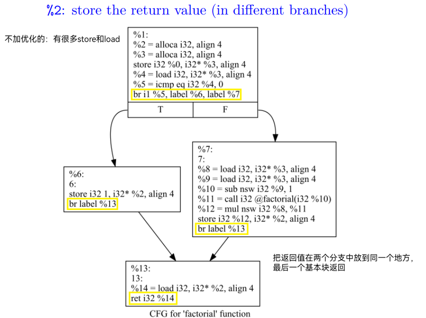

* 基本块的最后一条语句是一个branch：根据比较的结果决定是跳转到%5还是%6
* 只有最后一条可以是跳转语句：可以有或无条件跳转
* %2：把返回值在两个分支中放到同一个地方%2，最后一个基本块从%2中load出来返回值返回

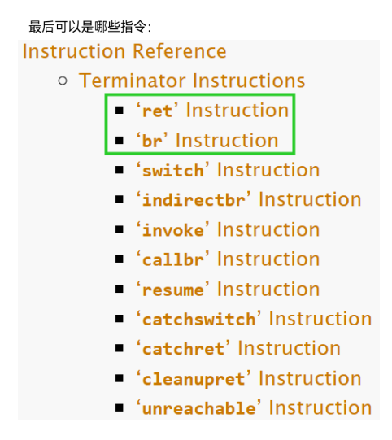

如果用clang生成中间代码的时候打开优化：

* 开优化，store和load被优化，只使用寄存器

* 产生了新的问题：LLVM的难点：
  * 如果是true跳转来的，应该return 1;
  * 如果是false跳转来的，应该return %6。

* LLVM中间代码静态单赋值，不能在两个分支中都重新赋值给%3，然后在label%7中返回%3。
* 于是引入phi φ/Φ指令：做选择，
  * 如果是从%3跳转来的就选%6寄存器
  * **如果是从%1跳转来的，就选择1，装入%8，返回%8。**
  * 问题没有得到解决：**phi指令的实现是没有底层实现的**，是需要再做一步转换的，即回退到上一个方案，这是一个虚拟的实现

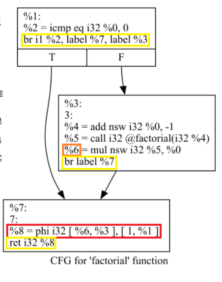

### 例子2

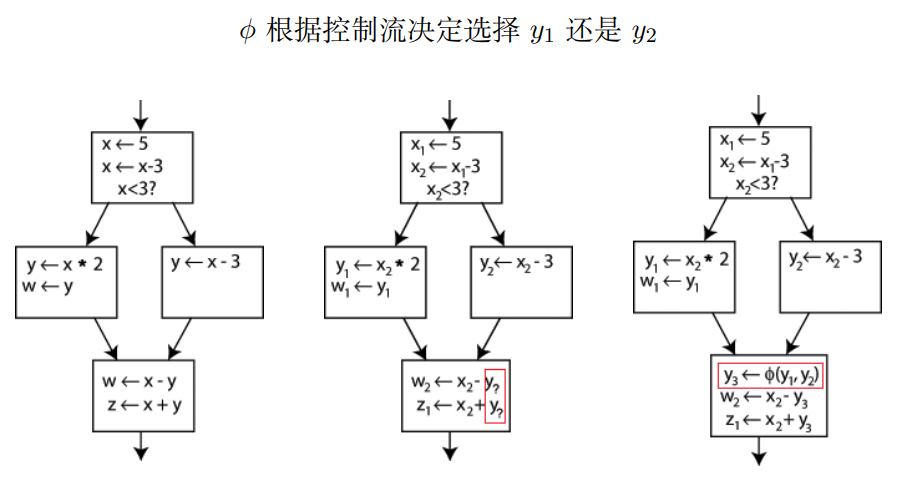

* 第一段代码不符合SSA
* 第二段满足SSA

基本思想: 将 ϕ 指令转换成若干赋值指令, 上推至前驱基本块中

#### SSA 形式的构建与消去

《毕昇编译器原理与实践》SECTION 4.3

《编译器设计》SECTION 9.3

[compilers-papers-we-love/TOPLAS1991 Efficiently Computing Static Single Assignment Form and the Control Dependence Graph.pdf at master · courses-at-nju-by-hfwei/compilers-papers-we-love · GitHub](https://github.com/courses-at-nju-by-hfwei/compilers-papers-we-love/blob/master/ir/TOPLAS1991 Efficiently Computing Static Single Assignment Form and the Control Dependence Graph.pdf)

#### factorial1 (opt3)三级优化

调用图

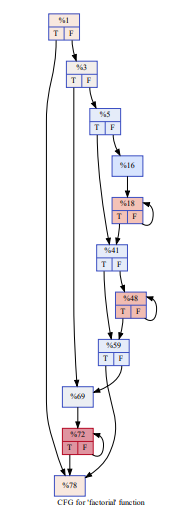

允许分配内存，内存不是寄存器，可以用store

### 例子3

fctorial2.c

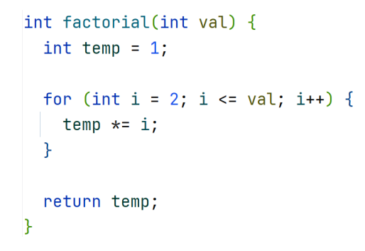


#### 在实验实现中

对于if语句，生成相应的branch语句

对于for循环，生成以下的中间代码

#### 未开优化

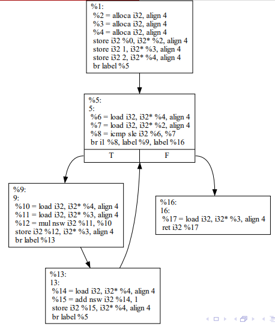

* %5中sle：less or equal 小于等于
* %3寄存器存着ret值

#### 开一级优化

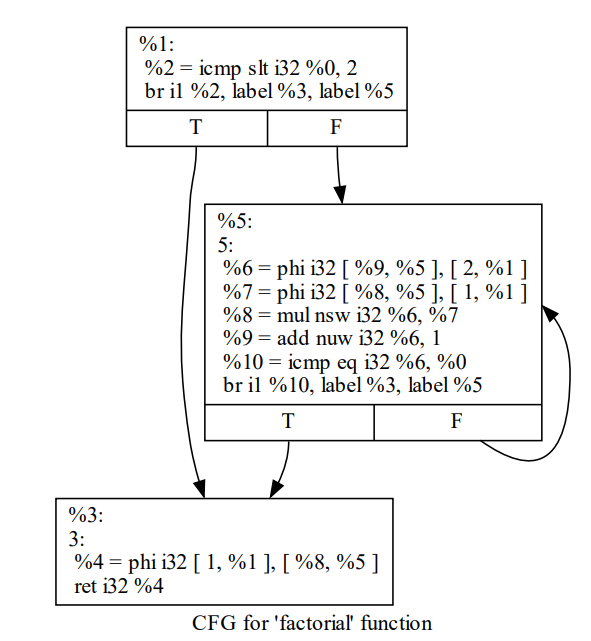

* slt：大于等于，sle的相反方向

#### 开三级优化

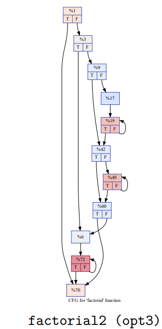

▶ 为什么基本块的中间某条指令可以是 call 指令?

▶ 一个函数里可以包含多个含有 ret 指令的基本块吗?

▶ 如果可以, 那不就可以解决 ϕ 指令相关的问题了吗? 

▶ 课程实验中具体如何生成 ϕ 指令? “课上不讲, 课后自学” 吗? 

▶ 为什么是 “%0, %1” 之后是 “%3”?

## 如何用编程的方式生成 LLVM IR?

[LLVM JAVA API使用手册：Maven Repository: org.bytedeco » llvm-platform » 15.0.3-1.5.8 (mvnrepository.com)](https://mvnrepository.com/artifact/org.bytedeco/llvm-platform/15.0.3-1.5.8)


* 构造一个语法分析树，当我碰到一个if，用编程的方式生成LLVM IR的字典，LLVM不能帮你做这个过程
* 原生API是c++，这个是用java包装的


~~~java
package llvm.factorial;

import org.bytedeco.javacpp.Pointer;
import org.bytedeco.javacpp.PointerPointer;
import org.bytedeco.llvm.LLVM.*;
import static org.bytedeco.llvm.global.LLVM.*;

public class Factorial1 {
    static void factorial1opt0() {
        LLVMInitializeCore(LLVMGetGlobalPassRegistry());
        LLVMLinkInMCJIT();
        LLVMInitializeNativeAsmPrinter();
        LLVMInitializeNativeAsmParser();
        LLVMInitializeNativeTarget();

        LLVMContextRef context = LLVMContextCreate();
        LLVMModuleRef module = LLVMModuleCreateWithNameInContext("factorial1", context);
        //builder指令生成器
        LLVMBuilderRef builder = LLVMCreateBuilderInContext(context);

        //类型和常量
        LLVMTypeRef i32Type = LLVMInt32TypeInContext(context);
        LLVMTypeRef i8Type = LLVMInt8TypeInContext(context);
        LLVMTypeRef i8ArrayType = LLVMPointerType(i8Type, 0);
        LLVMTypeRef i8ArrayArrayType = LLVMPointerType(i8ArrayType, 0);
        LLVMValueRef zero = LLVMConstInt(i32Type, 0, 0);
        LLVMValueRef one = LLVMConstInt(i32Type, 1, 0);

        //准备参数
        PointerPointer<Pointer> mainParamTypes = new PointerPointer<>(2)
                .put(0, i32Type)
                .put(1, i8ArrayArrayType);

        PointerPointer<Pointer> factorialParamTypes = new PointerPointer<>(1)
                .put(0, i32Type);

        // i32 main(i32, i8**)
        LLVMTypeRef mainRetType = LLVMFunctionType(i32Type, mainParamTypes, 2, 0);
        // i32 factorial(i32)
        LLVMTypeRef factorialRetType = LLVMFunctionType(i32Type, factorialParamTypes, 1, 0);

        // define function main and factorial
        LLVMValueRef mainFunction = LLVMAddFunction(module, "main", mainRetType);
        LLVMValueRef factorialFunction = LLVMAddFunction(module, "factorial", factorialRetType);

        // append code at main function
        //基本块
        LLVMBasicBlockRef mainEntry = LLVMAppendBasicBlock(mainFunction, "");
        LLVMPositionBuilderAtEnd(builder, mainEntry);

        // get function param
        LLVMValueRef arg1 = LLVMGetParam(mainFunction, 0);
        LLVMValueRef arg2 = LLVMGetParam(mainFunction, 1);

        // alloca and store param
        LLVMValueRef alloca1 = LLVMBuildAlloca(builder, i32Type, "");
        LLVMValueRef alloca2 = LLVMBuildAlloca(builder, i32Type, "");
        LLVMValueRef alloca3 = LLVMBuildAlloca(builder, i8ArrayArrayType, "");
        LLVMBuildStore(builder, zero, alloca1);
        LLVMBuildStore(builder, arg1, alloca2);
        LLVMBuildStore(builder, arg2, alloca3);

        // call factorial(2)
        PointerPointer<Pointer> argsv1 = new PointerPointer<>(1)
                .put(0, LLVMConstInt(i32Type, 2, 0));
        LLVMValueRef call1 = LLVMBuildCall(builder, factorialFunction, argsv1, 1, "");
        // factorial(2) * 7
        LLVMValueRef mul1 = LLVMBuildMul(builder, call1, LLVMConstInt(i32Type, 7, 0), "");
        // factorial(2) * 7 == 42
        LLVMValueRef icmp1 = LLVMBuildICmp(builder, LLVMIntEQ, mul1, LLVMConstInt(i32Type, 42, 0), "");
        // i1 -> i32
        LLVMValueRef zext1 = LLVMBuildZExt(builder, icmp1, i32Type, "");
        // return
        LLVMBuildRet(builder, zext1);

        // append code at factorial function
        LLVMBasicBlockRef factorialEntry = LLVMAppendBasicBlock(factorialFunction, "");
        LLVMPositionBuilderAtEnd(builder, factorialEntry);
        // alloca i32 and store arg
        LLVMValueRef arg3 = LLVMGetParam(factorialFunction, 0);
        LLVMValueRef alloca4 = LLVMBuildAlloca(builder, i32Type, "");
        LLVMValueRef alloca5 = LLVMBuildAlloca(builder, i32Type, "");
        LLVMBuildStore(builder, arg3, alloca5);
        LLVMValueRef load1 = LLVMBuildLoad(builder, alloca5, "");
        // val == 0
        LLVMValueRef icmp2 = LLVMBuildICmp(builder, LLVMIntEQ, load1, zero, "");

        // append 3 basic block
        LLVMBasicBlockRef entry1 = LLVMAppendBasicBlock(factorialFunction, "");
        LLVMBasicBlockRef entry2 = LLVMAppendBasicBlock(factorialFunction, "");
        LLVMBasicBlockRef entry3 = LLVMAppendBasicBlock(factorialFunction, "");

        // if val == 0 goto entry1 else goto entry2
        LLVMBuildCondBr(builder, icmp2, entry1, entry2);

        // append code at entry1
        LLVMPositionBuilderAtEnd(builder, entry1);
        // store 1 to alloca4
        LLVMBuildStore(builder, one, alloca4);
        // goto entry3
        LLVMBuildBr(builder, entry3);

        // append code at entry2
        LLVMPositionBuilderAtEnd(builder, entry2);
        // load2, load3 = val
        LLVMValueRef load2 = LLVMBuildLoad(builder, alloca5, "");
        LLVMValueRef load3 = LLVMBuildLoad(builder, alloca5, "");
        // val - 1
        LLVMValueRef sub1 = LLVMBuildSub(builder, load3, one, "");
        // call factorial(val - 1)
        PointerPointer<Pointer> argsv2 = new PointerPointer<>(1)
                .put(0, sub1);
        LLVMValueRef call2 = LLVMBuildCall(builder, factorialFunction, argsv2, 1, "");
        // val * factorial(val - 1)
        LLVMValueRef mul2 = LLVMBuildMul(builder, load2, call2, "");
        // store result to alloca4
        LLVMBuildStore(builder, mul2, alloca4);
        // goto entry3
        LLVMBuildBr(builder, entry3);

        // append code at entry3
        LLVMPositionBuilderAtEnd(builder, entry3);
        // return value at alloca4
        LLVMValueRef load4 = LLVMBuildLoad(builder, alloca4, "");
        LLVMBuildRet(builder, load4);

        LLVMDumpModule(module);
    }

    static void factorial1opt1() {
        LLVMInitializeCore(LLVMGetGlobalPassRegistry());
        LLVMLinkInMCJIT();
        LLVMInitializeNativeAsmPrinter();
        LLVMInitializeNativeAsmParser();
        LLVMInitializeNativeTarget();

        LLVMContextRef context = LLVMContextCreate();
        LLVMModuleRef module = LLVMModuleCreateWithNameInContext("factorial1", context);
        LLVMBuilderRef builder = LLVMCreateBuilderInContext(context);

        LLVMTypeRef i32Type = LLVMInt32TypeInContext(context);
        LLVMTypeRef i8Type = LLVMInt8TypeInContext(context);
        LLVMTypeRef i8ArrayType = LLVMPointerType(i8Type, 0);
        LLVMTypeRef i8ArrayArrayType = LLVMPointerType(i8ArrayType, 0);
        LLVMValueRef zero = LLVMConstInt(i32Type, 0, 0);
        LLVMValueRef one = LLVMConstInt(i32Type, 1, 0);

        PointerPointer<Pointer> mainParamTypes = new PointerPointer<>(2)
                .put(0, i32Type)
                .put(1, i8ArrayArrayType);

        PointerPointer<Pointer> factorialParamTypes = new PointerPointer<>(1)
                .put(0, i32Type);

        LLVMTypeRef mainRetType = LLVMFunctionType(i32Type, mainParamTypes, 2, 0);
        LLVMTypeRef factorialRetType = LLVMFunctionType(i32Type, factorialParamTypes, 1, 0);

        LLVMValueRef mainFunction = LLVMAddFunction(module, "main", mainRetType);
        LLVMValueRef factorialFunction = LLVMAddFunction(module, "factorial", factorialRetType);

        LLVMBasicBlockRef mainEntry = LLVMAppendBasicBlock(mainFunction, "");
        LLVMPositionBuilderAtEnd(builder, mainEntry);

        // 相比于opt0, opt1并没有store main函数参数的中间代码，因为main函数的参数并没有用到

        // call factorial(2)
        PointerPointer<Pointer> argsv1 = new PointerPointer<>(1)
                .put(0, LLVMConstInt(i32Type, 2, 0));
        LLVMValueRef call1 = LLVMBuildCall(builder, factorialFunction, argsv1, 1, "");
        // factorial(2) * 7
        LLVMValueRef mul1 = LLVMBuildMul(builder, call1, LLVMConstInt(i32Type, 7, 0), "");
        // factorial(2) * 7 == 42
        LLVMValueRef icmp1 = LLVMBuildICmp(builder, LLVMIntEQ, mul1, LLVMConstInt(i32Type, 42, 0), "");
        // i1 -> i32
        LLVMValueRef zext1 = LLVMBuildZExt(builder, icmp1, i32Type, "");
        // return
        LLVMBuildRet(builder, zext1);

        // append code at factorial
        LLVMBasicBlockRef factorialEntry = LLVMAppendBasicBlock(factorialFunction, "");
        LLVMPositionBuilderAtEnd(builder, factorialEntry);
        // get arg(val)
        LLVMValueRef arg3 = LLVMGetParam(factorialFunction, 0);
        // val == 0
        LLVMValueRef icmp2 = LLVMBuildICmp(builder, LLVMIntEQ, arg3, zero, "");

        LLVMBasicBlockRef entry1 = LLVMAppendBasicBlock(factorialFunction, "");
        LLVMBasicBlockRef entry2 = LLVMAppendBasicBlock(factorialFunction, "");

        // if val == 0 goto entry2 else goto entry1
        LLVMBuildCondBr(builder, icmp2, entry2, entry1);

        // append code at entry1
        LLVMPositionBuilderAtEnd(builder, entry1);
        // val - 1
        LLVMValueRef add1 = LLVMBuildAdd(builder, arg3, LLVMConstInt(i32Type, -1, 0), "");
        // call factorial(val - 1)
        PointerPointer<Pointer> argsv2 = new PointerPointer<>(1)
                .put(0, add1);
        LLVMValueRef call2 = LLVMBuildCall(builder, factorialFunction, argsv2, 1, "");
        // val * factorial(val - 1)
        LLVMValueRef mul2 = LLVMBuildMul(builder, call2, arg3, "");
        // goto entry2
        LLVMBuildBr(builder, entry2);

        // append code at entry2
        LLVMPositionBuilderAtEnd(builder, entry2);
        // build phi: if prev block is entry1, phi1 = mul2; if prev block is factorialEntry, phi1 = 1
        // more about phi: https://llvm.org/docs/LangRef.html#phi-instruction
        LLVMValueRef phi1 = LLVMBuildPhi(builder, i32Type, "");
        PointerPointer<Pointer> phiValues = new PointerPointer<>(2)
                .put(0, mul2)
                .put(1, one);
        PointerPointer<Pointer> phiBlocks = new PointerPointer<>(2)
                .put(0, entry1)
                .put(1, factorialEntry);
        LLVMAddIncoming(phi1, phiValues, phiBlocks, 2);

        // return result
        LLVMBuildRet(builder, phi1);

        LLVMDumpModule(module);
    }

    public static void main(String[] args) {
        factorial1opt0();
        factorial1opt1();
    }
}

~~~

* 如果不会写LLVM，就先写一段测试代码，然后用clang生成IR


~~~java
package llvm.factorial;

import org.bytedeco.javacpp.Pointer;
import org.bytedeco.javacpp.PointerPointer;
import org.bytedeco.llvm.LLVM.*;

import static org.bytedeco.llvm.global.LLVM.*;

public class Factorial2 {
    public static void main(String[] args) {
        LLVMInitializeCore(LLVMGetGlobalPassRegistry());
        LLVMLinkInMCJIT();
        LLVMInitializeNativeAsmPrinter();
        LLVMInitializeNativeAsmParser();
        LLVMInitializeNativeTarget();

        LLVMModuleRef module = LLVMModuleCreateWithName("factorial2");
        LLVMBuilderRef builder = LLVMCreateBuilder();
        LLVMTypeRef i32Type = LLVMInt32Type();
        LLVMTypeRef returnType = i32Type;

        LLVMValueRef one = LLVMConstInt(i32Type, 1, 0);
        LLVMValueRef two = LLVMConstInt(i32Type, 2, 0);
        LLVMValueRef seven = LLVMConstInt(i32Type, 7, 0);
        LLVMValueRef fortyTwo = LLVMConstInt(i32Type, 42, 0);

        // 创建factorial函数
        LLVMTypeRef factorial2Type = LLVMFunctionType(returnType, i32Type, 1, 0);
        LLVMValueRef factorial2 = LLVMAddFunction(module, "factorial2", factorial2Type);
        // 构建函数体
        LLVMBasicBlockRef entry = LLVMAppendBasicBlock(factorial2, "entry");
        LLVMBasicBlockRef forBranch = LLVMAppendBasicBlock(factorial2, "forBranch");
        LLVMBasicBlockRef trueBranch = LLVMAppendBasicBlock(factorial2, "true");
        LLVMBasicBlockRef exit = LLVMAppendBasicBlock(factorial2, "exit");

        // 获取参数 val
        LLVMValueRef val = LLVMGetParam(factorial2, /* parameterIndex */0);

        // 设置在entry块后插入代码
        LLVMPositionBuilderAtEnd(builder, entry);
        // int temp = 1;
        LLVMValueRef temp = LLVMBuildAlloca(builder, i32Type, "temp");
        LLVMBuildStore(builder, one, temp);
        // int i = 2;
        LLVMValueRef i = LLVMBuildAlloca(builder, i32Type, "i");
        LLVMBuildStore(builder, two, temp);
        // 无条件跳转到 forBranch
        LLVMBuildBr(builder, forBranch);

        LLVMPositionBuilderAtEnd(builder, forBranch);
        // i <= val
        LLVMValueRef iLoad = LLVMBuildLoad(builder, i, "iLoad");
        LLVMValueRef condition = LLVMBuildICmp(builder, LLVMIntSLE, iLoad, val, "condition=i<=val");
        // 条件为真，到trueBranch，否则到exit
        LLVMBuildCondBr(builder, condition, trueBranch, exit);

        // 设置在trueBranch块后插入代码
        LLVMPositionBuilderAtEnd(builder, trueBranch);
        // temp *= i;
        iLoad = LLVMBuildLoad(builder, i, "iLoad");
        LLVMValueRef tempLoad = LLVMBuildLoad(builder, temp, "tempLoad");
        LLVMValueRef mulRes = LLVMBuildMul(builder, tempLoad, iLoad, "temp=temp*i");
        LLVMBuildStore(builder, mulRes, temp);
        // i++;
        iLoad = LLVMBuildLoad(builder, i, "iLoad");
        LLVMValueRef addRes = LLVMBuildAdd(builder, iLoad, one, "i=i+1");
        LLVMBuildStore(builder, addRes, i);
        // 无条件跳转到forBranch块，继续迭代
        LLVMBuildBr(builder, forBranch);

        // 设置在exit块后插入代码
        LLVMPositionBuilderAtEnd(builder, exit);
        tempLoad = LLVMBuildLoad(builder, temp, "tempLoad");
        LLVMBuildRet(builder, tempLoad);


        // 创建main函数
        // char -> int8; 指向char的指针
        LLVMTypeRef charPtr = LLVMPointerType(LLVMInt8Type(), 0);
        // 指向char指针的指针
        LLVMTypeRef argumentType = LLVMPointerType(charPtr, 0);
        // 创建参数类型
        PointerPointer<Pointer> argumentTypes = new PointerPointer<>(2)
                .put(0, i32Type)
                .put(1, argumentType);
        // 创建函数类型
        LLVMTypeRef mainType = LLVMFunctionType(returnType, argumentTypes, 2, 0);
        LLVMValueRef mainFunc = LLVMAddFunction(module, "main", mainType);
        // 构建函数体
        LLVMBasicBlockRef mainEntry = LLVMAppendBasicBlock(mainFunc, "mainEntry");
        // 设置在mainEntry块后插入代码
        LLVMPositionBuilderAtEnd(builder, mainEntry);
        // 构建实参
        PointerPointer<Pointer> arguments = new PointerPointer<>(1)
                .put(0, two);
        // factorial(2)
        LLVMValueRef callFactorial2 = LLVMBuildCall(builder, factorial2, arguments, 1, "factorial(2)");
        // factorial(2) * 7
        LLVMValueRef factorial2Mul7 = LLVMBuildMul(builder, callFactorial2, seven, "factorial(2)*7");
        // factorial(2) * 7 == 42
        LLVMValueRef ifEqual = LLVMBuildICmp(builder, LLVMIntEQ, factorial2Mul7, fortyTwo, "factorial(2)*7==42");
        // 尤其要注意的：ifEqual是i1类型，而main函数要求返回i32类型，所以这里要做类型转换
        LLVMValueRef result = LLVMBuildZExt(builder, ifEqual, i32Type, "result");
        LLVMBuildRet(builder, result);

        // 导出生成的LLVM IR
        LLVMDumpModule(module);

        //释放资源
        LLVMDisposeBuilder(builder);
    }
}

~~~

