# 人机交互

这里只整理知识点，适合考前两小时快速过一遍。

# **Part 1 基础**

## **概述**

- HCI/CHI：Human-Computer Interaction/Computer-Human Interaction
- MMI/HMI：Man-Machine Interaction/Human-Machine Interaction
- UCD：User-Centered Design
- HF：Human Factors
- 什么是人机交互
- 抓住三方面答：人、计算机和他们之间互相联系的方式（交互），交互是重点。
- ACM定义：有关交互式计算机系统的设计、评估、实现以及与之相关现象的学科
- 人机交互的研究内容
  - U：使用计算机的上下文
  - H：人的特性
  - C：计算机系统和用户接口架构
  - D：开发过程
- 重要性
  - 企业角度
  - 市场角度
  - 个人角度
  - 人性因素角度
- 发展历史
  - 批处理阶段
  - 联机终端阶段（命令行）
  - GUI阶段（现在）
  - 多媒体界面（未来）

## **基础知识**

- 交互框架 
  - 执行评估
    - 执行隔阂 用户为达目标而制定的动作与系统允许的动作之间的差别  
    - 评估隔阂 系统状态的**实际表现**与用户预期之间的差别
  - 活动周期EEC
    - 四个组成部分
      - 目标
      - 执行
      - 客观因素
      - 评估
    - 1-4：执行阶段 
      - 形成目标
      - 形成意图
      - 明确动作
      - 执行动作
    - 5-7：评估阶段
      - 感知系统状态
      - 解释系统状态
      - 评估输出
  - 循环这个过程
  - 可以用来识别出交互存在的问题，即系统表现和用户预期之间的差距
- 交互形式：交互泛型（图形页面如何与机器交互）泛型决定了技术类型
  - 命令行交互
  - 菜单驱动界面（菜单/菜单栏）
  - 基于表格的界面（表单）
  - 直接操纵（拖拽等）
  - 问答界面（对话框）
  - 隐喻界面（图标）
  - 自然语言交互
- 信息处理模型（研究人对外界信息的接收、存储、集成、检索和使用，可预测人执行特定任务的效率，如可推算人需要多长时间来感知和响应某个刺激（又 称“反应时间”），信息过载会出现怎样的瓶颈现象等。
  - 人类处理机模型 最著名的**信息处理模型**，描述了人们从感知信息到付诸行动的认知过程
    - 感知处理器
      - 信息将被输出到声音存储和视觉存储区域
    - 认知处理器
      - 输入将被输出到工作记忆，能够访问工作记忆和长时记忆中的信息
    - 动作处理器
      - 执行动作

### 认知心理学

- 格式塔/完型心理学
  - 相近性原则
    - **空间上比较靠近**的物体容易被视为整体
    - 设计界面时应按照相关性对组件进行分组
    - 
  - 相似性原则 
  - 人们习惯将看上去**相似的物体**看成一个整体
  - 功能相近的组件应该使用相同或相近的表现形式
  - 

  - 连续性原则
    - **共线或具有相同方向**的物体会被组合在一起
    - 将组件对齐，更有助于增强用户的主观感知效果
    - 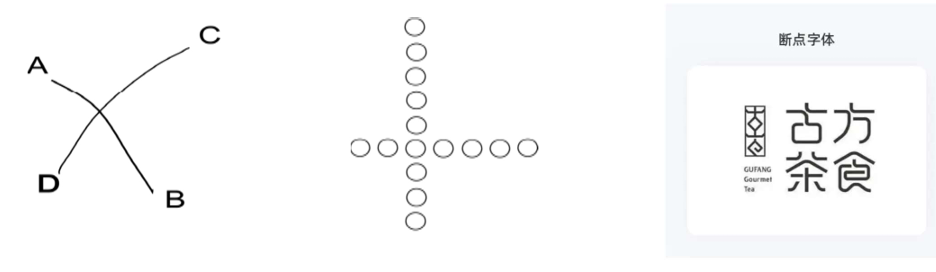
  - 对称性原则
    - **相互对称且能够组合为有意义单元的物体**会被组合在一起
  - 

  - 完整和闭合原则
    - 人们倾向于**忽视轮廓的间隙**而将其视作一个完整的整体
    - 页面上的空白可帮助实现分组
    - 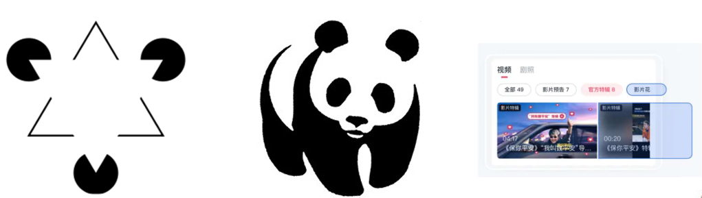
- 违反格式塔则可以突出某个物体
- 视错觉：上下文信息有助于增强人们的视觉感知
- 记忆特性
  - 三个阶段，Atkinson和Shiffrin
    - 感觉记忆
      1. 瞬时记忆，持续约1s
      2. 作用：视觉暂留，视频的实现
    - 短时记忆
      1. 工作记忆，30s左右。储存当前正在处理的信息。
      2. 感觉记忆经编码后进入短时记忆
      3. Short Term Memory, 简称 STM
      4. **存储能力**：7+2，7-2个信息单元
    - 长时记忆
      1. 短时记忆中的信息经进一步加工后会变为长时记忆不代表长时记忆区的信息丢失了
      2. 遗忘：可能失去了提取信息的途径，或原有联系受到了干扰。但不代表记忆丢失。
  - 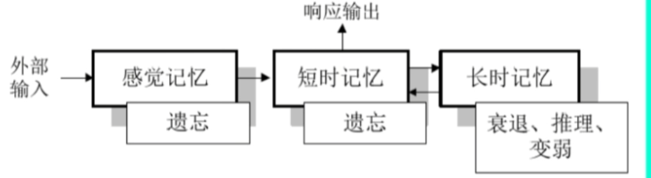
- 交互设备
  - 

## **交互设计的目标和原则**

- 目标
  - 可用性目标（产品应该具有的）
    - 易学性 关键问题在于确定用户准备花费多少时间学习一个产品
    - 易记性 学会使用并记住该产品如何使用的难易程度
    - 高效用 一定程度上该产品提供了正确的功能，可以让用户做他们需要做 的或想做的事情
    - 高效率 当用户学会使用产品之后，用户应该具有更高的生产力水平（效率）
    - 安全性 避免用户发生危险和陷入不好的情形
  - 用户体验目标（产品给用户额外带来的）
    - 用户与系统交互时的感受
    - 体验和可用性的关系 
    - 主观 vs.客观 
    - 矛盾性
      - 许多玩家喜欢找最具挑战、非简单的游戏：违反可用性 
      - 用塑料锤砸屏幕上的地鼠较用鼠标点击更费劲且更易出错，但会带来一个 更愉快和有趣的体验 
      - 有些可用性和用户体验目标是不兼容的 
    - **认识和理解可用性和其他用户体验目标之间的关系**是**交互设计的核心**
  - 简易可用性工程（可能这里会考实验设计？）
    - 提高产品的可用性为目标的先进的产品开发方法论，强调以人为中心来进行交互式产品的设计研发
    - 完整的可用性工程过程
      - 了解用户 
      - 竞争性分析 
      - 设定可用性目标 
      - 用户参与的设计 
      - 迭代设计 
      -  产品发布后的工作 
    - ####    简化的可用性工程过程 **四种主要技术**

    -  **用户和任务观察**  直接与潜在用户进行接触
    -  **场景（scenario）** 简便易行的原型工具，通过省略整个系统的若干部分来减少实现的复杂性
    -  **简化的边做边说（thinking aloud）**让真实用户在使用系统执行一组特定任务的时候，讲出他们的所思所想 **最有价值的单个可用性工程方法** 可了解用户为什么这样做，并确定其可能对系统产生的误解
    -  **启发式评估**  **5名专家能够发现约80%的可用性问题**，剩下的可以通过简化的边做边说方法来发现 为避免个人的偏见，应当让**多个不同的人来进行经验性评估** 
      - 系统状态可见性（进度条）
      - 和现实世界吻合（说人话）
      - 用户有控制的自主权（后退）
      - 一致化和标准化（确认在左还是右）
      - 预防错误（日历牌）
      - 认知而不是记忆（步骤条）
      - 使用的灵活性和效率（快捷键）
      - 审美感和最小化设计（遥控器）
      - 帮助用户识别、诊断和修正错误（说人话）
      - 帮助和文档（F1）
    - ####   可用性度量

    - 就是选一些用户来执行预定的任务，观察比较执行情况
    - 易学性度量
      - 从未使用过的用户
      - 统计到达某种熟练程度的时间（熟练程度：能够在特定的时间里完成一组特定的任务）
    - 易记性度量
      - 新手用户，熟练用户，非频繁使用用户（最能体现）
      - ①对特定长时间内没有使用系统的用户进行测试，记录执行特定任务所需的时间
      - ②在完成特定任务后要求用户解释各种命令的作用
    - 使用效率度量
      - 按已使用系统的小时数对用户进行分类
      - 记录不同用户群体的使用效率并绘制出曲线
    - 错误率度量
      - 所有用户
      - 统计用户在操作中的错误次数（可以在其他度量过程中一起进行）
    - 满意度度量
      - 所有用户
      - 在其他测试完成后询问用户（Likert度量尺度&语义差异尺度）
- 交互设计原则
  - 一般原则
    - 可学习性
    - 灵活性
    - 健壮性
  - ####  八条黄金原则（和启发式规则有很多可以对应的地方）

  - 尽可能一致（一致性和标准化）
    - 一致的颜色、布局、字体等 
  - 符合普遍可用性 （灵活性和高效性）
    - （不同用户群体都能轻松使用）
    - 专家用户/新手用户
  - 提供信息丰富的反馈（系统状态可见性）
    - 界面对象的可视化表现 
  - 设计说明对话款以生成结束信息（系统状态可见性？）
    - 让用户知道什么时候他们已经完成了任务
  - 预防并处理错误（预防错误）
    - 将不适当的菜单选项功能以灰色显示屏蔽 
    - 禁止在数值输入域中出现字母字符
    - 提供简单的、有建设性的、具体的指导来帮助用户恢复操作 
  - 让操作容易撤销（自主权和控制权）
    - 减轻用户的焦虑情绪，并鼓励用户尝试新的选
  - 支持内部控制点（自主权和控制权）
    - 提供出口：取消、重做、放弃等 
  - 减轻短时记忆负担（认知而不是记忆）
    - 确保提供用户足够的学习代码、记忆操作方法和操作序列的时间 
    - 提供适当的在线帮助信息 
  - ####  nielson 十项启发式规则 

  - 系统状态可见性（进度条）
  - 和现实世界吻合（说人话）
  - 用户有控制的自主权（后退）
  - 一致化和标准化（确认在左还是右）
  - 预防错误（日历牌）
  - 认知而不是记忆（步骤条）
  - 使用的灵活性和效率（快捷键）
  - 审美感和最小化设计（遥控器）
  - 帮助用户识别、诊断和修正错误（说人话）
  - 帮助和文档（F1）
  - ####  Norman 的七项原理

  - 应用现实世界和头脑中的知识
    - 系统应该在环境内部提供必要的知识。
  - 简化任务结构
    - 简化任务结构可避免复杂的问题求解和过多的内存负载。
  - 使事情变得明显
    - 要求界面使系统清楚能做什么事情以及如何完成，同时应该使用户清楚地看到这些操作在系统上的结果，其目的是架起执行和评估之间的桥梁。
  - 获得正确的映射
    - 应该将用户的意图和操作清晰地映射到系统的控制和事件上，保持相互之间清楚的对应关系和对应程度
    - 如对控制键和滑动键等而言，小的移动应该对应小的效果
  - 利用自然和人为的限制力量
    - 限制指除正确操作之外，禁止用户做其他事情
  - 容错设计
    - 在设计时应预见用户可能犯的错误，并提供系统的恢复机制
  - 当所有都不成功时进行标准化
    - 当驾驶员进入一辆从未驾驶过的汽车时，能够很快对其进驾驶，这是因为主要的控制已经标准化了

## 主要问题 

用户

需求

候选方案

决策 

 交互设计生命周期 

星型模型

可用性工程生命周期模型 

# 需求

## 产品特性 

- 功能不同 
- 物理条件不同 
- 使用环境不同 

## 用户特性

- 心理学原理部分，假设每个人都有相似的能力和局限性 
- 交互产品设计人员应该意识到个性的差异 
- 用户差异 体验水平 年龄 文化 健康 

## 用户建模 

- 人物角色 (Personas）
  - **不是真实的人**
  - 是基于观察到的那些**真实人的行为和动机**，并且在整个设计过程中**代表真实的人** 
  - 是在人口统计学调查收集到的**实际用户的行为数据的基础上形成的综合原型** 
  - 概念简单，但使用起来相当复杂 ：拼凑出几个用户档案是不行的 
- 人物角色的作用
  - 解决产品开发过程中出现的3个设计问题 
  - 弹性用户 
    - 为弹性用户设计赋予了开发者根据自己的意愿编码，而仍然能够为“用户”服务的许可 
  - 自参考设计 
    - 设计者或者程序员将其自己的目标、动机、技巧及心智模型投射到产品的设计中 
  - 边缘情况设计 
    - 必须考虑边缘情况，但它们又不应该成为设计的关注点 问：A会经常进行这种操作吗
- 人物角色的构造
  - 与某个系统有关的用户假定的一组公共需要、兴趣、期望、行为模式和责任 
  - 这些属性可能是若干用户共有 
  - 同一个用户也可以扮演系统的任意个不同角色 
  - 基于如下问题 
    - **谁**将使用系统？ 
    - 这些用户属于**哪些类型的人群**？ 
    - 是什么因素决定他们将**怎样使用系统**？ 
    - 他们与软件的关系有什么**特征**？ 
    - 他们通常需要软件提供什么**支持**？ 
    - 他们对软件会有怎样的**行为**？
    - 他们对软件的行为有什么**期望**？
- 人物角色的建模
  - 拼凑 采用头脑风暴方法，不去考虑他们的细节 
  - 组织 将这些片段按照所构造模型的需要进行分组和分类，归并或删除那些冗余重叠的东西 
  - 细节 建立和完善相应描述，补充遗漏的数据
  - 求精 对模型进行推敲，以便改进和完善 
  - 以上过程循环反复    

## 需求获取、分析、验证

- 需求获取：通过观察（直接或间接）
- 需求定义
  - 角色+场景
  - 五个步骤
    - 创建问题和前景综述
    - 头脑风暴
    - 确定角色的期望
    - 构建场景
    - 确立需求
  - 不断迭代
- 需求验证：把得出的需求给用户看
  - 原型：低保证，高保真（低保真好，高保真用户不会改）
    - 原型重要
      - 评估和反馈是交互设计的核心
      - 与文档相比，涉众能够更容易地看到、持有和与原型进行交互
      - 团队成员能够有效沟通

### 场景和观察 

- 观察
  - 直接观察 
    - 陪同他们工作而直接获得信息 
    - 可能影响被观察者的日常活动 
  - 间接观察 
    - 用视频/录音获得信息 
    - 观察者更舒适 
- 场景
  - “讲故事”
    - 是人们解释自己做什么或者希望执行某个任务的最自然方式
    - 故事的焦点就是用户希望达到的目标 
    - 若场景说明不断提到某个特定形式、行为或者地点，就表明它是该活动的核心 
  - 场景说明通常来自专题讨论或者访谈，目的是解释或讨论有关用户目标 的一些问题 

### HTA 层次化任务分析

- 把任务分解为若干子任务，再把子任务进一步分解为更细致的子任务。
- 之后，把他们组织成一个“执行次序”，说明在实际情形下如何执行各项任务 
- 图形描述
  - 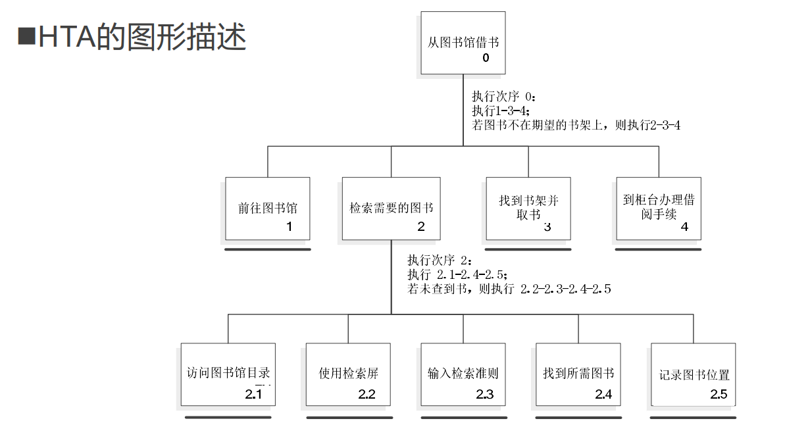
- 文字描述
  - 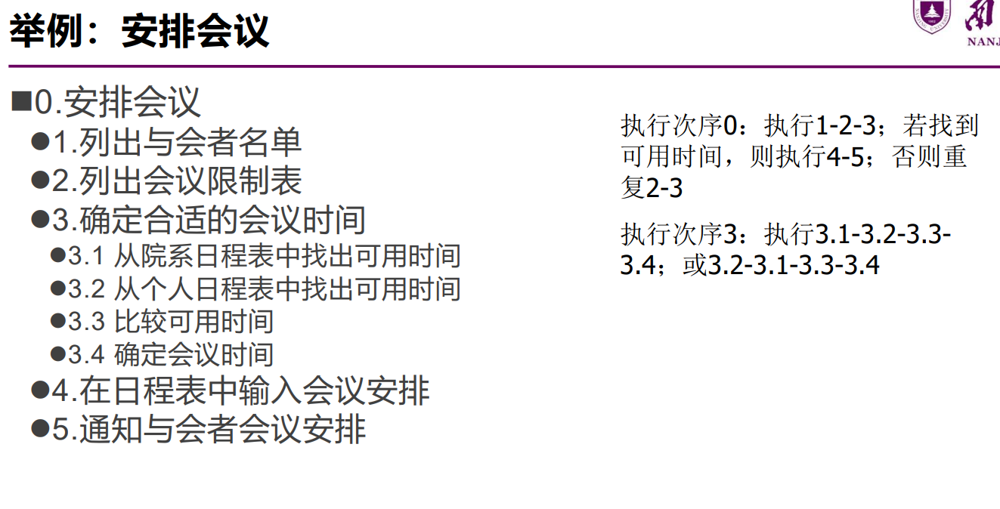

## 原型 

概念模型和心智模型

- 制作原型之前要首先关注用户的心智模型 
- 概念模型是对系统如何组织和操作的高级描述 
- 理想情况下，用户的心智模型应该与设计师的概念模型相同 

### 心智模型

心智模式又叫心智模型。所谓心智模式是指深植我们心中关于我们自己、别人、组织及周围世界每个层面的假设、形象和故事。并深受习惯思维、定势思维、已有知识的局限。

# 交互式系统的设计

## 设计框架（主要和前面的交互框架区分）

（设计过程的基本活动和特征 

1. 定义**外形因素和输入方法** 
   1. 外形因素 设计什么样的产品？
   2. 产品输入方法 产品与用户互动的形式
2. 定义**功能和数据元素** 
   1. 数据元素 交互产品中的基本主体，如相片、电子邮件、订单
   2. 功能元素 对数据元素操作的工具以及输入或者放置数据元素的位置
3. 决定**功能组合层次** 
4. 勾画**大致的设计框架** 
   1. 方块图阶段 用粗略的方块图来表达并区分每个视图 对应窗格、控制部件（如工具栏）为每个方块图添加上标签和注解
   2. 不要被界面上某个特殊区域的细枝末节分 散了精力
5. 构建**关键情景场景剧本** 
   1. 这些场景剧本描述了人物角色**最频繁**使用界面的主要路径
   2. 重点在任务层
   3. 可使用低保真草图序列的**故事板**
6. **通过验证性的场景剧本来检查设计** 
   1. 不用具备很多细节但包含一系列“如果怎样，将怎样”的问题

## 简化的设计策略

- 删除
  - 可以让设计师专注于把有限的重要问题解决好 
  - 删除视觉混乱，有助于用户心无旁骛地完成自己的目标
- 组织
  - **最快捷**的简化设计方式
  - 确定清晰的分类标准
  - 利用不可见的网格来对齐界面元素
  - 重要的元素要大一些，不太重要的界面元素应该小一些
  - 把相似元素放在一起
- 隐藏
  - 隐藏是一种**低成本**的简化方案
    - 用户不会因不常用的功能分散注意力 
    - 可作为删除不必要功能的开始 
    - 必须仔细权衡要隐藏哪些功能
  - 如果自定义的工具很简单，还是有价值的；一般来说，不应该让用户去自定义他们的软件
  - 渐进展示
    - 隐藏精确的控制部件：一项功能包含少数核心的供主流用户使用的控制部件，另有一些为专家级 用户准备的扩展性的精确的控制部件
  - 适时出现
    - 《纽约时报》 过分强调隐藏功能（如为每个词加上超链接）会导致混乱，在合适的时机、合适的位置上显示相应功能 
- 转移
  - 被精简掉的按钮全部通过电视屏幕上的菜单来管理
  - 在设备之间转移：移动平台与桌面平台：把某项任务的某些内容（如输入信息）转移到不同的平台 上可能是一种更好的选择 
  - 向用户转移
- **删除不必要的** 
- **组织要提供的** 
- **隐藏非核心的** 
- **转移不合适的？** 

## 设计中的折中

个性化和配置

本地化和国际化

审美学和实用性

## 软件设计的细节（感觉又重复一遍）

- 设计体贴的软件（尽责，自信，不问过多问题，知道什么时候调整规则，承担责任。具体什么意思看详细版）
- 加快响应时间（提前加载）
- 减轻用户的记忆负担（帮用户存储一些设置）
- 减少等待感（进度条，分步加载，分配任务分散注意力，降低期望值）
- 设计好的出错信息

## 设计模式

- 主导航模式 
- 二级导航模式 
- 轮播模式的讨论

# **交互设计模型与理论**

## 预测模型：

能够预测用户的执行情况而不用实际测试。

## GOMS模型（Goal、Operator、Method、Selection）（最著名的预测模型）

- 采用“分而治之”的思想，将一个任务进行多层次的细化 
- 把每个操作的时间相加就可以得到一项任务的时间
- 从最高层的用户目标开始，递归地分解出子目标直到无法再分，写出各个目标的实现方法
- 子目标的关系：顺序关系，选择关系
- 没有考虑错误处理、任务间的关系描述过于简单、忽略用户间的个体差异

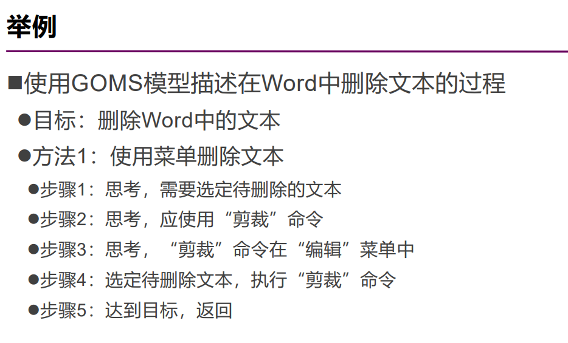

## KLM（击键层次模型）：GOMS模型的一种（这里很可能会考计算题！）

- 简化的模型，对执行时间进行量化预测。
- **场合：预测无错误情况下专家用户在特定输入前提下完成任务的时间。**
- 操作符

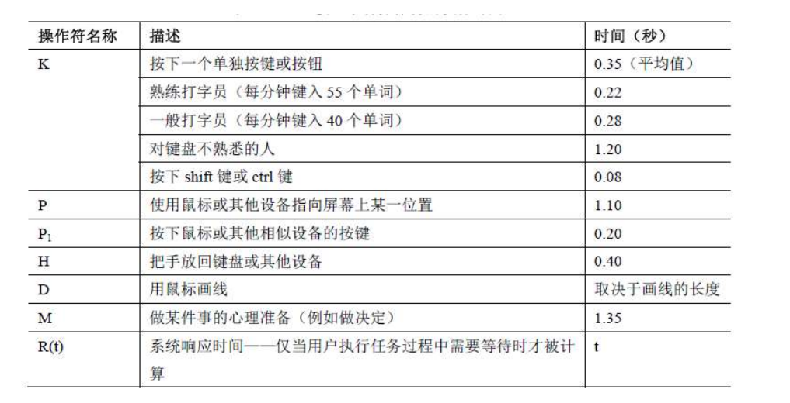

- 方法
  - 列出操作步骤：操作符名称+[到哪儿]的序列
  - 累加操作的预计时间
  - 操作符表格会给，不用背
  - 要看详细版的例子和规则
- 例子

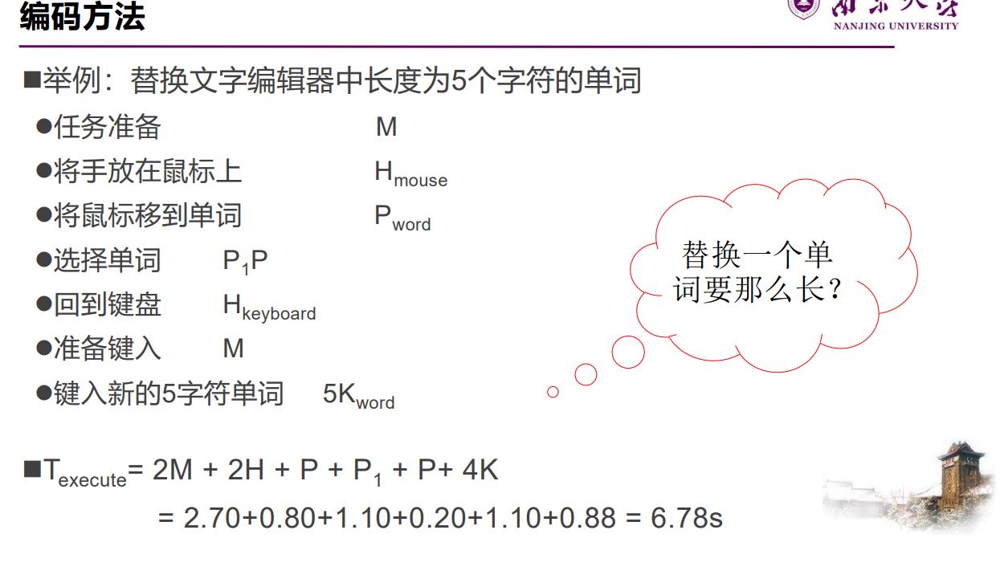

- 放置M操作符的启发规则 

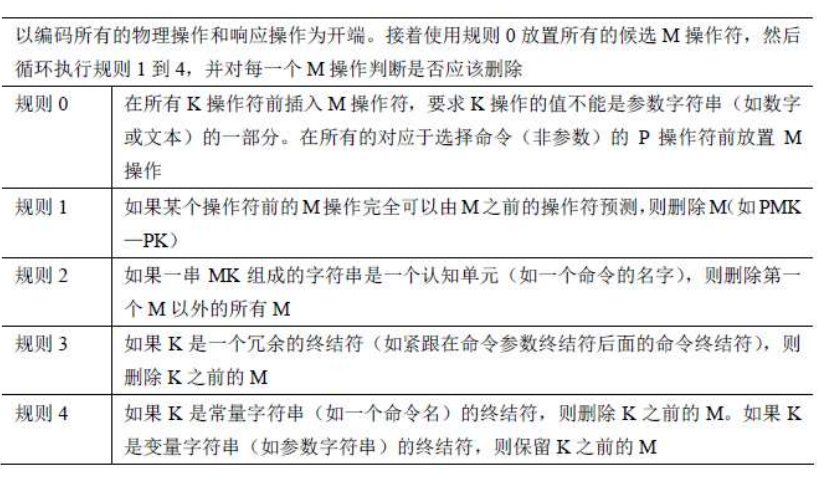

1.  在每一步需要访问长时记忆区的操作前放置一个M 
2.  在所有K和P之前放置M K -> MK; P -> MP 
3. 删除键入单词或字符串之间的M MKMKMK -> MKKK 
4. 删除复合操作之间的M (如, 选中P和点击P1 ) MPMP1 -> MPP1

## Fitts定律

- 预测指向某个目标的时间。依据：大小、距离
- 场合：可指导设计人员设计按钮的位置、大小和密集程度
- **“最健壮并被广泛采用的人类运动模型之一”**
- 得到的建议
  - 大目标、小距离
  - 尽可能大地占据屏幕空间
  - 最好的像素是光标所处的像素
  - 利用屏幕边缘
  - 大菜单
  -  动态特性建模

  - 状态转移网络
  - 三态模型
  -  语言模型：BNF

  -  系统模型：Z标记法

## **用户中心设计**

- 三个假设
  - 好的设计结果使用户感到满意
  - 设计过程是设计人员和客户间的协作过程
  - 整个过程中，客户和设计人员持续沟通
- 四个原则
  - 尽早以用户为中心进行设计
  - 综合设计
  - 尽早并持续进行测试
  - 迭代设计
- 用户参与设计（看完整版）
  - 重要性（为什么）
  - 形式
  - 参与式设计
- 理解用户工作
  - 上下文询问法/情景调查
    - 基于学徒模型
    - 研究人员也参与建立（观察法时用户不知道研究人员的存在）
    - 四个原则
      - 上下文环境
      - 伙伴关系
      - 解释
      - 焦点
- 反思（总之就是”UCD无法创造出新的需求“）
  - 影响创新性
  - 可操作性受限
  - 忽略人的主观能动性和对技术的适应能力
- 改进：活动为中心的设计（ACD）

# **评估**

## **基础知识**

- 评估是系统化的数据收集过程。目的是了解用户在特定环境中使用产品执行特定任务的情况

### 目标

- 评估系统功能的范围和可达性
- 评估交互中用户的经验
- 确定系统的某些特定问题

### 原则

- 应该依赖于产品的用户
- **评估与设计结合进行**
- 应在用户的**实际工作任务和操作环境下进行**
- 要选择有**广泛代表性的用户**

### 评估范型

- 快速评估（非正式地询问）
- 可用性测试（评估用户执行典型任务时的情况，如出错次数、完成任务的时间等。类似简易可用性工程中的度量方法）
- 实地研究（在自然工作环境中观察用户的真实使用情况）
- 预测性评估（专家预测用户行为。典型例子就是启发性评估）

### 评估技术

- 观察用户
- 询问用户意见
- 询问专家意见
- 测试用户的执行情况
- 使用原型
- 基于模型和理论，预测界面的有效性（GOMS和KLM）

### 评估方法（可用性评估方法汇总）

- 启发式评估
- 边做边说
- 观察
- 问卷调查
- 访谈
- 焦点小组
- 用户反馈
- 可用性测试

### DECIDE评估框架

- 决定总体目标（Determine）
- 发掘需要回答的具体问题（Explorer）
- 选择用于回答具体问题的评估范型和技术（Choose）
  - 范型决定了技术类型
- 标识必须解决的实际问题（Identify）
  - 应选择恰当的用户参与评估
  - 任务时间多长
  - 设施及设备
  - 期限及预算是否允许
  - 是否需要专门技能
- 处理有关道德的问题（Decide）
  - 应保护个人隐私
- 评估解释并标识数据（Evaluate）
  - 搜集什么类型的数据，如何分析，如何表示 通常由评估技术决定
  - 可靠性 非正式访谈的可靠性较低 
  - 有效性 能否得到想要的测量数据 
  - 偏见 评估人员可能有选择地搜集自己认为重要的数据 
  - 范围 研究发现是否具有普遍性 
  - 环境影响 霍桑效应 

### 小规模试验（看完整版）

- 小规模试验可进行多次 
  - 类似迭代设计 
  - 测试——反馈——修改——再测试 
  - 快速、成本低 

### 可用性问题分级（看完整版）

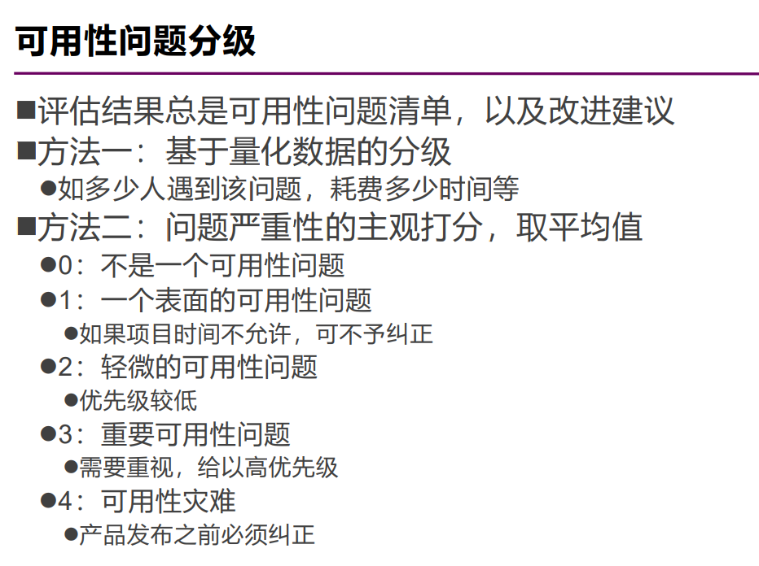

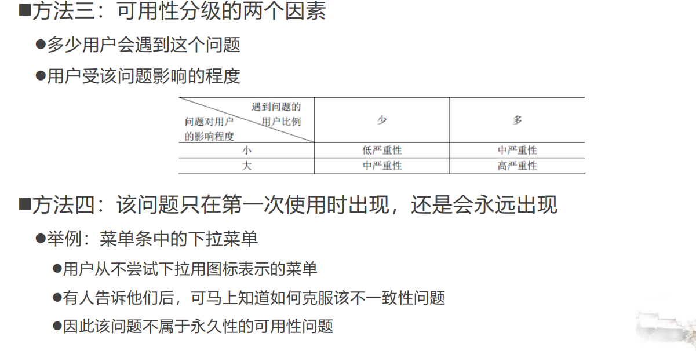

## **评估之观察用户**

- 直接观察
  - 方式
    - 真实环境中的观察 现场观察 用户的实际环境中观察用户在使用软件时的情况
    - 受控环境中的观察 实验室观察
  - 观察框架
    - 人员：有哪些人员在场？他们有何特征？承担什么角色？
    - 行为 ：人们说了什么？做了什么？举止如何？是否存在规律性的行为？语调和肢体语言如何？ 
    - 时间：行为何时发生？是否与其他行为相关联？ 
    - 地点 ：行为发生于何处？是否受物理条件的影响？ 
    - 原因：行为为何发生？事件或交互的促成因素是什么？不同的人是否有不 同的看法？ 
    - 方式：行为是如何组织的？受哪些规则或标准的影响？ 
- 间接观察
  - 日志和交互记录 
    - 可根据搜集到的数据，推断实际情形，并找出可用性和用户体验方面的问题
    - 体现了用户是如何完成真实任务的  使得从工作在不同环境下的大量用户那里自动收集数据变得相当容易
- 数据记录
  - 日志和交互记录
  - 音视频记录
  - 纸笔
- 数据分析（应该不会考吧？）

## **评估之询问用户**

### 访谈

- 请用户详细讲述记录里面任何可能引发可用性问题的地方 
  - 如对一个没用过系统某个功能的用户，询问为什么没有使用某项功能

### 原则 技巧

- 避免过长的问题 
- 避免使用复合句 
  - 对：“这款手机与你先前拥有的手机相比，你觉得如何” 
  - 错：“你觉得这款手机怎么样？你是否有其他的手机？若是的话，你觉得它怎么样？”
- 避免使用可能让用户感觉尴尬的术语或他们无法理解的语言
- 避免使用有诱导性的问题 
  - 你为什么喜欢这种交互方式？ 
- 尽可能保证问题是中性的 

#### 步骤

- “开始”阶段 
  - 访问人先介绍自己 
  - 解释访谈的原因，消除受访人对道德问题的疑虑，询问受访人是否介意被记录（录音或摄像） 
- “热身”阶段 
  - 先提出简单的问题 
- 主要访谈阶段 
  - 按逻辑次序由易到难提问 
- “冷却”阶段 
  - 提出若干容易的问题，消除用户的紧张感觉 
- 结束访谈 
  - 感谢受访者，关闭录音机，收好笔记本，表面访谈已经结束 

#### 类型

- 非结构化访谈 
  - 问题是**开放式**的，不限定内容和格式 
  - 受访人自行选择详细回答还是简要回答 
  - 访问人应确保能够搜集到重要问题的回答 
- 结构化访谈 
  - 根据预先确定的一组问题进行访谈 
  - 问题通常是“**封闭式**”的，它要求准确的回答 
- 半结构化访谈 
  - **开放式问题+封闭式问题** 
  - 注意不要暗示答案 
- 集体访谈 
  - 基本思想：个别成员的看法是在应用的上下文中通过与其他用户的交流而形成的 
  - “焦点小组”是集体访谈的一种形式 

### 问卷调查

#### 设计原则 

- 应确保问题明确，具体 
- 在可能时，采用封闭式问题并提供充分的答案选项 
- 对于征求用户意见的问题，应提供一个“无看法”的答案选项 
- 注意提问次序，先提出一般化问题，再提出具体问题 
- 避免使用复杂的多重问题 
- 在使用等级标度时，应设定适当的等级范围，并确保它们不重叠 
  - 做到直观、一致 
- 避免使用术语 
- 明确说明如何完成问卷 
  - 如说明应在选项前的方框内打“√” 
- 在设计问卷时，既要做到紧凑，也应适当留空 

上面两者都属于间接方法。不能完全听信

## **评估之询问专家**

### 认知走查

- 无需用户
- 逐步检查使用系统执行任务的过程，得出人们**第一次使用时的想法和大致流程**。能找出非常具体的问题

#### 步骤

- 标识并记录典型用户的特性 
- 基于评估重点，设计样本任务 
  - 应该是大多数用户要做的典型任务 
- 制作界面原型（或界面描述），明确用户执行任务的具体步骤 
- 由设计人员和专家级评估人员（一位或多位）共同进行分析 
- 评估人员结合应用的上下文，逐步检查每项任务的操作步骤 
  - 正确的操作对于用户是否足够明显？（可预见）
    - 即用户能否知道如何完成任务 
  - 用户能否注意到正确的操作？ （可理解） 
    - 功能名称或图标设计是否容易理解 
  - 能否正确解释操作的响应？（可解释）
    - 执行—评估交互周期的完成 
  - 认知走查的记录工作非常重要！ 
- 在完成逐步检查之后，汇总关键信息 
- 修改设计，更正发现的问题 

### 协作走查

- 由用户、开发人员和可用性专家合作，讨论与可用性问题

### 启发式评估

- 无需用户。快速有效，但可能出现虚假警报和漏报

## **评估之用户测试**

- 适用于对原型和能够运行的系统进行测试
- 测试设计
  - 需要考虑实际限制并作出适当的折衷
  - 确保不同参与者的测试条件相同
  - 确保评估目标特征具有代表性
  - 实验可重复

### 以DECIDE框架为基础

- 定义问题和目标
  - 举例：对菜单结构的关注 
  - 用户在第一次尝试使用时将能选择正确的菜单 
  - 用户在少于5秒的时间内，能够导航到正确的3级菜单 
- 选择参与者：
  - 了解用户的特性有助于选择典型用户 
  - 要尽可能接近实际用户 
  - 通常也需要平衡性别比例 
  - 至少4~5位，5~12位用户就足够了（视情况而言）
  - 注意均衡处理和消除顺序效应
    - 顺序效应即参与者在执行前一组任务时获得的经验将影响后面的测试任务 
    - 如果有两项任务A和B，那么，应让一半的参与者先执行A，再执行B，另一 半则先执行B，再执行A
- 设计测试任务。每项任务5-20分钟。
  - 
- 明确测试步骤。总时间控制在1小时之内。
  - 正式测试前应进行小规模测试
  - 在必要时，评估人员应询问参与者遇到了什么问题 
  - 若用户确实无法完成某些任务，应让他们继续下一项任务
  - 必须分析所有搜集到的数据 
- 数据收集
  - 使用的度量类型（定性/定量）依赖于所选择的任务
    - 完成任务的时间 
    - 停止使用产品一段时间后，完成任务的时间 
    - 执行每项任务时的出错次数和错误类型 
    - 单位时间内的出错次数 
    - 求助在线帮助或手册的次数 
    - 用户犯某个特定错误的次数 
    - 成功完成任务的用户数 
- 数据分析
  - 最常用的描述性统计方法是次数统计 平均数统计 

# **附：评估大题作答方法**

- 各种评估方法概要
  - 观察用户（任务分析，后续研究）
    - 直接观察
      - 实验室观察：易于分析
        - 边做边说
      - 现场观察（发现**同使用环境有关的问题**的最佳手段）
    - 间接观察：日志和交互记录（**直接观察会影响用户或评估人员无法在现场时使用**）
  - 询问用户意见（任务分析、后续研究）
    - 访谈
      - 非结构化、半结构化、结构化
      - 集体访谈（焦点访谈：问**用户想要什么**，而不是看使用是否有问题）
    - 问卷调查
  - 询问专家意见（任意阶段）
    - 认知走查（只适合评估一个产品的**易学习性**）
    - 协作走查（由用户、专家、开发者合作，发现**可用性**问题）
    - 启发式评估（用于**早期设计**）
  - 用户测试（对**原型和能够运行的系统**进行测试）
    - DECIDE模型
  - 分析模型（界面的**有效性**，或用来比较用户使用不同方案的**执行效率**）
    - Fitts
- 注意题目中
  - 对设计阶段的要求，如“设计初期阶段”，“已经设计和实现了”，“有一个xxx原型”，“在实现和给出原型之前”；
  - 对目标的要求，如“那种xx最容易学习”-->易学性，“能减少等待时间”-->效率，“在发布前想进行评估” --> 可用性和用户体验。
- 以筛选合适的评估方法和技术。

- 各个技术的详细内容写什么
  - 实验室观察：做的任务，进行测试，记录……可以边做边说，统计数据并分析
  - 访谈：谈什么，并做记录
  - 问卷调查：问什么，并做记录
  - 认知走查：试图想象出用户在第一次使用某个产品是的想法和所采取的动作，大致流程如何
  - 协作走查：逐步检查任务场景，讨论可用性问题
  - 启发式评估：分析每个问题对应的启发式规则，列出所有问题，给出“问题描述、严重等级、修复等级、违反规则、改进建议”列表
  - 用户测试：选择……作为参与者，怎么分组，怎么做，记录什么，统计数据，分析