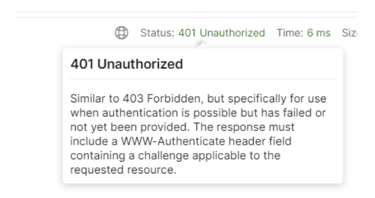
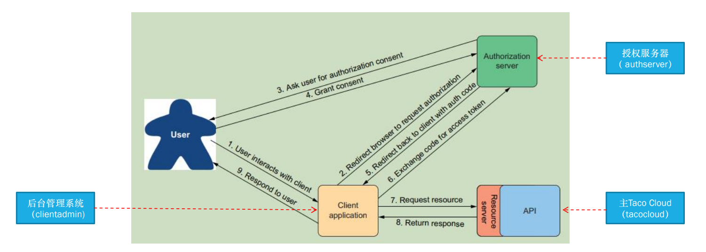
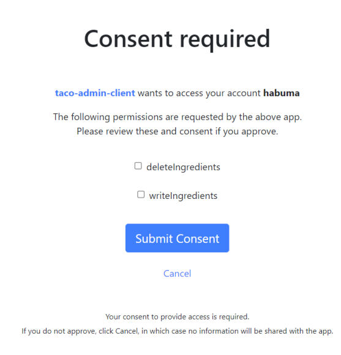
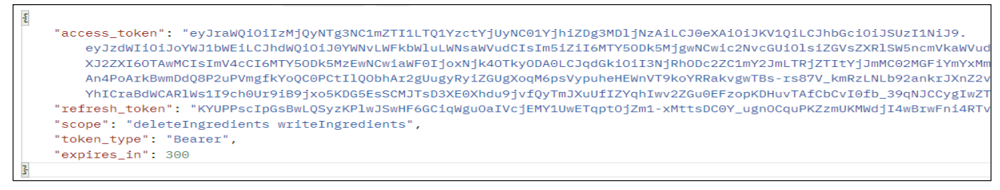
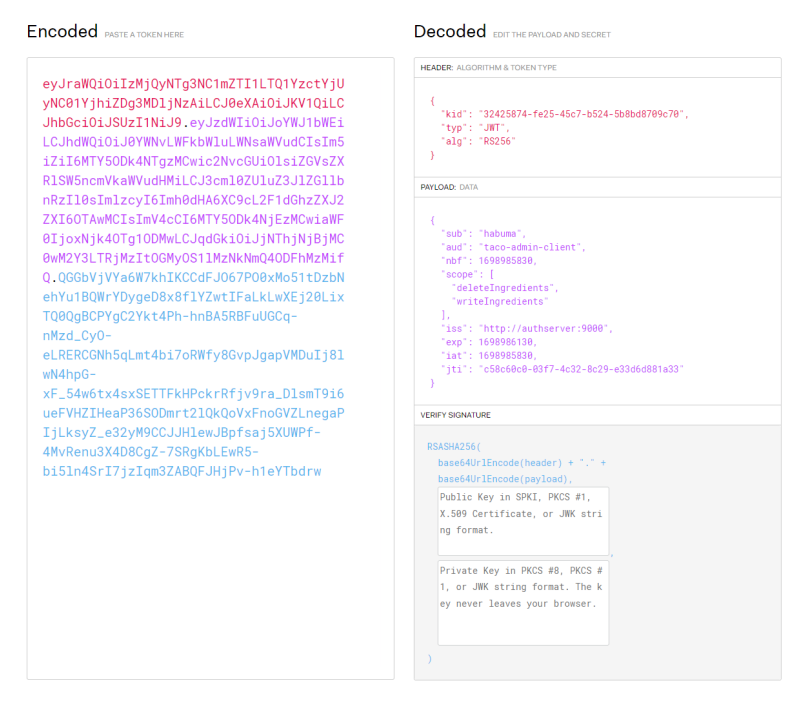
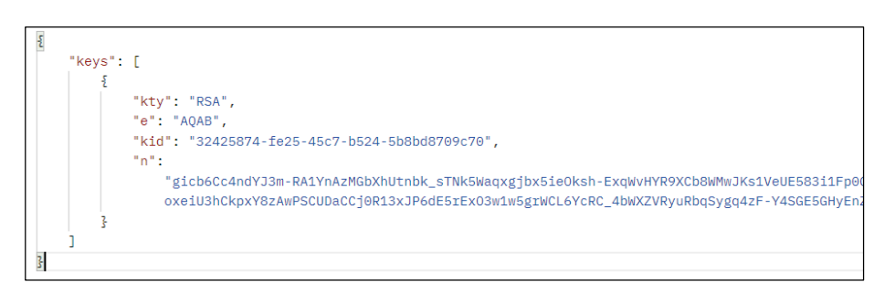
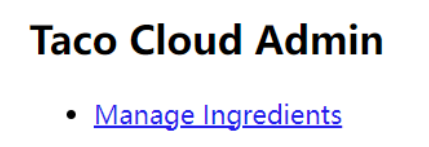
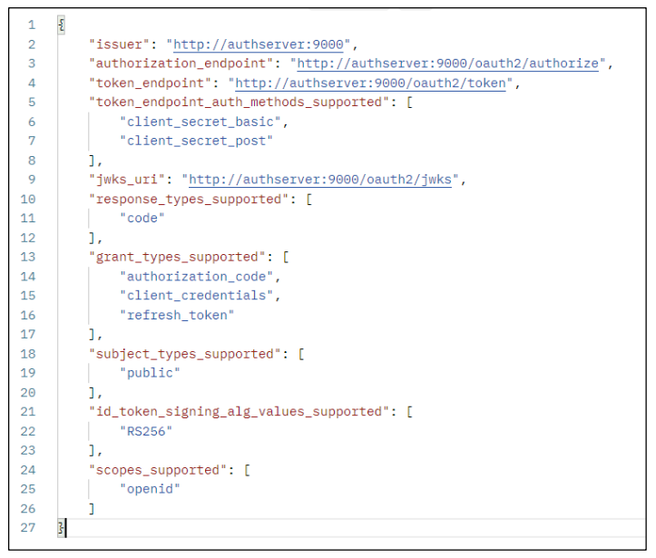

# ch10-OAuth2

# 创建授权服务器

## 主Taco Cloud增加REST API 

*  控制器实现：IngredientController

## 增加权限控制 

* POST：http://tacocloud:8080/api/ingredients 
*  DELETE ：http://tacocloud:8080 /api/ingredients/* 
*  两种方式 
  *  .antMatchers(HttpMethod.POST, "/api/ingredients").hasAuthority("ROLE_USER")
  *  @PreAuthorize("hasAuthority('ROLE_USER')")



## OAuth 2是一个安全规范（很重要，问答题）👍

* 授仅码授权（authorization code grant）模式



* AS：授权服务器，授权认证在这
* RS：资源服务器，需要保护API
* 客户app：客户端，需要用户从授权服务器授权
* **先有code再有token ：客户端程序其实并不知道用户id对应的密码，客户端后端一直维护密码，在向授权服务器换取token时才会使用密码，密码不会在浏览器中传来传去，别的程序拿到code但是没有密码的话没有办法获得token**
* 授权服务器会用**私钥**给token签名，资源服务器用**公钥**验证token是否合法
* token不变时公钥也不变，只有第一次才需要向授权服务器索取公钥

###  过程👍

其中使用**授权码授权模式**

1. 用户使用第三方的应用程序，也就是客户端应用程序

2. 客户端发现用户未登录，将用户

   重定向

   到授权服务器

   - 授权服务器会维护合法的重定向地址，用于校验

3. 授权服务器向用户索取用户名密码

4. 用户名密码匹配，则授权服务器请求用户授权

5. 授权服务器给客户端程序返回code，重定向回到应用程序

   - **这里的code是和重定向URL一起返回给浏览器的，所以不安全**
   - 授权服务器返回的是重定向url+code

6. 客户端应用程序用code向授权服务器索取token

   - 用code交换token，可能包含**访问令牌（access token）和更新令牌（refresh token）**
   - **token不过浏览器**，在应用程序服务端和授权服务器之间处理

7. 客户端在请求头带上token调用资源服务器的API

8. 资源服务器验证token，返回结果

   - 第一次，资源服务器向授权服务器索取公钥，验证Token合法性
   - Token过期时才会重新索取公钥

9. 客户端程序把结果返回给用户

密码没有在浏览器来回传送，但是如果没有密码即使拿到code也没用
用code向授权服务器换取token才需要密码

[9-OAuth2 - Charlie's Blog (chillcharlie357.github.io)](https://chillcharlie357.github.io/posts/a0bd262e/)

### 其他模式 

* 隐式授权（implicit grant），直接返回访问令牌，而不是授仅码 
* 用户凭证（或密码）授权（user credentials (password) grant）：用户凭证直接换取访问令牌，不经过浏览 器登录 
*  客户端凭证授权（client credentials grant）：客户端交换自己的凭证以获取访问令牌

# 开发授权服务器

## 授权服务器config

1. 注册第三方应用程序（客户端）
2. 指定资源服务器地址
3. jwkSource

## 配置本地域名

* Windows：C:\Windows\System32\drivers\etc\hosts 
*  Linux：/etc/hosts 
  * 127.0.0.1 tacocloud 
  * 127.0.0.1 authserver 
  * 127.0.0.1 clientadmin

## 创建授权服务器

* Spring Authorization Server 
* OAuth2AuthorizationServerConfiguration默认配置 
* 客户端存储库，RegisteredClientRepository（接口），RegisteredClient， InMemoryRegisteredClientRepository 
* OAuth 2 scope：writeIngredients、deleteIngredients

## 重定向的例子 

*  http://clientadmin:9090/login/oauth2/code/taco-admin-client?code=MGrX0ZgOoCpICZuGnhRGvsxBp3tV2DFlj9ScBIg1UGcla81haYuUjrpfGuZfsV3Od5a_gk7T6TZWspjCdEAkins4gE-fvWL_bhYmZO3D7KJ5NXHqNHNG1vMreI1p5-gz

## clientSettings.requireUserConsent(true)



## 生成JWK 

*  JSON web key，RSA密钥对（公䄴、私䄴），用于对令牌签名，令牌会用私钥签名，资源服务器会通过从授权 服务器获取到的公钥验证请求中收到的令牌是否有效 
*  interface JWKSource 
* interface JwtDecoder

## 运行授权服务器 

*  获得授权码（浏览器访问）： http://authserver:9000/oauth2/authorize?response_type=code&client_id=taco-admin-client&scope=writeIngredients+deleteIngredients&redirect_uri=http://clientadmin:9090/login/oauth2/code/taco-admin-client 
* 获得token（postman访问） POST ： http://authserver:9000/oauth2/token
* 刷新token（postman访问）： http://authserver:9000/oauth2/token



## jwt解码 

*  https://jwt.io/



# 创建资源服务器

## 添加依赖

1. 添加依赖

```xml
<dependency>
    <groupId>org.springframework.boot</groupId>
    <artifactId>spring-boot-starter-oauth2-resource-server</artifactId>
</dependency>
```

2. 在过滤器中针对被保护的API添加权限控制

- 使用`SCOPE_`前缀
- 开启API调用前的过滤器

```java
.antMatchers(HttpMethod.POST, "/api/ingredients").hasAuthority("SCOPE_writeIngredients")
.antMatchers(HttpMethod.DELETE, "/api/ingredients/*").hasAuthority("SCOPE_deleteIngredients")

```

## 开启调用API前的过滤器：

```java
 .and() .oauth2ResourceServer(oauth2 -> oauth2.jwt())
```

## 配置资源服务器从何处获取公钥

```yml
spring:
	security:
		oauth2:
			resourceserver:
				jwt:
					jwk-set-uri: http://tacocloud:9000/oauth2/jwks
```



## 从POSTMAN访问被保护资源 

* 带着token（Authorization属性）访问POST：http://tacocloud:8080/api/ingredients 
* 带着token（Authorization属性）访问DELETE：http://tacocloud:8080/api/ingredients/*

#  开发客户端应用

## 添加依赖

```
<dependency>
    <groupId>org.springframework.boot</groupId>
    <artifactId>spring-boot-starter-oauth2-client</artifactId>
</dependency>
```

## 代码配置

```java
@Bean
SecurityFilterChain defaultSecurityFilterChain(HttpSecurity http) throws Exception {
    http
    .authorizeRequests(
    authorizeRequests -> authorizeRequests.anyRequest().authenticated()
    )
    .oauth2Login(
    oauth2Login ->
    oauth2Login.loginPage("/oauth2/authorization/taco-admin-client"))
    .oauth2Client(withDefaults());
    return http.build();
}

```

## 属性配置

```java
spring:
security:
oauth2:
client:
registration:
taco-admin-client:
provider: tacocloud
client-id: taco-admin-client
client-secret: secret
authorization-grant-type: authorization_code
redirect-uri: "http://clientadmin:9090/login/oauth2/code/{registrationId}"
scope: writeIngredients,deleteIngredients,openid 
provider:
tacocloud:
issuer-uri: http://authserver:9000

```

## 实现请求拦截器

请求头增加属性：Authorization

## 访问

* http://clientadmin:9090



### http://authserver:9000/.well-known/openid-configuration

