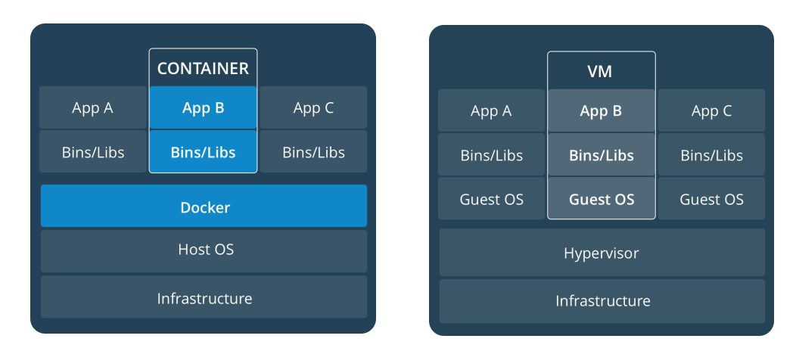
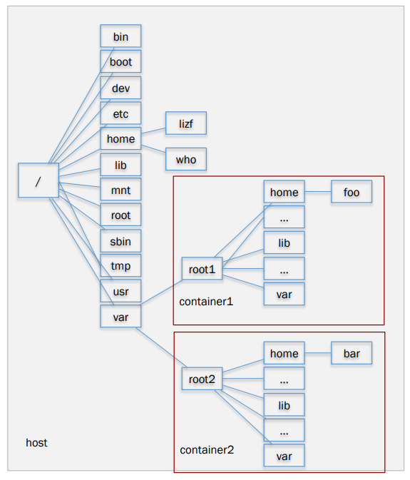
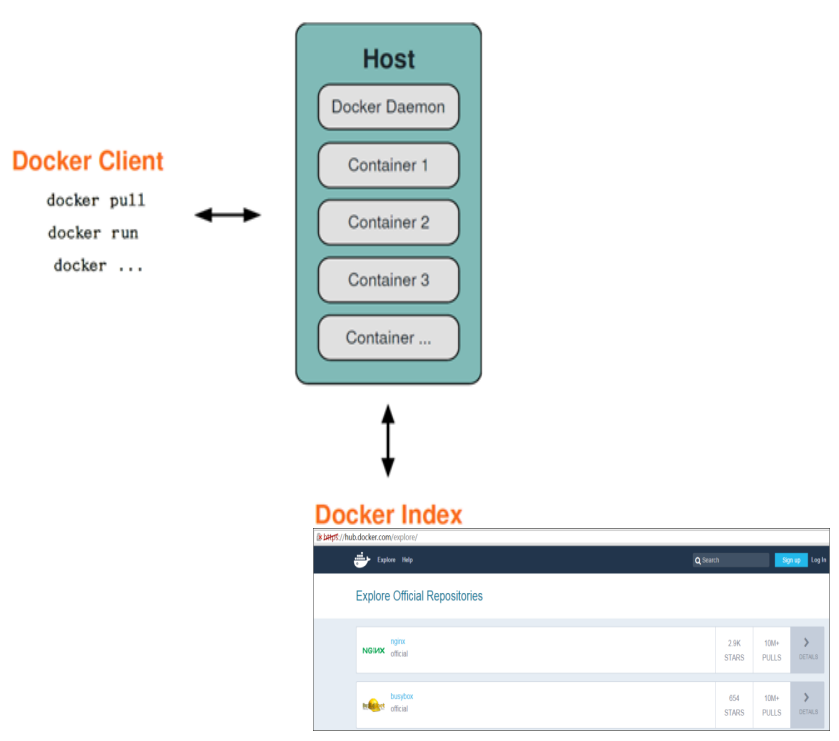
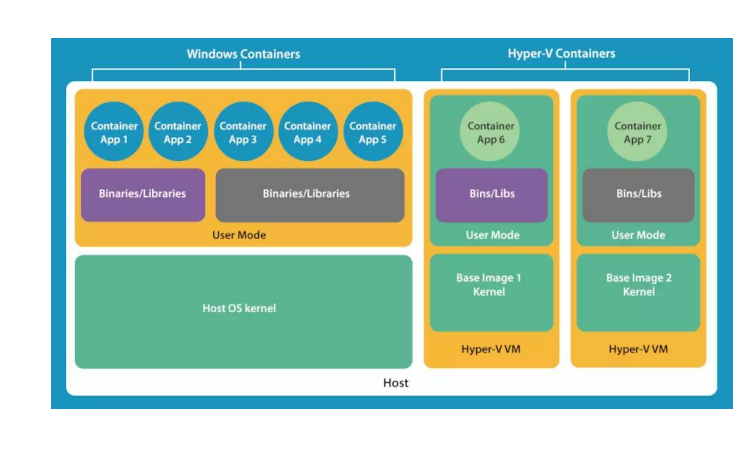

# ch15-Docker

本篇大量参考

[14-docker - Charlie's Blog (chillcharlie357.github.io)](https://chillcharlie357.github.io/posts/33399bea/)

## 容器与虚机



### 什么是容器?

容器是另外一种轻量级的虚拟化，容器是共用主 机内核，利用内核的虚拟化技术隔离出一个独立 的运行环境，拥有独立的一个文件系统，网络空间，进程空间视图等



## Docker 的 3部分

* Docker daemon就是**Docker Engine** ， 一般在宿主主机后台运行 
* 用户使用**client**通过pipe 、unix socket 或tcp直接跟daemon交互 
* Docker index指向Docker **registries** ， 也叫docker仓库，可以用来让你上传和 下载images 。Hub.docker.com 为 docker官方仓库
* 每一部分有哪些部分构成？




## Docker可运行在以下操作系统 

* Windows 
* OS X 
* Linux

### Windows下的两类容器 

*  Windows Container 
*  linux container



# docker子命令

## run👍

文件：写时复制，不修改就用底层linux的文件，修改复制一份就放到上一层

- **`--rm`: 退出时删除容器**

- **`--it`: 进入命令行终端**

- **`-d`: 后台运行容器，并返回容器 ID**

- `-i`: 交互模式运行容器，通常与 -t 同时使用

- `-t`: 为容器重新分配一个伪输入终端，通常与 -i 同时使用

- **`-p`: 指定（发布）端口映射**
  - **格式为：主机（宿主）端口：容器端口**
  
- `-P`: 随机端口映射，容器内部端口随机映射到主机的高端口

- **`--name="nginx-lb"`: 为容器指定一个名称**

- **`-e username="ritchie"`:设置环境变量**
  - 可以用环境变量给容器初始化/传入特定参数，在微服务中很常用
  - 例：给mysql容器传`MYSQL_ROOT_PASSWORD`

- `--env-file=c:/templ /tl .txt`: 从指定文件读入环境变量

- **--expose = 2000-2002: 开放（暴露）一个端口或一组端口，用于指出容器内可能对外暴露的端(不一定映射)**
  - 如果加上-P则会建立外部端口映射
  
- **`--link <name or id>:alias`：链接两个容器，使得他们可以相互通信**
  - 右边可以写在本地属性文件，可以在不修改命令的情况下把远程容器映射到本地容器
  
- **`-v c:/templ :/data`: 绑定一个卷**
  - 左边时本机路径，右边是容器路径
  
- `--rm`: 退出时自动删除容器

如何在镜像中查看网卡信息和ip地址？

```
docker run --rm -it busybox
cat /etc/hosts
ip a
```

- `--link`的例子：`docker run -d --name node --link selenium_hub:hub selenium/node-chrome-debug`。创建并启动名为node的容器，并把该容器和名为selenium_hub的容器链接起来。hub是该容器在link下的别名（alias），通俗易懂的讲，站在node容器的角度，selenium_hub和hub都是1cbbf6f07804容器的名字，并且作为容器的hostname，node用这2个名字中的哪一个都可以访问到1cbbf6f07804容器并与之通信（docker通过DNS自动解析）。

## 2.2. inspect

查看详细信息

`docker image`和`docker container`都有`inspect`子命令

# 镜像分层👍

- 写时复制 COW (Copy-On-Write)

  - 需要修改底层文件时才会复制一份到上层，然后进行修改

- 否则一直共享底层文件

- docker history \<image name> 查看镜像的层


# 数据的存储方式

1. 数据卷 Volume：docker自管理
2. bind mounts：存储在宿主机的任意位置
3. 临时文件系统 tmpfs(temporary file system)：存储在宿主机内存中

docker volume子命令可以管理数据卷


# 导入导出镜像

- 备份镜像
  - 保存：**docker save -o 文件名.tar 镜像**
  - 导入

# dangling镜像

dangling镜像：没有tag的镜像
**查看：`docker image ls -f dangling=true`**
**删除dangling镜像：`docker image prune -f`**

#  Docker System

- **docker system df** 命令，类似于 Linux上的 df 命令，用于查看 Docker 的磁盘使用情况
- RECLAIMABLE 指可回收的，对 image, 指的是没有被容器使用的镜像
- 查看系统日志：**docker system events**

#  容器网络👍

不同Network Driver的区别：[Network drivers overview | Docker Docs ](https://docs.docker.com/network/drivers/)

[Docker 网络模式详解及容器间网络通信 - 知乎 ](https://zhuanlan.zhihu.com/p/212772001)

- none网络， `--net=none`
- host网络，`--net=host`

  - 共享宿主机的网络
- bridge网络,`--net=bridge`

  - 例：docker0的linux bridge
- container网络,`--net=container:NAME_or_ID`

  - 新创建的容器共享其他容器的网络
- 共享相同的ip地址和端口号，类似k8s的pod
- `docker run --network=my-net`：在同一个network里的多个容器可以相互通信
  `docker network connect `


上图中host为宿主机，docker0为网关，docker1和docker2为容器
host eth0：宿主机网卡

#  Vscode中基于docker容器开发

C/C++：底层开发，嵌入式，性能要求高

Java：

Python

JS：前端开发，服务端，基于JS的测试工具


Gadle：并发构建，性能优于maven