# ch01

## HarmonyOS开发

### 系统架构 – 整体架构

内核层、系统服务层、框架层和应用层

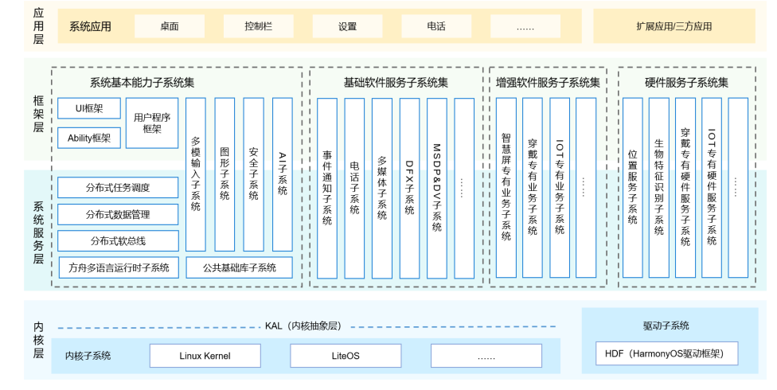

### 内核层

内核层是整个操作系统的核心，提供操作系统最基础的服务，主要分为内核子系 统和驱动子系统 

特别是适合物联⽹设备的LiteOS，能够为HarmonyOS的“同⼀套系统能⼒，适配多种终端形态” 的分布式理念提供坚实的基础 。

### 系统服务层

* 系统服务层是HarmonyOS的核⼼能⼒集合，通过框架层对应⽤程序提供服务，包括：
* 系统基础能⼒⼦系统 
  * 为分布式应⽤在HarmonyOS多设备上的运⾏、调度、迁移等操作提供了基础能⼒
* 基础软件服务⼦系统
  * 主要是⼀些设备之间公共的、通⽤的软件服务。
* 增强软件服务⼦系统
  * 提供针对不同设备的、差异化的能⼒增强型软件服务
* 硬件服务⼦系统 
  * 提供硬件服务，由位置服务、⽣物特征识别、穿戴专有硬件服务、IoT专有硬件服务等⼦系统组成

### 框架层

框架层提供了⽤户语⾔框架、Ability框架和UI框架

* ⽤户语⾔框架⽀持了Java/C/C++/JS等多种编程语⾔ 。
* Ability框架则是对系统服务能⼒的⼀种抽象的框架 。
* Harmony的UI框架提供了适⽤于JS语⾔的JS UI框架 。

### 应用层

应⽤层包括系统应⽤和扩展应⽤/第三⽅⾮系统应 ⽤ 。 

Stage模型：HarmonyOS 3.1 Develper Preview 版本开始新增的模型，是⽬前主推且会⻓期演进 的模型。在该模型中，由于提供了AbilityStage、 WindowStage等类作为应⽤组件和Window窗⼝ 的“舞台”，因此称这种应⽤模型为Stage模型

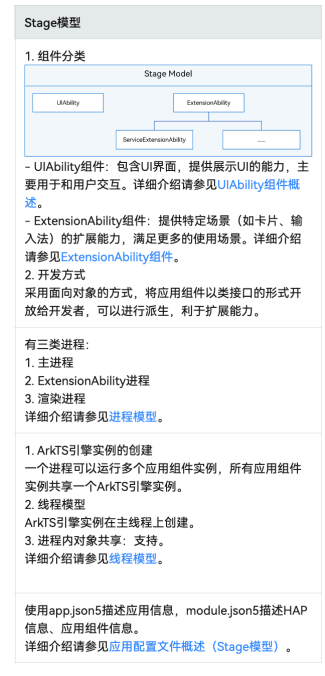

### 系统技术特性

HarmonyOS是⼀个多设备互连的分布式操作系统，通过**分布式软总线、分 布式设备虚拟化、分布式数据管理和分布式任务调度**从⽽达到“硬件互助， 资源共享” 。 

分布式软总线是多种终端设备的统⼀基座，为设备之间的互连互通提供了统 ⼀的分布式通信能⼒，能够快速发现并连接设备，⾼效地分发任务和传输数 据 

软总线构建在基础通信的协议栈之上，利⽤总线中枢实现设备的发现和连 接，以及组⽹和拓扑管理，这样多种终端设备就可以形成有效的连接。然后 再通过任务和数据总线，实现不同抽象层次的任务分发和数据传输

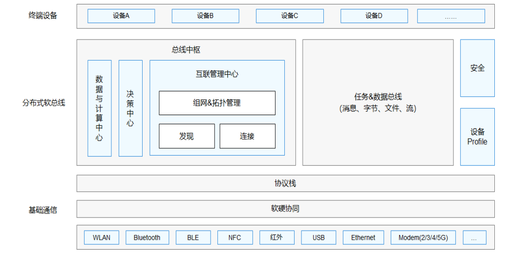

有了超级虚拟终端和基于分布式软总线的能⼒，HarmonyOS可以实现应⽤程序数 据和⽤户数据的分布式管理 。

对开发者来说，HarmonyOS能够**“⼀次开发，多端部署”**

### 系统安全 — 身份安全

HarmonyOS通过以下三个⽅⾯来实现协同身份认证：

* 零信任模型：HarmonyOS基于零信任模型，实现对⽤户的认证和数据的访问控制
* 多因素融合认证：HarmonyOS通过⽤户身份管理，将不同设备上标识同⼀⽤户的认证凭据关联起来，⽤于标识⼀个⽤户，来提⾼认证的准确度。
* 协同互助认证：HarmonyOS通过将硬件和认证能⼒解耦（即信息采集和认证可以在不同 的设备上完成）实现不同设备的资源池化以及能⼒的互助与共享，让⾼安全等级的设备 协助低安全等级的设备完成⽤户身份认证

### 系统安全 — 数据安全

HarmonyOS围绕数据的⽣成、存储、使⽤、传输以及销毁过程进⾏全⽣命周期的保护，从⽽ 保证个⼈数据与隐私以及系统的机密数据（如密钥）不泄漏 。

* 数据⽣成：根据数据所在的国家或组织的法律法规与标准规范，对数据进⾏分类分级，并且根据分类设置相 应的保护等级 。
* 数据存储：HarmonyOS通过区分数据的安全等级，将数据存储到不同安全防护能⼒的分区，对数据进⾏安全 保护 。
* 数据使⽤：HarmonyOS通过硬件为设备提供可信执⾏环境 。
* 数据传输：建⽴了信任关系（多个设备通过华为帐号建⽴配对关系），并能够在验证信任关系后，建⽴安全 的连接通道，按照数据流动的规则，安全地传输数据 。
* 数据销毁：销毁密钥即销毁数据 。

### 应⽤开发

在开发态，⼀个应⽤包含⼀个或者多个Module，可以在DevEco Studio⼯程中创建⼀个或者多个 Module。

Module是HarmonyOS应⽤/服务的基本功能单元，包含了源代码、资源⽂件、第三⽅库及应⽤/服 务配置⽂件，每⼀个Module都可以独⽴进⾏编译和运⾏。

Module分为“Ability”和“Library”两种类型，“Ability”类型的Module对应于编译后的HAP（Harmony  Ability Package）；“Library”类型的Module对应于HAR（Harmony Archive），或者HSP （Harmony Shared Package）

### HAP（Harmony  Ability Package）

开发者通过DevEco Studio把应⽤程序编译为⼀个或者多个.hap后缀的⽂件，即HAP。

HAP是HarmonyOS应⽤安 装的基本单位，包含了编译后的代码、资源、三⽅库及配置⽂件。

HAP可分为Entry和Feature两种类型。

* Entry类型的HAP：是应⽤的主模块，在module.json5配置⽂件中的type标签配置为“entry”类型。在同⼀个应 ⽤中，同⼀设备类型只⽀持⼀个Entry类型的HAP，通常⽤于实现应⽤的⼊⼝界⾯、⼊⼝图标、主特性功能等。
* Feature类型的HAP：是应⽤的动态特性模块，在module.json5配置⽂件中的type标签配置为“feature”类型。 
* ⼀个应⽤程序包可以包含⼀个或多个Feature类型的HAP，也可以不包含；Feature类型的HAP通常⽤于实现应⽤ 的特性功能，可以配置成按需下载安装，也可以配置成随Entry类型的HAP⼀起下载安装（请参⻅module对象内 部结构中的“deliveryWithInstall”）。
* 每个HarmonyOS应⽤可以包含多个.hap⽂件，⼀个应⽤中的.hap⽂件合在⼀起称为⼀个Bundle，⽽bundleName 就是应⽤的唯⼀标识（请参⻅app.json5配置⽂件中的bundleName标签）。
* 需要特别说明的是：在应⽤上架到应⽤ 市场时，需要把应⽤包含的所有.hap⽂件（即Bundle）打包为⼀个.app后缀的⽂件⽤于上架，这个.app⽂件称为 App Pack（Application Package），其中同时包含了描述App Pack属性的pack.info⽂件；在云端（服务器）分发 和终端设备安装时，都是以HAP为单位进⾏分发和安装的

### App结构

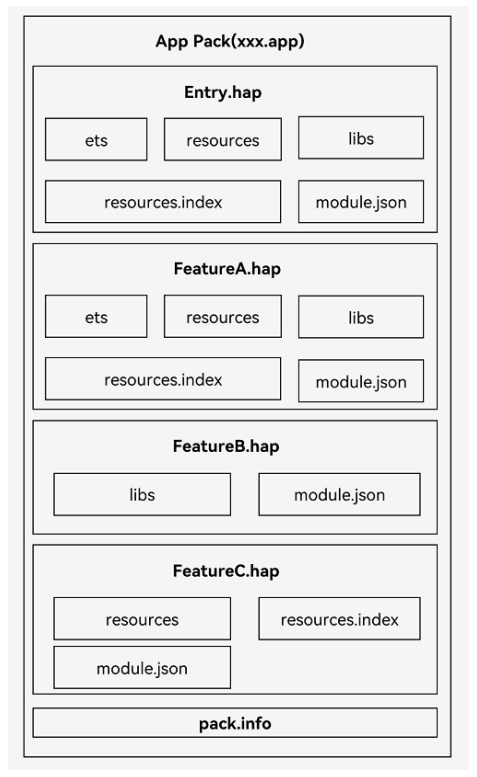

* ets⽬录⽤于存放应⽤代码编译后的字节码⽂件
* libs⽬录⽤于存放库⽂件。库⽂件是HarmonyOS应⽤依赖的第三⽅代码（.so ⼆进制⽂件）。
* resources⽬录⽤于存放应⽤的资源⽂件（字符串、图⽚等），便于开发者使 ⽤和维护，详⻅资源分类与访问。
* resources.index是资源索引表，由IDE编译⼯程时⽣成。
* module.json是HAP的配置⽂件，内容由⼯程配置中的module.json5和 app.json5组成，该⽂件是HAP中必不可少的⽂件。IDE会⾃动⽣成⼀部分默认配置，开发者按需修改其中的配置。详细字段请参⻅应⽤配置⽂件。
* pack.info是Bundle中⽤于描述每个HAP属性的⽂件，例如app中的 bundleName和versionCode信息、module中的name、type和abilities等信息， 由IDE⼯具⽣成Bundle包时⾃动⽣成

### Stage

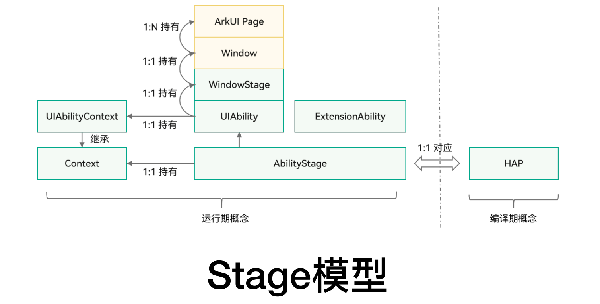

Stage模型⼯程⽬录

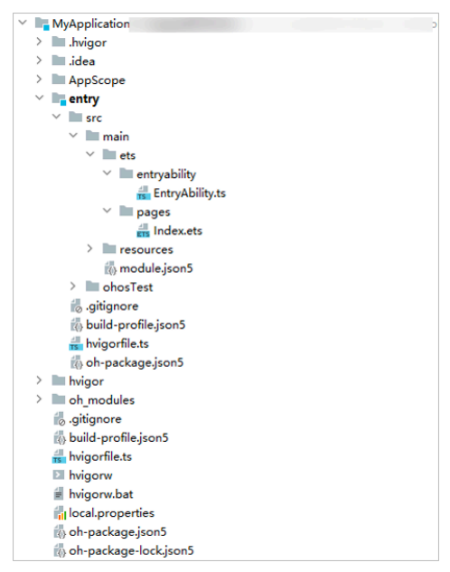

### 应⽤配置⽂件（Stage模型）

在基于Stage模型开发的应⽤项⽬代码下，都存在⼀个app.json5及⼀个或多个module.json5这两种配置⽂ 件。

* app.json5主要包含以下内容：
  * 应⽤的全局配置信息，包含应⽤的包名、开发⼚商、版本号等基本信息。
  * 特定设备类型的配置信息。
* module.json5主要包含以下内容：
  * Module的基本配置信息，例如Module名称、类型、描述、⽀持的设备类型等基本信息。
  * 应⽤组件信息，包含UIAbility组件和ExtensionAbility组件的描述信息。
  * 应⽤运⾏过程中所需的权限信息。

### UIAbility

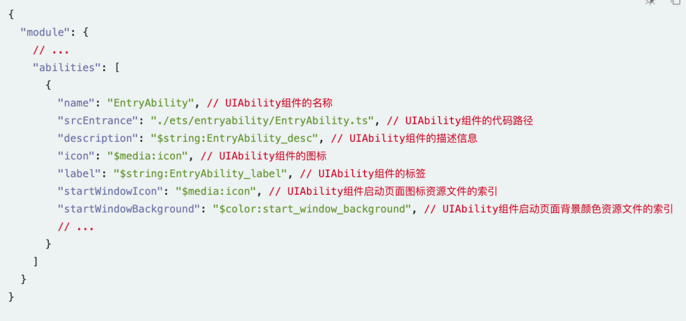

### UIAbility⽣命周期

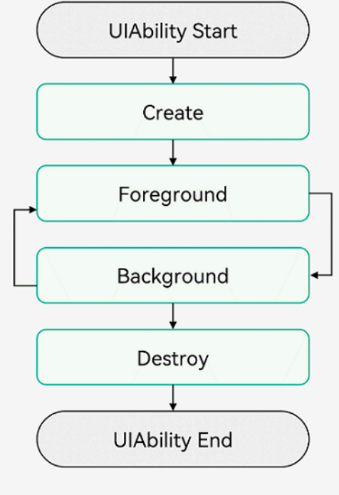

### WindowStage

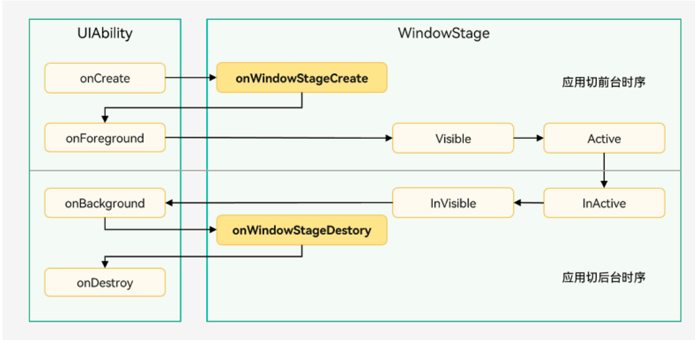

### UIAbility启动模式

UIAbility的启动模式是指UIAbility实例在启动 时的不同呈现状态。针对不同的业务场景， 系统提供了三种启动模式：

* singleton（单实例模式）
* standard（标准实例模式）
* specified（指定实例模式）

打开⽂件A，对应启动⼀个新的UIAbility实例，例如启动“UIAbility 实例1”。

* 在最近任务列表中关闭⽂件A的进程，此时UIAbility实例1被销毁， 
* 回到桌⾯，再次打开⽂件A，此时对应启动⼀个新的UIAbility实例，例 如启动“UIAbility实例2”
* 回到桌⾯，打开⽂件B，此时对应启动⼀个新的UIAbility实例，例 如启动“UIAbility实例3”。
* 回到桌⾯，再次打开⽂件A，此时对应启动的还是之前的“UIAbility 实例2”

#### Specified Mode

specified启动模式为指定实例模式，针对⼀些特殊场景使⽤

（例如⽂档应⽤中每次新建⽂档希望都能新建⼀个⽂档实例，重复打开⼀个已保存的⽂档希望打开的都是同⼀个⽂档实例）。

在UIAbility实例创建之前，允许开发者为该实例创建⼀个唯⼀的字符串Key，创建的UIAbility实例绑定Key之后，后续每次调⽤startAbility()⽅法时，都会询问应⽤使⽤哪个Key对应的UIAbility实例来响应startAbility()请求。

运⾏时由UIAbility内部业务决定是否创 建多实例，如果匹配有该UIAbility实例的Key，则直接拉起与之绑定的UIAbility实例，否则创建⼀个新的UIAbility实例

### 指定启动页面

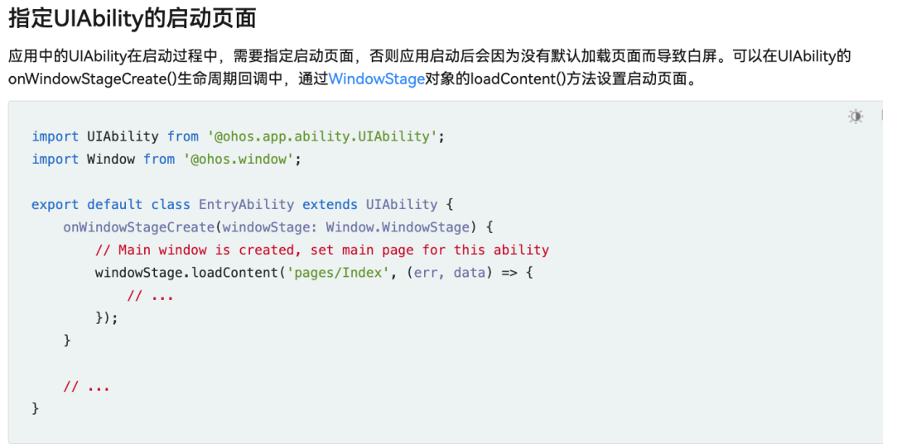

### 获取上下文

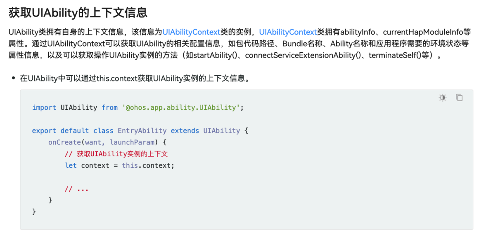

### 上下⽂继承关系

