# linux期末重点

考试重点都回联动，放在一起考

# 试卷结构

- 选择题
- 填空题
- 判断题
- 两年选择则下一年无选择

# 第一章

- mbr，常见目录、开机启动、冯诺依曼不考
- 配置文件能读懂
- cmake config make in
- 虚拟终端，命令行提示符

## linux概念

### 定义

免费的、多用户、多任务，运行方式、功能和UNIX系统很相似，但linux系统的稳定性、安全性与网络功能是许多商业操作系统所无法比拟的

### 发行版

 Linux 发行版：

- Red Hat(后来发展为Fedora)
- Debain(一定要配置自由软件，不会配置商业软件)、
- Ubuntu(用户好用就行)
- SuSe
- Mandrake
- Redflag  

### 性质，简答

1. **开放性：**

1. 源代码完全公开
2. 在符合GNU/GPL(通用公共许可证)的原则，任何人都可以自由取得、传播甚至修改源代码。
3. 遵守开放系统互联(OSI)国际标准.

1. **多用户:**

1. 是指系统资源可以被不同用户各自拥有、使用，每个用户对自己的资源有特定的权限，并且互不影响。

1. **多任务：**

1. 计算机可以同时执行多个程序，并且每个程序的处理相互独立。
2. linux系统调度每一个进程，平等地访问计算机处理器。

1. **良好的用户界面**

1. 文本界面(Shell)
2. 图形界面

1. **设备独立性:**

1. 是指操作系统把所有外设统一当做文件来看待，只要安装他们的驱动设备统一当做文件来看待，只要安装他们的驱动程序，任何用户都可以像使用文件一样操纵、使用这些设备，而不必知道它们的具体存在形式。

1. **丰富的网络功能**：提供了完善、强大的网络
2. **可靠的系统安全**

1. 采取了很多措施保证系统安全
2. 对读写进权限控制
3. 带保护措施的子系统
4. 审计跟踪
5. 核心授权

1. **良好的可移植性**

1. 是指操作系统从一个平台转移到另一个平台时，它仍然能按其自身的方式运行的特征。
2. 可以从微型计算机到大型计算机。

### gpl版权特点

只要软件中包含有其他GPL协议的产品或代码，那么该软件就必须也采用GPL许可协议且开源及免费。

- **复制自由**：允许将软件复制到任何人的电脑中，并且不限制复制的数量。
- **传播自由**：允许以各种形式进行传播。
- **收费传播**：允许在各种媒介上出售该软件，但必需提前让买家知道这个软件是可以免费获得的，并解释收费的理由（一般来讲都是能够为用户提供某种服务，以技术服务的形式来收费）。
- **修改自由**：允许开发人员增加或删除软件的功能，但必须依然基于GPL许可协议授权。

**修改后必须以GPL授权开源发布**。

只要在代码中加入这个名叫GPL的许可证，你就能保证软件的用户能够自由地运行、研究、分享和修改你的代码了。

而且，**从你的软件衍生出的一切修改版本，都必须遵守这个许可协议。**

## 文件系统（结合后面考）

 操作系统中负责存取和管理文件的部分  

 File System in Linux:  VFS EXT2, EXT3, FAT32, …  

### 磁盘分区和挂载目录

1. Linux系统处理分区及磁盘存储的方法与Windows截然不同
2. Linux系统中的每一个分区都是构成支持一组文件和目录所必需的存储区的一部分。通过挂载进行实现。

- **挂载是将分区关联到某一目录的过程**，**挂载分区使起始于这个指定目录(通称为挂载目录)的存储区能够被使用。**
- 例如:**如果/usr被挂载在了/root下，那么/usr下的所有文件和目录都在物理上位于/root下。**


如果需要使用某个文件系统存放数据，一般要经过以下操作步骤:

1. 使用fdisk命令在磁盘上创建分区。
2. 使用mkfs命令下分区上创建文件系统。
3. 使用mount命令挂载文件系统，或修改/etc/fstab文件使得开机自动挂载文件系统。
4. 使用umount命令写在文件系统。

### 合理的分区方案

1. /boot分区：用来存放与Linux**系统启动有关的程序**，比如启动引导装载程序等，建议大小为100MB。
2. /usr分区：用来存放Linux系统中的**应用程序，**其相关数据较多，建议大于9GB
3. /var分区：用来存放Linux系统中**经常变化的数据以及日志文件**，建议大小为1GB。
4. /分区：**Linux系统的根目录，所有的目录都挂在这个目录下面**，建议大小为2GB。
5. SWAP分区：实现**虚拟内存，建议大小是物理内存的1～2倍**。

- 用于实现linux虚拟内存的交换，当计算机上的物理内存不够用的时候可以调出虚拟内存来执行相应操作。

1. /home分区：存放**普通用户的数据，是普通用户的宿主目录**，建议大小为剩下的空间

### linux中的文件与目录

文件：数据的集合，可以写入或读取或同时读取的对象。

文件具有一定的属性，包括访问权限和类型。(susv3)

文件分类：

1. 一般文件
2. 目录
3. 设备(光驱、硬盘等)

#### 文件结构 

1. 在linux系统中，内核为每一个新创建的文件分配一个inode(索引节点)好，文件属性保存在索引节点里，在访问文件时，索引节点被赋值到内存里，从而快速访问文件
2. linux目录结构是一个分层的树形结构。

#### 文件类型 

- **普通文件类型：**纯文本文件(ASCII)；二进制文件(binary)；数据格式的文件(data)；各种压缩文件
- **目录文件**：就是目录， 能用 # cd 命令进入的。第一个属性为 [d]，例如 [drwxrwxrwx]
- **设备文件**

- **字符特殊文件**：串行端口的接口设备，例如键盘、打印机和终端等等。第一个属性为 [c]

- /dev/null这是一个非常有用的字符设备文件

1. 送入这个设备的所有内容都会被忽略
2. 将一个用户的shell指向这里就能禁止这个用户登录

- **块特殊文件**：存储数据以供系统存取的接口设备，简单而言就是硬盘。例如一号硬盘的代码是 /dev/hda1等文件。第一个属性为 [b]

- socket **套接字文件：**
- symbolic link **链接文件** ：类似快捷方式

1. 软链接

1. 文件用户数据块中存放的内容是另一文件的路径名的指向，可以使任意文件或目录，可以连接不同文件系统的文件。
2. 查看文件属性:ls -h
3. 属性第一个符号是"l"
4. **你在对符号文件进行读或写操作的时候，系统会自动把该操作转换为对源文件的操作**，但是**删除链接操作时，系统仅仅删除链接文件，而不删除源文件本**身

1. 硬链接

1. 硬链接是已存在文件的另一个文件，**对硬链接文件进行读写和删除操作时，结果和软链接相同**。但是**如果删除硬链接文件的源文件，硬链接文件仍然存在，而且保留了原有的内容，之后就会把硬链接文件将其变成一个普通的文本文件**。
2. 查看文件属性：ls -h
3. 属性的第一个符号是"l"
4. **如果第二列文件硬链接数大于1，那么这个文件是硬链接**。
5. 限制：

1. **不允许给目录创建硬链接**
2. **只有在同一文件系统中的文件之间才能建立链接。**

- **管道文件**：FIFO

1. 查看文件属性：ls -l
2. 属性第一个符号是"p"
3. 管道文件是从一头流入，从另一头流出。

#### 典型目录结构

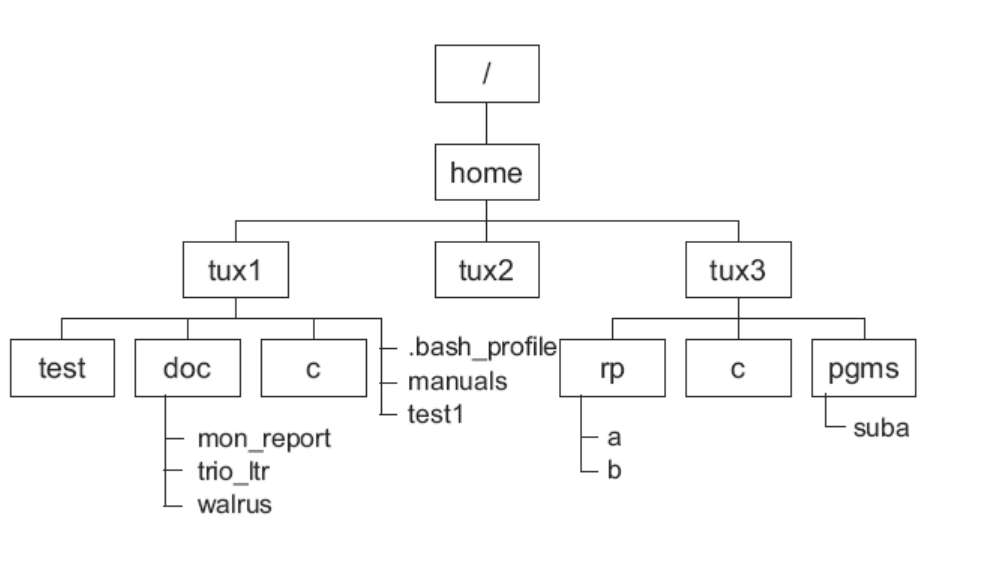

#### linux中主要目录（了解）

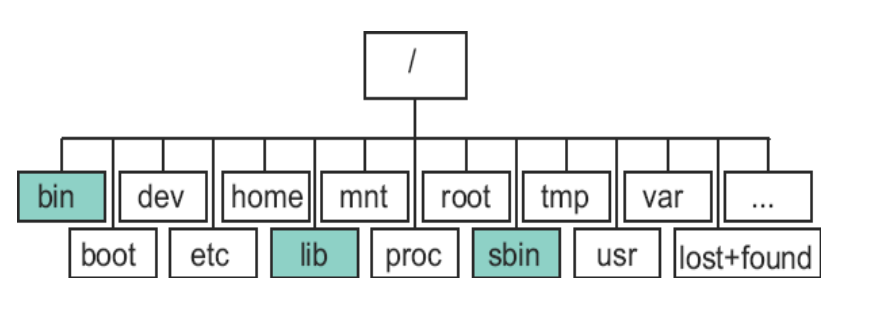

## 命令（重要）

1. passwd ：修改密码 （mkpasswd ：生成随机密码）
2. pwd：（print work directory）：显示目前工作目录

- **-P** ：显示出确实的路径，而非使用链接 (link) 路径。

1. cd：切换目录
2. rmdir ：删除文件夹
3. mkdir：创建文件夹

- -m 设置权限(-m 777)
- -p 一次性递归创建多个路径 mkdir -p test1/test2/test3/test4
- -v 每次创建新目录都显示信息

1. ls ：查看信息： 

- -l 查看所有信息； 
- -a 查看所有文件包含隐藏文件； 
- -R 递归的查看所有文件信息；

- 格式为 **文件类别、权限(3种)、链接数(硬链接数)、拥有者、拥有者组、大小、最后修改时间、名称**

1. touch ：修改文件或者目录的时间属性，包括存取时间和更改时间。若文件不存在，系统会建立一个新的文件。

- -a 更改File变量指定的文件的**访问时间**，不更新修改时间
- -m 改变档案的**修改时间记录，不要更改访问时间。**
- -c **如果文件不存在，则不要进行创建**
- -f 强制touch运行，不需要管理文件的读和写许可权

1. cp ：拷贝文件
2. mv ：移动或重命名文件
3. ln ：链接文件
4. rm ：删除文件
5. cat ：打印文件内容，  由第一行开始显示文件内容
6. more ：显示文件内容，向下滚动

less ：显示文件内容，上下滚动

1. ps ：报告所有的进程状态 

pstree ：展示树状的程序们

1. jobs ：用于**显示Linux中的任务列表及任务状态**，包括后台运行的任务；**显示任务号及其对应的进
   ****程号**。
2. fg ：将一个进程移动到前台执行 **foreground**
   bg ：将一个进程移动到后台执行
3. kill ：杀死一个进程
4. nohup ：忽略挂起的信号
5. chown ：修改文件所有者 change owner
6. chgrp ：修改文件分组 change group
7. find ：查找(find dir [-name] "*.c")
8. top ：查看当前的CPU信息状态
9. nice ：以更改过的优先级运行进程 
10. renice ：重新指定一个或多个进程的优先级  
11. mkfifo ：创建管道文件
12. 解压：tar -xzvf test.tar.gz
13. 压缩：tar -zcvf test.tar.gz ./test/
14. head ：查看文件头部，默认10行
15. tail ：查看文件尾部，默认10行
16. su ：切换用户名
17. uname ：打印当前Linux的版本信息
18. man ：查看命令说明书
19. grep ：在文件中搜索字符串


###  请解释命令mknod /dev/zero15 c 1 5的各个参数的含义。并描述在Linux上创建字符类型设备驱动程 序的步骤(12分)  

- mknod：命令名，用于创建特殊的文件节点（即设备文件）。
- /dev/zero15：要创建的设备文件的路径和名称。
- c：表示创建一个字符设备。
- 1：主设备号（major number），用于标识设备驱动程序。
- 5：次设备号（minor number），用于区分同一主设备号下的多个设备。

在Linux上创建字符类型设备驱动程序的步骤通常包括以下几个：

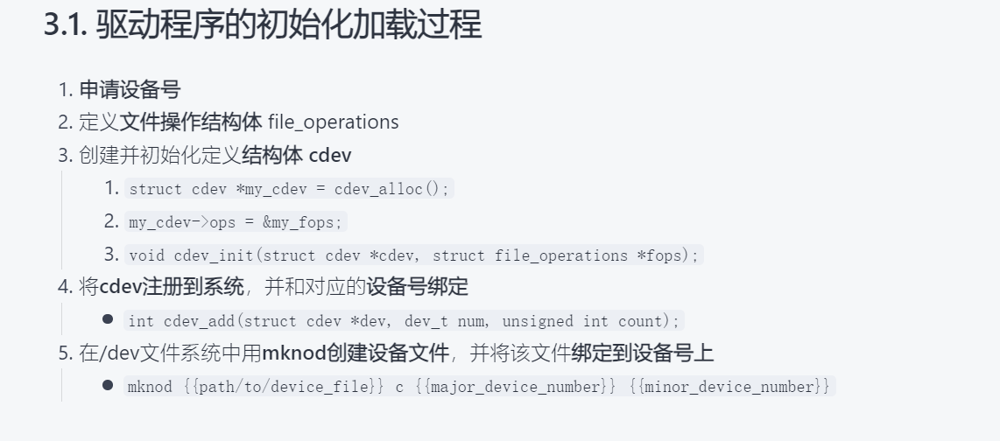

### 补充命令 不重要


date ：当天日期
who ：查看用户名以及当前登录名
finger ：当前用户的home目录
clear ：清空当前屏幕
echo ：写一个信息到屏幕；-n 不换行
write ：为已经登录的用户发送一个消息
wall ：群发消息
talk ：希望进行对象
mesg ：用来设置是否允许向当前终端写消息(Y/N)
nice ：以更改过的优先级运行进程
renice ：重新指定一个或多个进程的优先级
mknod : 在/dev下创建驱动的设备文件
who ：u，g，o，a
Operator ：+，-，==
what ：r(4)，w(2)，x(1)


1. options
2. -depth 在查看目录本身之前，先搜索目录的内容
3. -follow 跟随符号链接
4. -maxdepths N 最多搜索N层目录
5. -mount/-xdev 不搜索其他文件系统中的目录
6. tests
7. -name 根据名字查找
8. -type 根据文件类型查找
9. -user 根据用户名查找
10. -ctime 根据最近更新时间查询
11. -atime N 文件在N天之前被最后访问过
12. -mtime N 文件在N天之前被最后修改过
13. -newer other_file 文件比other_file新
    ar ：用于建立或修改备存文件(创建静态链接库)，或是从备存文件中抽取文件。


## 文件权限

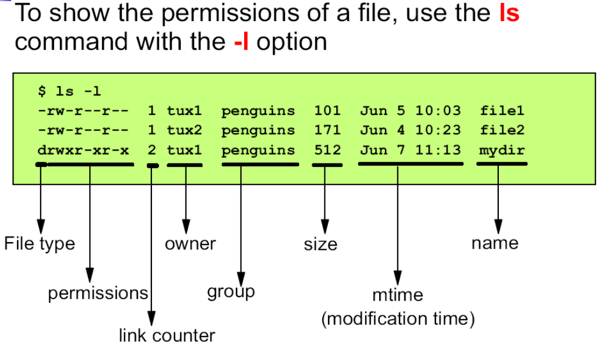

1. 文件权限简介:

1. 设定权限限制允许一下三种用户访问:

1. 文件的所有者(文件属主)
2. 文件所有者所在的同组用户
3. 系统中的其他用户

1. linux系统中，对每一个用户对文件或目录的读取、写入和执行权限。

1. 第一套：**(所有者权限)**：控制访问自己的文件权限。
2. 第二套：控制用户组访问其他一个用户的文件的权限。
3. 第三套：赋予用户不同类型的读取、写入及执行权限

1. 所以有9种类型的权限组
2. 用户可以控制一个给定文件和目录的访问程度:

1. 创建一个文件，系统会自动地赋予文件所有者读和写的权限
2. 文件所有者可以把权限改为任意权限
3. 一个文件可以有只读权限，禁止任何修改。也可以有只写权限，允许他像一个程序一样执行

1. 一般权限:

1. 使用"ls -l"命令可以显示文件的详细信息。
2. 使用"ls -l"和"ls -al"命令后显示的结果。
3. 最开始的第2-10个字符用来表示权限的:

1. 这9个，每3个为一组，**左边3个是所有者权限，中间3个字符表示与所有者同一组的用户的权限，右边3个字符是其他用户的权限**
2. 字符代表的意义:

1. **r ：读取,文件:读取内容,目录:浏览目录**
2. **w：写入,文件:新增修改文件,目录:删除移动目录内文件**
3. **x：执行,文件:执行文件,目录:进入目录**
4. **-：表示不具有该项权限**

特殊权限

1. 除了一般权限以外，还有特殊权限。用户如果没有特殊要求，不要启用这些权限，避免出现安全漏洞。
2. 特殊权限类型:

1. SUID:可执行文件搭配这个权限可以得到特权，任意存取文件的所有者可以使用全部的系统资源。
2. SGID:设置在文件上，可以访问用户组所使用的资源。
3. Sticky:/tmp和/var/tmp目录供所有用户暂时存取文件，即每位用户皆拥有完整的权限进入目录，去浏览、删除和移动文件。

1. 特殊权限占用x的位置来表示，表示上会有大小写区别，如果是小写的，那么是正在执行状态。

### 权限设置

#### 文字设定法

```shell
chmod [who] [+|-|=][mode][文件或目录名]
```

1. who参数以及含义:

1. u:所有者
2. g:用户组
3. o:其他用户
4. a:所有用户，系统默认值

1. 操作符号:

1. +:添加某个权限
2. -:删除某个权限
3. =:赋予给定权限并取消原先权限

1. mode权限组合:

1. r:可读
2. w:可写
3. x:可执行
4. s:执行时把进程的属主或组ID置为该文件的文件属主

- “g+s”:设置文件的SUID权限
- “u+s”:设置文件的GUID权限

1. t:保存程序的文本到交换设备上

1. 示例：

```shell
将文件 file1.txt 设为所有人皆可读取 :
chmod ugo+r file1.txt
将文件 file1.txt 设为所有人皆可读取 :
chmod a+r file1.txt
将文件 file1.txt 与 file2.txt 设为 该文件拥有者与其所属同一个群体者可写入，但其他以外的人则不可写入 :
chmod ug+w,o-w file1.txt file2.txt
为 ex1.py 文件拥有者增加可执行权限:
chmod u+x ex1.py
将目前目录下的所有文件与子目录皆设为任何人可读取 :
chmod -R a+r *
```

#### 数字设定法

```shell
chmod abc file
```

1. 语法为：其中a,b,c各为一个数字，分别表示User、Group、及Other的权限。

1. r=4，w=2，x=1 -=0

- 若要 rwx 属性则 4+2+1=7；
- 若要 rw- 属性则 4+2=6；
- 若要 r-x 属性则 4+1=5。

1. 第四个数字是特殊权限:

1. SUID:对应4
2. SGID:对应2
3. Sticky:对应1

1. 所有数字属性的格式为3个0-7的八进制数，其顺序是(u)(g)(o)
2. 例子:

1. -rwx------:700
2. -rwxr--r--:744

1. chmod a=rwx file 和 chmod 777 file 效果相同

### 更改文件所有者

#### chown命令

这个指令只有是由系统管理者(root)所使用

1. 使用chown命令可以更改文件和目录的所有者和用户组
2. 命令语法:

```shell
chown [-R] [用户:组][文件|目录]
```

1. 命令中参数:-R：将子级目录下的所有文件和目录的所有权一起改变。

#### chgrp命令

1. 使用chgrp命令可以更改文件或目录所属的组。
2. 命令语法

```shell
chgrp [选项] [用户组] [文件|目录]
```

1. 参数说明:-R:递归式地改变指定目录及其下的所有子目录和文件所属的组。


## 进程

进程是一个正在执行的程序实例。

由**执行程序、它的当前值、状态信息以及通过操作系统管理此进程执行情况的资源**组成。  

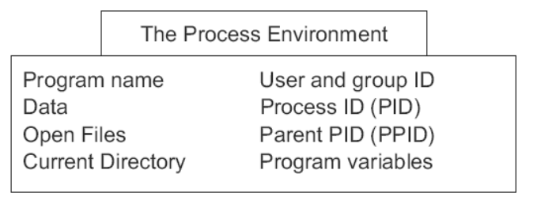

## 层次结构图

（了解，会以别的形式，编程题以系统调用写程序不能用c库）

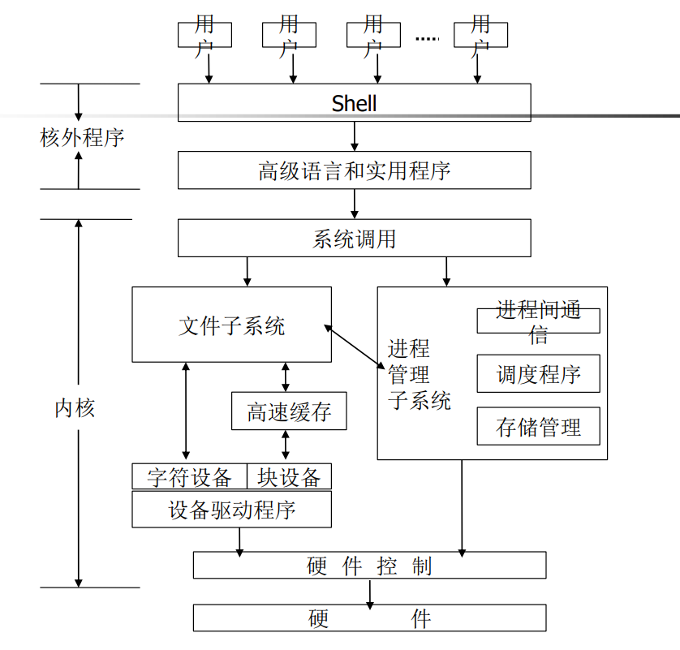

# 第二章

## 命令

- ls  

- [第一节命令](https://www.yuque.com/suibian-hyei2/schxvr/cnewa2cpdh79bggt#mn7se)

- dir 

- 列出目录的内容 -a, --all 不隐藏任何以. 开始的项目

- vdir 

- vdir [OPTION]... [FILE]...

-  mkdir, mknod, mkfifo  
-  cp, mv, rm  [第一节命令](https://www.yuque.com/suibian-hyei2/schxvr/cnewa2cpdh79bggt#mn7se)
-  chmod, chown, chgrp, touch    [第一节命令](https://www.yuque.com/suibian-hyei2/schxvr/cnewa2cpdh79bggt#Ln65f)
-  locate, find  
- grep

1. 查找符合文件中符合条件的字符串。

- -i：忽略大小写进行匹配。
- -v：反向查找，只打印不匹配的行。
- -n：显示匹配行的行号。
- -r：递归查找子目录中的文件。

1. 语法: 

```shell
grep [options] pattern [files]
```

1. 例子

```shell
在文件 file.txt 中查找字符串 "hello"，并打印匹配的行：
$ grep hello file.txt

在文件夹 dir 中递归查找所有文件中匹配正则表达式 "pattern" 的行，并打印匹配行所在的文件名和行号：
$ grep -r -n pattern dir/

在标准输入中查找字符串 "world"，并只打印匹配的行数：
$ echo "hello world" | grep -c world

在当前目录中，查找后缀有 file 字样的文件中包含 test 字符串的文件，并打印出该字符串的行。此时，可以使用如下命令：
$ grep test *file 

$ grep -n '2019-10-24 00:01:11' *.log
查看符合条件的日志条目。

从根目录开始查找所有扩展名为 .log 的文本文件，并找出包含 "ERROR" 的行：
$ find / -type f -name "*.log" | xargs grep "ERROR"
xargs 是一个 Linux 和类 Unix 系统中的命令行工具，它通常与管道（|）配合使用，
将标准输入数据转换成命令行参数。xargs 会读取来自标准输入的数据（通常是上一个命令的输出），
然后以空格、换行符或其他分隔符分隔这些数据，并将它们作为参数传递给指定的命令。

例子：从当前目录开始查找所有扩展名为 .in 的文本文件，并找出包含 "thermcontact" 的行：
$ find . -name "*.in" | xargs grep "thermcontact"
```

mknod要，mkfifo不考 loc不考 

- mknod

- 用于创建字符型或块型设备文件。这些文件位于/dev目录下

```shell
$ mknod [选项]... 名称 类型 主设备号 次设备号
```

其中，类型可以是 b (块设备), c 或 u (字符设备), p (FIFO)。

| 选项 | 说明                 |
| ---- | -------------------- |
| -m   | 设置文件模式（权限） |
| -Z   | 设置安全上下文       |

```shell
创建一个块设备文件
$ mknod /dev/myblock b 7 0

创建一个字符设备文件
$ mknod /dev/mychar c 5 1

创建一个带有特定权限的设备文件
使用 -m 选项来设置文件权限。
$ mknod -m 666 /dev/mychar c 5 1
```

## **重定向（重点）**

1. 标准输入、标准输出、标准错误 

对应的文件描述符：0、1、2 

C语言变量：stdin、stdout、stderr 

1. 符号 

1.  **< ：输入重定向**，改变命令的输入，后面指定输入内容(文件名) 
2. **> ：输出重定向**，将前面输出的部分输入到后面的文件，并清空文件内容。 
3. \>! ：同上，**强制覆盖**。 
4. **<< ：追加输入重定向**：后面跟字符串，用来表示输入结束 
5. **>> ：追加输出重定向**：把前面输出的东西追加到后面的文件尾部，不清除文件的内容 
6. **2> ：错误重定向**：将错误的信息输入到后面的文件中，**会删除文件原有的内容** 
7. **2>> ：错误追加重定向**：将错误的信息追加到后面的文件中，**不会删除文件原有的内容** 
8. 重定向操作在底层本质上就是调用了 dup2 函数，将进程的文件描述符进行拷贝和覆盖 
9. 一般情况下，每个Unix/Linux命令运行时都会打开三个文件： 

1. **标准输入文件(stdin)**：stdin的文件描述符为0，Unix程序默认从stdin读取数据。
2. **标准输出文件(stdout)**：stdout的文件描述符为1，Unix程序默认向stdout输出数据。 
3. **标准错误文件(stderr)**：stderr的文件描述符为2，Unix程序会向stderr流中写入错误信息。

1. 如果希望将stdout和stderr合并后重定向到file，可以这样写：

1. command > file 2 >& 1或command >> file 2>&1
2. & 用于指示重定向的对象是文件描述符，而不是文件名。
3. 如果 command 正常运行没有错误，那么 file 将只包含命令的正常输出；如果 command 出现错误，错误信息也会被追加到 file 中
4. 如果你写成 command > file 2 > &1，那么 &1 会被解释为一个文件名，而不是一个文件描述符
5. 为什么需要将标准错误重定向到标准输出的原因，那就归结为标准错误没有缓冲区， 而stdout有。 

1. 如果希望对stdin和stdout都重定向，可以这样写：

1. command < file1 > file2；
2. command命令将stdin 重定向到file1，将stdout重定向到file2。  

1.  kill –HUP 1234 > killout.txt 2> killerr.txt  

1. 向进程ID为1234的进程发送 SIGHUP 信号，并将命令的正常输出重定向到 killout.txt 文件中，将任何错误信息重定向到 killerr.txt 文件中

1.  kill –HUP 1234 > killout.txt 2>& 1  

1. 向进程ID为1234的进程发送 SIGHUP 信号，并将命令的正常输出和错误信息都重定向到 killout.txt 文件中。

## 环境变量

1. 变量包括 **用户变量**、**环境变量**、**参数变量**和**内部变量**
2. 操作环境的参数
3. 查看和设置环境变量

1. echo $file_parameters 

1. shell中打印环境变量的值，file_parameters是一个变量的名字

1. env 查看所有环境变量
2. set 查看所有环境变量

1. 不使用任何选项时，set会显示所有变量的值，包括环境变量和局部变量。
2. set VAR=value：设置一个变量VAR，使其值为value
3. set -o：显示和设置Shell选项。

1. 例：PATH环境变量，对变量进行**读操作添加 $** ，而**写操作不必**
2. echo $PATH

1. $ echo $PATH

/usr/local/sbin:/usr/local/bin:/usr/sbin:/usr/bin:/sbin:/bin:/usr/games:/usr/local/games:/snap/bin

1. export PATH ：设置和显示环境变量

1. PATH是一个特殊的环境变量，它告诉Shell在哪里查找可执行文件。当您在终端输入一个命令时，Shell会按照PATH变量中列出的目录顺序去查找该命令对应的可执行文件。
2. **export PATH=$PATH:/new/directory**

1. 这种改变PATH的方式只对当前的终端会话有效。如果想永久性地修改PATH，需要将export命令添加到您的个人启动文件中，比如~/.bashrc、~/.bash_profile或~/.profile，这取决于您使用的Shell。
2. 例如，在~/.bashrc文件中添加以下行：export PATH=$PATH:/new/directory 然后重新加载配置文件source ~/.bashrc

1. 具体变量

环境变量跟提示符配在一起考

1. HOME 用户登录目录
2. PATH 问号分割的用来搜索命令的目录清单
3. **PS1 命令行提示符，通常是$字符**
4. **PS2 辅助提示符，用来提示后续输入，通常是>字符**
5. UID 当前用户的识别字，取值由数位构成的字串
6. PWD 当前工作目录的绝对路径名

1. 参数变量和内部变量(未提)

1. $# 传递到脚本程序的参数个数
2. $0 脚本程序的名字
3. $1, 2... 脚本程序的参数
4. $* 全体参数组成的清单，使用IFS中的第一个字符分割
5. $@ $* 的变体，不使用IFS中的第一个字符分割

## 正则表达式 简单掌握

1. **普通字符**：匹配自身。例如，正则表达式abc将匹配字符串中的abc序列。
2. **元字符**：

- .：匹配除换行符以外的任意字符。
- []：匹配方括号内的任意一个字符（字符集）。例如，[abc]将匹配a、b或c。
- [^]：在方括号内使用^表示取反，匹配不在方括号内的任意一个字符。例如，[^abc]将匹配除a、b、c之外的任意字符。
- *：匹配**前面**的子表达式**零次或多次**。例如，a*将匹配空字符串、a、aa、aaa等。
- +：匹配前面的子表达式**一次或多次**。例如，a+将匹配a、aa、aaa等，但不匹配空字符串。
- ?：匹配前面的子表达式**零次或一次**。例如，a?将匹配空字符串或a。
- {m,n}：匹配前面的子表达式**至少****m****次，至多****n****次**。例如，**a{2,3}****将匹配****aa****或****aaa**。
- ^：匹配**输入字符串的开始位置**。
- $：匹配**输入字符串的结束位置**。
- \：转义字符，用于匹配一些特殊字符。例如，**\.****将匹配点****.****字符**。
- |：逻辑“或”操作符。例如，a|b将匹配a或b。

1. **预定义字符类**：

- \d：匹配**数字字符**，等价于[0-9]。
- \D：匹配**非数字字符**，等价于[^0-9]。
- \w：匹配**单词字符**（字母、数字和下划线），等价于[a-zA-Z0-9_]。
- \W：匹配**非单词字符**，等价于[^a-zA-Z0-9_]。
- \s：匹配**空白字符**（空格、制表符、换行符等）。
- \S：匹配非空白字符。

1. **分组**：

- (exp)：匹配exp并捕获文本到自动命名的组里。
- (?:exp)：匹配exp但不捕获匹配的文本。
- (?<name>exp)：匹配exp并捕获文本到名称为name的组里（仅部分正则表达式引擎支持）。

1. 示例：

1. **匹配日期（YYYY-MM-DD格式）**：

1. 正则表达式：\b\d{4}-\d{2}-\d{2}\b

1. **匹配邮箱地址**：

1. 正则表达式：[a-zA-Z0-9._%+-]+@[a-zA-Z0-9.-]+\.[a-zA-Z]{2,}

1. **匹配URL**：正则表达式：https?://[^\s/$.?#].[^\s]*
2.  **sed 's****/****\(****[****0-9A-Za-z_****]****\{1,\}****\)****\[** **\{0,\}\]\[ \{0,\}\****]****/*****\1\[\]****/****g' code1.cpp**  

1. **将C++代码中声明的二维数组替换成形式上的一维数组指针**
2. sed：流编辑器，用于对文本进行过滤和转换。
3. s：表示替换（substitute）命令。
4. s/regexp/replacement/g: 替换命令的基本格式，其中regexp是正则表达式，replacement是替换文本，g是全局替换标志。
5. \([0-9A-Za-z_]\{1,\}\): 这是一个捕获组，用圆括号()包围。它匹配一个或多个（由\{1,\}表示）数字、字母或下划线。捕获组的内容可以用\1在替换文本中引用。
6. sed的替换部分（即替换文本中），如果你想表示一个字面意义的花括号，你需要对它们进行转义，因为它们在替换模式中也有特殊含义
7. \[ \{0,\}\]\[ \{0,\}\]: 这部分试图匹配两个方括号，每个方括号前面可能有空格或花括号。这里的\{0,\}表示匹配前面的字符0次或多次。
8. *: 这是一个字面意义的星号*，它会被替换到匹配文本的前面。
9. \1: 这是对第一个捕获组的引用，它会插入捕获组匹配的文本。
10. \[\]: 这两个字符是字面意义上的方括号[]，它们会被替换到匹配文本的后面。
11. code1.cpp: 这是sed命令要处理的文件。

# 第三章-shell编程

- 哪些功能是shell管的，重定向和管道是shell实现的
- 哪些功能是shell，哪些是命令完成的

## shell的概念

Shell是用户与操作系统的接口，作为核外程序存在。

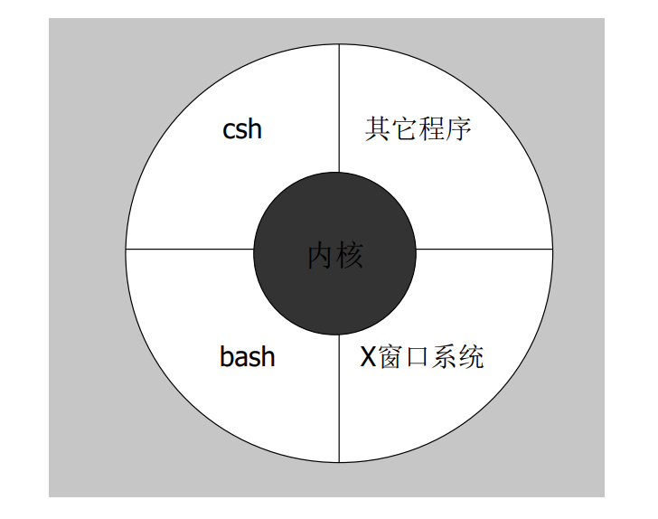

具有双重角色： 

1. Shell是一种命令解释程序：Linux的开发启动过程(进程树)、Shell的工作步骤：打印提示符； 得到命令行；解析命令；查找文件；准备参数；执行命令。 
2. Shell还是一种独立的程序设计语言解释器。  

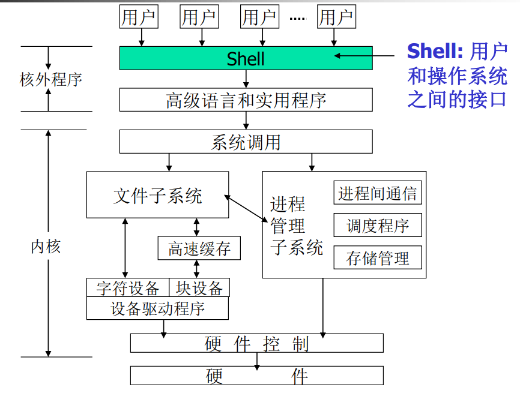

shell和虚拟终端是不同的，一台电脑只有一个console，但是可以划分很多虚拟终端，虚拟中断是
从console模拟出来的。

1. VT 1-6 文本模式登陆
2. VT 7 图形模式登陆提示
3. 可以使用Alt-Fn在VT之间切换

## 有那些shell

重点bash，其他是列名字就行

- bash ：bash 由 GNU 组织开发，保持了对 sh shell 的兼容性，是各种 Linux 发行版默认配置的 shell。

bash 兼容 sh 意味着，针对 sh 编写的 Shell 代码可以不加修改地在 bash 中运行。

- **sh ：**sh 的全称是 Bourne shell，由 AT&T 公司的 Steve Bourne开发
- **csh ：**sh 之后另一个广为流传的 shell 是由柏克莱大学的 Bill Joy 设计的。这个 shell 的语法有点类似C语言，所以才得名为 C shell ，简称为 csh
- **ash ：**一个简单的轻量级的 Shell，占用资源少，适合运行于低内存环境，但是与下面讲到的 bash shell 完全兼容。

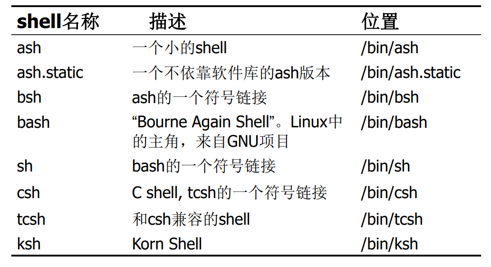

## Shell脚本的执行方式

1. 方法1： sh script_file 

1. 启动一个Shell实例来执行脚本，脚本会以Shell脚本的形式运行。这意味着脚本将具有Shell的所有特性，如环境变量、命令行参数等。

1. 方法2： chmod +x script_file 授予文件可执行权限； ./script_file 

1. 直接将脚本文件作为可执行文件来执行，不启动Shell实例。这意味着脚本将不会具有Shell的所有特性，如环境变量、命令行参数等。

1. 方法3： source script_file ； .script_file ，Shell使用本进程运行

1. 会在当前Shell实例中执行脚本，而不是启动一个新的Shell实例。这意味着脚本将具有当前Shell的所有特性，如环境变量、命令行参数等。

方法1和方法3更适合于需要使用Shell特性的脚本，而方法2则更适合于简单的脚本，特别是当您想要保持脚本执行环境与当前Shell环境一致时。

## 用户变量

### 用户环境

 .bash_profile, .bash_logout, .bashrc files 

- **bash_profile: 用户登录时被读取**，其中包含的命令 被bash执行
- **.bashrc: 启动一个新的shell时读取并执行** 
- .bash_logout: 登录退出时读取执行  

### 用户变量

 用户在shell脚本里定义的变量  

 var=value echo $var  

## Read

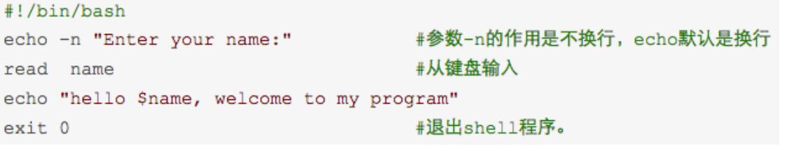

1. **read var 会等待从控制台获得输入放在 $var 中，要是直接read则会把输入的值放在 $REPLY**

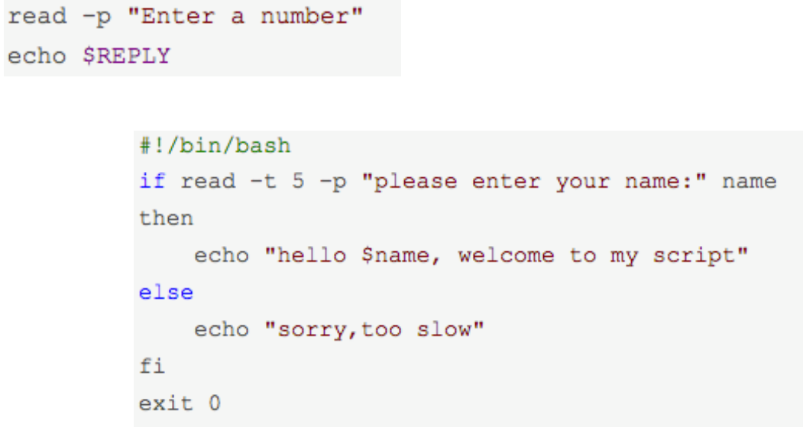

1. 读取输入并存储在多个变量中，每个变量对应输入的一个字段（由空格分隔）：

```plain
read var1 var2 var3
```

1. 使用 -p 选项提供提示信息：

```plain
read -p "Enter your name: " name
```

1. 使用 -t 选项设置超时时间（秒）：

```plain
read -t 5 var
```

1. -s 不显示输入

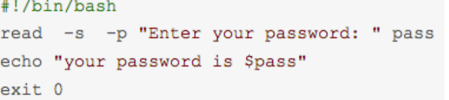

```plain
read -a my_array
```

在这个例子中，用户输入的每个单词都会被存储到 my_array 数组的下一个可用位置。例如，如果用户输入了 “one two three”，那么 my_array 将包含三个元素：my_array[0]="one", my_array[1]="two", my_array[2]="three"。

1. -a 将分裂后的字段依次存储到指定的数组中，存储的起始位置从数组的index=0开始。
2. -d 指定读取行的结束符号。默认结束符号为换行符。
3. -n 限制读取N个字符就自动结束读取，如果没有读满N个字符就按下回车或遇到换行符，
   则也会结束读取。
4. -N 严格要求读满N个字符才自动结束读取，即使中途按下了回车或遇到了换行符也不结
   束。其中换行符或回车算一个字符。
5. -r 禁止反斜线的转义功能。这意味着""会变成文本的一部分。

## 单引号、双引号、转义符

1. 单引号：**所有字符都保持本身字符的意思**，而不会被bash进行解释
2. 双引号：**除了 $ 、 ' ' 和 \ 以外**，双引号内的所有字符将**保持字符本身的函数而不被bash解释**(**打印
   ****上面的特殊字符需要配合转义符号)**
3. 转义符
4.  echo直接加内容会解析所有，如果后面的内容有空格，会当做两个参数-用双引号引起来

1. 使用 echo 命令时，如果没有用引号将内容括起来，shell 会按照空白字符（如空格、制表符、换行符等）将命令行上的参数分割成多个参数。这意味着如果 echo 后面的内容包含空格，shell 会将这些内容视为多个独立的参数，而不是一个连续的字符串。例如，如果执行以下命令：

```plain
echo hello world
```

Shell 会将 hello 和 world 视为两个独立的参数，并且 echo 命令会输出两个由空格分隔的词，如下所示：

```plain
hello world
```

如果您想要 echo 输出一个包含空格的字符串，您需要使用双引号将整个字符串括起来，如下所示：

```plain
echo "hello world"
```

这样，shell 就会将整个 hello world 当作一个参数，并且 echo 命令会输出hello world

**双引号告诉 shell 不要将引号内的字符串按照空白字符分割成多个参数**。这在您需要输出包含空格、特殊字符或者变量引用的字符串时非常有用。

例如，如果有一个变量 name，想要将其值包含在一个句子中输出，应该这样做：

```shell
name="John Doe"
echo "My name is $name"
```

这将会输出：

```plain
My name is John Doe
```

如果没有双引号，shell 会将 My、name、is 和 $name 当作四个独立的参数

## 参数变量

 $**＃ 传递到脚本程序的参数个数** 

$0 脚本程序的名字 

**$1, $2, … 脚本程序的参数** 

$* 一个全体参数组成的清单，它是一个独立的变量， 各个参数之间用环境变量IFS中的第一个字符分隔开 

$@ “$*”的一种变体，它不使用IFS环境变量。  


## 条件测试

###  test命令 

本质是执行一个程序，需要有空格

test命令支持的条件测试，**运算符之间都要都空格**

- 字符串比较
- 算术比较
- 与文件有关的条件测试
- 逻辑操作

### 字符串比较

1. str1 = str2 字符串相同则结果真
2. str1 != str2 字符串不相同则结果为真
3. -z str 字符串为空则结果为真
4. -n str 字符串不为空则结果为真

### 算术比较

1.  expr1 –eq expr2 两个表达式相等   结果为真 
2. expr1 –ne expr2 两个表达式不等   结果为真 
3. expr1 –gt expr2 expr1 大于 expr2   结果为真 
4. expr1 –ge expr2 expr1 大于或等于 expr2   结果为真 
5. expr1 –lt expr2 expr1 小于 expr2   结果为真 
6. expr1 –le expr2 expr1 小于或等于 expr2   结果为真  

### 文件操作

-e file 文件存在
-d file 文件是目录
-f file 文件是普通文件
-s file 文件长度不为零

-r file 文件可读
-w file 文件可写
-x file 文件可执行

### 逻辑操作

1. ! expr 逻辑表达式求反
2. expr1 –a expr2 两个逻辑表达式“And”（“与”） 
3. expr1 –o expr2 两个逻辑表达式“Or”（“或”）  


## 条件语句

### if 语句

- if elif后面也要有空格，then else默认单独占一行
- 形式：

```shell
#!/bin/sh
if [ expression ]
then
	statements
elif [ expression ]
then
	statements
elif …
else
	statements
fi
```

- 紧凑形式

- ; : 同一行上多个命令分隔符

示例

```shell
#!/bin/sh
echo "Is this morning? Please answer yes or no."
read answer
if [ "$answer" = "yes" ]; then
  echo “Good morning”
elif [ "$answer" = "no" ]; then
  echo "Good afternoon"
else 
echo "Sorry, $answer not recognized. Enter yes or no"
exit 1
fi
exit 0
```

### case语句

- 形式

- 分支语句结尾是**;;**

```shell
case str in
	str1 | str2) statements;;
	str3 | str4) statements;;
	*) statements;;
esac
```

- 例子：

```shell
#!/bin/sh
echo “Is this morning? Please answer yes or no.”
read answer
case “$answer” in
	yes | y | Yes | YES) echo “Good morning!” ;;
	no | n | No | NO) echo “Good afternoon!” ;;
	*) echo “Sorry, answer not recognized.” ;;
esac
exit 0
```


## 循环语句

语句开始和结束都是do和done

### for语句

```shell
for var in list
do
	statements
done

适用于对一系列字符串循环处理。将当前目录下所有以f开头，以.sh结尾的文件发送到打印机打印
for file in $(ls f*.sh);do
	lpr $file
done
exit 0
$()相当于反引号，执行里面的命令把结果字符串替换在这里
```

### while语句


```shell
while condition
do 
	statements
done

quit=n
while [ “$quit” != “y” ]; do
	read menu_choice
	case “$menu_choice” in
		a) do_something;;
		b) do_anotherthing;;
		…
		q|Q) quit=y;;
		*) echo “Sorry, choice not recognized.”;;
	esac
done

a=0
while [ "$a" -le "$LIMIT" ]
do
a=$(($a+1))
if [ "$a" -gt 2 ]
then
break # Skip entire rest of loop.
fi
echo -n "$a ”
done
```


### until语句

```shell
until condition
do
  statements
done
```

### select语句

Select后面输入的是数字，对应item list

```shell
select item in itemlist
do
  statements
done
```

例子：直接生成菜单列表

```shell
#!/bin/sh
clear
select item in Continue Finish
do
	case “$item” in
		Continue) ;;
		Finish) break ;;
		*) echo “Wrong choice! Please select again!” ;;
	esac
done
```

### until

- 形式

- 条件为假时执行循环

```shell
until condition
do
	statements
done
```


## 命令表/命令组合

- 分号串联

- 把多个命令放在同一行
- command1;command2;…

- 条件组合

- AND命令表

- 前面成功了，后面才会继续执行。
- statement1 && statement2 && statement3 && …

- OR命令表

- 前面的失败了，采取执行后面的；前面成功了后面就不执行。只有一个命令会成功执行。
- statement1 || statement2 || statement3 || …

## 语句块

```shell
{
	statement1
	statement2
	...
}
```

## 函数

- 语句块不考
- 函数最多读

```shell
func()
{
  statements
}
```

- 局部变量

- local关键字

- 默认全局变量
- 函数调用

- func para1 para2 …

- 返回值

- return

- 参数

- 没有形参
- 在函数内用2,…调用

```shell
yesno()
{
	msg=“$1”
	def=“$2”
	while true; do
		echo ” ”
		echo “$msg”
		read answer
		if [ -n “$answer” ]; then
			...
		else
			return $def
		fi
	done
}
```

## 命令

- 命令都要求，trap不要写，最多读

1. break: 从for/while/until/select循环退出
2. continue: 跳到下一个循环继续执行
3. exit n: 以退出码”n”退出脚本运行
4. return: 函数返回
5. export: 将变量导出到shell，使之成为shell的环境变量

- 该进程及其子进程都有效，否则只在脚本有效

1. set: 为shell设置参数变量
2. unset: 从环境中删除变量或函数
3. trap: 指定在收到操作系统信号后执行的动作
4. “:”(冒号命令): 空命令
5. “.”(句点命令)或source: 在当前shell中执行命令

## 算术扩展

```shell
#!/bin/sh
x=0
while [ “$x” –ne 10 ]; do
	echo $x
	x=$(($x+1))
done
exit 0
```

## 参数拓展

替换字符串

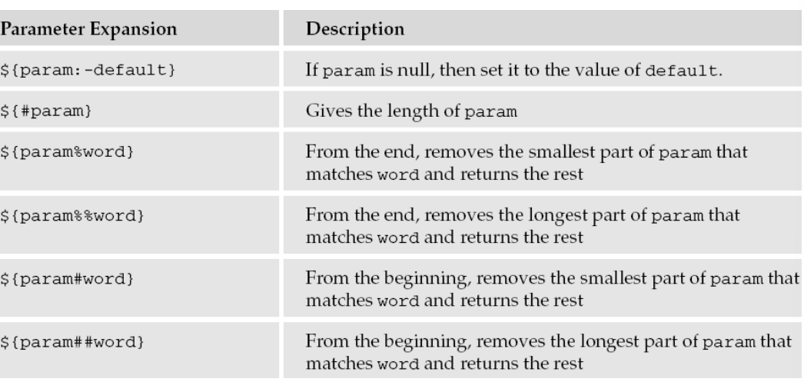

- 例子

- 批处理1_tmp,2_tmp,…

```shell
#!/bin/sh
i=1
while [ “$i” –ne 10 ]; do
	touch “${i}_tmp”
	i=$(($i+1))
done
exit 0
```

- 去掉扩展名

- ${param%.*}，这里*是通配符，不是正则表达式
- ${param%.cpp}，只去掉.cpp扩展名
- ${param%.cpp}.o，只去掉.cpp扩展名，扩展名变成.o

```shell
#!/bin/sh
echo “The current directory is $PWD”
echo “The current directory is $(pwd)”
exit 0
```

1. echo “The current directory is $PWD”：这行代码使用环境变量$PWD来获取当前工作目录的路径，并打印出来。$PWD是一个由Shell自动设置的环境变量，它总是包含当前工作目录的绝对路径。
2. echo “The current directory is $(pwd)”：这行代码使用命令替换$(...)来执行pwd命令，并捕获其输出，然后将输出的结果（当前工作目录的路径）打印出来。pwd是一个独立的命令，用于打印当前工作目录的路径。

## 即时文档

在shell脚本中向一条命令传送输入数据

```shell
#!/bin/bash

cat >> file.txt << !CATINPUT!
Hello, this is a here document.
!CATINPUT!
```

1. \#!/bin/bash：这是一个叫做shebang（或hashbang）的特殊注释，它告诉系统应该使用哪个解释器来执行这个脚本，在这里是Bash。
2. cat >> file.txt：这行命令使用cat命令和>>重定向操作符将输出追加到file.txt文件中。如果文件不存在，它将被创建。
3. << !CATINPUT!：这表示here document的开始。!CATINPUT!是一个自定义的终止序列，它告诉Bash here document的结束位置。这个序列可以是任何字符串，只要它在here document的文本中不被使用即可。
4. Hello, this is a here document.：这是here document中的文本，它会被cat命令作为输入追加到file.txt文件中。
5. !CATINPUT!：这标志着here document的结束。Bash会将从<< !CATINPUT!到!CATINPUT!之间的所有文本作为cat命令的输入。

总的来说，这段脚本的作用是将文本“Hello, this is a here document.”追加到file.txt文件的末尾。如果文件不存在，它将被创建。Here document提供了一种方便的方式来向脚本中插入多行文本，而不需要创建额外的文件或使用复杂的引号和转义字符。

# 第四章-编程前的预备工作

感谢鲨鱼辣椒老师

https://chillcharlie357.github.io/posts/30ede758/

## 编译

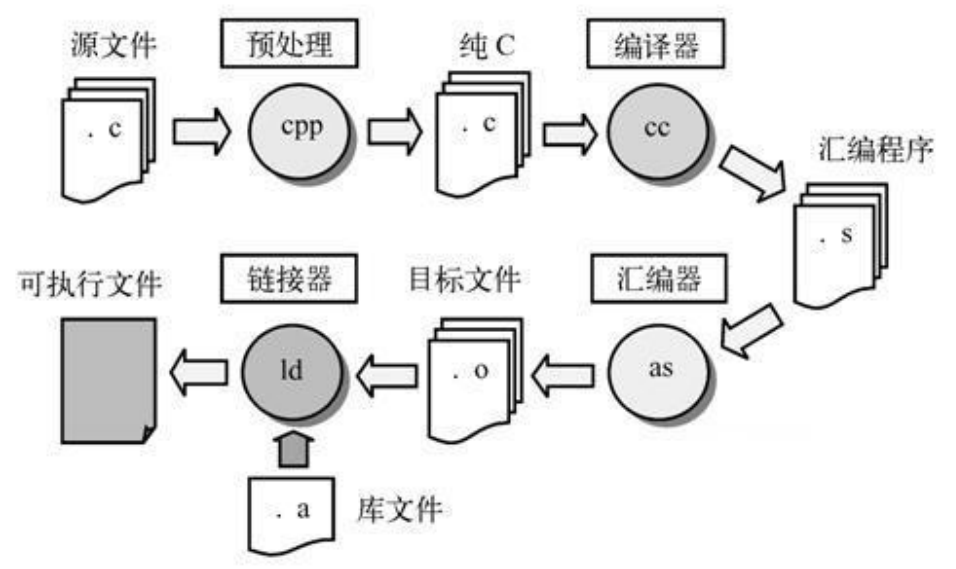

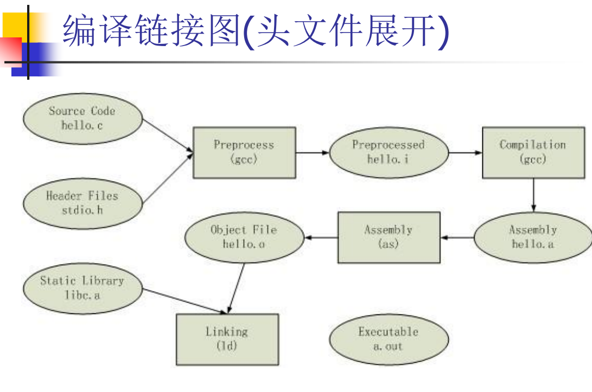

- 预处理

- 把预处理指令处理掉（#include, #if,#define…）
- \#include把目标文件粘贴到include的位置
- \#define字符串替换

- 链接：保证可执行文件里的二进制码是完整的

- 编译器每次只编译一个文件，链接实现了把这些单独的文件合成一个文件

- 静态库

- 在编译时就把库文件放到可执行文件里
- .a in Linux ,.lib in Windows

- 动态库

- 运行时去找库文件，用完可以释放掉减少内存占用，有利于打补丁
- .so in Linux, .dll in Windows

## 静态库动态库

二者的不同点在于代码被载入的时刻不同。

1. 静态库的代码在编译过程中已经被载入可执行程序，因此体积比较大。
2. 动态库(共享库)的代码在可执行程序运行时才载入内存，在编译过程中仅简单的引用，因此代
   码体积比较小。
3. 不同的应用程序如果调用相同的库，那么在内存中只需要有一份该动态库(共享库)的实例。
4. 静态库和动态库的最大区别：静态情况下，把库直接加载到程序中，而动态库链接的时候，它
   只是保留接口，将动态库与程序代码独立，这样就可以提高代码的可复用度，和降低程序的耦
   合度。
5. 静态库：编译链接时，把库文件的代码全部加入可执行文件中，因此生成的文件比较大，但是运行
   时也就不需要库文件了，后缀名一般为 .a
6. 为什么需要静态库：通过静态库的方式降低复杂度，在升级更新时尽量做到增量更新，但是静
   态库会导致复用性降低，磁盘占用高。
7. 动态库：在编译链接时并没有把库文件的代码加入可执行文件中，而是在程序执行时由运行时链接
   文件加载库，这样可以节省系统的开销，后缀名一般为 .so 。
8. 动态库的作用
9. 库文件不在可执行文件中，放置在外侧
10. 升级更新会方便快捷
11. 动态库会存在冲突(版本问题)
12. gcc/g++在编译时默认使用动态库。无论静态库还是动态库，都是由.o文件构成的

## GCC

### 选项

gcc的参数和llvm差不多

- 只编译: gcc -c test.c -o test.obj， 输出.obj
- 只链接gcc test.obj -o test，输出可执行文件
- 编译链接一起做：gcc test.c -o test，
- Usage:

- gcc [options] [filename]

- Basic options:

1. -E: 只对源程序进行预处理(调用cpp预处理器)
2. -S: 只对源程序进行预处理、编译
3. -c: 执行预处理、编译、汇编而不链接
4. -o output_file: 指定输出文件名
5. -g: 产生调试工具必需的符号信息
6. -O/On: 在程序编译、链接过程中进行优化处理

1. 如果开优化就无法调试，因为优化后代码与源代码无法直接对应
2. 在一台机器上编译，无法直接复制到另一台机器上调试

1. -Wall: 显示所有的警告信息
2. -Idir: 指定额外的头文件搜索路径
3. -Ldir: 指定额外的库文件搜索路径
4. -Iname: 链接时搜索指定的库文件
5. -DMACRO=[=DEFN]: 定义MACRO宏


## 文件扩展名

| 扩展名                         | 解释                                                        |
| ------------------------------ | ----------------------------------------------------------- |
| .c                             | C source code which must be preprocessed 使用C语言编译器    |
| .C .cc .cp .cpp .CPP .c++ .cxx | C++ source code which must be preprocessed 使用C++编译器    |
| .i                             | C source code which should not be preprocessed              |
| .ii                            | C++ source code which should not be preprocessed            |
| .h                             | C or C++ header file to be turned into a precompiled header |
| .H .hh                         | C++ header file to be turned into a precompiled header      |
| .s                             | Assembler code                                              |
| .S                             | Assembler code which must be preprocessed                   |
| .o                             | Object file                                                 |
| .a                             | Static library file (archive file)                          |
| .so                            | Dynamic library file (shared object)                        |


```shell
gcc –o hello hello.c ： 将hello.c文件编译成hello的可执行文件
gcc –c hello.c ： 将hello.c文件生成hello.o文件 
gcc -E hello.c ： 只是激活预处理，不生成文档
gcc –S hello.c ： 将hello.c文件生成hello.s文件的汇编代码
gcc –pipe –o hello hello.c ： 使用管道代替编译中临时文档
gcc hello.c –include /root/hello.h ：包含某个代码，简单来说，就是以某个文档，需要另外一个文档的时候，
```


## make和makefile

1. makefile

- 描述模块间的依赖关系;
- 记录实际编译的命令的脚本；
- 自动支持增量编译
- 编译开源软件时一般从./configure或cmake生成

1. make

- 根据makefile对程序进行管理和维护；
- 判断被维护文件的时序关系
- make的时候用普通用户(会产生很多中间文件，如果用root会导致没有删除权限)，make install可能需要root权限(把生成的文件复制到系统目录)

### Makefile与其他脚本的区别：

1. **专用性**：Makefile专门用于管理项目的构建过程，而其他脚本语言（如Shell脚本、Python脚本等）可以用于更广泛的任务自动化。
2. **依赖管理**：Makefile内建了对文件依赖关系的处理，而其他脚本通常需要手动编写代码来处理依赖。
3. **规则定义**：Makefile通过定义一系列的规则来描述构建过程，其他脚本则是通过执行一系列的命令。

### 格式

```shell
target ... : prerequisites ...
command
```

1. target是一个目标文件，可以是Object File，也可以是执行文件
2. prerequisites是要生成target所需要的文件或是目标
3. command是make需要执行的命令。（可以是任意的Shell命令）

- **命令前面必须是Tab，不能是空格;命令和目标之间不能有空行**


```makefile
hello : main.o kbd.o 
	gcc -o hello main.o kbd.o 
main.o : main.c defs.h
	cc -c main.c
kbd.o : kbd.c defs.h command.h
	cc -c kbd.c 
clean :
	rm edit main.o kbd.o 
```


```makefile
TOPDIR = ../
include $(TOPDIR)RuIes.mak
EXTRA LIBS
EXEC =
OBJS = hello.o

all: $(EXEC)
$(EXEC): $(OBJS)
$(CC) $(LDFLAGS) -o $(OBJS)

install:
$(EXEC)

clean:
-rm -f $(EXEC) *.elf *.gdb
```

1. TOPDIR = ../：定义一个变量TOPDIR，其值为上级目录（即当前目录的父目录）。
2. include $(TOPDIR)Rules.mak：包含上级目录下的Rules.mak文件。这个文件可能包含了一些编译器和链接器的选项，以及其他变量定义。
3. EXTRA_LIBS：定义一个变量EXTRA_LIBS，这里没有给它赋值，可能在Rules.mak文件中定义。
4. EXEC =：定义一个变量EXEC，这里没有给它赋值，可能在后面或其他文件中定义。
5. OBJS = hello.o：定义一个变量OBJS，表示要编译的目标文件为hello.o。
6. all: $(EXEC)：定义一个伪目标all，其依赖为$(EXEC)。这意味着当你运行make时，默认会构建$(EXEC)。
7. $(EXEC):$(OBJS)：定义了一个规则，表示$(EXEC)依赖于$(OBJS)。即当$(OBJS)更新时，需要重新构建$(EXEC)。
8. $(CC) $(LDFLAGS) -o $(OBJS)：这一行应该是一个命令，用于编译和链接目标文件。但是这里有一个错误，应该是$(CC) $(LDFLAGS) -o$(EXEC) $(OBJS)。
9. install:：定义一个伪目标install，用于安装程序。这里没有指定安装命令，可能在Rules.mak文件中定义。
10. clean:：定义一个伪目标clean，用于清理生成的文件。
11. -rm -f $(EXEC) *.elf *.gdb：这是clean伪目标的命令，用于删除生成的可执行文件、ELF文件和GDB文件。-rm表示忽略错误，-f表示强制删除。

### makefile执行次序

1. make会在当前目录下找名字叫“Makefile” 或 “makefile” 的文件。
2. 查找文件中的第一个目标文件（target），举例中的hello
3. 如果hello文件不存在，或是hello所依赖的文件修改时间要 比hello新，就会执行后面所定义的命令来生成hello文件。
4. 如果hello所依赖的.o文件不存在，那么make会在当前文 件中找目标为.o文件的依赖性，如果找到则再根据那一个 规则生成.o文件。（类似一个堆栈的过程）
5. make根据.o文件的规则生成 .o 文件，然后再用 .o 文件生 成hello文件。

### 作用

1. 定义整个工程的编译规则

- 一个工程中的源文件不计数，其按类型、功能、模块 分别放在若干个目录中，makefile定义了一系列的规则来指定，哪些文件需要先编译，哪些文件需要后编 译，哪些文件需要重新编译，甚至于进行更复杂的功 能操作 。

1. 自动化编译

- 只需要一个make命令，整个工程完全自动编译 ； make是一个命令工具，是一个解释makefile中指令的 命令工具；

### 命令

- make命令格式：make [-f Makefile] [option] [target]

### 伪目标

clean,install…

1. 不是一个文件，只是标签，所以 make无法生成它的依赖关系和决定它是否要执行，只 能通过显示地指明这个“目标”才能让其生效
2. “伪目标”的取名不能和文件名重名
3. 为了避免和文件重名的这种情况，可以使用一个特殊 的标记“.PHONY”来显示地指明一个目标是“伪目标 ”，向make说明，不管是否有这个文件，这个目标就 是“伪目标”
4. 伪目标一般没有依赖的文件，但也可以为伪目标指定所依赖的文件。
5. 伪目标同样可以作为“默认目标”，只要将其放在第一个

### 多目标

当多个目标同时依赖于一个文件，并且其生成的命令大体类似，可以使用一个自动化变量“$@”表示着目前规则中所有 的目标的集合。

```makefile
bigoutput littleoutput : text.g
	generate text.g -$(subst output,,$@) > $@ 
```

等价于：

```makefile
bigoutput : text.g
	generate text.g -big > bigoutput
littleoutput : text.g
	generate text.g -little > littleoutput
```

1. -$(subst output,,$@)：这部分是命令的参数。$@ 在Makefile中代表当前目标的名字，即 bigoutput 或 littleoutput。$(subst output,,$@) 是一个函数调用，它将 output 从目标名称中替换掉，所以对于 bigoutput，它将输出 big，对于 littleoutput，它将输出 little。这个参数可能是用来指定生成文本的大小或其他特性。

### 预定义变量

1. $< 第一个依赖文件的名称
2. $? 所有的依赖文件，以空格分开，这些依赖文件的修改日期比目标的创建日期晚
3. $+ 所有的依赖文件，以空格分开，并以出现的先后为序，可能包含重复的依赖文件
4. $^ 所有的依赖文件，以空格分开，不包含重复的依赖文件
5. $* 不包括扩展名的目标文件名称
6. $@目标的完整名称
7. $%如果目标是归档成员，则该变量表示目标的归档成员名称

### 多目标扩展

```makefile
<targets ...>: <target-pattern>: <prereq-patterns ...>
	<commands>
```


```makefile
objects = foo.o bar.o

all: $(objects)
$(objects): %.o: %.c
	$(CC) -c $(CFLAGS) $< -o $@
```

等价于：

```makefile
foo.o : foo.c
	$(CC) -c $(CFLAGS) foo.c -o foo.o
bar.o : bar.c
	$(CC) -c $(CFLAGS) bar.c -o bar.o
```

1. 目标从$object中获取
2. “%.o”表明要所有以“.o”结尾的目标，即“foo.o bar.o”，就是变量 $object集合的模式
3. 依赖模式“%.c”则取模式“%.o”的“%”，也就是“foo bar”，并为其 加下“.c”的后缀，于是依赖的目标就是“foo.c bar.c


- 连着makefile一起考，编译命令一起考
- 预定义变量，多目标扩展，使用函数，不要求写
- 静态库动态库、调式信息和原理
- gcc参数
- makefile读得懂，写最简单的（变量定义和规则）

# 第五章-编程

 文件：是数据的集合，可以写入、读取或两者兼有的对象(文件具有某些属性，包括访问权限和类 型)。逻辑上是字节，文件必然是整数字节。  

 文件结构：字节流(Linux)、记录序列、记录树  

## 文件系统

### 定义

操作系统中负责访问和管理文件的部分，是文件及其某种属性的集合，为引用文件的文
件序列号提供了名称空间。

1. 一种特定的文件格式
2. 指按指定格式进行格式化的一块存储介质
3. 指操作系统中(通常内核中)用来管理文件系统以及对文件进行操作的机制及其实现

### 文件类型和结构

- 文件类型

1. regular file
2. character special file，字符设备文件
3. block special file，块设备文件
4. fifo，管道：没有文件名的文件
5. socket：网络接口
6. symbolic link
7. directory

- 结构

- Byte stream; no particular internal structure

### Linux设备中字符设备与块设备有什么主要的区别？请分别列举一些实际的设备说出它是哪一类设备(9')

1. 字符设备：提供连续的数据流，应用程序可以顺序读取，通常不支持随机存取。相反，此类设
   备支持按字节/字符来读写数据。距离来说，调制调节器是典型的字符设备。
2. 块设备：应用程序可以随机访问设备数据，程序可自行确定读取数据的位置。硬盘是典型的块
   设备，应用程序可以寻址磁盘上的任何位置，并由此读取数据。此外，数据的读写只能以块(通
   常是512B)的倍数进行。与字符设备不同，块设备不支持基于字符的寻址。

### VFS

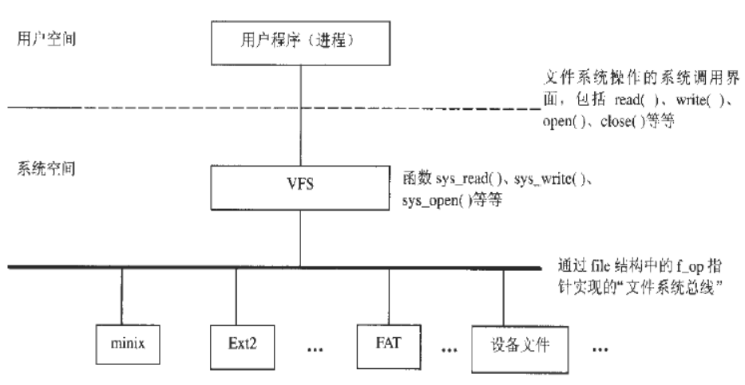

**位于内核态**，比系统调用更加底层。

- 组件

1. super block

- 描述文件系统的属性
- e.g.只读，ext4

1. i-node object

- 描述文件，磁盘上**所有的文件都有一个唯一的inode**
-  **记录真正的文件，文件存储在磁盘上时是按照索引号访问文件的，软链接是不同的文件，但是硬链接是相同的inode号，同一个文件。**  

1. file object

- **打开文件**，如果文件没有被打开，不会有file object
- 文件对象需要释放
- 标定唯一文件

1. dentry object目录项对象

- 记录目录路径

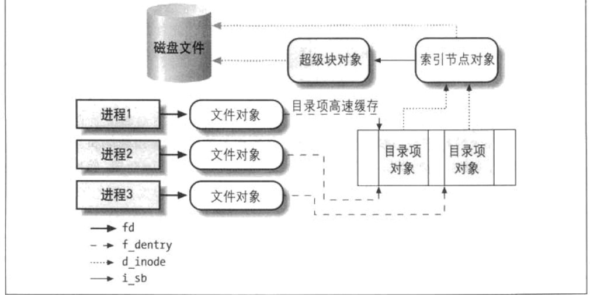

##  Linux中的文件描述符和文件指针FILE *的区别什么？

### 文件描述符（File Descriptor）

文件描述符是一个非负整数，它是内核为了高效管理已打开的文件或其他I/O资源（如套接字、管道等）而提供的一个抽象句柄。每当进程打开一个文件或创建一个新的I/O资源时，内核会分配一个文件描述符来唯一标识这个资源。文件描述符通常在系统级别进行操作，如使用read(), write(), close()等系统调用。

特点：

- 由内核管理。
- 通常在系统级别进行操作。
- 是一个轻量级的对象，仅表示一个整数。
- 可以用于所有类型的Unix文件系统I/O，包括网络套接字。

### 文件指针FILE *（Stream）

文件指针是一个指向FILE结构的指针，这个结构由C标准库（如glibc）提供，用于封装文件描述符和其他与文件操作相关的信息。FILE结构包含了缓冲区信息、文件偏移量、错误标志等。文件指针通常用于高级别的文件操作，如使用fread(), fwrite(), fclose()等库函数。

特点：

- 由C标准库管理。
- 通常在用户级别进行操作。
- 提供了缓冲区，可以减少系统调用的次数，提高I/O效率。
- 只能用于文件I/O，不能用于网络套接字等非文件类型的I/O。

### 区别

- **抽象层次**：文件描述符是系统级别的抽象，而文件指针是库级别的抽象。
- **用途**：文件描述符可以用于所有类型的Unix I/O，文件指针通常只用于文件I/O。
- **性能**：文件指针使用缓冲区，可以减少系统调用的次数，通常比直接使用文件描述符进行I/O操作要高效。
- **功能**：文件指针提供了更丰富的文件操作接口，如格式化输出、错误处理等。


## 符号链接

- Hard Link

1. 不同文件共用一个inode

- 两个文件没有主次关系删掉一个没有影响

1. 不能跨文件系统/分区
2. 对应**系统调用link**

- Symbolic link

1. 存储被链接文件的文件名（而不是inode）实现链接
2. 可以跨文件系统
3. 对应**系统调用symlink**

- ls -l查看链接数目

- 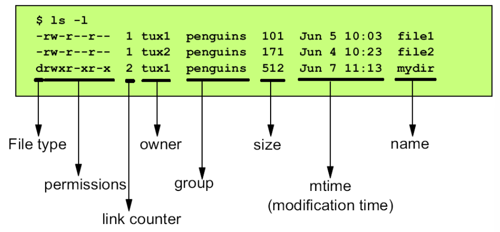

### 比较软链接和硬链接的不同之处(至少三点)，并分别给出硬链接和软链接在命令行和应用程序代码中的创建方法。(15')

硬链接：

1. 不同的文件名对应同一个inode号
2. 不能跨越文件系统
3. 对应系统调用link

软链接：

1. 存储被链接文件的文件名(而不是inode)实现链接
2. 可跨越文件系统
3. 对应系统调用symlink

shell：

1. 软链接: ln -s [filename] [filename]
2. 硬链接: ls [filename] [filename]

应用程序：

```c
// 创建硬链接
#include <unistd.h>
int link(const char oldpath, const char newpath);
// (Return: 0 if success; -1 if failure)
// 创建软链接：
#include <unistd.h>
int symlink(const char oldpath, const char newpath);
// (Return: 0 if success; -1 if failure)
```

## Basic I/O System Calls

使用系统调用读写文件

```c
#include <fcntl.h>
int main(){
    int fd, nread;
    char buf[1024];
    /*open file “data” for reading */
    fd = open(“data”, O_RDONLY);
    /* read in the data */
    nread = read(fd, buf, 1024);
    /* close the file */
    close(fd);
}
```

### open/creat function

```c
#include <sys/types.h> 
#include <sys/stat.h> 
#include <fcntl.h> 
int open(const char *pathname, int flags);
int open(const char *pathname, int flags, mode_t mode); //可变参数，不是函数重载
int creat(const char *pathname, mode_t mode);
//Return: a new file descriptor if success; -1 if failure
```

- flags: O_RDONLY, O_WRONLY, O_RDWR read-only, write-only or read/write  
- creat：open with flagsO_CREAT|O_WRONLY|O_TRUNC


```c
#include <unistd.h>
int close(int fd);
//Return: 0 if success; -1 if failure

#include <unistd.h>
ssize_t read(int fd, void *buf, size_t count);
//返回值: 读到的字节数，若已到文件尾为0，若出错为-1

#include <unistd.h>
ssize_t write(int fd, const void *buf, size_t count);
//返回值: 若成功为已写的字节数，若出错为-1

#include <sys/types.h>
#include <unistd.h>
off_t lseek(int fildes, off_t offset, int whence);
//Return: the resulting offset location if success; -1 if failure)
// whence：这是一个标志，用于指定offset的参考位置。它可以是以下三个值之一：
// SEEK_SET：设置文件偏移量到文件的开头加上offset字节的位置。
// SEEK_CUR：设置文件偏移量到当前位置加上offset字节的位置。这里的当前位置是指调用lseek之前文件的读写位置。
// SEEK_END：设置文件偏移量到文件的末尾加上offset字节的位置。如果offset是正数，那么文件偏移量将设置在文件末尾之后；如果offset是负数，那么文件偏移量将设置在文件末尾之前。

#include <unistd.h>
int dup(int oldfd);
int dup2(int oldfd, int newfd);
//Return: the new file descriptor if success; -1 if failure)
// 重定向的实现
int fd = open(...)
dup2(fd,1)
// 提供一种复制文件描述符的方法，我们可以用两个或多个描述符来访问同一个文件。
// 作用:复制文件描述符。dup产生一个相同的文件描述符指向同一个文件
// 请求复制fd指向的文件描述符到标准输出（stdout）的文件描述符（1）。
// 这意味着之后写到标准输出的数据将会被重定向到fd所指向的文件。
```

### fcntl和ioctl


```c
#include <unistd.h>
#include <fcntl.h>
int fcntl(int fd, int cmd);
int fcntl(int fd, int cmd, long arg);
int fcntl(int fd, int cmd, struct flock *lock);
//返回值: 若成功则依赖于cmd，若出错为-1

1. int fcntl(int fd, int cmd);
2. int fcntl(int fd, int cmd, long arg);
3. int fcntl(int fd, int cmd, struct flock *lock);
// 返回值；若成功则依赖于cmd，若出错则为-1
// cmd 为以下：
// F_DUPFD：复制文件描述符。
// F_GETFD：获取文件描述符标志。
// F_SETFD：设置文件描述符标志。
// F_GETFL：获取文件状态标志。
// F_SETFL：设置文件状态标志。
// F_GETLK, F_SETLK, F_SETLKW：获取和设置文件锁。


#include <sys/ioctl.h>
int ioctl(int d, int request, ...);
// d：文件描述符
// request：也是命令，但是是自定义的
```

#### 复制文件描述符


```c
#include <unistd.h>
#include <fcntl.h>
#include <stdio.h>

int main() {
    int fd = open("file.txt", O_WRONLY | O_CREAT, 0644);
    if (fd < 0) {
        perror("open");
        return 1;
    }

    // 复制文件描述符 fd
    int new_fd = fcntl(fd, F_DUPFD);
    if (new_fd < 0) {
        perror("fcntl");
        return 1;
    }

    printf("Original FD: %d, Duplicate FD: %d\n", fd, new_fd);

    close(fd);
    close(new_fd);
    return 0;
}
```

#### 设置非阻塞模式

```c
#include <unistd.h>
#include <fcntl.h>
#include <stdio.h>

int main() {
    int fd = open("file.txt", O_WRONLY | O_CREAT, 0644);
    if (fd < 0) {
        perror("open");
        return 1;
    }

    // 获取当前文件状态标志
    int flags = fcntl(fd, F_GETFL);
    if (flags < 0) {
        perror("fcntl");
        return 1;
    }

    // 设置非阻塞模式
    flags |= O_NONBLOCK;
    if (fcntl(fd, F_SETFL, flags) < 0) {
        perror("fcntl");
        return 1;
    }

    printf("File descriptor is now non-blocking.\n");

    close(fd);
    return 0;
}
```

#### 给文件加锁解锁


```c
int fcntl(int fd, int cmd, struct flock *lock);

struct flock {
    short l_type;   /* F_RDLCK, F_WRLCK, F_UNLCK */
    short l_whence; /* SEEK_SET, SEEK_CUR, SEEK_END */
    off_t l_start;  /* byte offset, relative to l_whence */
    off_t l_len;    /* length, in bytes; 0 means lock to EOF */
    pid_t l_pid;    /* returned with F_GETLK */
};
```

- l_type：锁的类型，F_RDLCK 表示共享锁（读锁），F_WRLCK 表示独占锁（写锁），F_UNLCK 表示解锁。
- l_whence：锁的起始位置，可以是 SEEK_SET（文件开始处），SEEK_CUR（当前文件位置），或 SEEK_END（文件末尾）。
- l_start：相对于 l_whence 的字节偏移量。
- l_len：锁的长度，0 表示锁直到文件末尾。
- l_pid：当使用 F_GETLK 命令时，如果存在冲突的锁，这里会返回持有锁的进程ID。


```c
#include <unistd.h>
#include <fcntl.h>
#include <stdio.h>

int main() {
    int fd = open("file.txt", O_WRONLY);
    if (fd < 0) {
        perror("open");
        return 1;
    }

    struct flock lock;
    lock.l_type = F_WRLCK;   // 设置为写锁
    lock.l_whence = SEEK_SET; // 从文件开始处
    lock.l_start = 0;         // 偏移量为0
    lock.l_len = 0;           // 锁定整个文件

    // 尝试加锁
    if (fcntl(fd, F_SETLK, &lock) == -1) {
        perror("fcntl lock");
        return 1;
    }

    printf("File locked.\n");

    // 执行一些操作...

    // 解锁文件
    lock.l_type = F_UNLCK; // 设置为解锁
    if (fcntl(fd, F_SETLK, &lock) == -1) {
        perror("fcntl unlock");
        return 1;
    }

    printf("File unlocked.\n");

    close(fd);
    return 0;
}
```

### 使用系统调用编写copy.cpp，接受两个参数(源文件路径和目标文件路径)，实现文件拷贝。使用通用语法编写makefile文件可以编译copy.cpp(35分


```c
#include <unistd.h>
#include <fcntl.h>
#include <iostream>

int main(int argc, char *argv[]) {
    const char *source = argv[1];
    const char *destination = argv[2];

    int source_fd = open(source, O_RDONLY);
    // if (source_fd == -1) {
    //     perror("open source");
    //     return 1;
    // }

    int destination_fd = open(destination, O_WRONLY | O_CREAT | O_TRUNC, 0644);
    // if (destination_fd == -1) {
    //     perror("open destination");
    //     close(source_fd);
    //     return 1;
    // }

    char buffer[4096];
    ssize_t read_count;
    while ((read_count = read(source_fd, buffer, sizeof(buffer))) > 0) {
        if (write(destination_fd, buffer, read_count) != read_count) {
            perror("write");
            close(source_fd);
            close(destination_fd);
            return 1;
        }
    }

    // if (read_count == -1) {
    //     perror("read");
    //     close(source_fd);
    //     close(destination_fd);
    //     return 1;
    // }

    close(source_fd);
    close(destination_fd);

    return 0;
}
```

在Makefile中，-o 标志必须紧跟在 $(CC) 之后，后面才是源文件的名称。

```c
CC = g++
CFLAGS = -Wall -Wextra -std=c++11

copy: copy.cpp
	$(CC)$(CFLAGS) -o $@$<

clean:
	rm -f copy
```

在这个例子中，$@ 代表目标 copy，而 $< 代表源文件 copy.cpp。Makefile会自动替换这些变量，所以当你运行 make 时，它实际上会执行 g++ -Wall -Wextra -std=c++11 -o copy copy.cpp。

## Standard I/O Library

### File Stream

使用用户态的**结构体**FILE，而不是文件描述符。FILE结构体内部保存文件描述符。

有预先定义好的stdin, stdout, stderr

- buffer

1. 全缓存 全缓冲指的是系统在填满标准IO缓冲区之后才进行实际的IO操作；注意，对于驻
   留在磁盘上的文件来说通常是由标准IO库实施全缓冲。
2. 行缓存 在这种情况下，标准IO在输入和输出中遇到换行符时执行IO操作；注意，当流涉
   及终端的时候，通常使用的是行缓冲。
3. 无缓存 无缓冲指的是标准IO库不对字符进行缓冲存储；注意，标准出错流stderr通常是无
   缓冲的。

### Stream Buffering Operations

```c
#include <stdio.h>
void setbuf(FILE *stream, char *buf);
int setvbuf(FILE *stream, char *buf, int mode, size_t size);
```

- type:

- _IOFBF(满缓冲）
- _IOLBF(行缓冲）
- _IONBF(无缓冲）

### Stream open/close


```c
#include <stdio.h>
FILE *fopen(const char *filename, const char *mode);
int fclose(FILE *stream);
```

- 创建/销毁stream

1. r 读
2. w 清空写
3. a 追加
4. r+ 读写
5. w+ 清空读写
6. a+ 不清空读写

```c
#include <stdio.h>

int main() {
    // 打开文件用于写入
    FILE *file = fopen("example.txt", "w");
    if (file == NULL) {
        perror("fopen");
        return 1;
    }

    // 写入数据到文件
    fprintf(file, "Hello, World!\n");

    // 关闭文件
    if (fclose(file) != 0) {
        perror("fclose");
        return 1;
    }

    return 0;
}
```

### fclose fgetc getc getchar putc fputc putchar fgets

```c
int getc(FILE *fp) ：是预定义宏，无函数副作用，更快
int fgetc(FILE *fp) ：常用，在用到函数副作用/函数指针用
int getchar(void) ：由stdin读取一个字节，默认行缓冲

int putc(int c, FILE *fp)
int fputc(int c, FILE *fp)
int putchar(int c)
char *fgets(char *s, int size, FILE *stream) 常用，最多从流中读取并存储size-1个字符，并最
后添加一个\0
```

## stat/fstat/lstat

- stat：获取指定文件的详细信息，如果文件是一个符号链接，则返回链接指向的文件的详细信息。
- fstat：获取已打开文件的详细信息，通过文件描述符来指定文件。
- lstat：获取指定文件的详细信息，如果文件是一个符号链接，则返回链接本身的详细信息，而不是链接指向的文件的详细信息。

```c
#include <sys/types.h>
#include <sys/stat.h>
#include <unistd.h>
int stat(const char *filename, struct stat *buf);
int fstat(int filedes, struct stat *buf);
int lstat(const char *file_name, struct stat *buf);
//Return: 0 if success; -1 if failure
// path：指向文件路径的指针。
// fd：文件描述符。
// buf：指向 struct stat 的指针，用于存储文件状态信息。

struct stat {
	mode_t st_mode; /*file type & mode*/
	ino_t st_ino; /*inode number (serial number)*/
	dev_t st_rdev; /*device number (file system)*/ 
	nlink_t st_nlink; /*link count*/
	uid_t st_uid; /*user ID of owner*/
	gid_t st_gid; /*group ID of owner*/
	off_t st_size; /*size of file, in bytes*/
	time_t st_atime; /*time of last access*/
	time_t st_mtime; /*time of last modification*/
	time_t st_ctime; /*time of last file status change*/
	long st_blksize; /*Optimal block size for I/O*/
	long st_blocks; /*number 512-byte blocks allocated*/
};
```

- lstate和stat的区别在于对符号链接的处理：

1. stat 会跟随符号链接并获取链接目标的文件状态信息
2. lstat 则获取**链接本身**的文件状态信息。当你需要确定一个文件是不是符号链接，或者你需要获取符号链接本身的信息（比如权限、所有者等），这时应该使用 lstat。


```c
#include <unistd.h>
#include <sys/stat.h>
#include <stdio.h>

int main() {
    struct stat file_stat;
    const char *path = "example.txt";

    // 使用 stat 获取文件信息
    if (stat(path, &file_stat) == -1) {
        perror("stat");
        return 1;
    }
    printf("Size of %s: %ld bytes\n", path, file_stat.st_size);

    // 打开文件
    int fd = open(path, O_RDONLY);
    if (fd == -1) {
        perror("open");
        return 1;
    }

    // 使用 fstat 获取文件信息
    if (fstat(fd, &file_stat) == -1) {
        perror("fstat");
        return 1;
    }
    printf("Size of file descriptor %d: %ld bytes\n", fd, file_stat.st_size);

    // 使用 lstat 获取符号链接信息（如果文件是符号链接）
    if (lstat(path, &file_stat) == -1) {
        perror("lstat");
        return 1;
    }
    if (S_ISLNK(file_stat.st_mode)) {
        printf("%s is a symbolic link\n", path);
    } else {
        printf("%s is not a symbolic link\n", path);
    }

    close(fd);
    return 0;
}
```

types

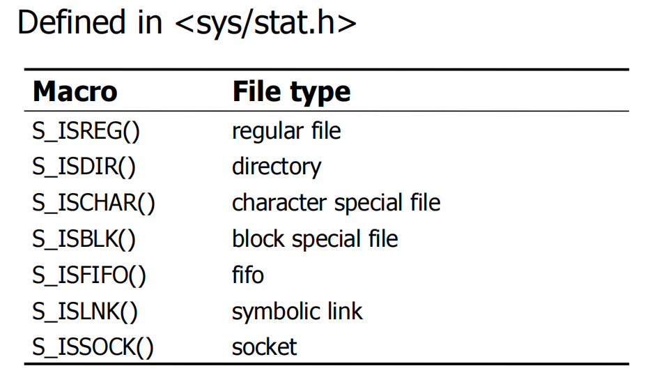

mode

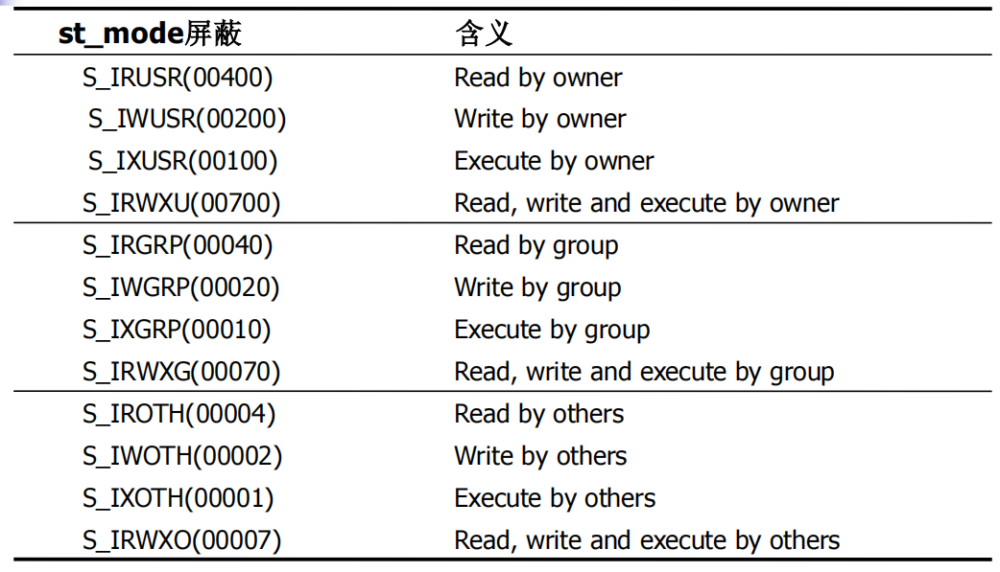

## File lock

作用：几个进程同时操作一个文件

### 分类

- 记录锁：往文件加锁时，是否要锁整个文件，还是只锁一部分（记录锁）
- 劝告锁：

- 检查，加锁由应用程序控制
- 系统会给进程发信号，告诉他这个文件被上锁，但是可以强行操作文件
- 劝告锁是一种协同工作的锁。对于这一种锁来说，内核只提供加锁以及检测文件是否已经加锁的手段，但是内核并不参与锁的控制和协调。也就是说，如果有进程不遵守“游戏规则”，不检查目标文件是否已经由别的进程加了锁就往其中写入数据，那么内核是不会加以阻拦的

- 强制锁：

- 检查，加锁由内核控制
- 影响open,write,read等操作
- 每当有系统调用 open()、read() 以及write() 发生的时候，内核都要检查并确保这些系统调用不会违反在所访问文件上加的强制锁约束。也就是说，如果有进程不遵守游戏规则，硬要往加了锁的文件中写入内容，内核就会加以阻拦

- 共享锁 读锁
- 排他锁 写锁

**进行对已加强制锁的文件进行操作时的行为**

| 当前锁类型 | 阻塞读       | 阻塞写 | 非阻塞读     | 非阻塞写 |
| ---------- | ------------ | ------ | ------------ | -------- |
| 读锁       | 正常读取数据 | 阻塞   | 正常读取数据 | EAGAIN   |
| 写锁       | 阻塞         | 阻塞   | EAGAIN       | EAGAIN   |

### fcntl记录锁

```c
#include <unistd.h>
#include <fcntl.h>
int fcntl(int fd, int cmd, struct flock *lock);
//返回值: 若成功则依赖于cmd，若出错为-1

struct flock{
	...
	short l_type; /* Type of lock: F_RDLCK, F_WRLCK, F_UNLCK */
	short l_whence; /* How to interpret l_start: SEEK_SET, SEEK_CUR, 
	SEEK_END */
	off_t l_start; /* Starting offset for lock */
	off_t l_len; /* Number of bytes to lock */
	pid_t l_pid; /* PID of process blocking our lock (F_GETLK only) */
	...
}
```

## directory


```c
//in <dirent.h>
//The data type of directory stream objects
typedef struct __dirstream DIR;

//in <dirent.h>
//Directory item
ino_t d_ino; /* inode number */
char d_name[NAME_MAX + 1]; /* file name */


#include <sys/types.h>
#include <dirent.h>
DIR *opendir(const char *name);
int closedir(DIR *dir);
struct dirent *readdir(DIR *dir);
off_t telldir(DIR *dir);
void seekdir(DIR *dir, off_t offset);
```


```c
DIR *dp;
struct dirent *entry;
if ( (dp = opendir(dir) ) == NULL ) {
    err_sys(…);
}
while ( (entry = readdir(dp)) != NULL ) {
	lstat(entry->d_name, &statbuf);
	if ( S_ISDIR(statbuf.st_mode) ) 
		…
	else
		…
}
closedir(dp);
```

- 编程题：文件、文件系统的定义
- 文件类型，内容，正确解释
- VFS，四个对象，名称概念（年年考）
- 硬链接软连接（常考）联系、区别（要答全了），联动创建命令，对应编程的系统调用， ls -l会影响哪些地方
- 系统调用和库的区别，不考概念，考编程题（用系统调用写代码）库函数在系统调用的上层，差别是什么，文件相关的缓存分配
- 各种调用，联动重定向
- fcntl：参数写出来，后面的意思对就行
- ioctl跟字符型驱动什么关系
- c库：重点buffer，fopen fclose不是系统调用
- 缓存的影响，图（考缓存就考ppt里下面的图）
- 系统调用，编程题
- 权限
- 硬软连接的系统调用
- 尽可能高效-》系统调用
- 文件锁（考试重点），掌握五种，每种锁有什么特点，怎么调用
- lockf可以不掌握， fcntl掌握

# 第六章-进程线程

1. 进程：是一个正在执行的程序实例，是操作系统的执行单位，由执行程序、当前值、状态信息以及
   通过操作系统管理此进程执行情况的资源组成；包含有一个地址空间，在该空间内指定一个或多个
   线程，并分配这些线程所需的系统资源。
2. echi $$ 告知shell当前的进程号
3. 进程的启动都由其他进程启动：所有的进程都是由内核进程(PID=1)来启动的，往往都具有父子进
   程关系，init(1号进程)由内核本身启动，形成树状的层次结构。
4. 进程的终止

1. 正常终止

1. 从main返回
2. 调用exit函数(库函数，做清理处理)
3. 调用_exit函数(系统函数，立即进入内核)

1. 异常终止

1. 调用abort函数
2. 由一个信号终止

1. Daemons 守护进程：守护进程指的是一个永无止境的进程，通常是控制诸如打印机队列之类的系
   统资源或执行网络的系统进程。

## exec fork

1. exec：直接执行新的程序
2. fork：创建一个一样的新进程

## wait & waitpid


```c
pid_t wait(int * status)
pid_t waitpid(pid_t  pid, int *status, int options)
```

- 作用

1. 父进程等待子进程结束
2. 回收僵尸进程

- 结果

1. 阻塞
2. 立即返回
3. 出错

- waitpid

1. 指定pid
2. 非阻塞
3. waitpid的pid参数

1. == -1：对应wait
2. 0: 指定pid
3. ==0：指定父进程的group
4. <0：指定group id，等待对应组里的进程

## signal 信号量

进程之间通信

### 信号

1. SIGHUP连接挂断
2. SIGINT终端中断
3. SIGKILL终止进程（此信号不能被捕获或忽略）
4. SIGQUIT终端退出
5. SIGTERM终止
6. SIGCHLD子进程已经停止或退出
7. SIGCONT继续执行暂停进程
8. SIGSTOP停止执行（此信号不能被捕获或忽略）
9. SIGTSTP终端挂起

###  可靠性

- 信号可靠性

1. 连续重复信号能不能收到

1. 可能会丢失，SIG对应的int值较大对应早期Linux版本不可靠，int值较小对应早期版本;后期版本有可靠机制

1. 阻塞信号
2. 复位机制

### 发信号

1. kill: send signal to a process
2. raise: send a signal to the current process
3. alarm: set an alarm clock for delivery of a signal

1. 每个进程只能有一个闹钟
2. 可以用来做超时处理

1. pause: wait for a signal

1. 挂起，等到有信号来才执行
2. e.g. CTRL+Z的实现

### 可靠信号

信号集

给一个信号注册一个结构体，而不是直接注册处理函数

- sigprocmask：检测或更改(或两者)进程的信号掩码
- **sigaction**：检查或修改与指定信号的关联处理动作


```c
#include <signal.h>
int sigaction(int signum, const struct sigaction *act, struct 
sigaction *oldact);
//Returned Value: 0 is success, -1 if failure)

handler_t sa_handler; /* addr of signal handler, or SIG_IGN, 
or SIG_DEL */
sigset_t sa_mask; /* additional signals to block */
int sa_flags; /* signal options */

#include <signal.h>
int sigsuspend(const sigset *sigmask);
//Returned value: -1, errno is set to be EINTR
```

## mmap/munmap

mmap系统调用可以将一个文件或者其它对象映射到内存中。映射之后，进程可以像访问普通内存一样访问这个文件的内容，而不需要使用read和write系统调用。这种方式通常比传统的文件I/O操作要快，因为它减少了数据在用户空间和内核空间之间复制的次数。

mmap的常见用途包括：

- 文件映射：将文件内容映射到内存中，以便快速读写。
- 共享内存：允许多个进程共享一段内存区域，用于进程间通信。
- 匿名映射：创建一段没有关联到任何文件的内存区域，通常用于分配内存。

```c
void* mmap(void* addr,size_t length,int prot, int flags,int fd,off_t offset)
int munmap(void* addr, size_t length)
```

- flags

1. MAP_SHARED
2. MAP_ANONYMOUS：忽略掉fd，虚拟了一个文件
3. MAP_PRIVATE：只有当前进程可以写

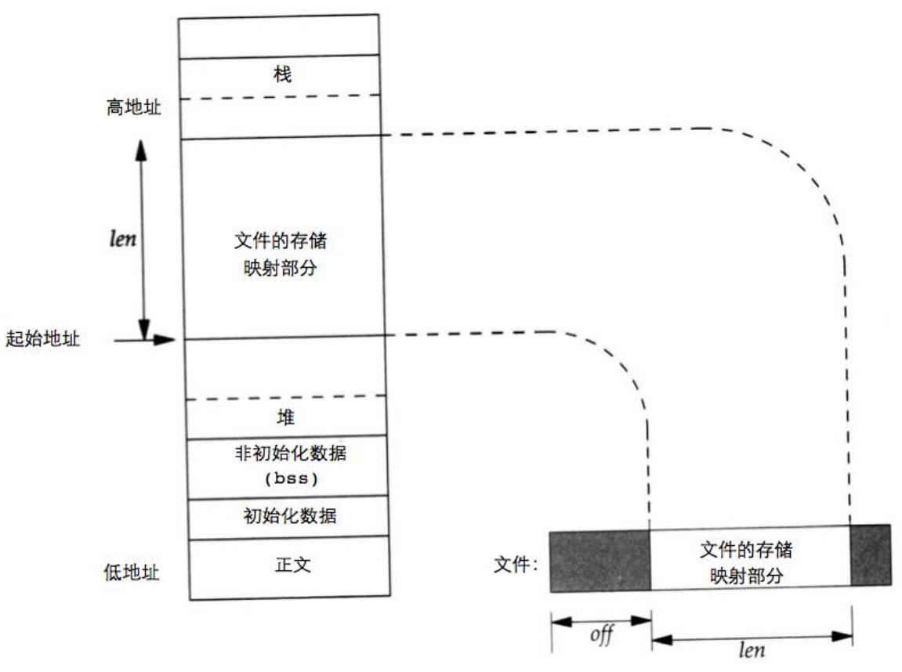

当不再需要访问映射的内存区域时，可以使用munmap系统调用来解除映射。这个调用会将映射的内存区域从进程的地址空间移除，并释放相关的资源。

使用mmap和munmap时需要注意：

- 如果映射的内存区域是基于文件的，那么对该内存区域的修改可能会被写回到文件中，这取决于映射时的标志。
- 如果没有调用munmap来解除映射，那么当进程终止时，内核会自动解除所有的映射。
- 不正确的使用mmap和munmap可能导致资源泄漏或者程序行为的不确定性。

## POSIX thread

1. POSIX thread不是系统调用，是Linux下的标准库
2. Linux下可以用clone创建thread，但是比较复杂很少用

线程共享地址空间，轻量级

- pthread library

- /usr/lib/libpthread.so, /usr/lib/libpthread.a

- pthread.h header file

- /usr/include/pthread.h

- Compiler options

- gcc thread.c –o thread –lpthread
- -l: link，链接本地二进制码

## 生命周期

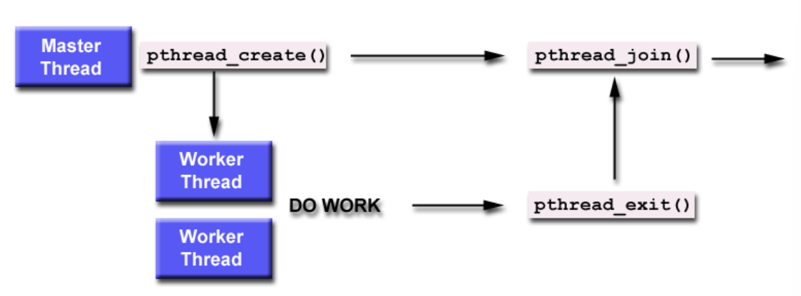

### pthread_create pthread_exit pthread_join

```c
#include <pthread.h>
int pthread_create(
pthread_t *thread, pthread_attr_t *attr, void *(*start_routine)(void *), void *arg);
    
// 创建线程
// thread：输出线程ID
// attr：创建线程的时候可以传属性，默认可以传NULL
// start_routine：线程的入口函数
// arg


void pthread_exit(void * retval);
可以在线程里调用pthread_exit，也可以在线程main函数return

int pthread_join(pthread_t th, void **thread_return);
th：需要等待的线程
thread_return：指向线程返回值的指针
返回值是void*

int pthread_detach(pthread_t th);
线程自己回收自己的资源，不和任何线程做join
```


## 信号量

```c
#include <semaphore.h>
int sem_init(sem_t *sem, int pshared, unsigned int 
value);
int sem_wait(sem_t *sem); //P
int sem_post(sem_t *sem); //V
int sem_destroy(sem_t *sem);// 释放
int sem_trywait(sem_t *sem); //不阻塞的P
int sem_getvalue(sem_t *sem, int *sval);
```

- sem_init

1. sem：指向信号量指针
2. pshared：是否共享
3. value：初始值


```c
#include <pthread.h>
#include <stdio.h>

void *thread_function(void *arg) {
    printf("Hello from thread %d\n", (int)arg);
    return NULL;
}

int main() {
    pthread_t thread_id;
    int thread_number = 1;

    // 创建线程
    if (pthread_create(&thread_id, NULL, thread_function, (void *)thread_number) != 0) {
        perror("pthread_create");
        exit(EXIT_FAILURE);
    }

    // 等待线程完成
    if (pthread_join(thread_id, NULL) != 0) {
        perror("pthread_join");
        exit(EXIT_FAILURE);
    }

    printf("Thread completed\n");
    return 0;
}
```

## 互斥量

```c
#include <pthread.h>
int pthread_mutex_init(pthread_mutex_t *mutex, const 
pthread_mutexattr_t *mutexattr);
int pthread_mutex_lock(pthread_mutex_t *mutex);
int pthread_mutex_unlock(pthread_mutex_t *mutex);
int pthread_mutex_destroy(pthread_mutex_t *mutex);
int pthread_mutex_trylock(pthread_mutex_t *mutex);
```


```c
#include <pthread.h>

pthread_mutex_t mutex;

// 初始化互斥量
if (pthread_mutex_init(&mutex, NULL) != 0) {
    // 错误处理
}

// 销毁互斥量
pthread_mutex_destroy(&mutex);

// 加锁
if (pthread_mutex_lock(&mutex) != 0) {
    // 错误处理
}

// 解锁
if (pthread_mutex_unlock(&mutex) != 0) {
    // 错误处理
}
```

## 条件变量

等待某个变量满足条件，和**互斥量一起使用**

```c
pthread_cond_t cond;

// 初始化条件变量
if (pthread_cond_init(&cond, NULL) != 0) {
    // 错误处理
}

// 销毁条件变量
pthread_cond_destroy(&cond);

// 加锁
if (pthread_mutex_lock(&mutex) != 0) {
    // 错误处理
}

// 检查条件
if (condition) {
    // 如果条件为真，解锁并继续
    pthread_mutex_unlock(&mutex);
} else {
    // 如果条件为假，等待信号
    pthread_cond_wait(&cond, &mutex);
}

// 解锁
pthread_mutex_unlock(&mutex);

// 加锁
if (pthread_mutex_lock(&mutex) != 0) {
    // 错误处理
}

// 设置条件
if (pthread_cond_signal(&cond) != 0) {
    // 错误处理
}

// 广播条件
if (pthread_cond_broadcast(&cond) != 0) {
    // 错误处理
}

// 解锁
pthread_mutex_unlock(&mutex);
```

### 初始化

静态初始化pthread_cond_t convar = PTHREAD_COND_INITIALIZER;

pthread_cond_init()

```c
int pthread_cond_init(pthread_cond_t *cond, pthread_condattr_t *cond_attr);
int pthread_cond_destory(pthread_cond_t cond);


int pthread_cond_wait(pthread_cond_t *cond, pthread_mutex_t mutex); 
int pthread_cond_signal(pthread_cond_t cond); 
int pthread_cond_broadcast(pthread_cond_t cond);
```


1. 等待：等到条件变量被通知或广播，**等待时会unlock互斥量（原子操作）**

- 当重新开始执行，会lock互斥量

1. 通知：随机唤醒
2. 广播：唤醒所有

### 例子

加数据，拿数据并发修改index，len

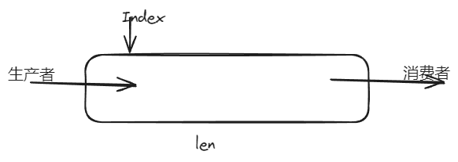


```c
pthread_mutex_t mutex;
pthread_cond_t condition;
int count = 0;

void decrement_count() {
    pthread_mutex_lock(&mutex);
    while (count == 0)
        pthread_cond_wait(&condition, &mutex);
    count = count - 1;
    pthread_mutex_unlock(&mutex);
}

void increment_count() {
    pthread_mutex_lock(&mutex);
    if (count == 0)
        pthread_cond_signal(&condition);
    count = count + 1;
    pthread_mutex_unlock(&mutex);
}
```


```c
#include <pthread.h>
#include <stdio.h>
#include <stdlib.h>

pthread_mutex_t mutex;
pthread_cond_t cond;
int count = 0;

void *thread_function(void *arg) {
    int num = (int)arg;
    printf("Thread %d starting\n", num);

    // 加锁
    pthread_mutex_lock(&mutex);

    // 等待条件不满足
    while (count < 10) {
        pthread_cond_wait(&cond, &mutex);
    }

    // 条件满足，解锁
    pthread_mutex_unlock(&mutex);

    printf("Thread %d finishing\n", num);
    return NULL;
}

int main() {
    pthread_t threads[3];
    int i;

    // 初始化互斥量和条件变量
    if (pthread_mutex_init(&mutex, NULL) != 0) {
        perror("pthread_mutex_init");
        exit(EXIT_FAILURE);
    }
    if (pthread_cond_init(&cond, NULL) != 0) {
               perror("pthread_cond_init");
        exit(EXIT_FAILURE);
    }

    // 创建线程
    for (i = 0; i < 3; i++) {
        if (pthread_create(&threads[i], NULL, thread_function, (void *)i) != 0) {
            perror("pthread_create");
            exit(EXIT_FAILURE);
        }
    }

    // 等待所有线程完成
    for (i = 0; i < 3; i++) {
        if (pthread_join(threads[i], NULL) != 0) {
            perror("pthread_join");
            exit(EXIT_FAILURE);
        }
    }

    // 销毁互斥量和条件变量
    pthread_mutex_destroy(&mutex);
    pthread_cond_destroy(&cond);

    return 0;
}
```

## Thread cancellation

```c
int pthread_cancel(pthread_t thread);
int pthread_setcancelstate(int state, int 
*oldstate);
int pthread_setcanceltype(int type, int *oldtype);
```

## Thread Local Storage (TLS)

线程局部存储：变量是**线程私有**的，对于线程内部的函数是全局变量

函数内的局部变量在线程的函数调用栈里，本来就不存在全局共享

```c
int pthread_key_create(pthread_key_t *key, void (*destructor)(void*));

int pthread_key_delete(pthread_key_t key);

void *pthread_getspecific(pthread_key_t key);

int pthread_setspecific(pthread_key_t key, const void *value);
```

1. pthread_key_create：key相当于变量名，每一个线程都创建了这个变量，只是隔离了

- 在每个线程中**同时创建，同时释放**

1. delete：会调用create时传入的析构函数
2. get/set：对TLS读写操作


- 系统调用
- main函数入口出口不考
- exec掌握
- fork
- 进程中的信息，大致写出来
- wait waitpid掌握
- signal不要求写，给代码问效果
- 有部分信号不能被跳过，能读懂代码
- 可靠信号和不可靠信号
- 可重入函数
- 可靠信号的实现方式
- 细节设置不考
- 地址映射：文件和设备
- 线程
- 信号量、互斥量、条件变量
- 线程部分polix
- 设置线程属性不考
- cancel要考
- multithread program描述题
- tls怎么做

# 第七章-linux内核

操作系统是一系列程序的集合，其中最重要的部分构成了内核
单内核/微内核

1. 单内核是一个很大的进程，内部可以分为若干模块，运行时是一个独立的二进制文件，模块间
   通讯通过直接调用函数实现
2. 微内核中大部分内核作为独立的进程在特权下运行，通过消息传递进行通
3. Linux内核的能力：内存管理，文件系统，进程管理，多线程支持，抢占式，多处理支持
4. Linux内核区别于其他UNIX商业内核的优点

1. 单内核，模块支持
2. 免费/开源
3. 支持多种CPU，硬件支持能力非常强大


## Linux内核模块与应用程序模块的区别

|      | C        | Linux内核模块     |
| ---- | -------- | ----------------- |
| 运行 | 用户空间 | 内核空间          |
| 入口 | main()   | module_init()指定 |
| 出口 | 无       | module_exit()指定 |
| 运行 | 直接指定 | insmod            |
| 调试 | gdb      | kdbug,kdb,kgdb等  |


## 内核程序注意事项

不能调用C库来开发驱动程序

没有内存保护机制

小内核栈

内核一般不用递归否则会占用大量内存空间

并发考虑


- 块设备、网络设备不考，只考到字符型设备
- 编译内核不考，make menuconfig是额外增加的，给个菜单，让用户选择yes or no 
- 引导菜单能读就行
- make init跳过不考
- 驱动工作在内核态
- 加载命令也是内核的一部分
- 模块的依赖不考概念，结合命令考
- 用户态程序和内核态程序的区别（不能完全按照ppt，要拓展）
- 内核的代码，不要求写，要求读懂
- 编译模式不要求
- 内核相关代码没有浮点支持，%f不能用在printk
- 主设备号和副设备号
- 内核调用不需要