# 数据库期末重点

100

20机试

80笔试

# SQL 

- 三道题 时间 字符串 数值（考虑空值）三选二 常见函数
- 日期索引的三种写法
- 标注选择的数据库
- 递归查询可能会考一个 withas
- 外连接和数值在一起
- 结构和关键字合理就有分，细节全对全部分

## 字符串——replace（a，“，”，“”），计数需要/length（“，”）

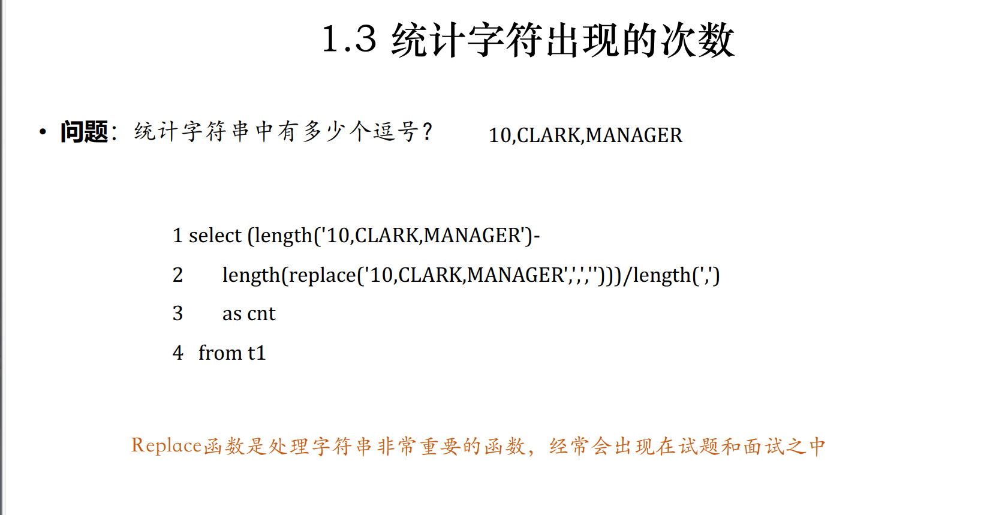

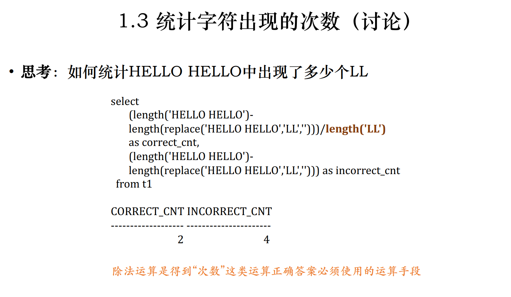

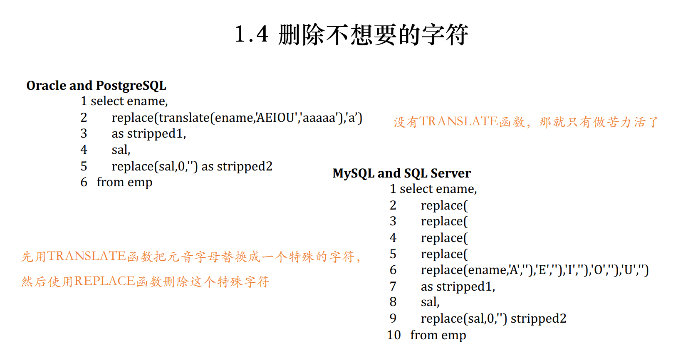

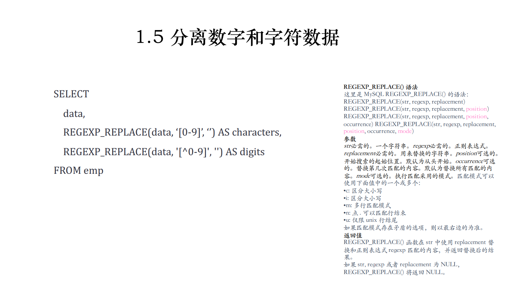

## 日期

- 直接加减——date_add(日期，interval -5 day)

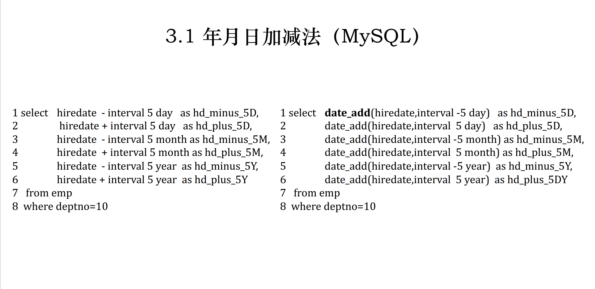

- 日期之差

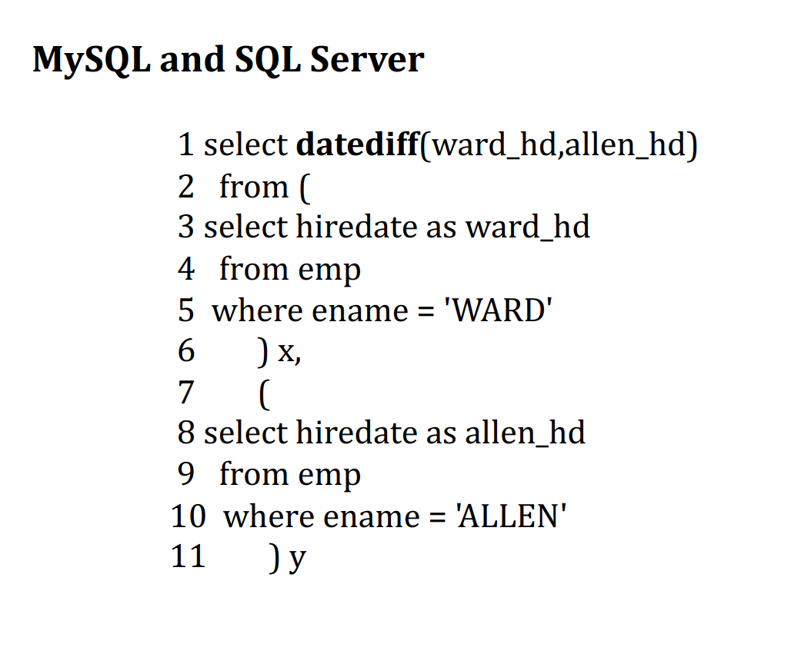

- 日期格式化

date_format('data','format')

Format:

- %a Mon
- %b Jan
- %W Monday
- %M January
- %D 一个月中的第几天
- %Y-%m-%d ： 2017/4/30
- 当前日期——current_date
- 一年已经过了多少天——dayofyear()

## 平均值——coalesce（sal，0）

avg(sal)如果有null，不会被统计在里面，所以要用avg(coalesce(sal, 0))

## 中位数——大小一致——正负sum

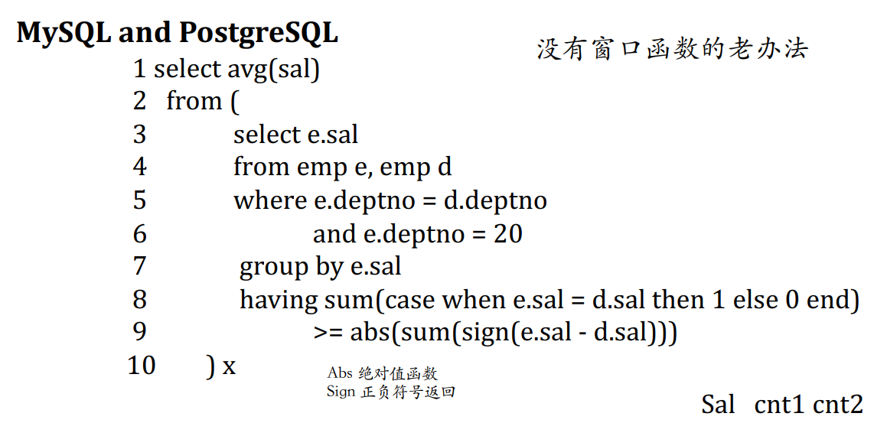

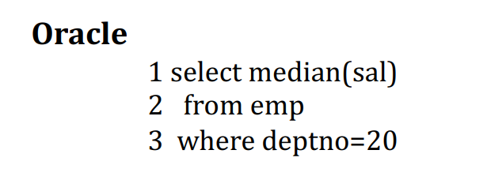

## 众数——数目最多——count

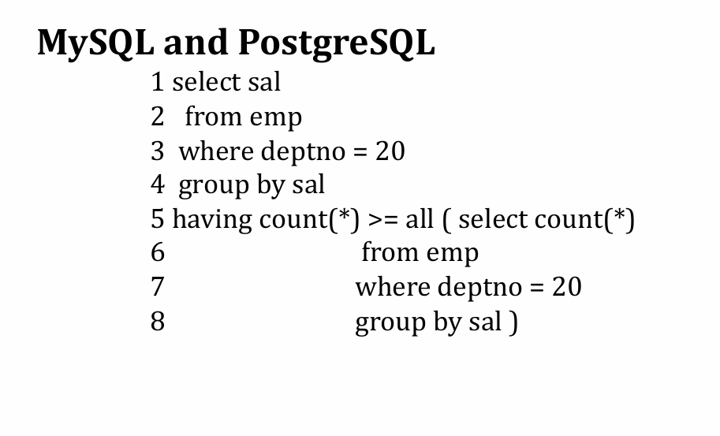

注意标注使用哪个数据库

## 递归查询 with as 树状结构递归查询

例如：查询递归查询所有员工

```plain
# Write your MySQL query statement below
with recursive temp as (
    select e.employee_id from Employees e where e.employee_id!=1 and manager_id=1
    union all 
    select e.employee_id from Employees e join temp t on t.employee_id=e.manager_id
)
select * from temp
```

格式：


```sql
with recursive 递归名字(a1, a2, a3)(
  // 第一层
  select a1 from where conditon
  union all
  Select a1
  from 表 left join 递归名字 on 递归表.父 = 表.子
) 
select * from 递归名字
```

# 论述、简答

## 索引

- 索引的叶节点，不同的区域，有link
- N节点，N+1link
- 节点的分裂与合并，在叶节点和内部节点，如何影响上一层的节点（必考）

### B树与B+树

[B树和B+树的插入、删除图文详解 - nullzx - 博客园](https://www.cnblogs.com/nullzx/p/8729425.html)

[数据结构之B+树插入详解-CSDN博客](https://blog.csdn.net/Weixiaohuai/article/details/109493541)

[数据结构之B+树删除详解-CSDN博客](https://blog.csdn.net/Weixiaohuai/article/details/109494006?ops_request_misc=&request_id=&biz_id=102&utm_term=数据结构之B+树删除详解&utm_medium=distribute.pc_search_result.none-task-blog-2~blog~sobaiduweb~default-1-109494006.nonecase&spm=1018.2226.3001.4450)

B树的插入

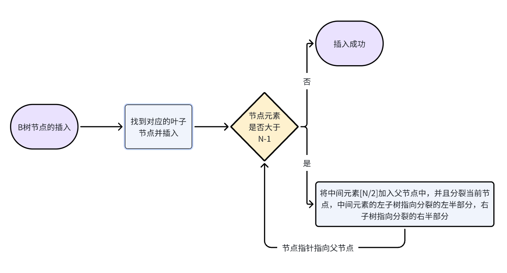

B树的删除

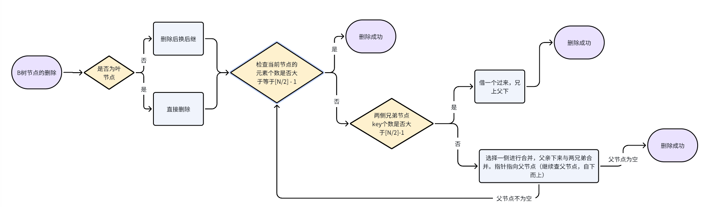


### 1）位图索引的存储结构和用途

存储结构：

1. 位图索引的索引存储指向多行的指针；
2. 位图索引每次进行修改都会锁住全部的索引；

用途：

1. 相异基数低：字段可以取用的值比较少；
2. 大量临时查询的聚合；

### 2）函数索引的含义和用途

含义：对F(x)的值构建索引，在通过对索引读取x所指向的记录行；

用途：

1. 不区分大小写的查询：使用函数输入；
2. T、F的巨大差异下的索引：如何找到少量的F；
3. 有选择的唯一性：Active的活动的名称不能相同；

### 3）反向键索引或逆向索引的含义和用途

含义：将索引的字段翻转过来作为索引的键值；

用途：用来解决高并发下的系统生成键的创建和插入问题；

### 4）还知道什么索引？

B+树索引、哈希索引、聚簇索引、辅助索引、稀疏索引（部分数据建立索引）、密集索引（全部）

## 日志

- redo undo 如何实现，什么区别，有什么问题

### redo

如何实现

- Redo Log记录的是对数据库页的物理修改操作，即每次事务对数据页进行更改后，都会将变更以“redo record”的形式写入Redo Log。可以保证事务的持久性

### undo

#### 如何实现

- 设计与功能：Undo Log用于实现事务原子性和一致性的重要机制，它记录了事务对数据库所做的更改的相反操作。例如，如果事务执行了一条INSERT语句，那么Undo Log会记录一个DELETE操作；若执行UPDATE，则记录一个相反的UPDATE操作

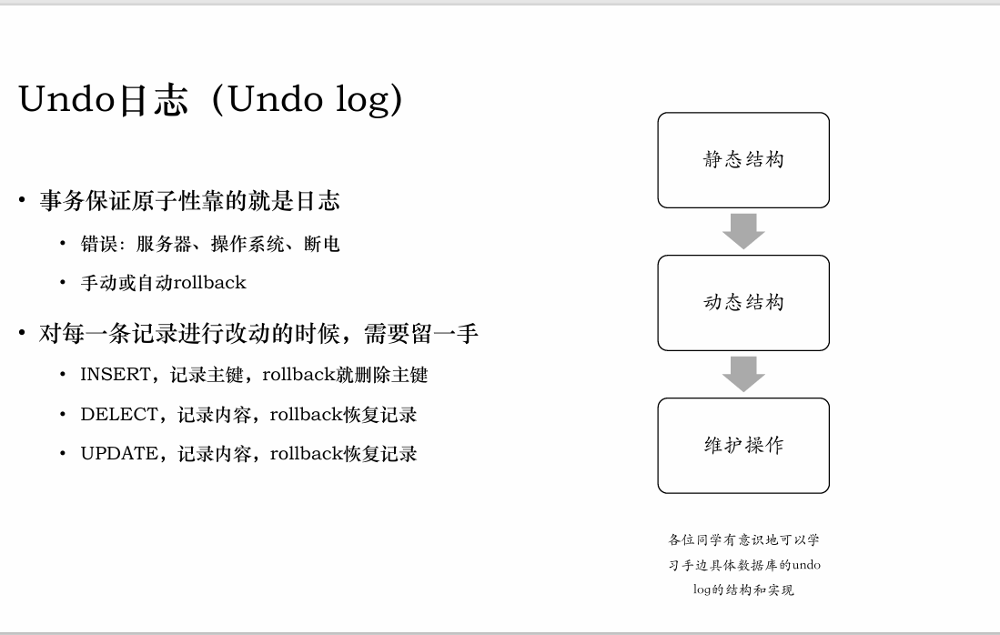

## 分区分表

- 原因
- 解决的问题
- 带来的问题

https://cloud.tencent.com/developer/article/1849822

## 分区

### 原因

表数据量太大，查询速度变慢。在物理上将这一张表对应的三个文件，分割成许多个小块，这样呢，我们查找一条数据时，就不用全部查找了，只要知道这条数据在哪一块，然后在那一块找就行了。另一方面，如果表的数据太大，可能一个磁盘放不下，这个时候，我们可以把数据分配到不同的磁盘里面去。

通俗地讲表分区是将一大表，根据条件分割成若干个小表。mysql5.1开始支持数据表分区了。如：某用户表的记录超过了600万条，那么就可以根据入库日期将表分区，也可以根据所在地将表分区。当然也可根据其他的条件分区。

当表非常大，或者表中有大量的历史记录，而“热数据”却位于表的末尾。如日志系统、新闻。此时就可以考虑分区表。【注：此处也可以使用分表，但是会增加业务的复杂性

### 解决问题

查询能过滤掉很多额外分区、分区本身不会带来很多额外代价

能解决并发问题 ：通过分区键让数据聚集，利于检索。但对于并发执行的更改操作，分散的数据可以避免访问过于集中的问题

### 分区的实现方式：

- 哈希分区

- **HASH分区**：基于用户定义的表达式的返回值来进行选择的分区，该表达式使用将要插入到表中的这些行的列值进行计算。这个函数可以包含MySQL 中有效的、产生非负整数值的任何表达式。 hash 分发，好处在于说，可以平均分配每个库的数据量和请求压力；坏处在于说扩容起来比较麻烦，会有一个数据迁移的过程，之前的数据需要重新计算 hash 值重新分配到不同的库或表

- 范围分区

- **RANGE分区**：基于属于一个给定连续区间的列值，把多行分配给分区。mysql将会根据指定的拆分策略，,把数据放在不同的表文件上。相当于在文件上,被拆成了小块.但是,对外给客户的感觉还是一张表，透明的。

- 列表分区

- **LIST分区**：类似于按RANGE分区，每个分区必须明确定义。它们的主要区别在于，LIST分区中每个分区的定义和选择是基于某列的值从属于一个值列表集中的一个值（例如地区），而RANGE分区是从属于一个连续区间值（例如时间）的集合。

### 带来的问题

- 存在冲突——不能解决并发问题 

- 通过分区键让数据聚集，利于检索。但对于并发执行的更改操作，分散的数据可以避免访问过于集中的问题
- NULL值会让分区过滤无效
- 分区列和索引列不匹配
- 选择分区的代价很高
- 很可能打开并锁住所有底层表（读写锁问题）
- 维护分区成本很高

## 分表

### 实现方式

分表有两种分割方式，一种垂直拆分，另一种水平拆分。

- **垂直拆分** 垂直分表，通常是按照业务功能的使用频次，把主要的、热门的字段放在一起做为主要表。然后把不常用的，按照各自的业务属性进行聚集，拆分到不同的次要表中；主要表和次要表的关系一般都是一对一的。
- **水平拆分(数据分片)** 单表的容量不超过500W，否则建议水平拆分。是把一个表复制成同样表结构的不同表，然后把数据按照一定的规则划分，分别存储到这些表中，从而保证单表的容量不会太大，提升性能；当然这些结构一样的表，可以放在一个或多个数据库中。 水平分割的几种方法：

- 使用MD5哈希，做法是对UID进行md5加密，然后取前几位（我们这里取前两位），然后就可以将不同的UID哈希到不同的用户表（user_xx）中了。
- 还可根据时间放入不同的表，比如：article_201601，article_201602。
- 按热度拆分，高点击率的词条生成各自的一张表，低热度的词条都放在一张大表里，待低热度的词条达到一定的贴数后，再把低热度的表单独拆分成一张表。
- 根据ID的值放入对应的表，第一个表user_0000，第二个100万的用户数据放在第二 个表user_0001中，随用户增加，直接添加用户表就行了。

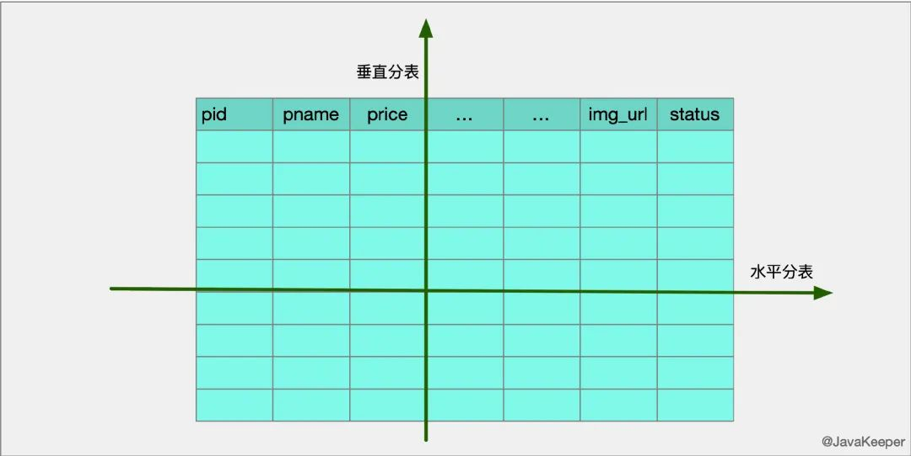

### 解决的问题 

- 单表并发提高
- 数据存储在不同文件，磁盘IO性能提高
- 读写锁影响的数据减少
- 插入数据库需要建立索引的数据减少

### 带来的问题 

- 实现方式复杂，需要配合业务实现

## 分区和分表的联系

- 目的相同：分区和分表的目的都是减少数据库的负担，提高表的增删改查效率
- 实现区别：分区只是一张表中的数据的存储位置发生改变，分表是将一张表分成多张表
- 如何使用 

- 访问大，数据大——配合使用
- 访问不大，数据大——分区

## 分库

### 适用场景 

- 单台DB空间不足
- 查询量增加，单台数据库服务器无法支撑

### 解决问题 

- 为突破单节点数据库服务器的 I/O 能力限制，解决数据库扩展性问题

### 带来问题 

- 事务的支持，分库分表，就变成了分布式事务
- join时跨库，跨表的问题
- 分库分表，读写分离使用了分布式，分布式为了保证强一致性，必然带来延迟，导致性能降低，系统的复杂度变高

### 解决方案 

- 选用第三方的数据库中间件提高效率，同时业务系统需要配合数据存储的升级

### 数据库的三个范式（不考）

- 第一范式（1NF）：数据库表中的字段都是单一属性的，不可再分。这个单一属性由基本类型构成，包括整型、实数、字符型、逻辑型、日期型等。
- 第二范式（2NF）：数据库表中不存在非关键字段对任一候选关键字段的部分函数依赖（部分函数依赖指的是存在组合关键字中的某些字段决定非关键字段的情况），也即所有非关键字段都完全依赖于任意一组候选关键字。
- 第三范式（3NF）：在第二范式的基础上，数据表中如果不存在非关键字段对任一候选关键字段的传递函数依赖则符合第三范式。所谓传递函数依赖，指的是如果存在"A → B → C"的决定关系，则C传递函数依赖于A。因此，满足第三范式的数据库表应该不存在如下依赖关系：关键字段 → 非关键字段 x → 非关键字段y

## SQL解释器

- 成本优化器、规则优化器
- 优化的基本逻辑
- 考一个基于成本优化器的计算方式

### SQL解释过程

1.  **语法分析**
   分析语句的语法是否符合规范；衡量语句中各个表达式的意义； 
2.  **语义分析**
   检查语句中设计的所有数据库对象是否存在，且用户有相应的权限； 
3.  **执行解析**
   优化器对每一个表达式的等价变化生成解析树，然后进行评估，由优化器选择一个最优的执行路径来生成执行计划。
   执行路径选择中会经历： 

1.  **视图转换**
   将涉及视图的查询语句转换为相应的对基表查询语句； 
2.  **表达式转换**
   将复杂的SQL表达式转换为较简单的等效连接表达式； 
3.  **选择优化器**
   不同的优化器一般会生成不同的“执行计划”； 
4.  **选择连接方式**
   对多表连接选择适当的连接方式； 
5.  **选择连接顺序**
   对多表连接，选择哪一对表先连接，选择这两表中哪个表作为源数据表； 
6.  **选择数据的搜索路径**
   根据以上条件选择合适的数据搜索路径，如果是选用全表搜索还是利用索引或者是其他的运行方式； 

1.  **运行“执行计划”** 


语法分析：分析语法是否符合规范，代价小；

语义分析：分析语句含义，检查用户对数据库是否有相应权限，代价小；

解析：分为硬解析和软解析。若在共享池中没找到已有的执行计划则硬解析，否则软解析。硬解析指使用优化器对SQL语句进行优化，将SQL转化为一些等价语句，并选择代价最小的语句生成执行计划。软解析指在共享池中已经存在对应的执行计划，则不再进行优化，直接使用该执行计划。硬解析的代价最大，软解析较小。

执行计划，返回执行结果。代价根据SQL语句不同可大可小。

### 成本优化器

https://juejin.cn/post/6990669704457093134

成本优化器考虑到io成本和cpu成本

成本常数：

- 1.0 读取一个页面花费的成本
- 0.2 读取并检测一条记录是否符合搜索条件

查找流程

1. 根据搜索条件，找出所有可能使用的索引
2. **计算****全表扫描****的代价**
3. **计算****使用不同索引执行查询的代价**

1. 对比各种执行方案的代价，找出成本最低的那一个

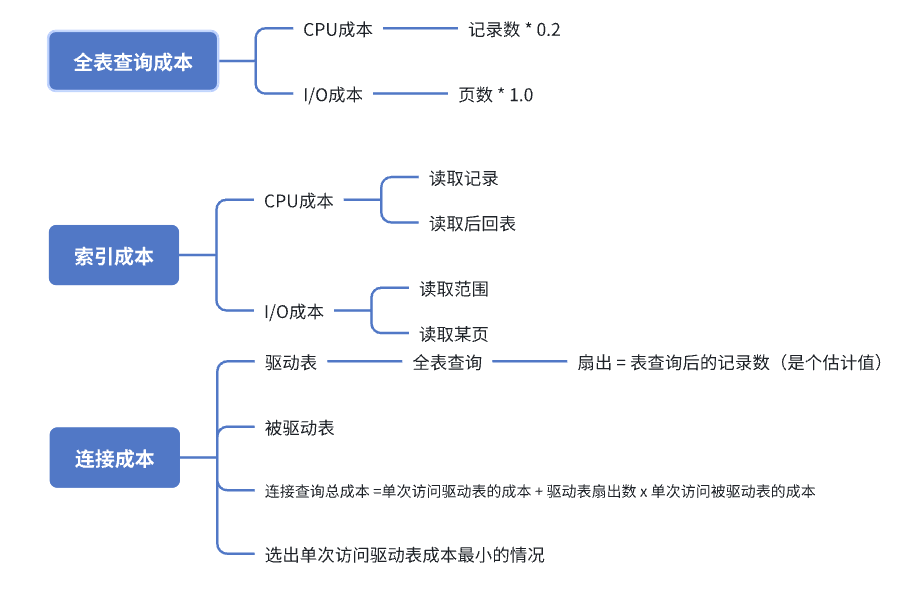


## 你对这门课有什么建议和想法

唉