[软件系统设计复习往年题 | wbl-z’s Blog](https://wbl-z.github.io/软件系统设计/软件系统设计复习往年题/#)

# 架构定义

## 什么是软件架构

- 所有架构都属于设计
- 结构、元素、关系、设计

### 定义

1. 软件架构是程序或计算系统的结构，由软件元素、这些元素外部可⻅的属性、这些元素的关系组成
2. 一个系统的基本组织形式，包含于它的组件、组件之间和软件与环境之间的关系、⽀配它的设计和演进的原则

所有架构都是软件设计，但不是所有设计都是架构

### 架构与设计

- 架构是设计过程的⼀个部分
- 是⾼层次的设计
- 是⼀系列的设计决定
- 因地制宜的
- 系统的结构/组织
- 元素：组件和连接件
- 关系：静态/动态关系
- 属性：元素、元素的组、总体的系统

### 架构与架构

- 系统分解为组件、模块、子系统

架构定义了

- 组件接口：组件能做什么
- 组件交互和依赖：组件怎么交互
- 组件责任：组件怎么按要求做

###  架构定义了交互

- 数据传输机制
- 控制流

### 体系结构强调非功能性需求

非功能性需求 NFRs include

- 技术约束 Technical constraints
- 商业约束 Business constraints
- 质量属性 Quality attrilbutes

### 体系结构视图

体系结构视图主要是为了应对软件不可见的问题，屏蔽其他没有影响的部分，将关注点进行分离

软件体系结构代表了一个复杂的设计制品 

### 如何开发设计

1. 分解 Decomposition
2. 抽象 Abstraction
3. 逐步的：分而治之 Stepwise: Divide and Conquer
4. 生成和测试 Generate and Test
5. 迭代：渐进式细化 Iteration: Incremental Refinement
6. 重用元素 Reusable elements

## 架构做什么

- 联络

- 在客户、技术团队和业务需求分析师之间
- 与主管或销售

- 软件工程

- 软件工程最佳实践

- 技术知识

- 技术领域的深⼊理解

- ⻛险管控

- 与设计、技术选择相关联的⻛险

## 哪来的

- ASRs
- stakeholders开发维护，考虑他们的利益

## 架构（4+1）视图

https://juejin.cn/post/7271283075171205156

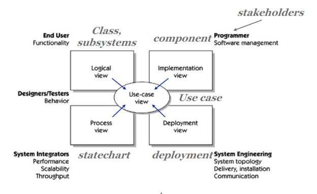

- 逻辑、过程、物理、开发视图
- 逻辑：

- 元素间的逻辑关系、静态的，除非架构变化，否则不变
- 描述了体系结构中在体系结构上明显重要的元素以及他们之间的关系

- 过程：

- 动态
- 描述了体系结构中的并发和交流元素 Process view: describes the concurrency and communications elements of an architecture.

- 物理：

- 与现实世界的物理元素的对应关系
- 描述了主要过程和部件是如何映射到应用硬件上的 Physical view: depicts how the major processes and components are mapped on to the applications hardware.

- 开发：

- 描述了体系结构的需求，关系到了超过一个常规的视图。是四个视图在某一个场景下进行描述Architecture use cases: capture the requirements for the architecture; related to more than one particular view

- 用例场景（Use Case）：捕获架构需求，与一个或多个特定视图相关。

[【UML】软件工程中常用图：类图、部署图、时序图、状态图_软件工程 uml-CSDN博客](https://blog.csdn.net/Joker_ZJN/article/details/132461717)

- 逻辑视景（Logical view）：逻辑视景和提供给最终用户的机能有关。会用[统一建模语言](https://zh.wikipedia.org/wiki/统一建模语言)（UML）来表现逻辑视景，包括有[类别图](https://zh.wikipedia.org/wiki/類別圖)、[状态图](https://zh.wikipedia.org/wiki/状态图)等[[2\]](https://zh.wikipedia.org/wiki/4%2B1視景模型#cite_note-Kontio05-2)。
- 过程视景（Process view）：过程视景处理系统的动态层面，说明系统的过程以及通信的方式，着重在系统运行时的时间特性。过程视景描述并发性、分散、集成者、性能以及[可扩缩性](https://zh.wikipedia.org/wiki/可擴縮性)（scalability）等。表示过程视景的UML有[时序图](https://zh.wikipedia.org/wiki/时序图)、[通信图](https://zh.wikipedia.org/w/index.php?title=通信图&action=edit&redlink=1)、[活动图](https://zh.wikipedia.org/wiki/活动图)[[3\]](https://zh.wikipedia.org/wiki/4%2B1視景模型#cite_note-3)[[2\]](https://zh.wikipedia.org/wiki/4%2B1視景模型#cite_note-Kontio05-2)。
- 开发视景（Development view）：开发视景描述从程序员的观点所看到的系统，着重软件的管理。此视景也称为实现视景（implementation view），会用到UML中的[组件图](https://zh.wikipedia.org/wiki/组件图)来说明系统组件。[包图](https://zh.wikipedia.org/w/index.php?title=包图&action=edit&redlink=1)也可以用来说明开发视景[[2\]](https://zh.wikipedia.org/wiki/4%2B1視景模型#cite_note-Kontio05-2)
- 实体视景（Physical view）：实体视景以系统工程师的观点来说明系统，这和软件组件在物理层上的拓扑有关，也和各组件之间的实体连接有关。此视景也称为是布署视景（deployment view）UML图中的[部署图](https://zh.wikipedia.org/w/index.php?title=部署图&action=edit&redlink=1)可以说明实体视景[[2\]](https://zh.wikipedia.org/wiki/4%2B1視景模型#cite_note-Kontio05-2)。
- 情景（scenarios）：这种说明架构的方式是透过小型的[用例](https://zh.wikipedia.org/wiki/用例)或情景来进行，这是第五个观点。情景会叙述各对象、各过程之间交互的结果。也可以用来识别架构元素，也可叙述并且确认架构设计。这也是架构原形测试的起点。此视景也称为是用例视景（use case view）。

## 架构活动

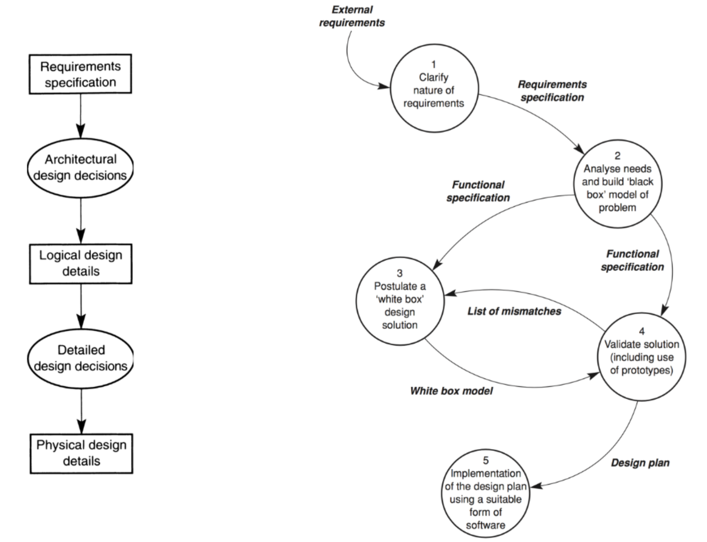

- 架构实践、确认、维护、演化

## 架构设计的活动

- 识别ASRs，指导架构设计的依据
- 考虑已有的框架、风格、模式、tactic
- 形成文档
- 架构的分析和评估 stakeholder参与，是否满足ASR要求

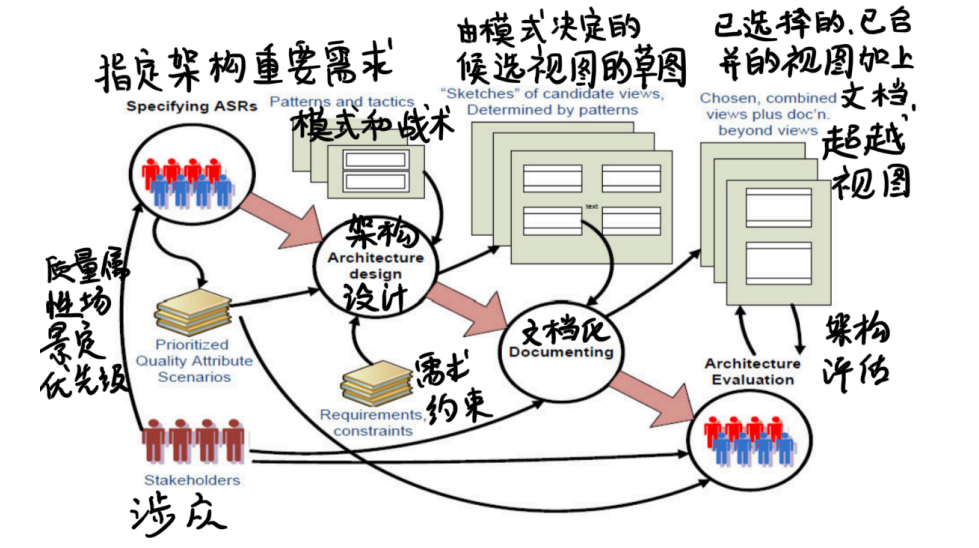

1. 通过 StakeHolders 获取到 ASRs（架构攸关的需求）
2. 通过分析得到 Prioritized Quality Attribute Scenarios（高优先级质量属性解决方案）和 Requirements，Constraints（需求和约束）
3. 将上述部分，结合模式和策略，综合可以得到架构的设计
4. 根据架构的设计得到由模式决定的候选视图的示意图，之后完成文档化
5. 选择、组合视图，将文档进行进一步的评估，这一部分需要 StakeHolders 的参与、也需要 Prioritized Quality Attribute Scenarios 和文档等作为参考。

# 质量属性

- 功能	需求：说明系统的行为
- 质量需求：系统完成工作的好坏程度 NFRs
- constraints：约束，设计时预设好的，满足现有系统架构或者法律法规要求
- 质量属性：对质量属性的高度抽象聚合

- 内部：系统作为白盒，开发人员知道系统是如何实现的，系统之内出发，可修改性、可测试性、可靠性
- 外部：系统之外的，外部用户看系统是个黑盒，与系统交互能够体验到的，可用性、易用性、安全性

- 刺激-响应，基于情境来建模

- 谁发出
- 刺激是什么
- 作用在那一部分
- 发生刺激是在什么环境中
- 产生什么样的响应
- 度量

- 什么策略来解决问题，在每一个策略下有很多tactics
- checklist是在架构设计时需要覆盖的七个方面，结合质量属性
- 如何从用户获取ASR，哪些需求是架构时要考虑的
- 需求中获取ASR最简单，但是信息缺少
- workshop（interviews）、最终商业目标（作为最终裁决标准）、使用项目树组织排序（utility tree）

## 需求

### 功能性需求

- 系统必须要做的、系统如何为涉众提供价值，意为系统的⾏为
- 功能的实现可能⽤了很多的结构，但功能是与结构⽆关的

### 质量需求

- 是整个系统的期望特征，是在功能需求之上的
- 如果质量属性很重要，软件架构将约束功能的分配到不同的结构

### 约束

- 是 0 自由度的设计决定
- 是预定义的设计决定
- 接受设计决定、协调其他受影响的设计决定，如此来满足约束

### 非功能需求 NFRs

非功能需求是质量需求

质量需求包括质量属性 约束

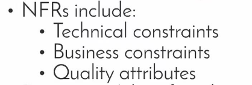

1. 在执行过程中可观察（外部）：系统满足其行为要求的程度如何？例如性能，安全性，可用性，易用性等。Observable (External) during execution: How well a system satisfies its behavioural requirements? e.g., performance, security, availability, usability etc.
2. 执行期间不可观察（内部）：系统的维护，集成或测试有多容易？ 例如，可修改性，可移植性，可重用性，可测试性等。Not observable (Internal) during execution: How easily a system can be maintained, integrated, or tested? e.g., modifiability, portability, reusability, testability etc.

- ⾮功能需求和架构需求是质量属性的两个相互替代的形式
- 不太可能先把功能做好再考虑⾮功能需求
- ⾮功能需求必须在设计的时候就考虑

### 质量属性

- 替代用语：非功能要求或体系结构要求
- 质量不能在开发结束后才被加到系统上
- 需要在开发的所有阶段考虑质量
- 业务⽬标决定了系统需要有的质量
- 质量属性高于系统功能，是系统功能、服务和行为的基本陈述 Quality attributes are over and above of system's functionality, which is the basic statement of the system's capabilities, services, and behaviours.
- 功能通常是开发计划的第⼀步，但是系统常因缺乏预期的质量水平而被重新设计
- 软件体系结构限制了各种质量属性的实现，例如性能，安全性，可用性等 Software architecture constrains the achievement of various quality attributes, e.g., performance, security, usability etc.
- 这就是为什么软件架构被认为是落实质量要求的最恰当的层次
- 没有质量属性完全依赖于设计，也没有完全依赖于实现或者部署

##  质量属性场景建模  

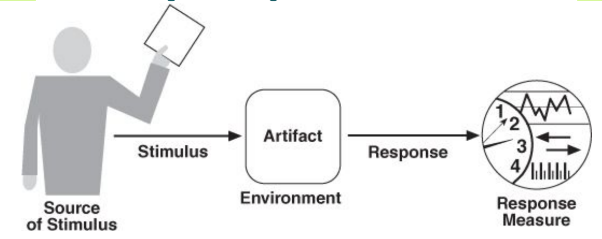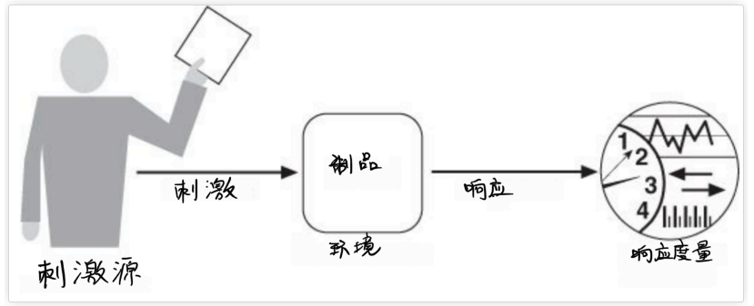

- 刺激：到达系统时需要考虑的条件 Stimulus: A condition that needs to be considered when it arrives at a system.
- 刺激源：产生刺激的实体（人，系统或任何促动器） Source of Stimulus: An entity (human, system, or any actuator) that generates the stimulus.可能是输入、消息等等，对当前的状态有一个变化。
- 响应：刺激措施到来之后开展的活动 Response: The activity undertaken after the arrival of the stimulus.
- 响应度量：对刺激的响应应以某种方式进行测量，以便可以测试需求。Response Measure: The response to the stimulus should be measurable in some fashion so that the requirement can be testable.多长时间系统有反馈
- 环境：发生刺激时系统的状况，例如过载，运行等 Environment: A system's condition when a stimulus occurs, e.g. overloaded, running etc.
- 制品：需求适用的整个系统或系统的一部分。Artifact: The whole system or the portion of the system to which the requirement applies.可能是一个软件制品

只要定义好这 6 个元素，就能锁定架构的一个场景，之后可以用来进行架构的设计。

刺激和响应发生在一个环境中：系统正常运行、系统过载、系统受到攻击、系统网络等出现了故障。

### 战术（tactic）

（原子级别的最小的决定）

- 战术是影响质量属性响应控制的设计决策，例如冗余。A tactic is a design decision, .e.g. redundancy, that influences the control of a quality attribute response.
- 战术的集合称为体系结构策略。A collection of tactics is called an architectural strategy.
- 系统设计包括一组设计决策，其中一些决策可帮助控制质量属性响应；其他确保系统功能的实现 A system design consists of a collection of design decisions: some of these decisions help control the quality attribute response; others ensure achievement of system functionality.
- 像模式一样，策略也可以由其他策略组成，例如，冗余可以由数据的冗余，计算的冗余组成。设计人员根据需求选择一个或另一个 Like patterns, tactics may also be composed of other tactics, e.g., redundancy may be composed of redundancy of data, redundancy of computation——Designer chooses one or other depending upon requirements.

### 质量设计决策

架构是设计决策的集合。Architecture is a collection of design decisions.

七类设计决策（可能重叠） Seven categories of design decisions (may overlap):

1. 职责分配 Allocation of responsibilities：将大的职责进行分配
2. 协调模型 Coordination model：各部分之间的沟通、交互
3. 数据模型 Data model：数据格式、存储方式（缓存等）
4. 资源管理 Management of resources：CPU、网络、内存、时间（部分时间敏感的场景）等资源
5. 架构元素之间的映射 Mapping among architecture elements：将架构元素如何映射到软件的实现上
6. 绑定时间决策 Binding time decisions：

1. 系统的变化可以在什么时间点前需要固定下来，也就是这个时间前，系统还是可以变化的，但是这个时间之后就不可以变化了
2. 比如选择安装环境是需要在一个时间点前完成的，技术是否添加、编译时间、初始化时间，运行时绑定，但运行时是弹性最大的
3. 实际上我们希望绑定时间越往后越好，但是也就要付出相应的代价。

1. 技术选择 Choice of technology：前面的部分都确定后，我们可以选择技术栈相对比较局限，解空间已经被压缩了。

### 质量属性举例

- Adaptability 适应性
- Extensibility 可扩展性
- Availability 可⽤性
- Modularity 模块化性
- Configurability 可配置性
- Portability 便携性
- Flexibility 灵活性
- Reusability 可重⽤性
- Interoperability 互操作性
- Testability 可测试性
- Performance 性能
- Auditability 可审计性
- Reliability 可靠性
- Maintainability 可维护性
- Responsiveness 响应性
- Manageability 可管理性
- Recoverability 可恢复性
- Sustainabilit 持续性
- Scalability 可伸缩性
- Supportability 保障性
- Stability 稳定性
- Usability 易⽤性
- Security 安全性

## 可用性 Availability

1. 可用性是应用程序的**关键**要求 Key requirement for most IT applications
2. 度量方式：以所需的可用时间比例来衡量，例如 Measured by the proportion of the required time it is useable, e.g.

1. **营业时间内100％可用** 100% available during business hours
2. **每周计划的停机时间不超过2个小时-24x7x52(100％可用性)**No more than 2 hours scheduled downtime per week - 24x7x52 (100% availability)

1. 相关性：与应用程序的可靠性有关 Related to an application’s reliability

1. 不可靠的应用程序的可用性较差 Unreliable applications suffer poor availability
2. **可用性、可靠性不同**：

1. 可用性是指可以使用，但是不保证正确
2. 可靠性是指可以稳定正确的使用。

1. 可用性损失的时间由以下因素决定：Period of loss of availability determined by:

1. **发现**故障的时间 Time to detect failure
2. **纠正**故障的时间 Time to correct failure
3. **重启**应用的时间 Time to restart application
4. 例子(时间序)：发生故障-检测到故障-纠正故障-重启应用，这三个代表的是not available的时间(N/A)
5. 提高可用性的方案

1. 尽可能降低N/A的时间

1. 机器尽可能缩短failure到detect时间
2. 机器尽可能缩短correct到restart的时间

1. 尽可能提高Available的时间

1. 高可用性策略 Strategies for high availability

1. 消除**单点故障** Eliminate single points of failure
2. **复制**和**故障转移** Replication and failover
3. 自动**检测**并**重启** Automatic detection and restart

1. 可恢复性(例如数据库)Recoverability (e.g… a database)

1. 在应用程序或系统出现故障后，可以重新建立**性能级别**并**恢复**受影响的数据的功能。The capability to re-establish performance levels and recover affected data after an application or system failure.

1. 可将可用性计算为在指定的时间间隔内它将在要求的范围内提供指定服务的概率。Availability can be calculated as the probability that it will provide the specified services within required bounds over a specitied time interval.

1. **MTBF**(平均无故障时间)MTBF (mean time between failures)
2. **MTTR**(平均维修时间)MTTR (mean time to repair)

1. 计算可用性时，可能不考虑**计划内的停机时间**。Scheduled downtimes may not be considered when calculating availability

### Outage, Failure, Fault, Error

1. 可用性是指通过**减少**故障来最大程度地减少服务**中断**时间。Availablity is about minimizing the service outage time by mitigating faults.
2. **Failure的原因**称为**Fault**。A failure’s cause is called a fault.
3. 当系统无法交付该系统期望的服务时，将发生Failure。A failure occurs when a system cannot deliver a service that is expected of that system.
4. Failure是系统状态的**可观察**特征。A failure is an observable characteristics of a system’s state.
5. 系统任何部分中的Fault都有可能导致Failure。系统可以从Failure中修复或恢复。A fault in any part of a system has a potential to cause a tailure; a system can be repaired or recovered from a failure.
6. Fault发生与Failure之间的**中间状态**称为Error。Intermediate states between the occurrence of a fault and a ftailure are called errors.
7. 名词辨别

1. Outage是系统不可用的情况，scheduled downTime就是一种Outage。
2. Failure：系统不可用失效
3. Fault：是系统导致Failure的原因，Fault不会立即导致Failure
4. Error：在Fault发生与Failure的中间状态。

### 服务水平协议 Service-Level Agreement

[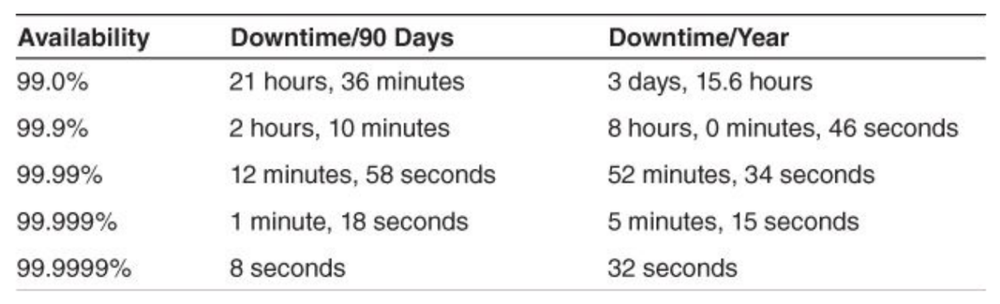](https://spricoder.oss-cn-shanghai.aliyuncs.com/2021-Software-System-Design/img/lec13/8.png)

1. Amazon EC2的SLA Amazon EC2’s SLA
2. AWS将通过商业上合理的努力来使Amazon EC2在服务年度内的年度正常运行率至少达到99.95％。如果Amazon EC2不符合年度正常运行时间百分比承诺，您将有资格获得服务信用。AWS will use commercially reasonable efforts to make Amazon EC2 available with an Annual Uptime Percentage of at least 99.95% during the Service Year. In the event Amazon EC2 does not meet the Annual Uptime Percentage commitment, you will be eligible to receive a Service Credit.
3. 99.95%的是99.9%的一半

### 对于Failure的计划 Planning for Failure

1. 危害分析 Hazard analysis: 对Failure进行分类

1. 灾难性的/危险 Catastrophic/ Hazardous
2. 重大的/轻微的 Major/ Minor
3. 没有效果 No effect

1. 故障树分析：Fault tree analysis:

[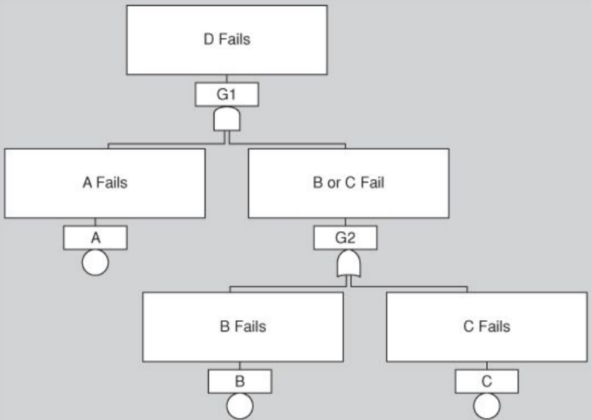](https://spricoder.oss-cn-shanghai.aliyuncs.com/2021-Software-System-Design/img/lec13/9.png)

- 分级处理Failure

1. 故障模式，影响和严重性分析(Failure Mode, Effects, and Criticality Analysis：FMECA) Failure Mode, Effects, and Criticality Analysis (FMECA)

1. FMECA依靠过去类似系统的故障历史。FMECA relies on the history of failure of similar systems in the past.
2. 5∗10−5=1∗10−3∗5%5∗10−5=1∗10−3∗5%5∗10−5=1∗10−3∗5%

[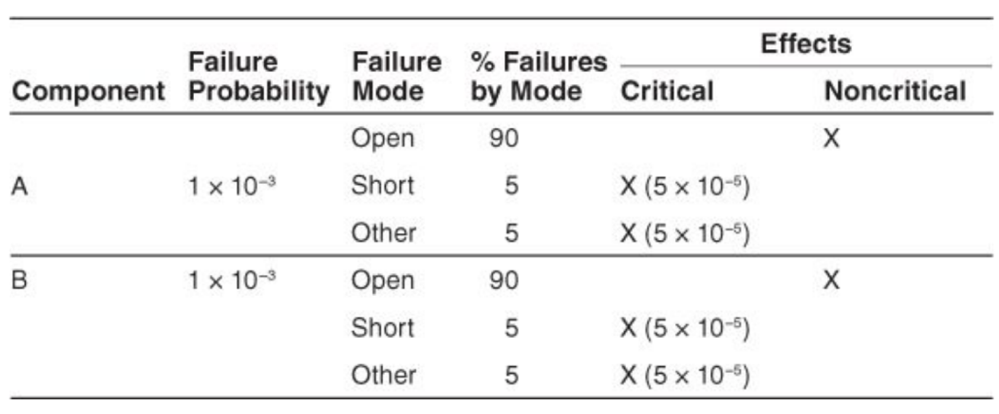](https://spricoder.oss-cn-shanghai.aliyuncs.com/2021-Software-System-Design/img/lec13/10.png)

### 可用性通用方案 Availability General Scenario

[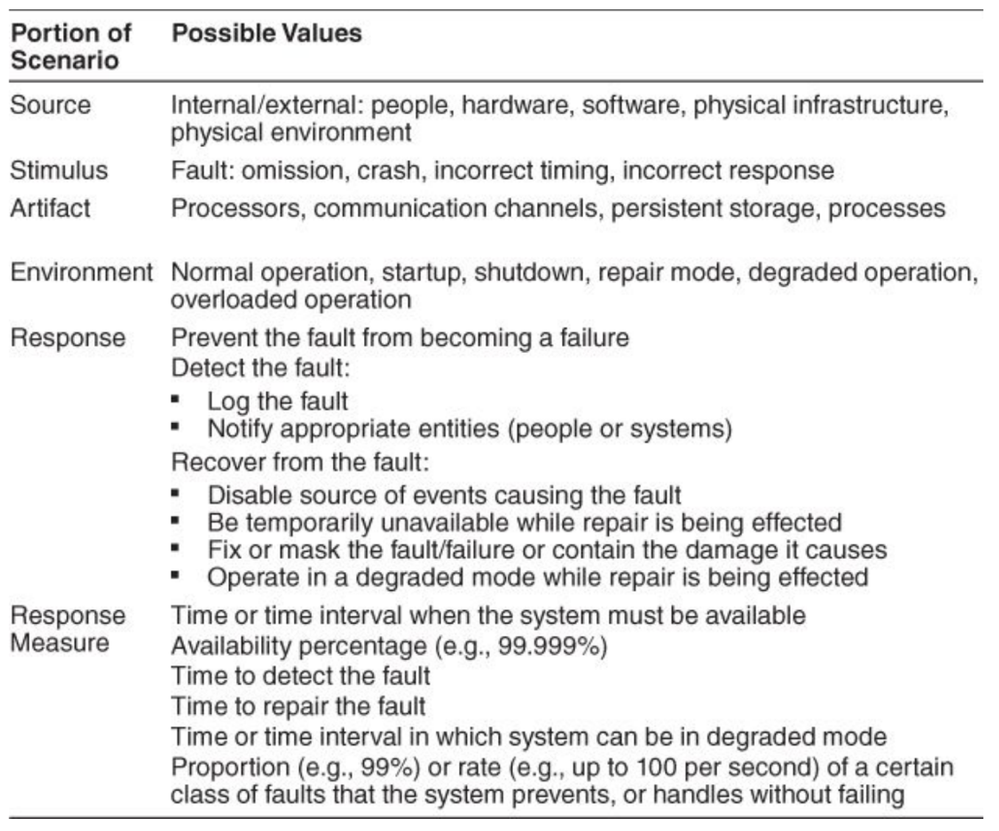](https://spricoder.oss-cn-shanghai.aliyuncs.com/2021-Software-System-Design/img/lec13/11.png)

1. **source：可能是内部的，也可能是外部的，可能是人、设施、硬件等等，无论是哪一类都会引起可用性的问题，都能发出一个刺激**
2. **Stiumulus：Failure，不正确的时间、不正确回复(超过边界)**
3. **工件：在进程中、交流通道中等等**
4. **环境：各种不同的系统环境，正常的错误的等等**
5. **反应：错误发生后一些的可能反应，recover是correct的时间**

防止错误变成失败

1. 检测故障：

1. 记录故障
2. 通知有关实体(人员或系统)

1. 从错误中恢复：

1. 禁用导致故障的事件源
2. 在进行修理时暂时不可用
3. 修复或掩盖错误/故障或包含它所造成的损害
4. 在进行修复时，以降级模式操作。

1. **反应度量：时间上、可用性的描述(多长时间，可以用多少)**

1. 系统必须可用的时间或时间间隔可用性百分比(例如，99.999%)

1. 检测故障的时间
2. 修复故障的时间
3. 系统处于退化模式的时间或时间间隔
4. 某一特定值的比例(例如99%)或比率(例如，每秒100%)
5. 系统防止或处理的错误的类别，而不会失败。

### 可用性具体方案 Availability Sample Scenario

[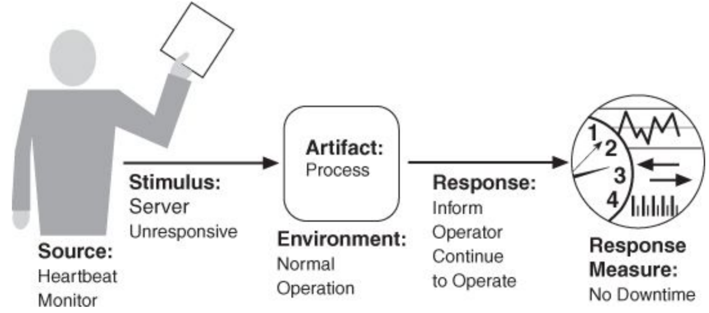](https://spricoder.oss-cn-shanghai.aliyuncs.com/2021-Software-System-Design/img/lec13/12.png)

1. Source没有收到Heartbeat认为出现了一个Failure
2. 将Stimulus发送给正在处理的进程
3. 进程会通知Operation(人和服务器，来检查是否可以运行)
4. 最后会发送一个回复
5. 整体发生在一个正常运转的环境中

### 可用性策略 Availability Tactics

[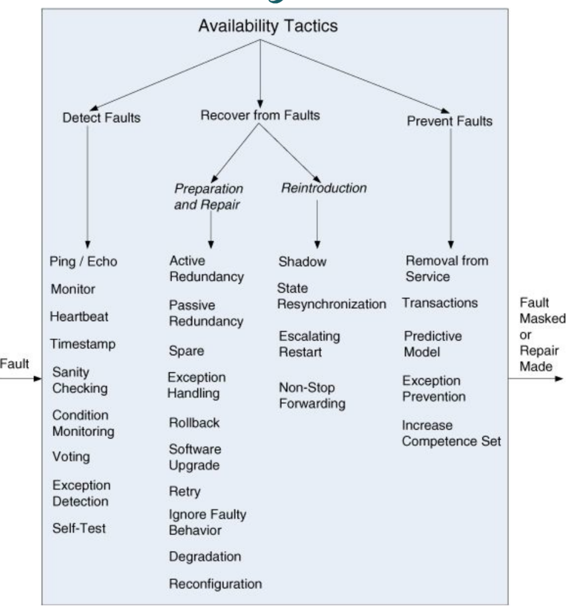](https://spricoder.oss-cn-shanghai.aliyuncs.com/2021-Software-System-Design/img/lec13/13.png)

1. 这个树说明了对于可用性可以采用哪些手段来解决可用性：很重要
2. 每一个树的分支代表了我们考虑的时间点：尽可能的延长可用时间
3. 不同的检测服务可用的手段

1. 主动发送心跳：Heart Beat

1. **资源的损耗有一次通讯**
2. 可以同时承担更多的业务(定期更新状态)
3. **自动化检测，更为定时的服务**
4. 单向更为**安全**

1. 被动接受检测：Ping/Echo 或 Minotor

1. **资源损耗有两次通讯**
2. 更加**灵活自助**，根据自己的情况进行检测
3. **双向确认**

1. TimeStamp

1. 收到一系列的消息应该在时间上有先后顺序
2. 进行常识的信息的检查，如果**和常识不符合那么可能是出现了问题**

1. 自检：检查一下自己是否有问题

### Fault

#### Fault 探测 Fault Detection

1. Ping/Echo

1. 一个组件发出ping命令，并期望在预定时间内在另一个组件上产生回波。One component issues a ping and expects, an echo from another component within a pre-detined time.
2. Ping/Echo可以在负责一项任务的一组组件中使用。Ping/Echo can be used within a group of components responsible for one task.

1. 心跳(死人时间) Heartbeat(dead man time)

1. 一个组件定期发出心跳消息(也可以携带数据)，而另一个组件侦听该消息。One component emits a heartbeat message (can also carry data) periodically and another component listens for it.
2. 如果心跳失败，则假定始发组件已失败，并通知故障纠正组件。If the heartbeat fails, the originating component is assumed to have failed and a fault correction component is notified.

1. 异常 Exception

1. 识别故障的一种方法是遇到异常。One method for recognising faults is to encounter an exception.
2. 异常处理程序通常在引入异常的同一过程中执行。The exception handler typically executes in the same process that introduces the exception.

1. ping和心跳策略在不同的进程中运行，异常策略在单个进程中运行。The ping and heartbeat tactics operate among distinct processes, and the exception tactic operates within a single process.

#### Fault 恢复 Fault Recovery

1. 表决 Voting

1. 在冗余处理器上运行的进程每个都接受等效输入并计算一个简单值，该值将发送给投票者。Processes running on redundant processors each take equivalent input and compute a simple value that is sent to a voter.
2. 如果投票者从单个过程中检测到异常行为，则它会使失败。If the voter detects deviant behaviour from a single process, it fails it.

1. 主动冗余 Active redundancy

1. 所有冗余组件均以并行方式响应事件-所有组件均处于相同状态。All redundant components respond to events in parallel - there are all in the same state.
2. 仅使用了一个组件的响应，其余组件则被丢弃。The response from only one component is used, and the rest are discarded.
3. 发生故障时，通常不存在停机时间，因为备份是最新的，唯一的切换时间是恢复时间。When a failure occurs, the downtime is usually non-existent as backup is current and the only switching time is the recovery time.

1. 被动冗余 Passive redundancy

1. 一个组件(主要)响应事件，并通知其他组件(辅助)它们必须进行的状态更新。One component (primary) responds to events and informs the other components (secondary) of state updates they must make.
2. 发生故障时，系统必须首先确保备份状态足够新，然后才能恢复服务。When a failure occurs, the system must first ensure that the backup state is sufficiently recent before resuming services.

1. 备件 Spare

1. 备用备用计算平台配置为替换许多不同的故障组件。A standby spare computing platform is configured to replace many different failed components.

1. 影子操作 Shadow operation

1. 先前发生故障的组件可能会在“影子模式”下运行一小段时间，以确保它可以模仿工作组件的行为，然后再将其恢复正常工作。A previously failed component may be run in “shadow mode” for a short time to make sure that it mimics the behaviour of the working components before restoring it to service.

1. 状态重新同步 State re-synchronisation

1. 被动和主动冗余策略要求要恢复的组件在恢复服务之前对其状态进行升级。The passive and active redundancy tactics require the component being restored to have its state upgraded before its return to service.

1. 检查点/回滚 Checkpoint/ Rollback

1. 检查点记录的是定期或响应特定事件创建的一致状态。A checkpoint is recording of a consistent state created either periodically or in response to specific events.

1. 从服务中删除 Removal from service

1. 该策略将系统的某个组件从运行中移除，以进行一些活动以防止预期的故障。This tactic removes a component of the system from operation to undergo some activities to prevent anticipated failure.

1. 交易 Transaction

1. 事务是几个连续步骤的捆绑，这样就可以一次撤消整个捆绑。A transaction is the bundling of several sequential steps such that the entire bundle can be undone at once.

1. 过程监控器 Process monitor

1. 一旦检测到流程中的故障，监视流程就可以检测到不良流程并为其创建新实例，并按照备用策略将其初始化为适当的状态。Once a fault in a process has been detected, a monitoring process can detect the non- pertorming process and create a new instance ot it, initialised to some appropriate state as in the spare tactic.

### 可用性设计和分析的检查列表 

| [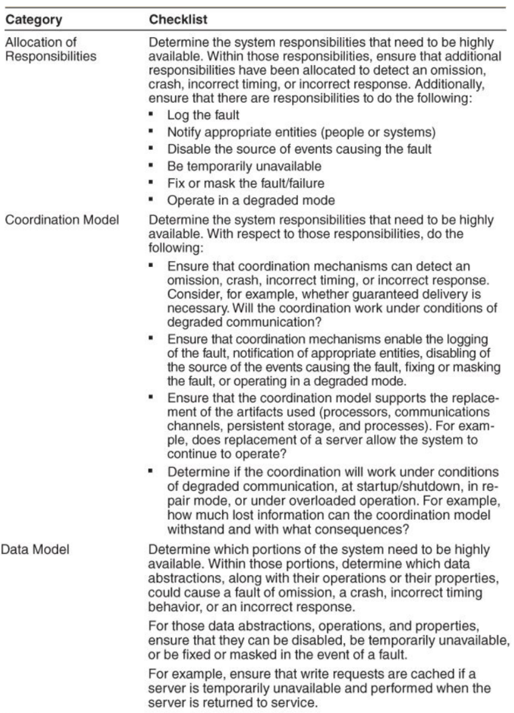](https://spricoder.oss-cn-shanghai.aliyuncs.com/2021-Software-System-Design/img/lec13/14.png) | [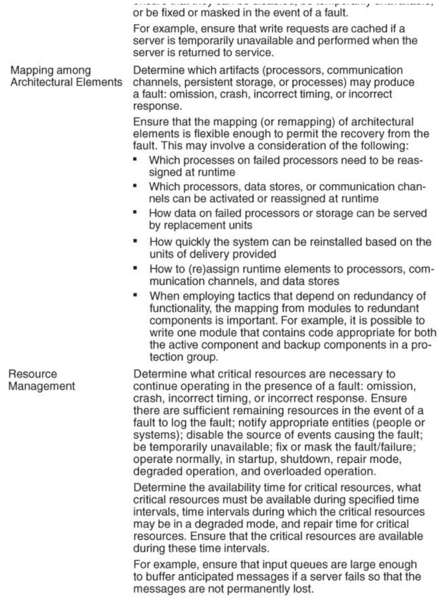](https://spricoder.oss-cn-shanghai.aliyuncs.com/2021-Software-System-Design/img/lec13/15.png) |
| ------------------------------------------------------------ | ------------------------------------------------------------ |
|                                                              |                                                              |

[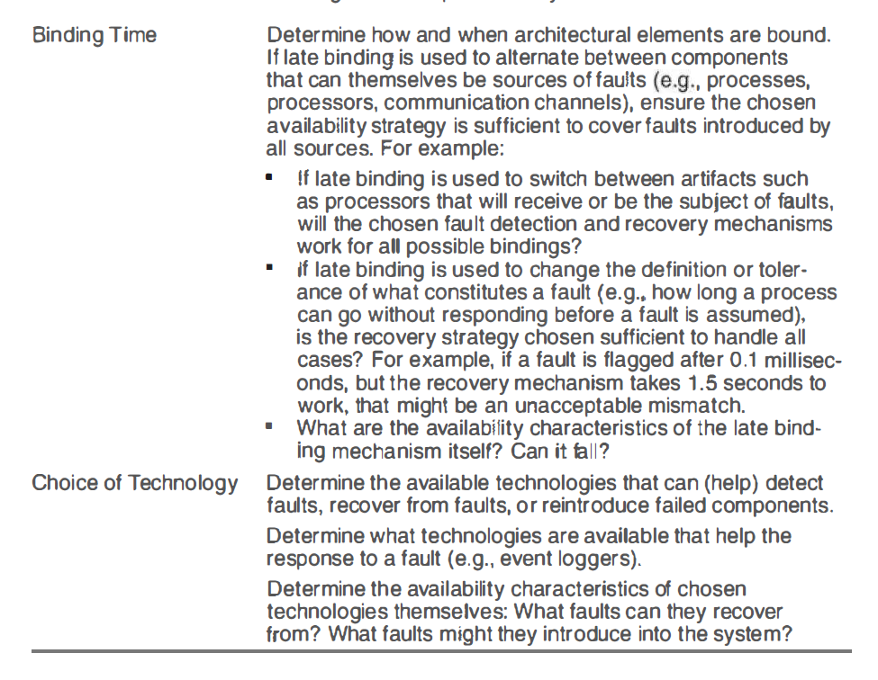](https://spricoder.oss-cn-shanghai.aliyuncs.com/2021-Software-System-Design/img/lec13/60.png)

## 互操作性 Interoperability

1. 互操作性是指两个或多个系统可以在特定上下文中通过接口完全改变有意义的信息的程度 Interoperability is about the degree to which two or more systems can usefully exchange meaningful information via interfaces in a particular context.

1. **交换**数据的能力(**语法**互操作性)Ability to exchange data (syntactic interoperability)
2. 能够正确**解释**数据(**语义**互操作性)Ability to correctly interpret the data (semantic interoperability)

1. 互操作性需要确定与**谁，什么以及在什么情况**下(上下文)。Interoperability needs to identify with whom, with what, and under what circumstances (the context).
2. 互动 Interface

1. 夏琳说金告诉她特雷弗听说希瑟想参加你的聚会。Charlene said that Kim told her that Trevor heard that Heather wants to come to your party.

1. 互操作性的两个重要方面：Two important aspects of interoperability:

1. **发现**：服务的使用者必须发现服务的**位置，身份和接口**。Discovery: the consumer of a service must discover the location, identity, and the interface of the service.
2. 处理回应

：Handling of the response:

1. 向请求者**报告**并做出**响应**。reports back to the requester with response.
2. 将其响应**发送**到另一个系统。sends its response on to another system.
3. 向任何感兴趣的各方**广播**其回复。broadcasts its response to any interested parties.

### 互操作性的通用方案 Interoperability General Scenario

[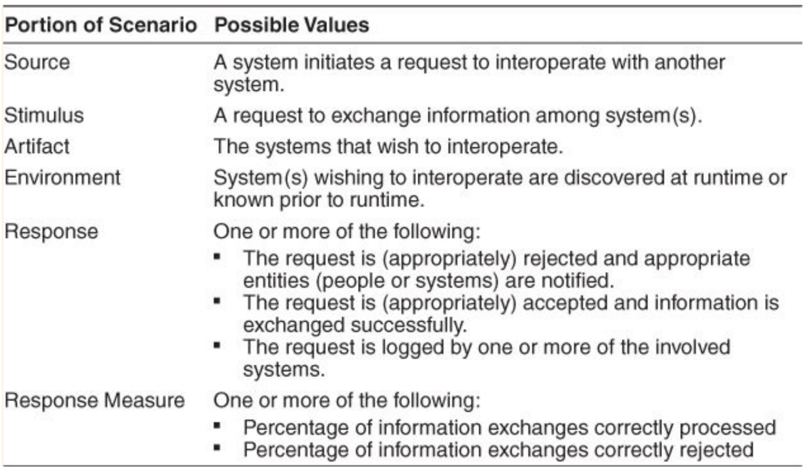](https://spricoder.oss-cn-shanghai.aliyuncs.com/2021-Software-System-Design/img/lec13/16.png)

| **情景部分** | **可能值**                                                   |
| ------------ | ------------------------------------------------------------ |
| 来源         | 系统启动与另一个系统进行互操作的请求。                       |
| 刺激         | 系统间交换信息的请求                                         |
| 工件         | 希望互操作的系统                                             |
| 环境         | 系统(S)希望在运行时互操作，或者在运行时之前已知              |
| 反应         | 该请求(适当地)被适当拒绝和通知实体(人员或系统)。该请求(适当地)被接受，并且信息成功地交换了。请求由一个或多个所涉人员或者系统记录。 |
| 反应测量     | 正确处理信息交流的百分比正确拒绝信息交换的百分比             |

### 互操作性的样本方案 Interoperability Sample Scenario

[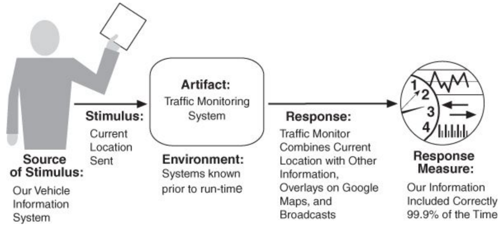](https://spricoder.oss-cn-shanghai.aliyuncs.com/2021-Software-System-Design/img/lec13/17.png)

### . 互操作性的策略 Interoperability Tactics

[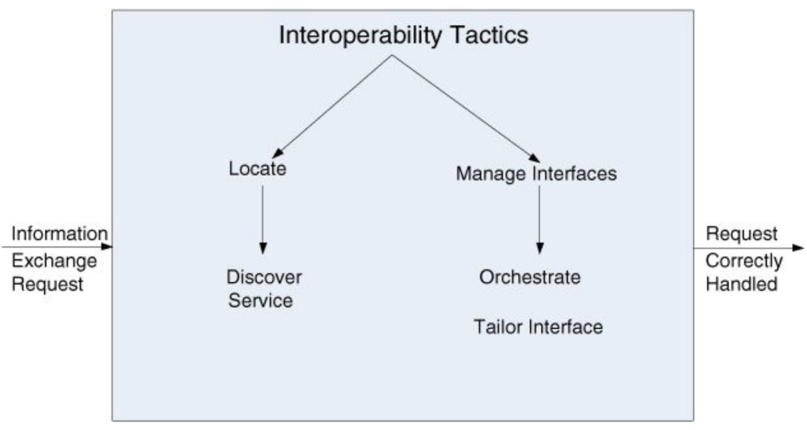](https://spricoder.oss-cn-shanghai.aliyuncs.com/2021-Software-System-Design/img/lec13/18.png)

1. 定位 Locate

1. 发现

服务：通过搜索已知目录服务来找到服务Discovery service: locate a service through searching a known directory service.

1. 多级间接 multiple levels of indirection

1. 管理界面 Manage interfaces

1. **编排**：使用控制机制来协调，管理和排序特定服务的调用。Orchestrate: uses a control mechanism to coordinate and manage and sequence the invocation of particular services.
2. **定制界面**：添加或删除界面功能 Tailor interface: adds or removes capabilities to an interface.

1. Orchestrate：请求，一个请求会涉及到多个Service，我们需要按照一定顺序进行处理请求

### 互操作性的检查列表 Checklist for Interoperability Design & Analysis

| [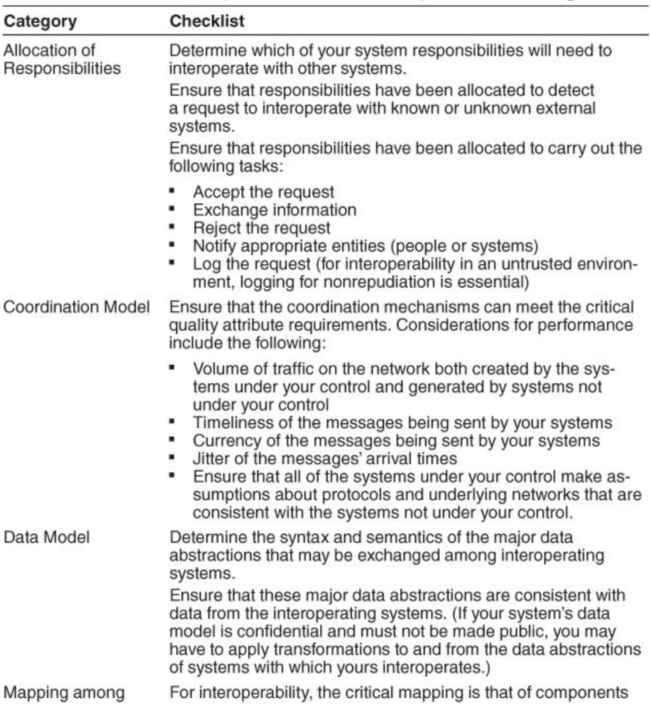](https://spricoder.oss-cn-shanghai.aliyuncs.com/2021-Software-System-Design/img/lec13/19.png) | [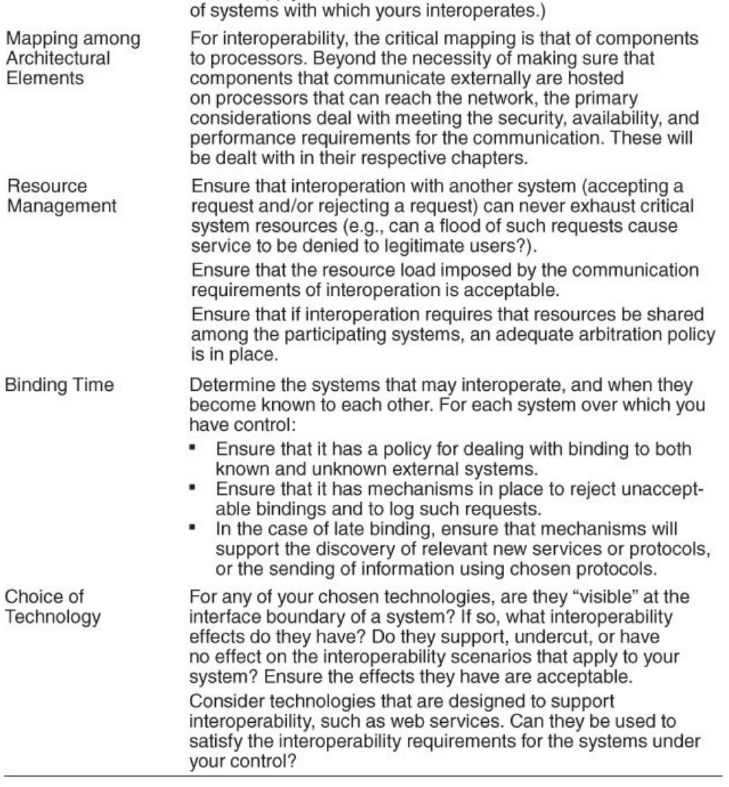](https://spricoder.oss-cn-shanghai.aliyuncs.com/2021-Software-System-Design/img/lec13/20.png) |
| ------------------------------------------------------------ | ------------------------------------------------------------ |
|                                                              |                                                              |

## 可修改性 Modifiability

1. 可修改性涉及**更改**以及进行更改所**花费的时间或金钱**，包括这种可更改性影响其他功能或质量属性的程度。Modifiability deal with change and the cost in time or money of making a change, including the extent to which this modifiability affects other functions or quality attributes.
2. 为变更做**准备**是有代价的，而**进行**变更则要付出代价。There is a cost of prepraring for change as well as a cost of making a change.
3. 计划可修改性的四个问题 Four questions to plan for modifiability

1. 有什么可以改变的？What can change?
2. 变化的**可能性**是多少？What is the likelihood of the change?
3. **何时**进行更改，谁进行更改？When is the change made and who makes it?
4. 变更的**费用**是多少？What is the cost of the change?

1. 如果更改少于预期，则可能不需要昂贵的修改机制。If fewer changes than expected come in, then an expensive modification mechanism may not be warranted.
2. 计算公式：N * 不使用机械装置进行更改的成本 ≤≤≤ 安装机械装置的成本 +(N *使用机械装置进行更改的成本)
3. 降低的成本可以用于提高可修改性

### 可修改性的通用方案 Modifiability General Scenario

[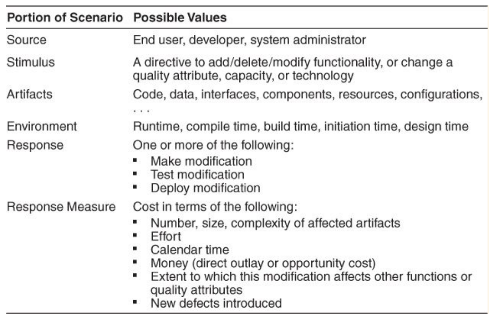](https://spricoder.oss-cn-shanghai.aliyuncs.com/2021-Software-System-Design/img/lec13/21.png)

| **情景部分** | **可能值**                                                   |
| ------------ | ------------------------------------------------------------ |
| 来源         | 最终用户、开发人员、系统管理员                               |
| 刺激         | 添加/删除/修改功能或更改质量属性、能力或技术                 |
| 工件         | 代码、数据、接口、组件、资源、配置                           |
| 环境         | 运行时、编译时间、构建时间、启动时间、设计时间               |
| 反应         | 作出修改试验修改部署修改                                     |
| 度量         | 费用如下：受影响工件的数量、大小和复杂性努力日历时间金钱(直接支出或机会成本)本修改影响其他功能的程度或质量属性新缺陷 |

### 可修改性的样本方案 Modifiability Sample Scenario

[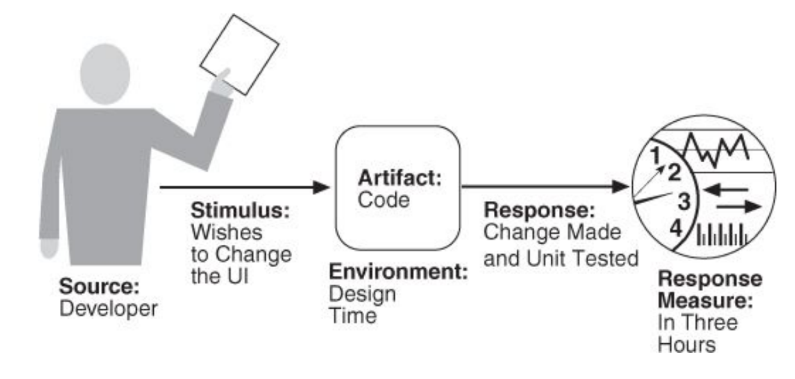](https://spricoder.oss-cn-shanghai.aliyuncs.com/2021-Software-System-Design/img/lec13/22.png)

### 可修改性的策略 Modifiability Tactics

[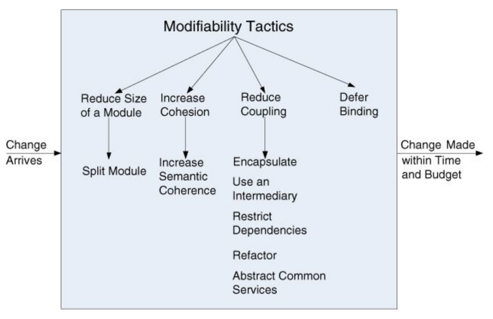](https://spricoder.oss-cn-shanghai.aliyuncs.com/2021-Software-System-Design/img/lec13/23.png)

1. Reduce Size of a Module：**拆分模块**：如果要修改的模块包含**大量功能**，则修改成本可能会很高(尽可能的控制包的大小)。Split module: If the module being modified includes a great deal of capabilities, the modification costs will likely be high.
2. Increase Cohesion：**增加语义一致性**：如果模块中的职责A和B不能达到**相同的目的**，则应通过创建新模块或将职责移至现有模块将它们放置在不同的模块中。Increase semantic coherence: If the responsibilities A and B in a module do not serve the same purpose, they should be placed in different modules by creating a new module or moving a responsibility to an existing module.
3. Reduce Coupling：

1. **封装**为模块引入了显式**接口**，并减少了对一个模块的更改**传播**到其他模块的可能性。Encapsulation introduces an explicit interface to a module, and reduces the probability that a change to one module propagates to other modules.
2. 使用**中介**打破**依赖**：所有的组件都要通过中间的组件进行通信，使用反模式等方法解决。Use an intermediary breaks a dependency.
3. 当两个模块受到相同更改的影响时，请进行**重构**：不同于代码重构 Refactor when two modules are affected by the same change.

1. Defer Binding：**延迟绑定**：在生命周期中与初始定义阶段**不同的阶段**绑定某些参数的值。Defer binding: Binds the value of some parameters at a different phase in the life cycle than the one in which they are initially defined.

### Checklist for Modifiability Design and Analsis

| [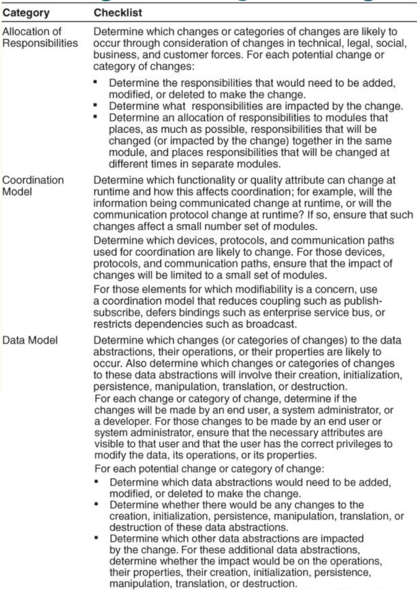](https://spricoder.oss-cn-shanghai.aliyuncs.com/2021-Software-System-Design/img/lec13/24.png) | [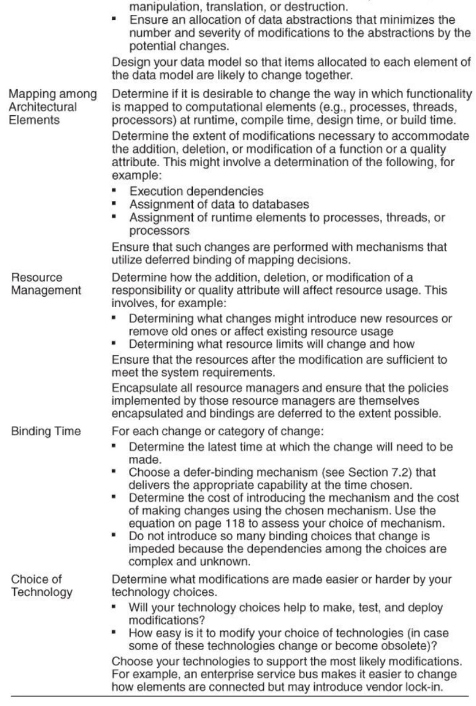](https://spricoder.oss-cn-shanghai.aliyuncs.com/2021-Software-System-Design/img/lec13/25.png) |
| ------------------------------------------------------------ | ------------------------------------------------------------ |
|                                                              |                                                              |

## 性能 Performance

1. 性能与**时间**有关，软件与系统满足时序要求的能力有关。(单位时间内能做多少事情) Performance is about time and the software system’s ability to meet timing requiements.
2. 所有系统都有性能要求，即使未明确表示也是如此。All systems have pertormance requirements, even it they are not explicitly expressed.
3. 响应时间的两个基本因素 Two basic contributors to the response time

1. 处理时间(系统**正在**响应时) processing time (when the system is working to response)
2. 阻塞时间(系统**无法**响应时) blocked time (when the system is una able to response)

### 性能的通用方案 Performance General Scenario

[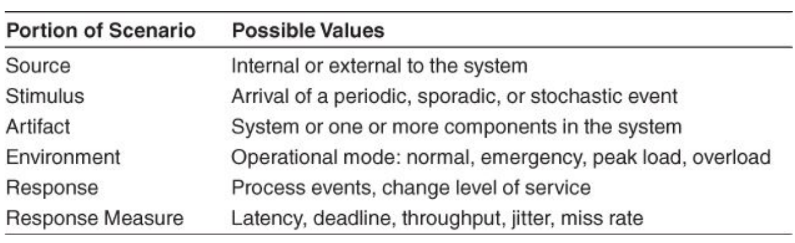](https://spricoder.oss-cn-shanghai.aliyuncs.com/2021-Software-System-Design/img/lec13/26.png)

| **情景部分** | **可能值**                           |
| ------------ | ------------------------------------ |
| 来源         | 系统的内部或外部                     |
| 刺激         | 周期性、偶发性或随机事件的到来       |
| 工件         | 系统或系统中的一个或多个组件         |
| 环境         | 运行方式：正常，紧急，高峰负荷，过载 |
| 反应         | 处理事件，更改服务级别               |
| 度量         | 延迟，截止日期，吞吐量，抖动，误码率 |

### 性能的样本方案 Performance Sample Scenario

[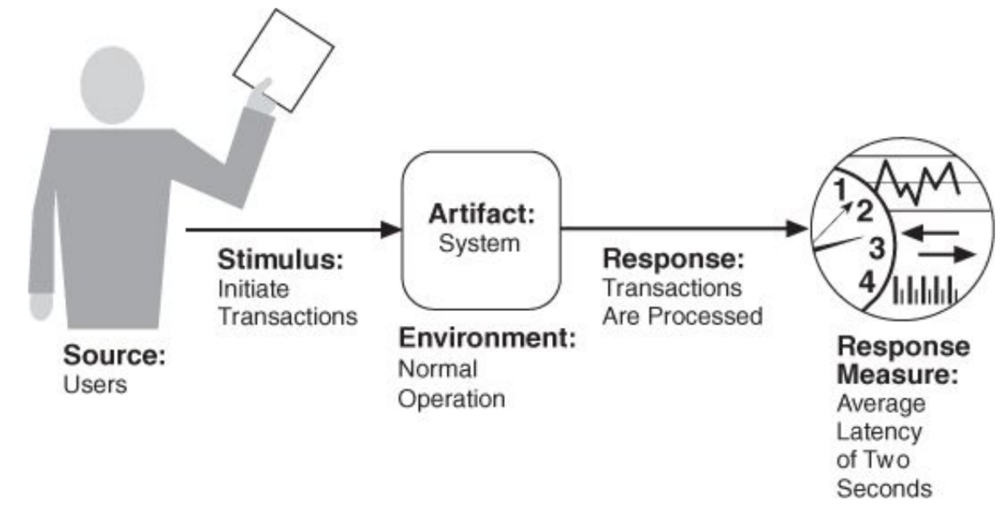](https://spricoder.oss-cn-shanghai.aliyuncs.com/2021-Software-System-Design/img/lec13/27.png)

### 性能的策略 Tactics for Performance

[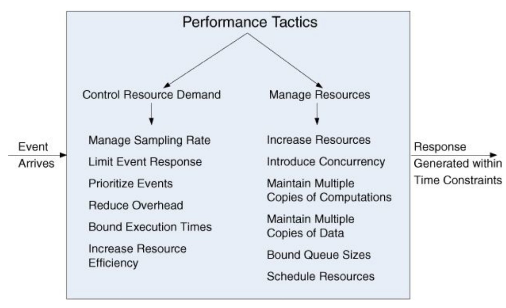](https://spricoder.oss-cn-shanghai.aliyuncs.com/2021-Software-System-Design/img/lec13/28.png)

1. 在需求方面 On the demand side

1. 管理**采样率**(降低采样频率) Manage sampling rate (reducing sampling frequency)
2. 限制事件响应：当离散事件到达系统的速度太快而无法处理时，必须将事件**排队**，直到可以处理它们为止。Limit event response: When discrete events arrive at the system too rapidly to be processed, the events must be queued until they can be processed.
3. 如果不是所有事件都同样重要，则对事件进行**优先级**排序。Prioritize events if not all events are equally important.
4. 通过使用**中介**来增加处理事件流的资源，从而减少开销 Reduce overhead by using intermediaries to increase the resources in processing an event stream

1. 在资源方面 On the resource side

1. 增加**资源**(更快的处理器，更多的内存，更快的网络…)Increase resources(faster processor, additional memory, faster network…)
2. 如果可以**并行**处理请求，请引入并发性。Introduce concurrency if requests can be processed in parallel.
3. 维护多个计算副本：使用负载平衡器将新工作分配给可用的**重复**服务器之一。Maintain multiple copies of computations: Use load balancer to assign new work to one of the available duplicate servers.
4. 维护数据的多个副本：Maintain multiple copies of data:

1. 快取 caching
2. 资料复制 data replication

### Checklist for Performance Design and Analysis

| [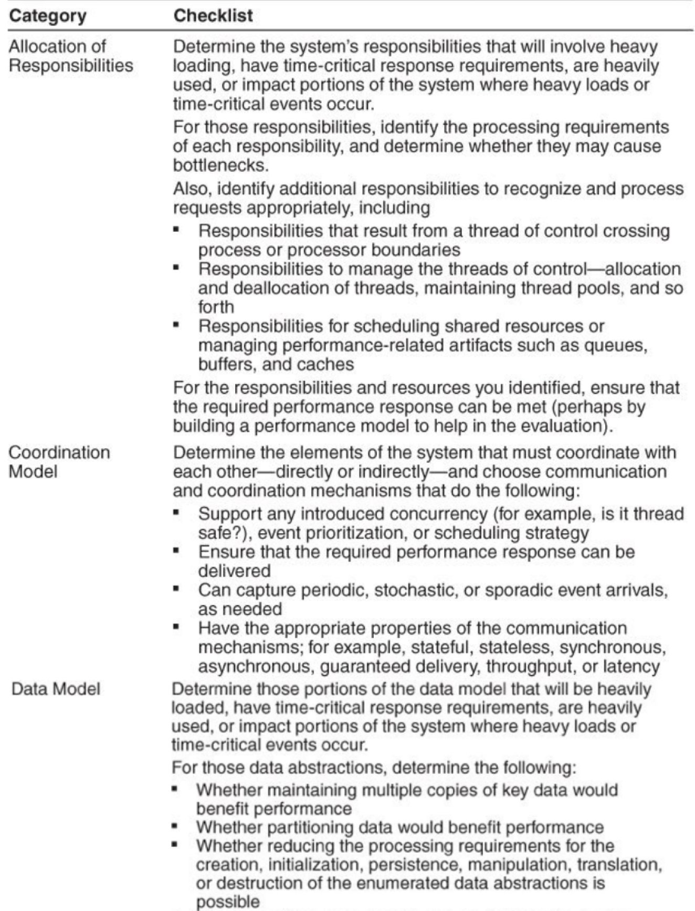](https://spricoder.oss-cn-shanghai.aliyuncs.com/2021-Software-System-Design/img/lec13/29.png) | [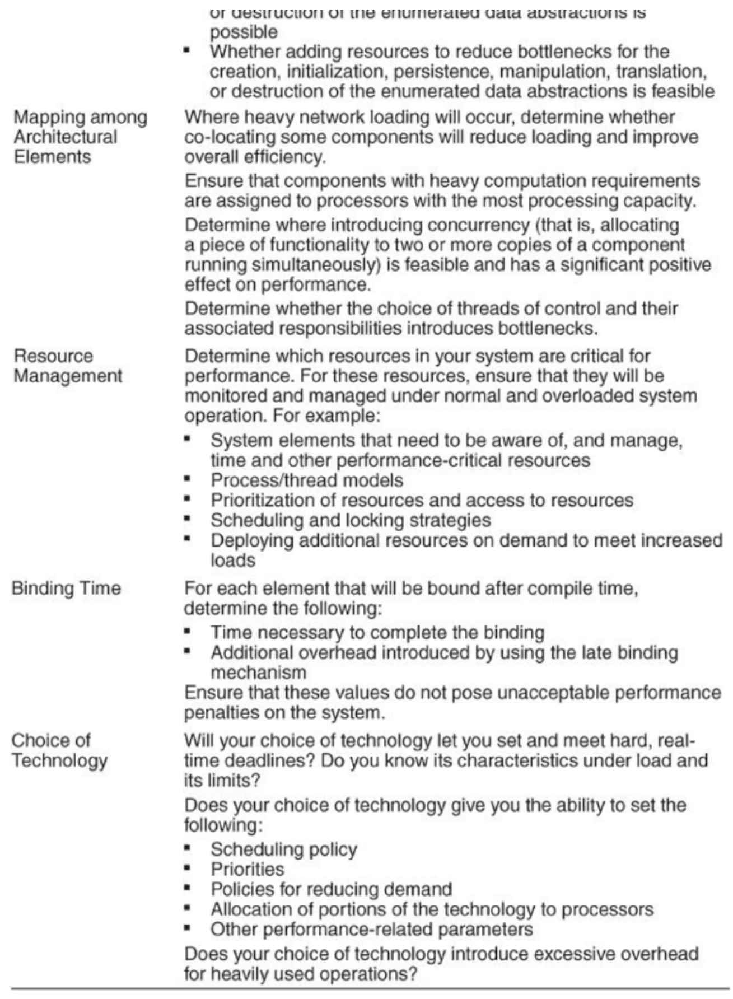](https://spricoder.oss-cn-shanghai.aliyuncs.com/2021-Software-System-Design/img/lec13/30.png) |
| ------------------------------------------------------------ | ------------------------------------------------------------ |
|                                                              |                                                              |

## 安全性 Security

1. 安全性衡量系统**保护**数据和信息免遭**未授权访问**的能力，同时仍提供对授权人员和系统的访问权限。Security measures system’s ability to protect data and information from unauthorized access while still providing access to people and systems that are authorized.
2. 安全性的三个特征：(CIA) Three characteristics of security: (CIA)

1. **机密性**，Confidentiality：防止**未经授权**访问数据和服务。Confidentiality: Data and services are pretected from unauthorized access.
2. **完整性**，Integrity：数据和服务不会受到**未经授权**的操纵。Integrity: Data and services are not subject to unauthorized manipulation.
3. **可用性**，Availability：系统将可供**合法使用**。Availability: The system will be available for legitimate use.

### 安全性的通用方案 Security General Scenario

[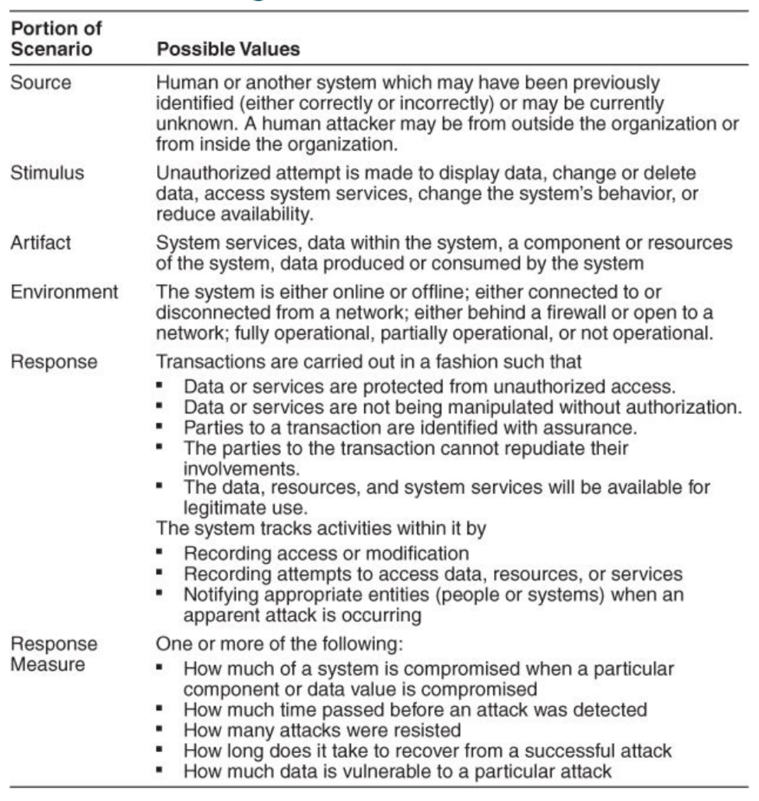](https://spricoder.oss-cn-shanghai.aliyuncs.com/2021-Software-System-Design/img/lec13/31.png)

| **情景部分** | **可能值**                                                   |
| ------------ | ------------------------------------------------------------ |
| 来源         | 人类或其他系统，以前可能识别(无论是正确的还是错误的)或可能是当前未知。人类攻击者可能来自组织以外，或者来自组织内部 |
| 刺激         | 未经授权的尝试显示数据、更改或删除数据、访问系统服务、更改系统行为，或降低可用性。 |
| 工件         | 系统服务、系统中的数据、组件或资源由系统产生或消耗的数据     |
| 环境         | 系统是联机的或脱机的；连接到或断开与网络的连接；系统在防火墙后或直接面向网络；完全运作，部分运作，或不运作 |
| 反应         | **交易是以这样的方式进行的**数据或服务受到保护，不受未经授权的访问。数据或服务不会未经授权而被操纵。一项交易的当事方得到了明确的确认。交易各方不能否认其参与。数据、资源和系统服务将用于合法使用。**系统通过以下方式跟踪其中的活动**：记录存取或修改记录访问数据、资源或服务的尝试通知适当的实体(人员或系统)明显的攻击正在发生 |
| 度量         | 当一个特定的组件或数据值被破坏。在检测到攻击之前，过了多长时间多少次攻击被抵抗从一次成功的攻击中恢复需要多长时间有多少数据易受特定攻击的影响？ |

### 安全性的样本方案 Security Sample Scenario

[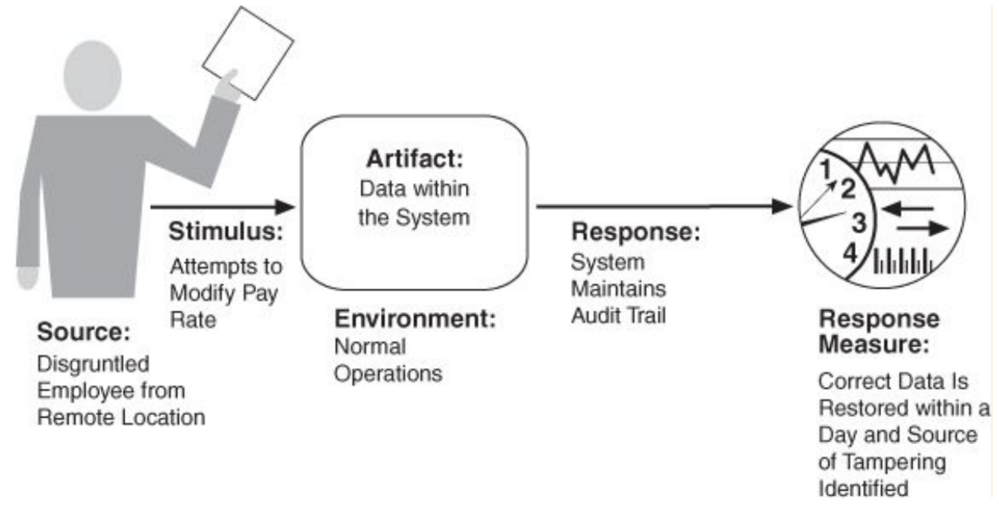](https://spricoder.oss-cn-shanghai.aliyuncs.com/2021-Software-System-Design/img/lec13/32.png)

### 安全性的策略 Security Tactics

[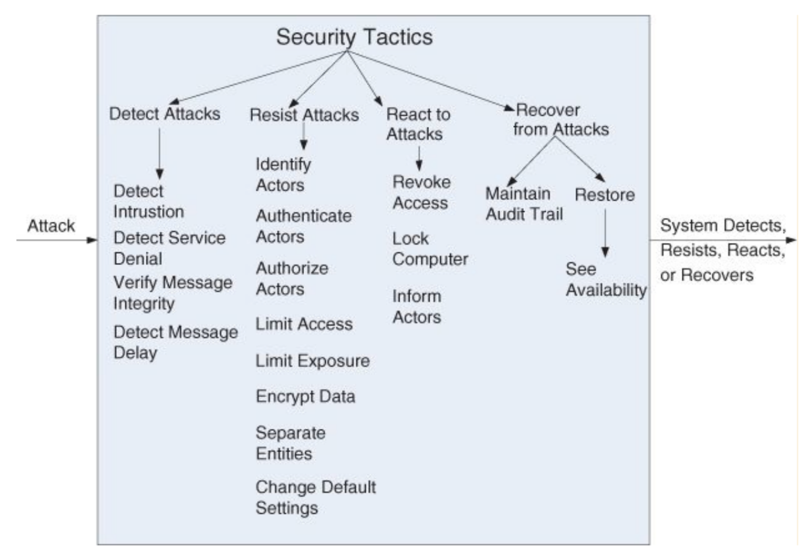](https://spricoder.oss-cn-shanghai.aliyuncs.com/2021-Software-System-Design/img/lec13/33.png)

1. 通过将系统内的网络流量或服务请求模式与一组签名或已知模式进行比较来检测**入侵** Detect intrusion by comparing network traffic or service request patterns within a system to a set of signatures or known patterns.
2. 检测服务**拒绝** Detect service denial
3. 使用校验和或哈希值验证**消息的完整性**。Verify message integrity using checksums or hash values.
4. 确定参与者-系统的任何**外部**输入的**来源**。ldentify actors - source of any external input to the system.
5. **验证**演员或他们所要扮演的角色。Authenticate actors who or what they purport to be.
6. **授权**有权访问和修改数据或服务的行为者。Authorize actors who have the rights to access and modify either data or services.
7. **限制**对计算资源的**访问**。Limit access to computing resouces.
8. 通过最小化系统的攻击面来**限制暴露**。Limit exposure by minimizing the attack surface of a system.
9. **加密**数据。Encrypt data.
10. 正在进行攻击时，撤消对**敏感资源**的访问。Revoke access to sensitive resources when an attack is underway.
11. Authenticate：认证，Authorize：授权。

### 安全性的检查列表 Checklist for Security Design and Analysis

| [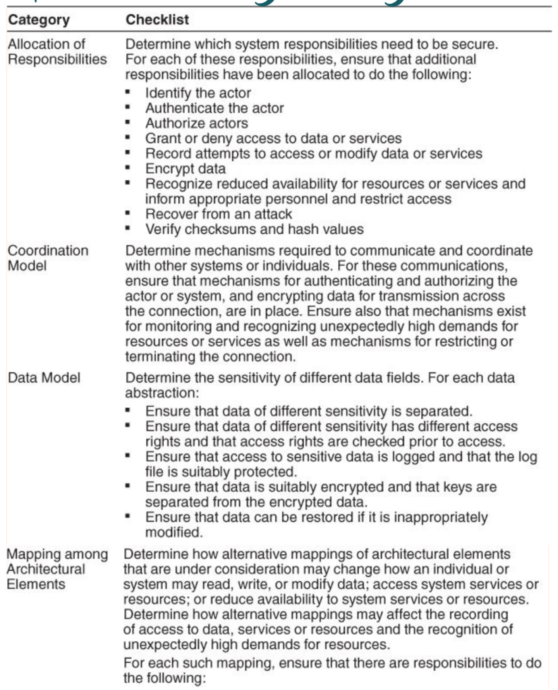](https://spricoder.oss-cn-shanghai.aliyuncs.com/2021-Software-System-Design/img/lec13/34.png) | [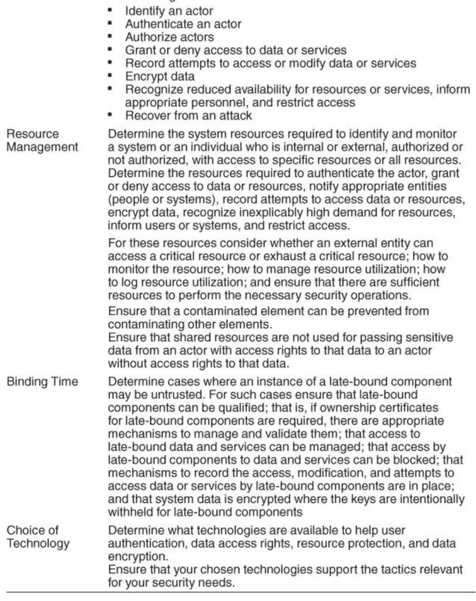](https://spricoder.oss-cn-shanghai.aliyuncs.com/2021-Software-System-Design/img/lec13/35.png) |
| ------------------------------------------------------------ | ------------------------------------------------------------ |
|                                                              |                                                              |

## 可测试性 Testability

1. 可测试性是指可以使软件通过(通常基于执行)测试来证明其故障的难易程度。Testability refers to ease with which software can be made to demonstrate its faults through (typically execution-based) testing.
2. 为了使系统能够正确测试，必须有可能**控制每个分量S的输入，然后观察其输出**。For a system to be properly testable, it must be possible to control each component s inputs and then to observe its outputs.

[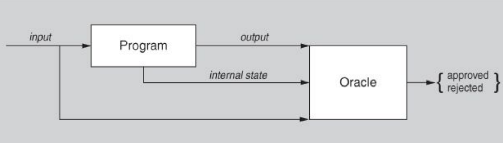](https://spricoder.oss-cn-shanghai.aliyuncs.com/2021-Software-System-Design/img/lec13/36.png)

### 可测试性的通用方案 Testability General Scenario

[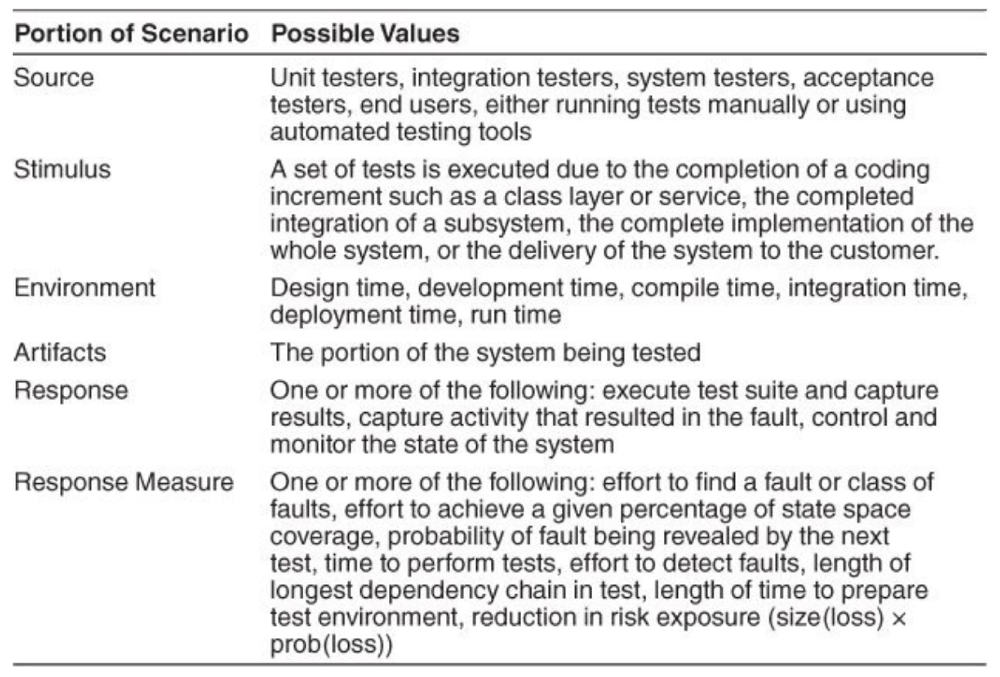](https://spricoder.oss-cn-shanghai.aliyuncs.com/2021-Software-System-Design/img/lec13/37.png)

| **情景部分** | **可能值**                                                   |
| ------------ | ------------------------------------------------------------ |
| 来源         | 单元测试员，集成测试人员，系统测试人员，验收测试人员、最终用户，或者手动运行测试，或者使用自动化测试工具 |
| 刺激         | 由于完成编码增量（例如类层或服务）、完成子系统的集成、整个系统的完整实现或将系统交付给客户，因此执行一组测试。 |
| 工件         | 正在测试的系统的部分                                         |
| 环境         | 设计时间，开发时间，编译时间，集成时间，部署时，运行时       |
| 反应         | 执行测试套件并捕获结果，导致故障、控制和捕获的捕获活动，监视系统的状态 |
| 度量         | 努力查找故障或故障类别，努力实现给定百分比的状态空间覆盖率，故障的概率由下一个揭示测试、执行测试的时间、检测故障的工作量、测试中最长依赖链的长度、准备测试环境的时间长度、风险暴露的降低 |

### 可测试性的样本方案 Testability Sample Scenario

[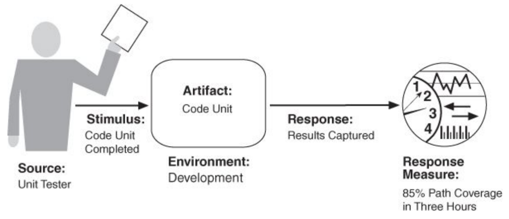](https://spricoder.oss-cn-shanghai.aliyuncs.com/2021-Software-System-Design/img/lec13/38.png)

### 可测试性的策略 Testability Tactcs

[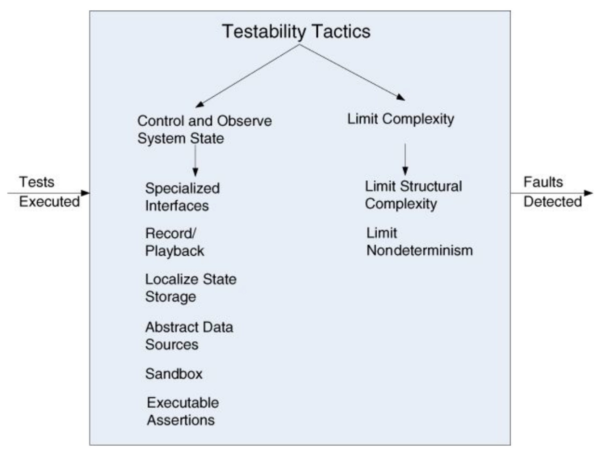](https://spricoder.oss-cn-shanghai.aliyuncs.com/2021-Software-System-Design/img/lec13/39.png)

1. 控制和观察系统状态：维护某种状态信息，允许测试人员为该状态信息分配一个值，和/或使测试人员可以按需访问该信息。Control and observe system state: Maintain some sort of state information, allow testers to assign a value to that state information, and/or make that information accessible to testers on demand.

1. **专用界面**使您可以控制或捕获组件的值 Specialized interfaces allow you to control or capture values for a component.
2. **记录/回放**导致故障的状态，然后重新创建故障。 Record/playback the state that caused a fault and re-create the fault.
3. **沙盒**将系统的实例与现实世界隔离开来，可以进行实验以消除其后果。Sandboxing isolates an instance of the system from the real world to enable experimentation to undo its consequences.

1. **限制复杂度****：复杂的软件更难测试，因为它的操作状态空间很大**，并且在大状态空间中重新创建精确状态更加困难。Limit complexity: Complex software is harder to test, because its operating state space is very large and more difficult to re-create an exact state in a large state space.

1. 限制结构的复杂性，避免、减少或解决组件之间的依赖关系；隔离和封装对外部环境的依赖关系。Limit structural complexity avoiding, reducing or resoling dependencies between components; isolating and encapsulating dependencies on external environment.

1. 限制派生一个类的**类的数量**。Limit the number of classes from which a class is derived.
2. 限制继承**树的深度**和类的子级数。Limit the depth of the inheritance tree and the number of children of a class.
3. ==限制**多态**和**动态调用=**=。Limit polymorphism and dynamic calls.

1. **限制不确定性**-限制行为复杂性 Limit nondeterminism - limiting behavioral complexity.

1. 非确定性系统更难测试。Nondeterminism systems are harder to test.

### 可测试性的检查列表 Checklist for Testability Design and Analysis

| [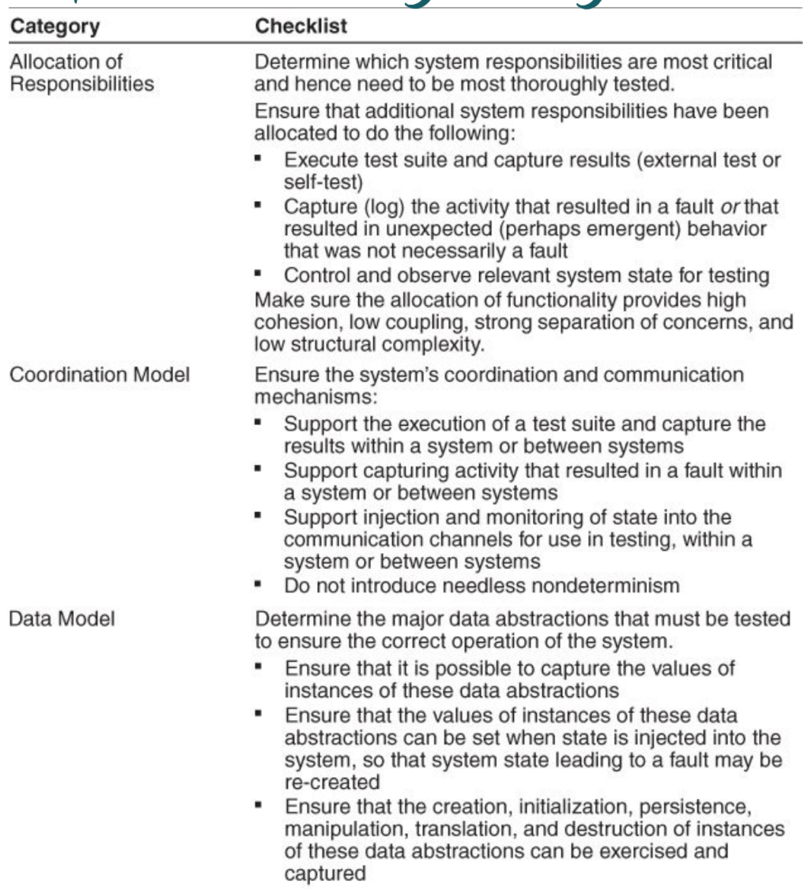](https://spricoder.oss-cn-shanghai.aliyuncs.com/2021-Software-System-Design/img/lec13/40.png) | [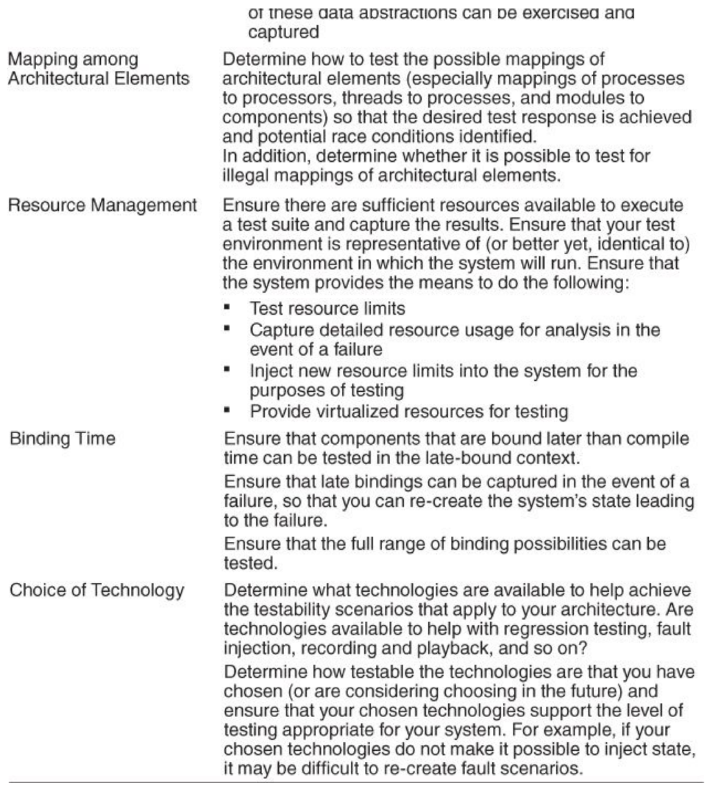](https://spricoder.oss-cn-shanghai.aliyuncs.com/2021-Software-System-Design/img/lec13/41.png) |
| ------------------------------------------------------------ | ------------------------------------------------------------ |
|                                                              |                                                              |

## 易用性 Usability

1. 易用性与用户完成所需任务的**难易程度**以及系统提供的用户**支持**的类型有关。Usability is concerned with h how easy it is for the user to accomplish a desired task and the kind of user support the system provides.
2. 可用性包括以下几个方面：Usability comprises the following aspects:

1. **学习**系统功能 Learning system features
2. **有效**使用系统 Using a system efficiently
3. 最小化**错误的影响** Minimizing the impact of errors
4. 使系统**适应**用户需求 Adapting the system to user’s needs
5. 增强信心和**满意度** Increasing confidence and satistaction

### 易用性的通用方案 Usability General Scenario

[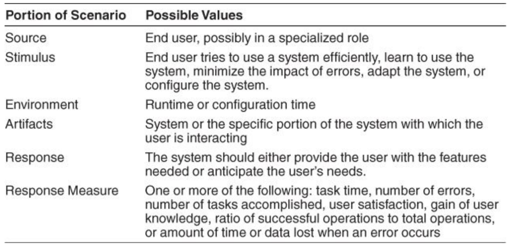](https://spricoder.oss-cn-shanghai.aliyuncs.com/2021-Software-System-Design/img/lec13/42.png)

| **情景部分** | **可能值**                                                   |
| ------------ | ------------------------------------------------------------ |
| 来源         | 最终用户，可能担任专业角色                                   |
| 刺激         | 最终用户尝试有效地使用系统，学习使用系统，尽量减少错误的影响，调整系统，或配置系统。 |
| 工件         | 系统或系统的特定部分                                         |
| 环境         | 运行时或配置时                                               |
| 反应         | 系统应为用户提供功能需要或预测用户的需求。                   |
| 度量         | 任务时间、错误数、完成的任务数量、用户满意度、用户收益知识，成功运营与总运营的比率，或发生错误时丢失的时间或数据量 |

### 易用性的样本方案 Usbility Sample Scenario

[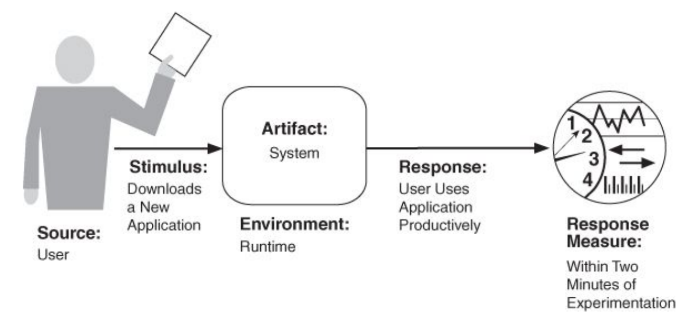](https://spricoder.oss-cn-shanghai.aliyuncs.com/2021-Software-System-Design/img/lec13/43.png)

### 易用性的策略 Usability Tactics

[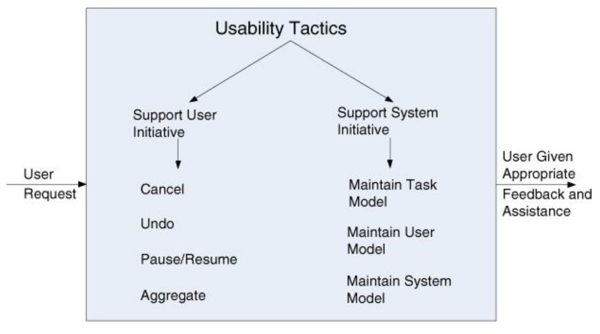](https://spricoder.oss-cn-shanghai.aliyuncs.com/2021-Software-System-Design/img/lec13/44.png)

1. 支持用户主动权：支持用户纠正错误或提高效率。Support user initiative: support the user in either correcting errors or being more efficient.

1. **取消** Cancel
2. **撤消**：系统必须维持足够数量的系统状态，以便可以恢复更早的状态。Undo: System must maintain a sufficient amount of system state so that an earlier state may be restored.
3. 用户启动长时间操作运行时**暂停/恢复** Pause/resume when a user has initiated a long-running operation
4. 将较低级别的对象**聚合**到一个**组**中，以便可以将操作应用于该组。Aggregate the lower-level objects into a single group, so that the operation may be applied to the group.

1. 初步支持

系统：确定系统用来预测其自身行为或用户意图的模型。Support system initiaive: Identify the models the system uses to predict either its own behavior or the user’s intention.

1. 维护**任务模型**：确定**上下文**，以便系统可以了解用户的尝试并提供帮助，对任务进行建模。Maintain task model: Determine context so the system can have some idea of what the user is attemping and provide assistance.
2. 维护**用户模型**：代表用户的关于**系统的知识**，根据用户行为训练出用户的模型 Maintain user model: Represent the user’s knowledge of system.
3. 维护**系统模型**：确定预期的**系统行为**，以便可以向用户提供适当的反馈。Maintain system model: Determine expected system behavior so that appropriate feedback can be given to the user.

### Checklist for Usbility Design and Analysis

| [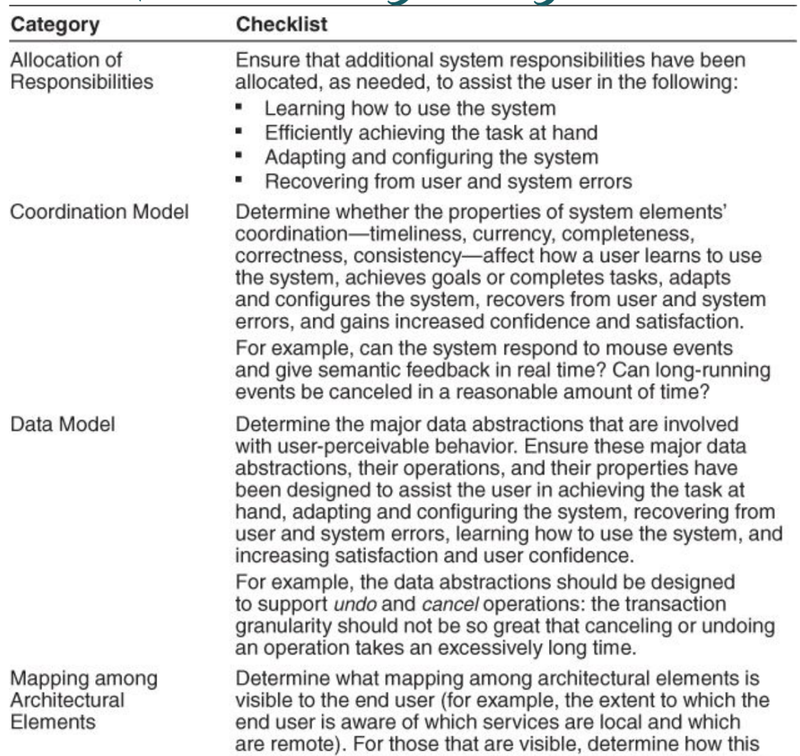](https://spricoder.oss-cn-shanghai.aliyuncs.com/2021-Software-System-Design/img/lec13/45.png) | [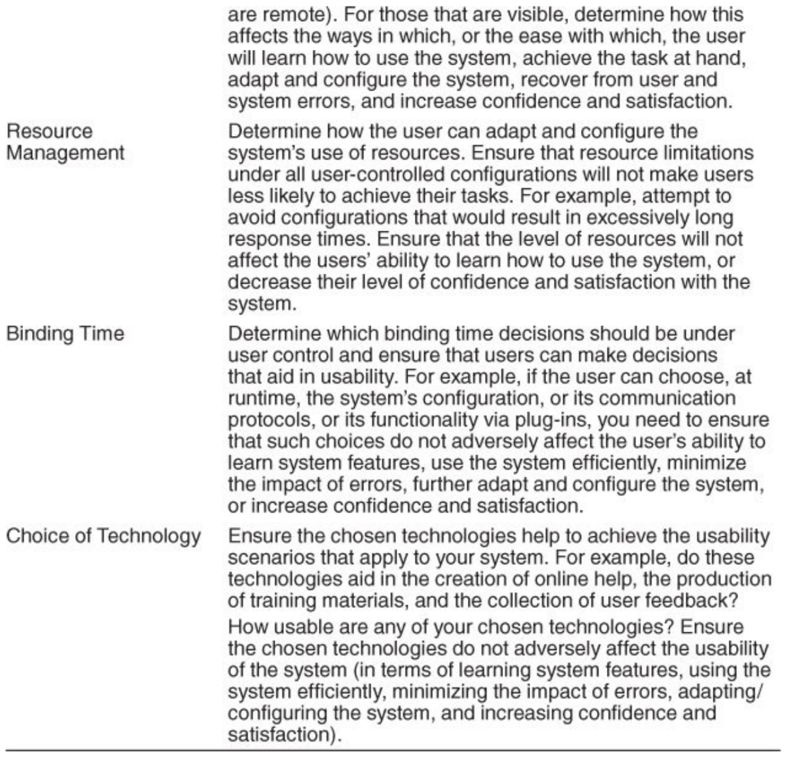](https://spricoder.oss-cn-shanghai.aliyuncs.com/2021-Software-System-Design/img/lec13/46.png) |
| ------------------------------------------------------------ | ------------------------------------------------------------ |
|                                                              |                                                              |

# 架构模式

**架构模式里除了分层、Map-Reduce、Mutil-tier都是CC**

## 定义

context problem solution

能够复用的解决方案

元素+关系+constraints = solution

1. 是在实践中反复发现的一套设计决策 is a package of design decisions that is found repeatedly in practice,
2. 具有允许重复使用的已知属性，并且描述了一类架构 has known properties that permit reuse, and describes a class of architectures.

1. 背景：世界上经常发生的常见问题，会引起问题 A context: A recurring, common situation in the world that gives rise to a problem.
2. 一个问题：在给定的上下文中出现的问题，经过适当概括 A problem: The problem, appropriately generalized, that arises in the given context.
3. 解决方案：针对问题的成功架构解决方案，并进行了适当抽象 A solution: A successful architecture resolution to the problem, appropriately abstracted.

## module pattern

## layered pattern

对应 4+1 视图中的逻辑视图

| 概述 | 分层模式定义了层(提供模块的分组和一组内聚的服务）和单向允许使用。该模式通常以图形形式显示。通过堆叠盒子来表示彼此之间的层 |
| ---- | ------------------------------------------------------------ |
| 元素 | 对一个层的描述应该定义该层包含哪些模块，以及该层提供的一组内聚服务。 |
| 关系 | “允许使用”，这是对更通用的"依赖"关系的一个特化。设计应该定义层使用规则是什么（例如，“一个层允许使用任何更低的层"或"一个层只允许使用它下面的层”）以及任何可允许的例外。 |
| 约束 | 每段软件都被精确地分配到一个层中。至少有两个层（但通常有三个或更多）。允许使用的关联关系不应该是循环的（即，下层不能使用上层）。 |
| 弱点 | 添加层会增加系统的前期成本和复杂性。层会对系统性能产生负面影响。 |

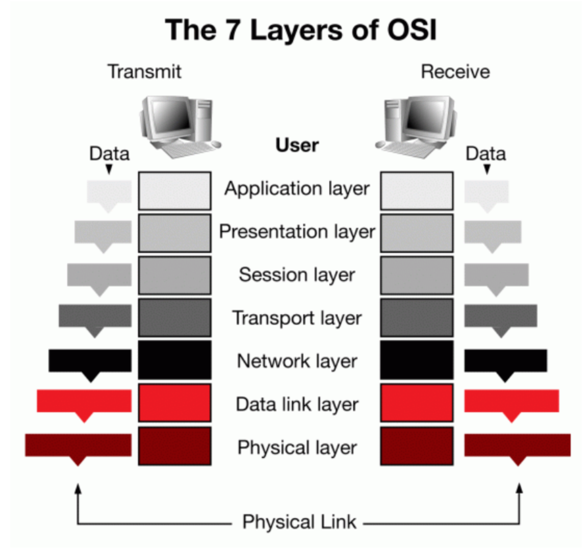

### 分层模式变体

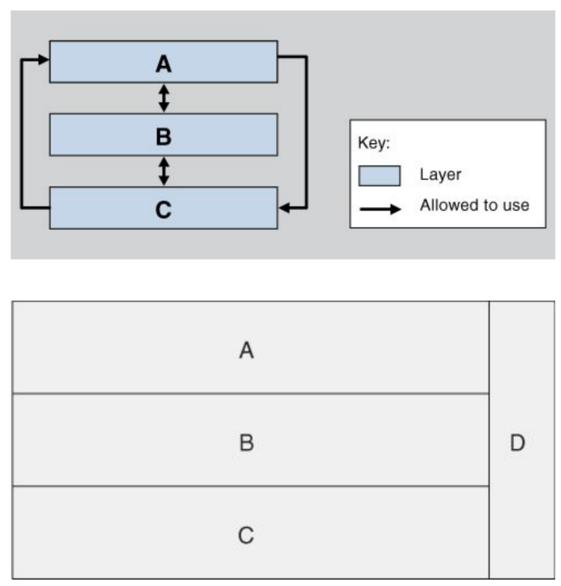

1. 上面的 A、B、C：不是一种分层模式：

1. 分层的核心是为了实现关注点分离
2. 不是分层模式：

1. 形成了环状依赖
2. 没有实现关注点分离，一个的修改可能有多个原因
3. 是一种软件的坏味道

1. 下面的 A、B、C、D：是一种分层模式：

1. 也可以是一种分层模式，D 不期待 A 的结果且 D 不期待 B 的结果
2. 而严格意义和其他场景中，不认为是一种分层模式

### 分层模式对质量属性的影响

可修改性

可模块化

可维护性

可复用性

## micro-service

### 【2019】【2023】微服务和 SOA 的区别，相同点

1. 相同点：微服务和 SOA 都是分布式架构，微服务架构可以看作是SOA的一种实现方式，适用于更小规模和更灵活的应用系统。都包含了服务契约、服务封装、服务重用、服务组合、服务自治和服务无状态等基本特点。
2. 微服务去掉了 SOA 架构中的 ESB(Enterprise Service Bus) 企业服务总线，采用轻量级通信机制 (HTTP、REST) 进行服务之间的通信。
3. 微服务引入了熔断器：避免出现服务失效或网络问题等导致的级联故障。
4. 部署和扩展：在SOA中，整个应用程序通常作为一个单元进行部署和扩展。而在微服务架构中，每个微服务可以独立部署和扩展，使得系统具有更好的弹性和可伸缩性。
5. 服务粒度：在SOA中，服务的粒度可以比较大，一个服务可能涵盖多个相关的业务功能。而在微服务架构中，服务的粒度更小，每个服务通常专注于一个特定的业务功能。
6. 组织和治理：SOA通常需要涉及企业范围内的中央治理和管理，**不能控制独立服务的演变**。而微服务架构强调团队的自治性，**每个微服务可以由一个独立的团队进行开发和管理，更加注重服务的自治性和快速迭代**。

是分布式架构，SOA的一种扩展

1. 微服务架构风格是一种将一个单一应用开发为一组小型服务的方法，每个服务运行在自己的进程中，服务间通信采用轻量级通信机制，这些服务围绕业务能力构建并可以通过自动部署机制独立部署。
2. 微服务特点

1. 服务颗粒化:服务粒度由业务功能决定，服务间尽可能解耦
2. 责任单一化:单一职责原则，服务内尽可能内聚
3. 运行隔离化:服务运行在各自进程中，互不影响
4. 管理自动化:对服务提供自动化部署与监控预警能力，高效管理

1. 微服务核心模式：针对采用微服务系统在特定问题所使用的程序的架构解决方案的集合

1. 服务注册与发现
2. API网关
3. 熔断器

1. 微服务的挑战

1. 运维要求高:微服务数量多，部署与监控要求高
2. 发布复杂度:部署环境多样化，网络性能系统容错、分布式事务等挑战
3. 部署依赖强:服务间相互调用关系复杂，存在部署顺序依赖
4. 通信成本高:跨进程调用比进程内调用消耗更多的资源

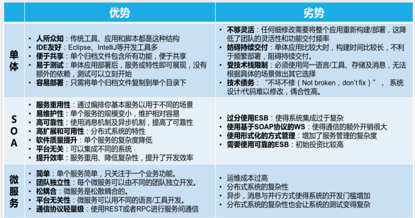

### 微服务架构特点

- 通过服务组件化

- 组件是⼀个可独立替换或升级的软件单元，微服务架构实现组件化的⽅式是分解成服务
- 服务是⼀种进程外的组件，它通过 Web 服务请求或远程过程调⽤（RPC）机制通信
- 使⽤服务作为组件的主要原因是服务是可独立部署
- 使⽤服务作为组件产⽣更加明确的组件发布接⼝

- 围绕业务能⼒组织

- 传统软件系统开发管理通常聚焦在技术层⾯，导致⽤户界⾯团队、服务逻辑团队、数据库团队
  等的划分，将始终伴随跨团队的沟通、交接和预算审批等
- 微服务采⽤围绕业务能⼒的划分⽅法来组织服务，实现在服务的业务领域内的宽栈实现，其团
  队都是跨职能的，包括全⽅位开发技能，如⽤户体验、数据库、项⽬管理
- 微服务采⽤产品开发模式，⽽⾮项⽬模式，开发团队负责软件的整个⽣命周期，持续关注软件
  如何帮助⽤户提升业务能⼒，实现价值交付

- 内聚与解耦

- 基于微服务构建的系统⽬标是尽可能的解耦和尽可能的内聚，他们拥有各⾃的领域逻辑
- 当系统被划分成分离的服务时，可利⽤领域驱动设计（Domain-Driven Design）的理念，把⼀
  个复杂域划分成多个限界上下⽂（Bounded Context），并且映射出它们之间的关系
- 服务和上下⽂边界的确定有助于澄清和强化分离，实现解耦

- 去中⼼化

- 去中⼼化治理，在构建微服务时各服务可以⾃⼰选择技术栈
- 服务之间只需要约定接⼝，⽽⽆需关注彼此的内部实现
- 运维只需要知道服务的部署规范
- 去中⼼化数据存储，微服务更倾向于让每个服务管理⾃⼰的数据库，或者同⼀数据库技术的不
  同实例，或完全不同的数据库系统
- 去中⼼化数据管理，对跨微服务的数据来说，去中⼼化责任对管理升级带来困难，微服务架构
  强调服务间的⽆事务协作，需要权衡更⼤⼀致性的业务损失与修复错误的代价

- 基础设施⾃动化

- 随着基础设施的⾃动化，特别是云和 Web Services 等技术的发展，已经降低了构建、部署和
  运维微服务的操作复杂度

- 服务设计

- ⾼可⽤性

- 任何服务调⽤都可能因为服务提供者不可⽤⽽失败，客户端必须尽可能有效地应对这种失效
- 为每个单独的服务设置完善的监控和⽇志记录，有助于快速发现不良突发⾏为⽽尽早修复

- 变更与演化

- 把组件放在服务中，只需重新部署修改的服务，可以在更细粒度上实现频繁、快速的发布
- 服务的划分上，系统中很少变更的部分应该和正在经历频繁改动的部分放在不同的服务⾥
  （如果不断地⼀起改变两个服务，它们应该被合并）

## 组件-连接器模式

为了解决一个问题，使用一个模式，可能会对别的质量属性产生正面或者负面的影响

需要做权衡和补充设计，最大化收益、忽略能够容忍的负面影响

### broker：代理解决互操作问题

Broker 可以理解为中间人，撮合双方达成交易。

| 概述 | 代理模式定义了一个运行时组件，称为代理，它调解多个客户端和服务器之间的通信。 |
| ---- | ------------------------------------------------------------ |
| 元素 | 客户端，服务的请求者服务器，服务的提供者代理，一个中介，用于定位适当的服务器以满足客户端的请求，转发请求到服务器，并将结果返回给客户端客户端代理，一个中介，负责与代理的实际通信，包括消息的编组、发送和解组服务器端代理，一个中介，负责与代理的实际通信，包括消息的编组、发送和解组 |
| 关系 | 附着关系将客户端（以及可选的客户端代理）和服务器（以及可选的服务器端代理）与代理关联起来。 |
| 约束 | 客户端只能附着到一个代理（可能通过客户端代理）。服务器只能附着到一个代理（可能通过服务器端代理） |
| 弱点 | 代理可能成为单点故障。代理增加了前期的复杂性。代理可能成为安全攻击的目标。代理可能难以测试。代理在客户端和服务器之间增加了一层间接性，因此增加了延迟，这个层次可能成为通信瓶颈。 |

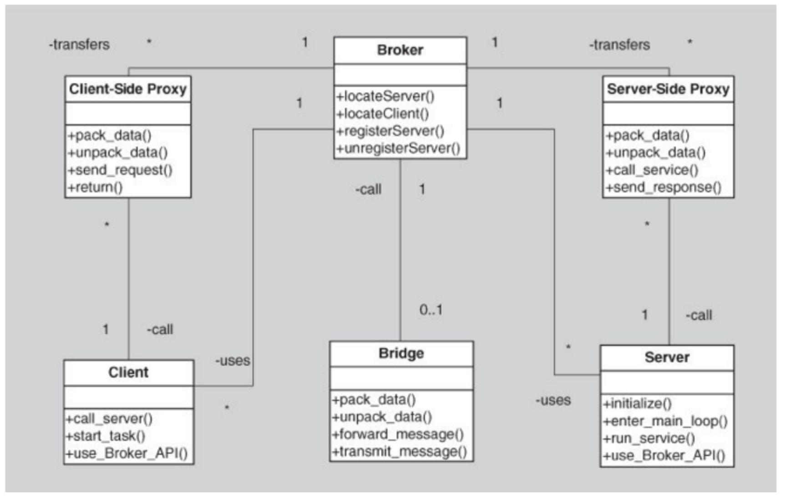

#### 对质量属性的影响

1. 优点

1. Interoperability：根本目的，提高 Server-Client 之间的交互性
2. Scaliability：可伸缩和扩展
3. Modifiabiliy：
4. 两面性：

1. Security：代理对象屏蔽了系统内部的具体实现
2. Reliability：服务降级和实例重启
3. Availability：

1. 缺点：

1. Security：成为被攻击的对象
2. Reliabiliy：可靠性会降低

1. 两面性：

1. Performance：整体大集群的性能可能会提高（QPS 等提高），但是局部单点性能会下降，多次网络请求、多次匹配，有可能会抵消。

### MVC

使用运行时、动态、相互之间的关系来审视，集成到了开发框架中，也是分层架构的变种（会强调各模块之间的约束关系，model 不可以直接返回到 controller）

- model 业务逻辑
- view 处理用户展示，接收用户操作
- controller 对用户操作进行处理，将信息通知给 model
- model -> controller 不会产生通信

| 概述 | MVC 模式将系统功能拆分成三个组件：模型、视图 和在模型和视图之间中介的控制器 |
| ---- | ------------------------------------------------------------ |
| 元素 | 模型是应⽤程序数据或状态的表示，它包含（或提供了接⼝）应⽤程序逻辑 视图是⽤户界⾯组件，它要么为⽤户⽣成模型的表示，要么允许某种形式的⽤户输⼊，要么两者兼⽽有 之 控制器管理模型和视图之间的交互，将⽤户操作转换为对模型或视图的更改 |
| 关系 | “通知关系”连接了模型、视图和控制器的实例，通知相关状态更改的元素 |
| 约束 | 必须有⾄少⼀个模型、视图和控制器的实例模型组件不能直接和控制器交互 |
| 弱点 | 对于简单的⽤户界⾯，这种复杂性可能不值得 模型、视图和控制器抽象可能不适合某些⽤户界⾯⼯具包 |

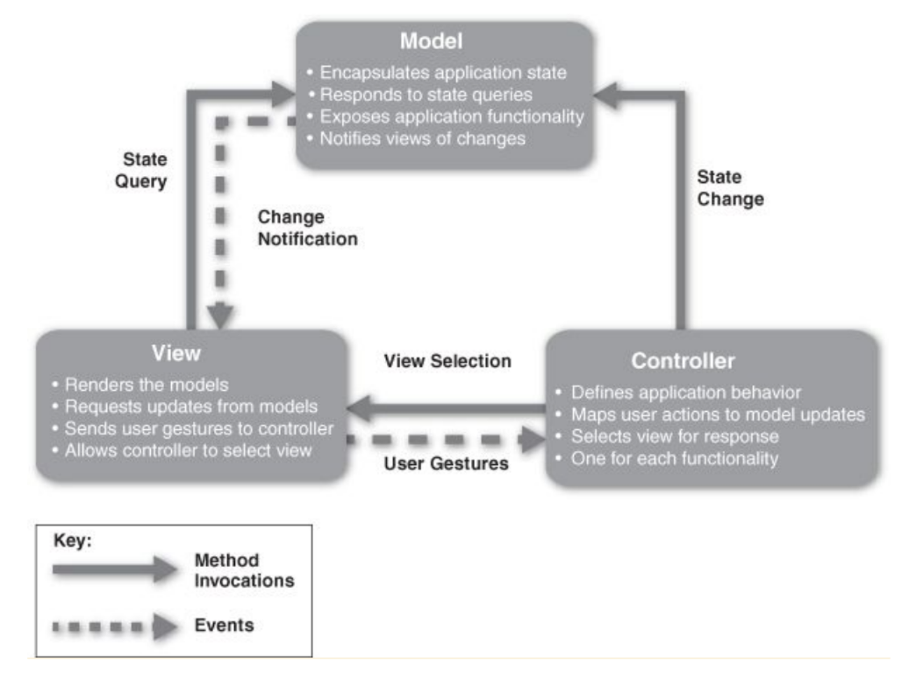

### Pipe-and-Filter Pattern

1. filter：相当于 component，起到数据处理、计算作用，每个 filter 有 input 和多个 output，数据处理后传递给后续的部分。
2. pipe：连接 filter，相当于 connector，将 output 导入到其他的 filter 的 input 中去，不会孤立存在。
3. 管道和过滤模式不会孤立存在，应用在顺序处理结构，有一系列的数据结构 filter，体现依赖关系。
4. 场景应用在科学计算的场景中，需要避免出现环形的 filter，不适用于有很多交互产生的场景。

| 概述 | 通过⼀系列由管道连接的过滤器执⾏的转换，数据从系统的外部输⼊转换为外部输出 |
| ---- | ------------------------------------------------------------ |
| 元素 | 过滤器，将数据从它的输⼊端读⼊并转换后写出到输出端的组件。过滤器可以同时执⾏。过滤器可以增量转换数据，也就是说它们⼀开始处理输⼊时就可以开始产出输出。重要的特征包括处理速率、输⼊输出数据格式以及过滤器执⾏的转换管道，将数据从⼀个过滤器的输出端传输到另⼀个过滤器的输⼊端的连接器。管道只有⼀个输⼊源和⼀个 输出⽬标。管道保留了数据项的序列，并且不会改变这些被传输的数据。重要的特征包括缓冲区大小、交互协议、传输速度和通过管道的数据格式 |
| 关系 | 连接关系将过滤器的输出与管道的输⼊相关联，反之亦然           |
| 约束 | 管道将过滤器输出端连接到过滤器输⼊端相连的过滤器必须保证传输的数据的类型符合沿途的管道模式的专⻔化可能会限制组件与⾮循环图或线形序列（有时叫流⽔线）的关联其他专⻔化可能会规定组件具有特定的命名端⼝，例如 UNIX 过滤器的 stdin 、stdout 、stderr 端⼝ |
| 弱点 | 管道-过滤器模式通常不是交互系统的⼀个的好选择拥有⼤量独立的过滤器会增加⼤量的计算开销管道过滤器系统可能不适合⻓时间运⾏的计算 |

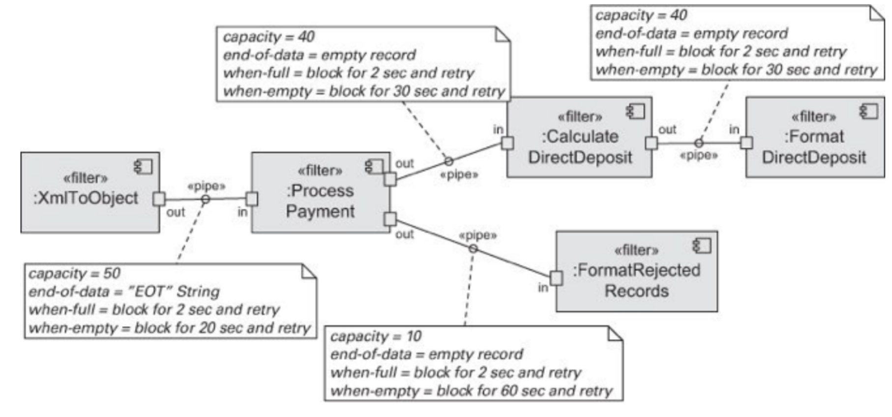

每一组件表示 filter，连接两个组件的部分是 pipe（类似于 queue 交易任务的排队等待处理）

任何一个 filter 都依赖于前一个 filter 的输出，中间没有机会接收外部的交互来改变严格定义好的流程。

不适用于一些可以引入变形的场景（相互独立、不依赖前面的产出，会带来损耗）

### Client-Server Pattern

1. 包含两类不同的 component
2. 请求发起 client、server 接收请求，这里没有 broker，不能动态改变 client 和 server 的关系，相对更固定，但是一个 client 可以连接多个 server
3. 一个 component 在一个关系中可以是 client，也可能是 server，非绝对，但是成对的关系相对固定。
4. 会受到负载的限制。
5. Server 可能有性能瓶颈，但是可以通过事先规划避免。
6. Server 可能单点失效，但是 broker 可以控制

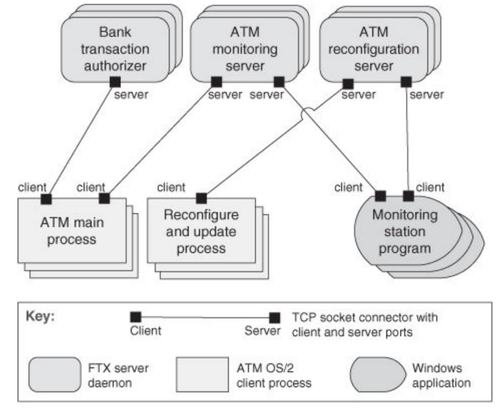

1. ATM 验证身份，某一个 server 会给很多设备提供服务。
2. ATM 操作安全监控、盗刷之类，通过 monitoring 发现问题找到记录
3. 对银行工作人员而言，需要新的业务，policy 发生变化，银行工作人员定义 ATM 上的操作
4. 银行负责安全金融的根据 ATM、对照用户操作行为是否有安全隐患，多对多。
5. 问题：broker 也存在 client 和 server 之间的关系，对质量属性的影响，做一下比较，broker 是之前，c/s 是 90 年代流行广泛应用

1. 互操作性：可能导致变弱？没有 broker，需要人为连接
2. 安全性：Client、Server 不采用 broker 可能被拦截
3. 伸缩性
4. 性能
5. 可修改性

1. 小型局域网、互联网还没有普及，规模有限，直接联系，性能上安全性可能带来更大收益
2. broker 的一些负面影响就不必承担了，c/s 会比 broker 投入更少，收益可能更大

| 概述 | 客户机发起与服务器的交互，从这些服务器调⽤所需的服务并等到这些请求的结果 |
| ---- | ------------------------------------------------------------ |
| 元素 | 客户机，调⽤服务器服务的组件。客户机有描述他们所需服务的端⼝服务器，为客户机提供服务的组件。服务器具有描述其提供的服务的端⼝。重要的特征包括服务器端⼝的性质（能连多少客户机）、性能特征（服务调⽤的最⼤速率）请求/应答连接器，⼀种采⽤请求/应答协议的数据连接器，⽤来让客户机调⽤服务器上的服务。重要的特征包括请求是本地的还是远程的、数据是否加密 |
| 关系 | 连接关系关联了客户机和服务器                                 |
| 约束 | 客户机通过请求/应答连接器连接到服务器 服务器组件可以是其它服务器的客户机 专⻔化可能会施加限制：给定端⼝的连接数服务器之间允许的关系组件可以按层排列，这些层是相关联的功能或共享主 机计算环境的功能的逻辑组 |
| 弱点 | 机计算环境的功能的逻辑组弱点服务器可能是性能瓶颈服务器可能是单点错误（在客户机还是服务端）放置功能，这⼀决定如果在系统构建后变更，经常是复杂且成本⾼昂的 |

### peer-to-peer 点对点模式

1. 这一刻是提供者，下一刻就是消费者，是对等的
2. 不单单提供服务，还能提供物流（对于整个网络）
3. 对每一个 peer 可能会给他一个规定对的连接数

| 概述 | 计算是通过相互协作的节点来实现的，这些节点通过 ⽹络相互提供服务并向对⽅提供服务 |
| ---- | ------------------------------------------------------------ |
| 元素 | 节点，是运⾏在⽹络节点上的独立组件。特殊节点组件可以提供路由、索引和节点搜索功能请求/应答连接器，⽤户在节点⽹络中连接、搜索其 它节点和从其它节点调⽤服务。在某些情况下，不需要应答 |
| 关系 | “连接”关系将节点与其连接器相关联，连接可以在运 ⾏时改变      |
| 约束 | 可能会对以下⽅⾯施加限制：对任意给定节点的允许连接数搜索指定节点所需要的跃点数哪些节点知道其它节点⼀些 P2P ⽹络采⽤星型拓扑结构，节点只能连接到 超级节点 |
| 弱点 | 安全性管理、数据⼀致性、数据/服务可⽤性、备份 和恢复会更复杂 ⼩的点对点系统可能⽆法保持性能和可⽤性的质量⽬标 |

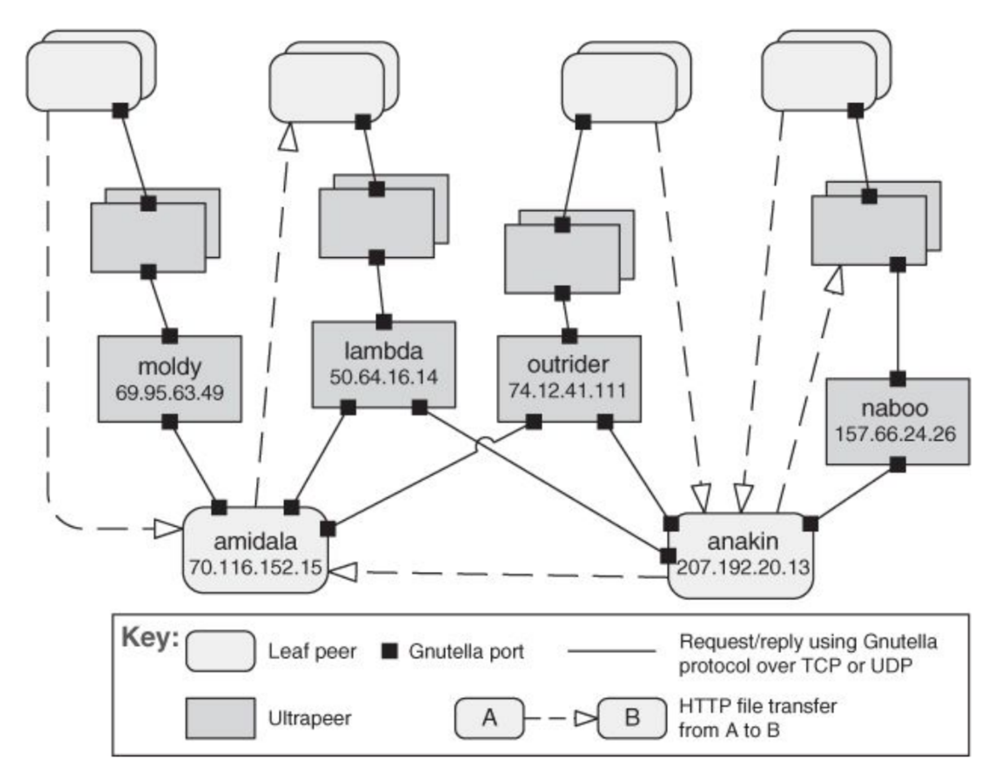

1. 可能安全性不受保障，因为节点既是 Client 又是 Server，被攻击可能性提高了，attack、surface 受攻击面变大
2. 数据分布在不同的节点上，相同数据多处拷贝，如果要的话，可能会导致数据不一致（数据一致性难度更大），不能保证数据一定可用，数据可用性不能百分之百保证。
3. 可用性 availability，同一个数据多个副本，所以个别数据出问题不影响整体。
4. 但又不能保证 availability，不会以后任何一个节点有权限。
5. Performance：多个节点同时提供服务，性能快（多个渠道获取数据，并行能力提高）

### service-oriented 面向服务

| 概述 | 计算是由⼀组通过⽹络提供或使⽤服务的协作组件来 实现的。经常使⽤⼯作流语⾔来描述计算 |
| ---- | ------------------------------------------------------------ |
| 元素 | 组件：服务提供者，通过发布接⼝来提供⼀个或多个服务。关注点通常与所选的实现技术相关，包括性能、授权约束、可⽤性和成本。在某些情况下这些属性是在服务级别的协议中指定的服务使⽤者，直接或通过中介调⽤服务服务提供者也可以是服务使⽤者ESB(Enterprise Service Bus) 企业服务总线，是中介元素，可以在服务提供者和使⽤者之间路由并转换消息服务注册表，⽤以给服务提供者注册它们的服务，给服务使⽤者在运⾏时发现服务编排服务器，基于业务流程和⼯作流语⾔，协调服务使⽤者和提供者之间的交互连接器：SOAP(Simple Object Access Protocol) 简单对象访问协议连接器，使⽤ SOAP 协议来在 web 服务间同步通信，通常通过 httpREST(Representational State Transfer) 表述性状态传递连接器，依赖于 http 协议的基础请求/应答操作异步消息传递连接器（Asynchronous messaging），使⽤消息传递系统来提供点对点或发布-订阅的异步消息交换 |
| 关系 | 各连接器可⽤的不同类型组件的连接                             |
| 约束 | 服务使⽤者被连接到服务提供者，但是可能使⽤中介 组件（ESB 、注册表、编排服务器） |
| 弱点 | 基于 SOA 的系统通常复杂于构建 不能控制独立服务的演变 有中间件的性能开销，服务可能是性能瓶颈，通常不能提供性能保证 |

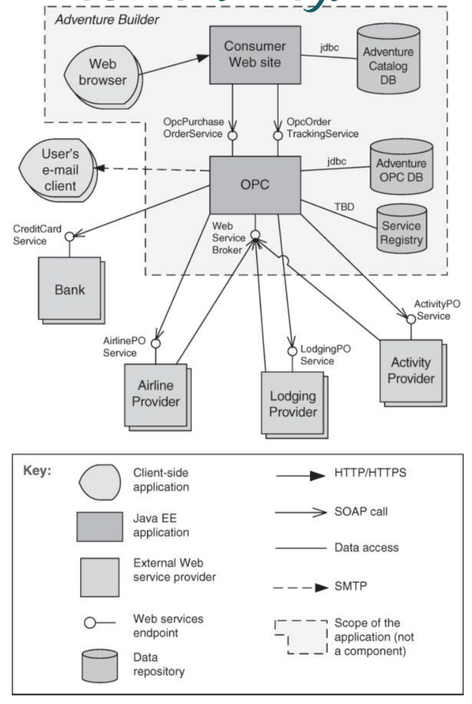

1. 具备 broker 的优势，这里又不想继承 broker，所以 broker 消失了
2. 出现类似集基础设施的组件，代替单一节点 broker，单点失效的问题消失了
3. 商业模式的变化、看技术可用性
4. 基础条件——互联网普及范围参与者人数规模比以往大这样一个背景下打破 broker c-s
5. 追求更高互操作性更高伸缩性
6. 技术条件下提供的服务越来越多现在可以分得更细更大差异化更细粒度的组合可以实现出来社会分工越来越细（不同航空公司不同酒店细粒度体现如果固定就很难实现差异化）微服务也是这样的体现服务粒度越来越小是有很多技术条件支持的（单体系统内部复杂度外化外面复杂度可以进行动态绑定可以提供多样化服务）

### publish-subscribe 发布订阅

1. subscribe 注册对于 publiser 进行注册
2. 某一个 publiser 发布自己的消息可能订阅其他消息（朋友圈微博）

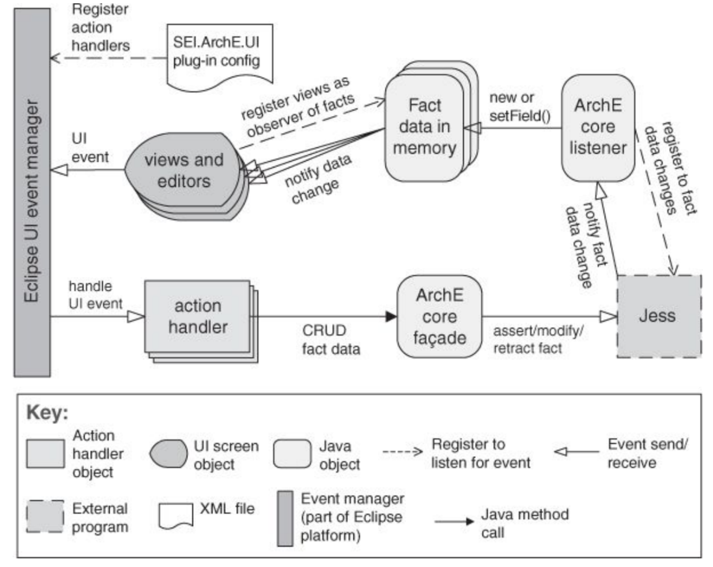

1. 传统操作系统也是通过事件驱动方式来管理的
2. IDE 环境注册后就行结构发布的事件
3. 数据发生变化会反映到环境中去
4. 性能上的延迟（可限制 subscriber 数量订阅越多性能下降）
5. scalability publisher 数量不会变多
6. 发布者不关心每个订阅者都收到不是 guarantee

| 概述 | 组件发布和订阅事件。当⼀个事件被⼀个组件宣布， 连接器基础结构会将该事件派发给所有注册订阅者 |
| ---- | ------------------------------------------------------------ |
| 元素 | ⾄少有⼀个发布或订阅端⼝的任⼀ C&C 组件。关注 点包括发布和订阅哪些事件，以及事件的粒度 发布订阅连接器，它将为希望发布和订阅事件的组件 提供宣布和侦听的⻆⾊ |
| 关系 | 连接关系将组件与发布-订阅连接器关联，通过制定 哪些组件宣布事件、哪些组件被注册以接收事件 |
| 约束 | 所有组件都被连接到⼀个事件分发器，这个分发器可 以被视为总线、连接器或组件。发布端⼝连接到宣布⻆⾊，订阅端⼝连接到侦听角色。约束可能限制哪个组件可以侦听哪些事件、组件是否可以侦听⾃⼰的事 件，以及多少发布-订阅连接器可以在系统中存在 组件可以同时是发布者和订阅者，有两种类型的端⼝ |
| 弱点 | 通常增加了延迟，在可伸缩性和消息传输时间的可预测性上有负⾯影响在消息的顺序上的控制较少，并且⽆法保证消息的传递 |

### share-data 共享数据模式

| 概述 | 数据访问器之间的通信由共享数据存储库进⾏中介。 控制可能由数据访问器或数据存储库来发起。数据存储库使数据持久化 |
| ---- | ------------------------------------------------------------ |
| 元素 | 共享数据存储库。关注点包括存储的数据类型、⾯向性能的数据属性、数据分布和允许的访问器数量 数据访问器组件 数据读写连接器。⼀个重要的选择是连接器是否是事务性的，以及读写语⾔、协议和语义 |
| 关系 | 连接关系决定哪个数据访问器连接到哪个数据存储库               |
| 约束 | 数据访问器与数据存储库交互                                   |
| 弱点 | 共享数据存储库可能是性能瓶颈 共享数据存储库可能是单点错误 数据的⽣产者和消费者可能紧密耦合 |

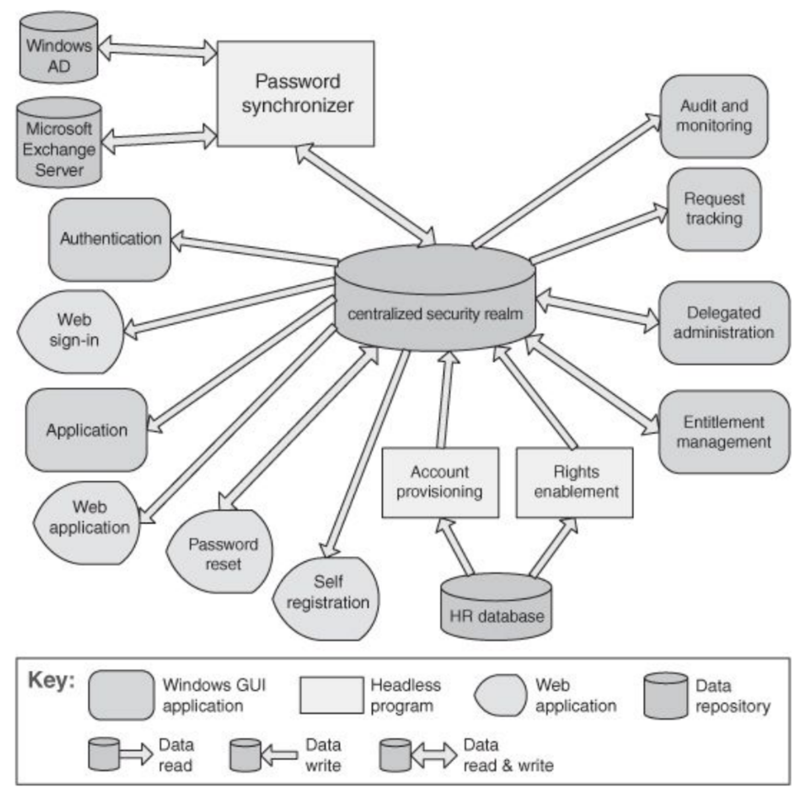

## allocation pattern

每个pattern之间并不是互斥，而是描述一个系统在不同视角下的

### map-reduce 映射-规约

1. 软件和外部环境的关系 部署
2. map 对数据进行抽取所需要的信息信息转换
3. 可以有多个 map 处理数据工作内容不一样
4. 相互独立可以运行
5. reduce 进行合并产出想要的答案

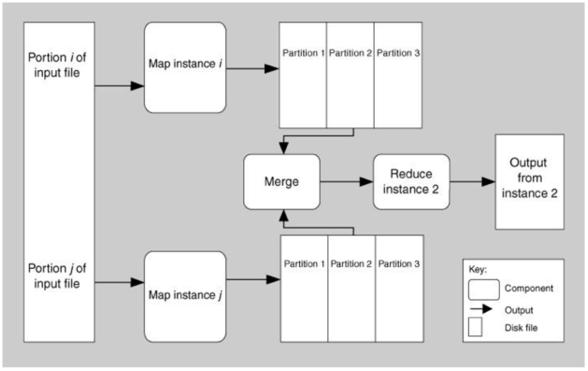

1. map reduce 部署在不同的地方
2. 词频分析案例大量数据
3. Map-Reduce Based System
4. 每一个 partition 对应一个 map 每一个 map 任务一样不同实例
5. 所有词汇使用频率标注出来
6. 通过 reduce 进行合并
7. 最后进行排序

| 概述 | 映射-规约模式提供了⼀个框架，⽤于⼀组处理器上并⾏分析⼀个⼤型分布式数据集。这种并⾏化允许低延迟和⾼可⽤性。映射执⾏分析的提取和转换部分，规约执⾏结果的加载（“提取-转换-加载”有时⽤于描述映射和规约的功能） |
| ---- | ------------------------------------------------------------ |
| 元素 | 映射是⼀个跨多个处理器、有多个已部署的实例的函 数，执⾏分析的提取和转换部分 规约是可能被部署成单点实例或者跨多个处理器的多个实例的函数，执⾏“提取-转换-加载”中的加载部分基础设施是个负责部署映射和规约实例、传递数据、 检测故障和恢复的框架 |
| 关系 | “部署于”是映射和规约函数实例，与安装了它们的处 理器之间的关系 |
| 约束 | 要分析的数据必须作为⼀组⽂件存在 映射函数是⽆状态的，不能相互通信 唯⼀的在映射实例和规约实例之间的通信是，从映射 实例发出的键值对数据 |
| 弱点 | 如果没有⼤型数据集，映射-规约的开销是不合理的 如果不能将数据集划分为⼤⼩相似的⼦集，那么并⾏ 性的优势就丧失了 需要多个规约的操作编排起来很复杂 |

### multi-tier 多层模式

| 概述 | 许多系统的执⾏结构被组织为⼀组组件的逻辑分组。每个分组称为⼀层。将组件分组到层可以基于各种标准，⽐如组件的类型、共享相同的执⾏环境，或具有相同的运⾏时⽬的 |
| ---- | ------------------------------------------------------------ |
| 元素 | 层，是软件组件的逻辑分组 层可以在公共计算平台的基础上形成，在这种情况 下，这些平台也是此模式的元素 |
| 关系 | “⼀部分”，分组组件是层的⼀部分 “与之通信”，层与其包含的组件进⾏交互 “被分配到”，层映射到计算平台 |
| 约束 | ⼀个软件组件只属于⼀个层                                     |
| 弱点 | ⼤量的前期成本和复杂性                                       |

1. 部署的环境划分
2. layer 是真实存在的
3. 这里是逻辑的组合没有和层的强依赖关系
4. 不同的部署环境里面分层不同但是软件完成内容一样

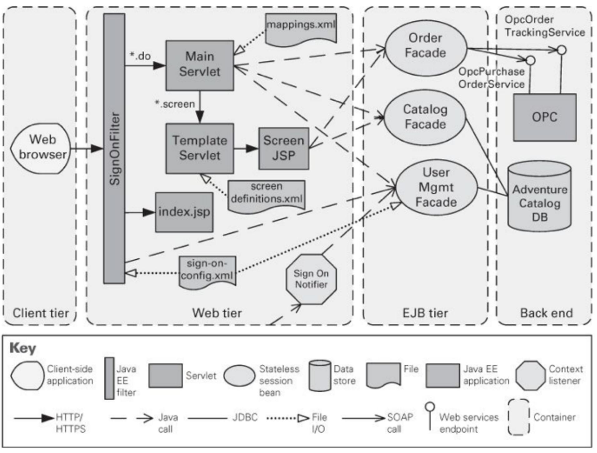

## pattern和tactic

pattern包括要解决的问题和发生问题的场景context

1. 策略比模式简单。他们使用单一的结构或机制来应对单一的架构力量 Tactics are simpler than patterns; they use a single structure or mechanism to address a single architectural force.WW
2. 模式通常将多个设计决策组合到一个包中 Patterns typically combine multiple design decisions into a package.
3. 模式和策略共同构成了软件设计师的主要工具 Patterns and tactics together constitute the software architect' s primary tools.
4. 战术是设计的“构建块”，可从中创建架构模式 Tactics are "building blocks" of design from which architectural patterns are created.
5. 大多数模式包含几种不同的策略，这些策略可能 Most patterns consist of several different tactics that may:

1. 都有共同的目的 all serve a common purpose,
2. 经常被选择来承诺不同的质量属性 be often chosen to promise different quality attributes

1. 示例：分层模式 Example: layered pattern

1. 提高语义一致性 Increase semantic coherence
2. 限制依赖 Restrict dependencies

1. tactic 是设计最小粒度 

1. tactic 进行组合
2. 一个 tactic 是为了某一个质量属性也会影响其他属性（正面、负面）

1. 针对某一个质量属性 Modifiability 相关的 tactic 和 pattern 之间的关系是否涉及到

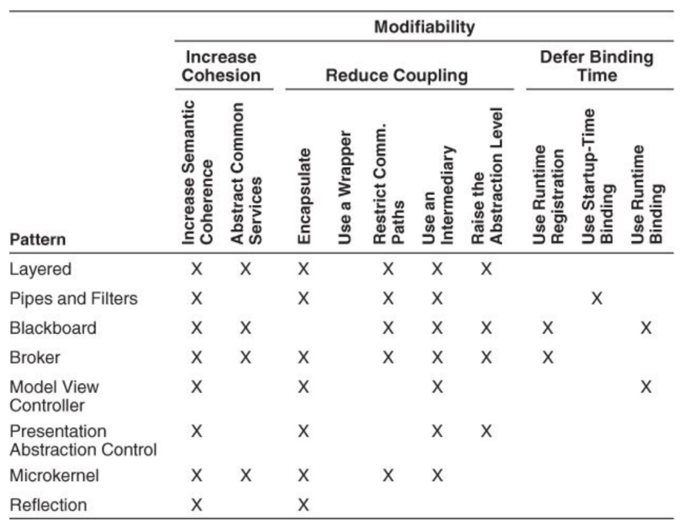

# 设计架构

## 通用设计策略

abstraction：从下往上进行抽象，忽略、隐藏细节，关注高抽象层次的关系

分解decomposition：分解成一个个问题？

divide & conquer：分而治之

generation and test：看组合能不能满足ASR要求，

iteration：迭代、修正

reuse：复用以往的成功设计，快速 有保障的方式

**在设计软件时应用了哪些通用设计策略？为每个策略提供一个带有软件架构的简明工作示例。**

1. 抽象：使用抽象让设计师关注本身结构而不关心实现，比如将系统抽象为组件和连接件或抽象为模块。
2. 分解：针对某一个系统关注点分解后处理，比如将整个系统分解或将某个模块分解。
3. 分而治之：将每个模块分别处理
4. 生成与测试：将一个特定的设计看作是一个假设；根据测试路径生成测试用例。
5. 迭代与细化：使用迭代的方法，ADD方法多次迭代直到满足所有ASR
6. 复用元素：重用在设计过程中出现了可以复用的元素，重用现有架构

## 设计应该覆盖的内容

1. responsibility：职责
2. coordination：系统中元素如何协调通讯
3. data 处理数据，输入输出，管理存储协议格式，不同介质上的分配
4. resource 资源分配，计算资源、网络、cache、软件资源、时间
5. elements mapping元素的对应关系 从架构元素到软件元素
6. binding time 元素与元素之间的关系什么时候确认，五个时间点绑定，绑定时间越靠后越灵活，但是增加不确定和测试负担
7. technology 实现技术和技术栈的选择

## ADD  属性驱动设计  

### 输入

Architecturally significant requirements

ASR，最重要的功能需求和constraints

### 输出

- 软件元素
- 角色
- 职责
- 属性
- 关系

### 八步过程

1. 确保有充足的需求信息

1. 系统的涉众已经根据业务和任务⽬标，对需求定优先级
2. 你可以决定在设计过程中关注哪些系统元素
3. 你可以决定是否有充⾜的关于系统的质量属性需求的信息
4. “刺激-响应”形式

1. 选择元素作为设计焦点：哪一个元素承担了最多最重要的ASR

1. 如果是第⼀次作为绿地开发的⼀部分，所有需求都被分配给系统
2. 当细化⼀个部分设计的系统时，系统被划分为多个元素，并分配了相应的需求，选择其中⼀个
   元素作为焦点

1. 识别哪些相关ASR

1. 根据这些需求对架构的相对影响，对这些相同的需求进⾏第⼆次排序，为每个需求分配“⾼影
   响”“中影响”“低影响”
2. (H,H)(H,M)(H,L)(M,H)(M,M)(M,L)(L,H)(L,M)(L,L)
3. 第⼀个字符表示需求对涉众的重要性
4. 第⼆个字符表示需求对架构的潜在影响

1. 选择设计满足ASR

4.1.  识别设计关注点

- 如何在设计中落实你的 ASR ？

4.2. 为从属关注点列出可选的模式、战术

- 对于列表中的每个模式，应该
- 确定每个模式的估计参数，以帮助你在模式和战术中选择
- 判别参数的估计值

4.3. 从列表中选择模式、战术

- 在使⽤每种模式时，需要进⾏哪些权衡？
- 模式如何良好地组合？
- 有没有相互排斥的？

4.4. 决定模式、战术与 ASR 之间的关系

- 考虑到⽬前为⽌确定的模式、战术，并决定它们之间的关系。所选模式的组合可产⽣新模式

4.5. 捕捉初步架构视图

- 通过开始捕捉不同的架构视图，来描述你选择的模式
- 在此阶段，你不需要创建完全⽂档化的架构视图

4.6. 评估和解决不⼀致

- 根据架构驱动因素对设计进⾏评估
- 决定是否存在未考虑的架构驱动因素
- 评估可选的模式或者应⽤附加的战术
- 对照架构中其他元素的设计，评估当前元素的设计，并解决不⼀致的问题

1. 实例化架构元素并分配职责

1. 为你选择的每类元素实例化⼀个实例
2. 根据类型，分配职责给每个⼦元素
3. 在⼦元素上分配与⽗元素相关联的职责
4. 分析并⽂档化你所做的设计决定

1. 为实例化的元素定义接⼝

1. 接⼝描述了元素之间的“提供”和“需要”的假设
2. 运⽤涉及实例化元素的功能性需求
3. 观察由⼀个元素产⽣并由另⼀个元素消费的任何信息

1. 验证和细化需求，并使它们成为实例化元素的约束

1. 验证所有被分配到⽗元素的需求都被分配到了⼀个或多个⼦元素
2. 将分配给⼦元素的任何职责转化为给单个元素的功能性需求

1. 重复直到所有 ASR 都被满⾜

## views and beyond

合并视图减少视图数量

排序来减少不重要的视图，得到精简的视图

对视图进行说明，提供作出决定的依据、视图之间的关系

视图之外的补充信息（跨越视图、系统之间的）

评估：在不同阶段对系统掌握的信息不同，使用不同的手段，使用不同的方法

**为什么软件系统架构需要使用不同视图来文档化？给出4种示例视图的名称和目的。**

1. 原因

1. 不同视图支持不同的目标和用户，突出不同的系统元素和关系
2. 不同视图将不同质量属性暴露出不同的程度

1. 4种视图(了解)：

1. 模块视图 Module View：提供一组连贯职责的实现单元
2. 组件和连接器视图 C & C View：显示具有某些运行时存在的元素
3. 分配视图 Allocation View：描述了软件单元到软件开发或执行环境元素的映射
4. 质量视图 Quality Views，安全视图、性能视图、可靠性视图、沟通视图、异常（错误处理）视图
5. 组合视图：将上述视图进行组合

### 模块视图

- 模块是提供⼀套连贯的职责的实现单元
- 没有⾄少⼀个模块视图，任何软件架构⽂档都不可能完整

包含

- 分解视图 Decomposition view
- 使⽤视图 Uses view
- 概括视图 Generalization view
- 分层视图 Layered view
- ⽅⾯视图 Aspects view
- 数据模型视图 Data model view

总结

- 元素：

- 模块，是提供⼀套连贯职责的实现单元

- 关系

- “⼀部分”，它定义了部分⼦模块和整体聚合模块之间的部分、整体关系
- “依赖于”，它定义了两个模块之间的依赖关系。特定的模块视图详细说明了依赖关系的含义
- “是”，它定义了更具体的⼦模块和更⼀般的⽗模块之间的泛化、专⻔化关系

- 约束：

- 不同模块视图可能会施加特定的拓扑约束，例如限制模块之间的可⻅性

- ⽤途

- 代码构建蓝图
- 变更影响分析
- 规划增量开发
- 需求追踪分析

- 传达系统的功能及代码库的结构
- ⽀持⼯作分配、实施计划和预算信息的定义
- 显示系统需要管理的信息结构

### 组件-连接器视图 Component-Connector Views

组件和连接器视图显示具有某些运行时存在的元素，例如进程、对象、客户端、服务器和数据存储（称为“组件”）。 Component-and-connector views show elements that have some runtime presence, e.g, processes, objects, clients, servers, and data stores (being termed 'components).

附件指示哪些连接器连接到哪些组件 Attachments indicate which connectors are attached to which components.

通过将连接器的端点连接到组件的端口来显示附件。 Attachment is shown by connecting the endpoints of the connector to the ports of components.

1. 管道和过滤器视图 Pipe-and-filter view
2. 客户端-服务器视图 Client-server view
3. 点对点视图 Peer-to-peer view
4. 面向服务的架构 (SOA) 视图 Service-oriented architecture (SOA) view
5. 发布订阅视图 Publish-subscribe view
6. 共享数据视图 Shared-data view
7. 多层视图 Multi-tier view

- 总结
- 元素

- 组件。主要处理单元和数据存储。组件有⼀组端⼝，通过这些端⼝与其他组件进⾏交互（通
  过连接器）
- 连接器。组件间交互的途径。连接器有⼀组⻆⾊（接⼝），指示组件如何在交互中使⽤连接
  器

- 关系

- 连接。组件端⼝与连接器⻆⾊相关联，以⽣成组件和连接器的图
- 接⼝委托。在某些情况下，组件端⼝与“内部”⼦架构中的⼀个或多个端⼝相关联。连接器的
  ⻆⾊情况类似

- 约束

- 组件只能连接到连接器，⽽不是直连其他组件
- 连接器只能连接到组件，⽽不是直连其他连接器
- 连接只能在相容的端⼝和⻆⾊上建⽴
- 接⼝委托只能在两个相容端⼝或⻆⾊上定义
- 连接器不能孤⽴出现，必须连接到组件

- ⽤途

- 演示系统如何⼯作
- 通过指定运⾏时元素的结构和⾏为来指导开发
- 帮助解释运⾏时系统质量属性，如性能和可⽤性

###  分配视图  Allocation Views

- 分配视图描述了软件单元到软件开发或执⾏环境元素的映射
- 分配视图的通常⽬标是⽐较软件元素所需的属性和环境元素所提供的属性，以确定分配是否成功
- 分配视图可以描述静态或动态视图

包含

- 部署视图 Deployment view
- 安装视图 Install view
- ⼯作安排视图 Work assignment view
- 其他分配视图 Other allocation view

总结

- 元素

- 软件元素。软件元素具有环境所需的属性
- 环境元素。环境元素具有提供给软件的属性

- 关系：被分配。软件元素被映射（分配）到环境元素，属性取决于特定视图
- 约束：视不同视图⽽定
- ⽤途

- ⽤于对性能、可⽤性、安全性 security 和安全性 safety 进⾏解释
- ⽤于解释分布式开发和将⼯作分配给团队
- ⽤于解释软件版本的并⾏访问
- ⽤于解释系统安装的形式和机制

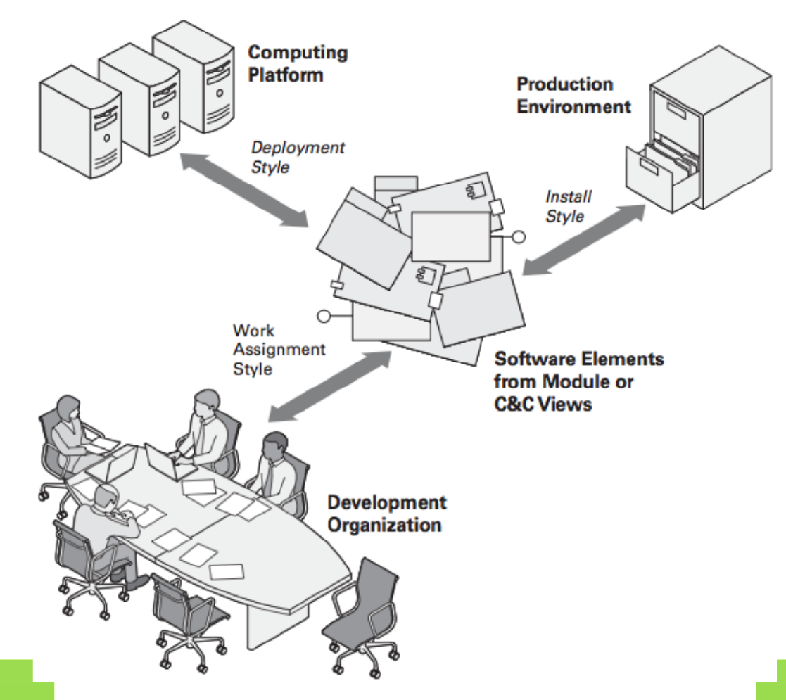

### 质量视图

包含

- 安全视图 Security view
- 性能视图 Performance view
- 可靠性视图 Reliability view
- 通信视图 Communication view
- 异常视图 Exception view（错误处理视图 error- handling view

## 文档化视图

### 选择视图三步走

1. 构建涉众-视图表
2. 组合视图

1. 确定上表中的边缘视图
2. 通过将⼀个视图的元素与另⼀个视图中的元素相关联，将每个边缘视图与另⼀个更具⽀持性
   的视图相结合

1. 确定优先级和阶段

1. 分解视图
2. ⼋⼆开原则
3. 按顺序完成所有视图？

### 涉众与视图

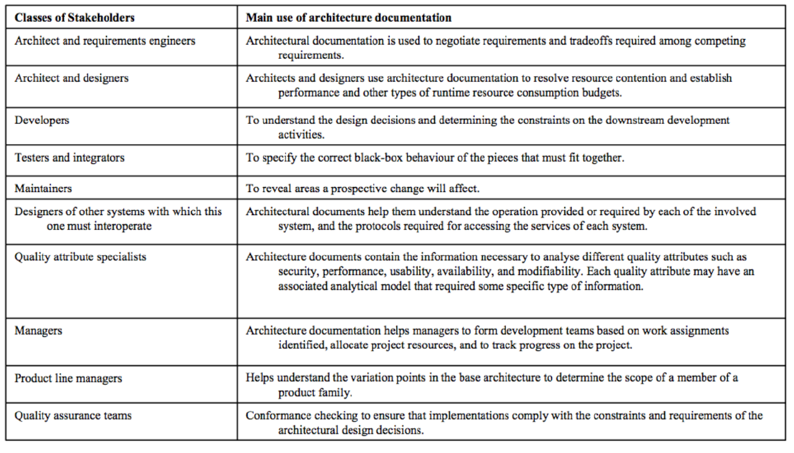

### 将视图组合

1. 各种 C&C 视图 Various C&C view
2. 带有 SOA 或通信进程视图的部署视图 Deployment view with either SOA or communicating- process Views
3. 分解视图和任何工作分配、实施、使用或分层视图 Decomposition view and any of work assignment, implementation, uses, or layered views

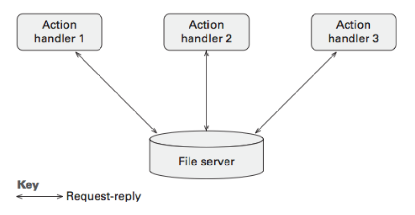

- **使用一张视图说明整个系统的部署信息**

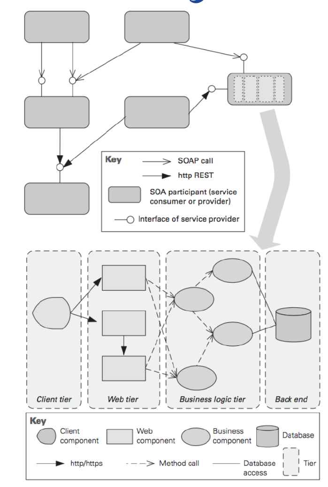

###  视图模板  

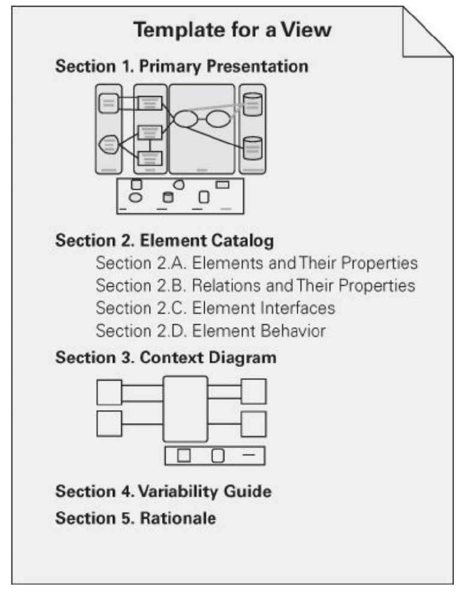

1. 第 1 部分：主要介绍 Section-1: The Primary Presentation

1. 显示视图的元素和关系 shows the elements and relations of the view
2. 通常带有一个键的图形 often graphical with a key

1. 第 2 部分：元素目录 Section-2: The Element Catalog

1. 详细介绍了第 1 节中描述的元素。details the elements depicted in Sect.1
2. 元素及其属性 Elements and their properties
3. 关系及其属性 Relations and their properties
4. 元素接口和行为 Element interfaces and behavior

1. 第 3 部分：上下文图 Section-3: Context Diagram

1. 系统或其部分如何与其环境相关 how the system or its portion relates to its envlronment

1. 第 4 部分：可变性指南 Section-4: Variability Guide

1. 如何在此视图中练习架构的任何变化点 how to exercise any variation points of the architecture in this view

1. 第 5 节：基本原理 Section-5: Rationale

1. 为什么设计反映在视图中 why the design reflected in the view
2. 提供了一个令人信服的论据，证明它是合理的。 provides a convincing argument that it is sound .

##  超越视图  

###  超越视图的⽂档  

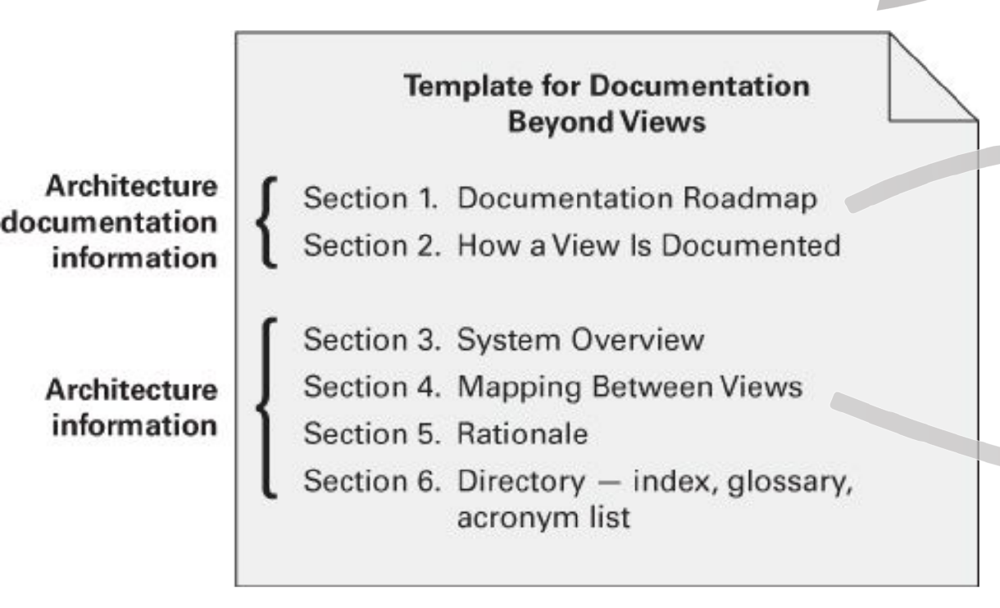

1. 范围和总结 Scope and summary
2. 文档的组织方式 How the documentation is organized

1. 简短的概要 short synopsis
2. 带注释的目录 annotated table of contents

1. 查看概览 View overview
2. 利益相关者如何使用文档 How stakeholders can use the documentation

###  文档控制信息  

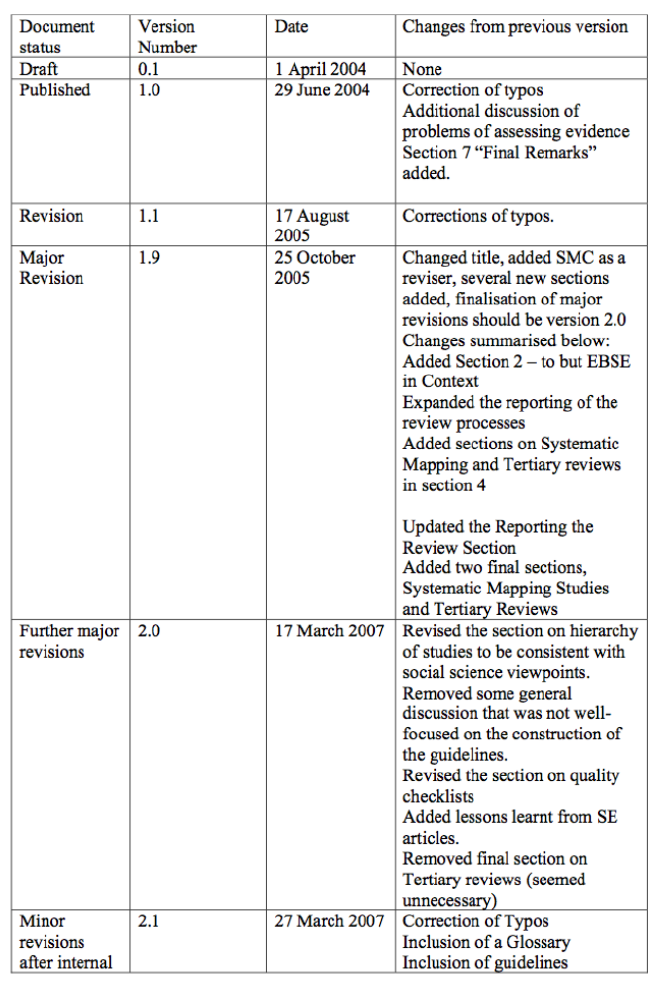

### 文档间映射

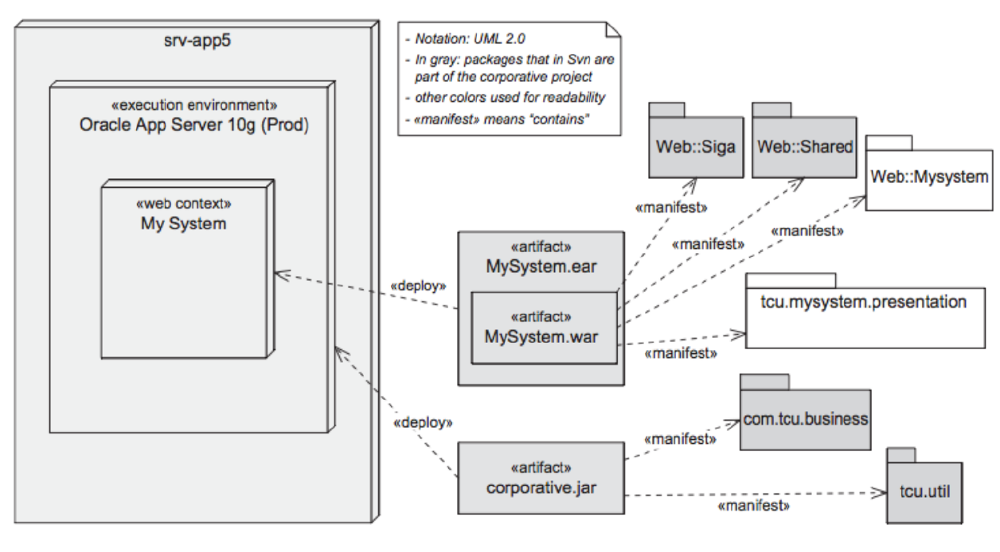

### 文档包

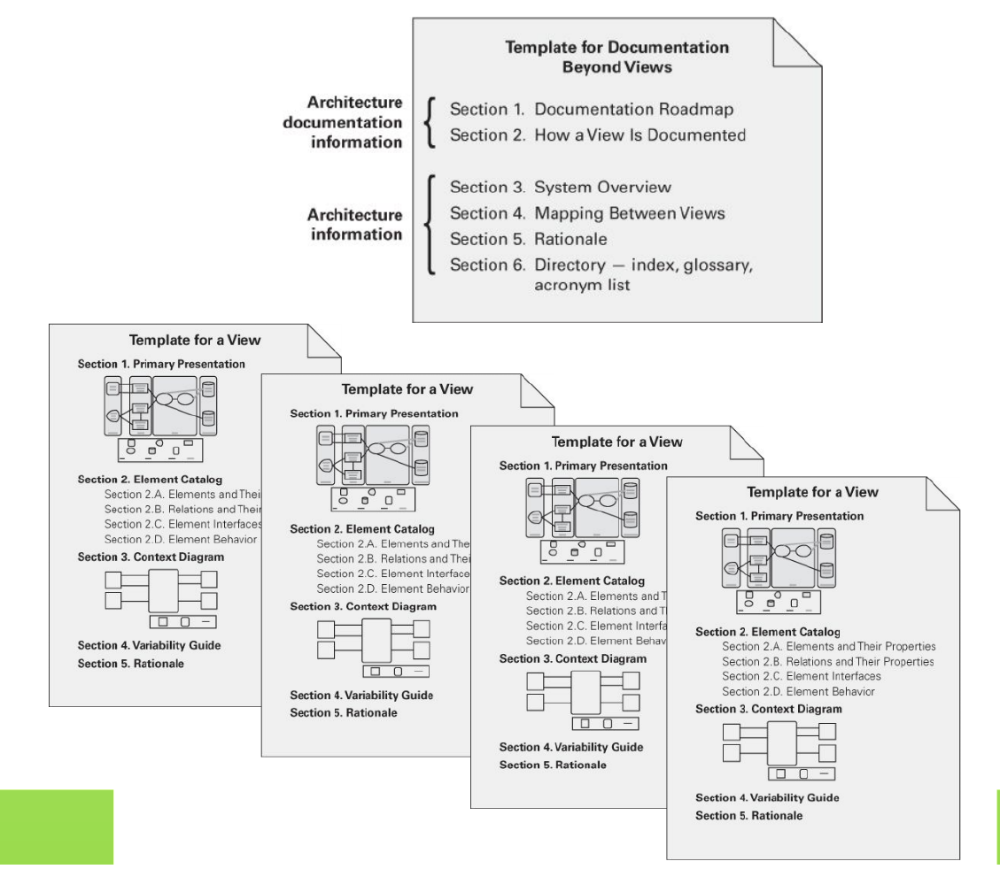

# 评估架构

## 评估方法 ATAM

参与者

输入输出

ASR与项目树中体现出来的重要场景

风险（非风险）：组织形成风险主题，对某一类的ASR，怎样影响商业目标达成

敏感点

权衡点：影响多个ASR

第一个阶段：介绍评估过程、项目经理介绍目标、架构师介绍重要决定和视图、平菇小组如何做设计、一起决定重要场景和形成项目树、对重要场景和使用的设计决定产生对应（是否解决）

第二个阶段：展示第一阶段结果、不能向stakeholder透露项目树（不受之前的设计者和评估者的影响）、头脑风暴收集对stakeholder重要的场景、排序投票、得到列表、与项目树对比、发现不一致、调整列表、形成评估的文档

### ATAM 体系结构权衡分析方法

: Architecture Tradeoff Analysis Method 

ATAM一种进行构架评估的综合方法，ATAM是评估软件构架的一个健壮的方法。在该方法中，项目决策者和涉众要清晰地阐述一个准确的质量属性需求列表（以场景的方式），并说明与实现每个高优先场景相关的构架决策。然后，把这些决策确定为有风险决策或无风险决策，以找到构架中任何存在问题的地方。

ATAM不是需求评估。

ATAM不是代码评估。

ATAM不包括实际的系统测试。

ATAM不是一个准确的手段，但它识别了构架中可能存在风险的区域。这些风险包含在敏感点和权衡中。

### 选择ATAM的原因

通用的架构评估方法（很多其他方法只关心某一个质量属性）

### 四个阶段

#### 阶段 0 ：合作和准备

- 参与者：评估团队领导和主要项⽬决策者
- 输⼊：架构⽂档
- 输出：评价计划

- 谁：涉众的初步名单
- 逻辑：何时？何地？如何？
- 评估报告何时交付给何⼈
- 评估报告包含何种信息

#### 阶段 1 ：评估 1

- 参与者：评估团队和项⽬决策者
- 步骤

1. 展示 ATAM ：评估负责⼈向项⽬代表（决策者）简要介绍 ATAM ，以让他们了解评估过程和
   结果
2. 展示业务驱动因素：项⽬经理或者系统客户从业务⻆度介绍系统概述，描述

1. 它最重要的功能需求
2. 它的技术、管理、经济或政治约束
3. 它的业务⽬标和环境
4. 它的主要涉众
5. 架构驱动因素（塑造架构的主要的质量属性⽬标）

1. 展示架构

1. ⾸席架构师以适当的细节级别进⾏描述
2. 技术限制，如规定使⽤的操作系统、硬件或中间件
3. 系统必须与之交互的其他系统
4. ⽤于满⾜质量属性需求的架构⽅法

1. 确定架构⽅法

1. ATAM 专注于通过理解架构⽅法来分析架构
2. 在这⼀步前，评估团队

1. 研究过架构⽂档
2. 听过架构师的展示
3. 问了架构师关于在设计系统中使⽤的模式、战术的问题

1. 评估团队对已经确定的架构⽅法（样式、模式、战术）进⾏编⽬

1. ⽣成质量属性效⽤树

1. 这是指导分析其余部分的关键步骤
2. 评估团队与项⽬决策者合作，识别、确定优先级并细化系统最重要的质量属性⽬标
3. 质量属性⽬标通过质量属性效⽤树进⾏详细阐述，通过精确定义相关的质量属性需求，使
   需求具体化

1. 分析架构⽅法

1. ⽬标是让评估团队确信该⽅法的实例化适合于满⾜特定属性的需求
2. 评估团队通过要求架构师解释架构如何相互⽀持，⼀次⼀个地检查最⾼排名的场景（来⾃
   效⽤树）
3. 评估团队记录了相关的架构信息，以便在已经做出的架构决定和需要满⾜的质量属性之间
   建⽴某种联系
4. 在这⼀步结束时，评估团队应该清楚地了解整个架构最重要的⽅⾯、关键设计决定的原
   理，以及⻛险、⾮⻛险、敏感点和权衡点的列表

- 输出：

- 架构的简短展示
- 业务⽬标的表达（驱动因素）
- 作为场景实现的特定质量属性需求的优先级列表
- 效⽤树
- ⻛险和⾮⻛险
- 敏感点和权衡点

#### 阶段 2 ：评估 2

- 参与者：评估团队、项⽬决策者和架构涉众
- 步骤

- 重复“步骤 1 ”，展示 ATAM 和之前的结果

- 让涉众理解⽅法和他们扮演的⻆⾊
- 评估负责⼈重述步骤 2 到 6 的结果，并分享输出（效⽤树除外）

1. 头脑⻛暴、定场景优先级

- 这⼀步的⽬的是把握更⼤的涉众群体的脉搏，了解系统成功对他们意味着什么
- 评估团队要求涉众集思⼴益，讨论对其个⼈角色有操作性意义的场景
- ⼀旦收集到场景，涉众被要求对他们认为表示行为或者质量关注点的场景进⾏定优先级和
  合并
- 将优先方案列表与效⽤树中的⽅案列表进⾏⽐较
- 如果差异明显，则可将附加场景确定为⻛险

1. 分析架构⽅法

- 在这⼀步中，评估团队执⾏与步骤 6 相同的活动，使⽤排名最高的但是新生成的场景
- 架构师解释相关的架构决定如何有助于实现每个场景

1. 展示结果

- 评估⼩组根据共同的潜在关注点或系统缺陷，将⻛险划分成⻛险主题
- 确定的⻛险主题随后被关联到步骤 2 中列出的特定业务驱动因素
- 从评估中收集的信息被总结并提交给所有涉众

- 记录的架构⽅法
- 从头脑⻛暴中获取的⼀组场景及其优先级
- 效⽤树
- 发现的⻛险和记录的⾮⻛险
- 找到的敏感点和权衡点
- ⻛险主题和每个主题所威胁的业务驱动因素

- 输出：

- 涉众社区的优先级场景列表
- ⻛险主题和受到威胁的业务驱动因素

#### 阶段 3 ：后续⾏动

- 参与者：评估团队和主要涉众（评估客户）
- 输出：最终评估报告
- 评估团队编写⼀份书⾯的最终报告，分发给关键涉众进⾏评估
- 审查结束后，报告将交给委托进⾏评估的⼈

#### 总结 ATAM 输出

- 架构的简短展示
- 业务⽬标的表达
- 由质量属性场景表达的定优先级的质量属性需求
- 效⽤树
- ⼀组⻛险和⾮⻛险
- ⼀组⻛险主题
- 从架构决定到质量需求的映射
- ⼀组确定的敏感点和权衡点
- 最终评估报告