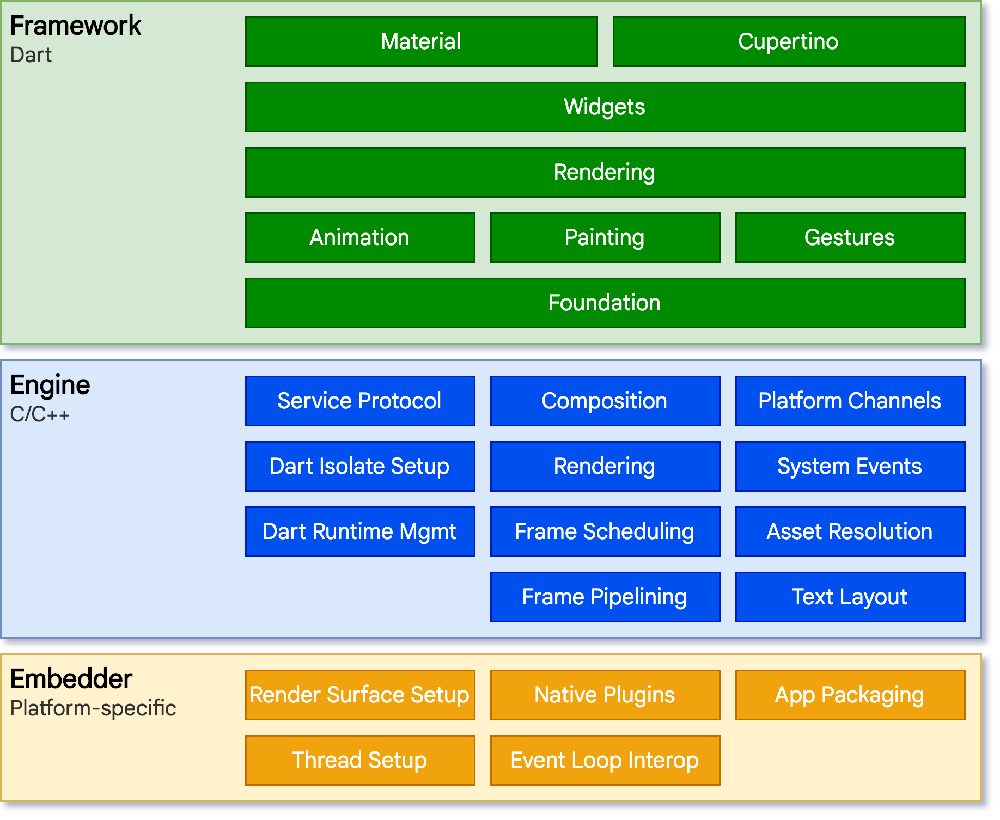

2024.6.28

# Flutter 简介

[1.2 初识 Flutter | 《Flutter实战·第二版》 (flutterchina.club)](https://book.flutterchina.club/chapter1/flutter_intro.html#_1-2-1-flutter-简介)

Flutter 是 Google 推出并开源的移动应用开发框架，主打跨平台、高保真、高性能。开发者可以通过 Dart 语言开发 App，一套代码同时运行在 iOS 和 Android平台。

 Flutter 提供了丰富的组件、接口，开发者可以很快地为 Flutter 添加 Native（即原生开发，指基于平台原生语言来开发应用，flutter可以和平台原生语言混合开发） 扩展。

## flutter的引擎

Flutter 使用自己的高性能渲染引擎来绘制 Widget（组件）。

Flutter 底层使用 Skia 作为其 2D 渲染引擎，Skia 是 Google的一个 2D 图形处理函数库，包含字型、坐标转换，以及点阵图，它们都有高效能且简洁的表现。Skia 是跨平台的，并提供了非常友好的 API，目前 Google Chrome浏览器和 Android 均采用 Skia 作为其 2D 绘图引擎。

## Flutter 高性能

Flutter App 采用 Dart 语言开发。Dart 在 JIT（即时编译）模式下，执行速度与 JavaScript 基本持平。但是 Dart 支持 AOT，当以 AOT模式运行时，JavaScript 便远远追不上了。执行速度的提升对高帧率下的视图数据计算很有帮助。

Flutter 使用自己的渲染引擎来绘制 UI ，布局数据等由 Dart 语言直接控制，所以在布局过程中不需要像 RN 那样要在 JavaScript 和 Native 之间通信，这在一些滑动和拖动的场景下具有明显优势，因为在滑动和拖动过程往往都会引起布局发生变化，所以 JavaScript 需要和 Native 之间不停地同步布局信息，这和在浏览器中JavaScript 频繁操作 DOM 所带来的问题是类似的，都会导致比较可观的性能开销。

### 采用Dart语言开发

这个是一个很有意思但也很有争议的问题， Flutter 为什么选择了 Dart 而不是 JavaScript 

之前提到过的两个概念：JIT 和 AOT

程序主要有两种运行方式：静态编译与动态解释。静态编译的程序在执行前程序会被提前编译为机器码（或中间字节码），通常将这种类型称为**AOT** （Ahead of time）即 “提前编译”。而解释执行则是在运行时将源码实时翻译为机器码来执行，通常将这种类型称为**JIT**（Just-in-time）即“即时编译”。

AOT 程序的典型代表是用 C/C++ 开发的应用，它们必须在执行前编译成机器码；

而JIT的代表则非常多，如JavaScript、python等

事实上，所有脚本语言都支持 JIT 模式。

但需要注意的是 JIT 和 AOT 指的是程序运行方式，和编程语言并非强关联的，有些语言既可以以 JIT 方式运行也可以以 AOT 方式运行，如Python，它可以在第一次执行时编译成中间字节码，然后在之后执行时再将字节码实时转为机器码执行。

也许有人会说，中间字节码并非机器码，在程序执行时仍然需要动态将字节码转为机器码，这不应该是 JIT 吗 ? 是这样，==但通常我们区分是否为AOT 的标准就是看代码在执行之前**是否需要编译**，只要需要编译，无论其编译产物是字节码还是机器码，都属于AOT。==

1. **开发效率高**

   Dart 运行时和编译器支持 Flutter 的两个关键特性的组合：

   - **基于 JIT 的快速开发周期**：Flutter **在开发阶段采用 JIT 模式**，这样就避免了每次改动都要进行编译，极大地节省了开发时间；
   - **基于 AOT 的发布包**: Flutter 在**发布时**可以**通过 AOT 生成高效的机器码以保证应用性能**。而 JavaScript 则不具有这个能力。

2. **高性能**

   Flutter 旨在提供流畅、高保真的 UI 体验。为了实现这一点，Flutter 中需要能够在每个动画帧中运行大量的代码。这意味着需要一种既能保证高性能，也不会出现丢帧的编程语言，而 Dart 支持 AOT，在这一点上可以做得比 JavaScript 更好。

3. **快速内存分配**

   Flutter 框架使用函数式流，这使得它在很大程度上依赖于底层的内存分配器。因此，拥有一个能够有效地处理琐碎任务的内存分配器将显得十分重要，在缺乏此功能的语言中，Flutter 将无法有效地工作。当然 Chrome V8 的 JavaScript 引擎在内存分配上也已经做的很好，事实上 Dart 开发团队的很多成员都是来自Chrome 团队的，所以在内存分配上 Dart 并不能作为超越 JavaScript 的优势，而对于Flutter来说，它需要这样的特性，而 Dart 也正好满足而已。

4. **类型安全和空安全**

   由于 Dart 是类型安全的语言，且 2.12 版本后也支持了空安全特性，所以 Dart 支持**静态类型检测**，可以在编译前发现一些类型的错误，并排除潜在问题，这一点对于前端开发者来说可能会更具有吸引力。与之不同的，JavaScript 是一个弱类型语言，也因此前端社区出现了很多给 JavaScript 代码添加静态类型检测的扩展语言和工具，如：微软的 TypeScript 以及Facebook 的 Flow。相比之下，Dart 本身就支持静态类型，这是它的一个重要优势。

5. **Dart 团队就在你身边**

   看似不起眼，实则举足轻重。由于有 Dart 团队的积极投入，Flutter 团队可以获得更多、更方便的支持，正如Flutter 官网所述“我们正与 Dart 社区进行密切合作，以改进 Dart 在 Flutter 中的使用。例如，当我们最初采用 Dart 时，该语言并没有提供生成原生二进制文件的工具链（这对于实现可预测的高性能具有很大的帮助），但是现在它实现了，因为 Dart 团队专门为 Flutter 构建了它。同样，Dart VM 之前已经针对吞吐量进行了优化，但团队现在正在优化 VM 的延迟时间，这对于 Flutter 的工作负载更为重要。”

## Flutter框架结构

### 1. 框架层

Flutter Framework，即框架层。这是一个纯 Dart实现的 SDK，它实现了一套基础库，自底向上，我们来简单介绍一下：

- 底下两层（Foundation 和 Animation、Painting、Gestures）在 Google 的一些视频中被合并为一个dart UI层，**对应的是Flutter中的`dart:ui`包**，它是 Flutter Engine 暴露的底层UI库，**提供动画、手势及绘制能力**。
- Rendering 层，即**渲染层**，这一层是一个抽象的布局层，它依赖于 Dart UI 层，渲染层会构建一棵由可渲染对象组成的**渲染树**，当动态更新这些对象时，渲染树会找出变化的部分，然后更新渲染。**渲染层可以说是Flutter 框架层中最核心的部分，它除了确定每个渲染对象的位置、大小之外还要进行坐标变换、绘制（调用底层 dart:ui ）**。
- Widgets 层是 Flutter 提供的一套基础组件库，在基础组件库之上，Flutter 还提供了 Material 和 Cupertino 两种视觉风格的组件库，它们分别实现了 Material 和 iOS 设计规范。

Flutter 框架相对较小，因为一些开发者可能会使用到的更高层级的功能已经被拆分到不同的软件包中，使用 Dart 和 Flutter 的核心库实现，其中包括平台插件，例如 [camera (opens new window)](https://pub.flutter-io.cn/packages/camera)和 [webview (opens new window)](https://pub.flutter-io.cn/packages/webview_flutter)，以及和平台无关的功能，例如 [animations (opens new window)](https://pub.flutter-io.cn/packages/animations)。

我们进行Flutter 开发时，大多数时候都是和 Flutter Framework 打交道。

### 2. 引擎层

Engine，即引擎层。毫无疑问是 Flutter 的核心， 该层主要是 C++ 实现，其中包括了 Skia 引擎、Dart 运行时（Dart runtime）、文字排版引擎等。在代码调用 `dart:ui`库时，调用最终会走到引擎层，然后实现真正的绘制和显示。

### 3. 嵌入层

**Embedder，即嵌入层**。Flutter 最终渲染、交互是要依赖其所在平台的操作系统 API，**嵌入层主要是将 Flutter 引擎 ”安装“ 到特定平台上。**嵌入层采用了当前平台的语言编写，例如 **Android 使用的是 Java 和 C++， iOS 和 macOS 使用的是 Objective-C 和 Objective-C++，Windows 和 Linux 使用的是 C++**。 Flutter 代码可以通过嵌入层，以模块方式集成到现有的应用中，也可以作为应用的主体。**Flutter 本身包含了各个常见平台的嵌入层，假如以后 Flutter 要支持新的平台，则需要针对该新的平台编写一个嵌入层。**