md版排版好像有点问题

https://www.yuque.com/suibian-hyei2/md18sc/dgtrw6lw6xgeziz7?singleDoc# 《课程总结-期末复习》

# 过程线

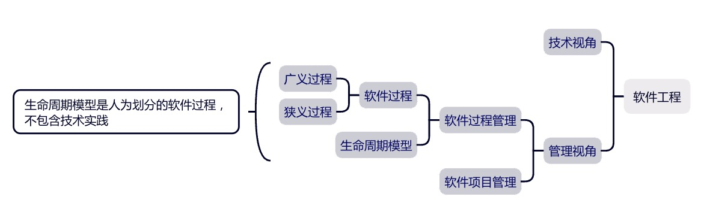

## 什么是管理

### 三个要素，关注学习

管理的三大关键要素：目标、状态（是在接近目标还是在远离目标）和纠偏  

大部分情况下，管理仅仅是试图复制其他地方（场景）的成功，但是这种复制一般不容易 

软件项目管理是为了降低/减少各种无谓的损耗来实现本该有的性能

软件过程改进是为了达到更好的效能，其中质量/缺陷是首要目标或限制  

### 软件项目管理

 **典型的三大目标：成本、质量和工期** 

定义：软件项目管理是应用方法、工具、技术以及人员能力来完成软件项目，实现项目目标的过程 

- 软件项目管理包括估算、计划、跟踪、风险管理、范围管理、人员管理、沟通管理等等 
- 软件项目管理的对象是各类软件项目 

可以细分为两种管理视角：软件过程与生命周期模型  

复现别人的成功-》一样的方法做-》引出过程-》过程复杂，引出生命周期

迭代式和瀑布

迭代式的精髓

瀑布模型的错误观点

## 过程改进

PDCA和IDEAL

CMM/CMMI 不适合当今互联网环境的项目管理需求：**CMM/CMMI 是用来做过程管理和改进的**， 根本不是满足项目管理需求的手段，正确的。  

**CMM（Capability Maturity Model，能力成熟度模型）**和CMMI（Capability Maturity Model Integration，能力成熟度模型集成）是两种用于**指导组织改进其过程和系统**的框架。

 CMM 的创始人是哪位？C A. Boehm B. Juran C. **Humphrey** D. Crosby  

 PDCA 和 IDEAL 不适合在敏捷环境中使用：**PDCA，IDEAL 是软件过程改进参考元模型**，因此是 适合在敏捷环境中使用的，错误的。  

###  广义软件过程  

理论基石：软件产品和服务的质量，很大程度上取决于生产和维护该软件或者服务的过程的质量 

包括：技术、人员以及狭义过程 

同义词：**软件开发方法、软件开发过程** 

- 净室 Clean Room 方法、极限编程方法、Scrum 方法、Gate 方法
- Clean Room 工程过程和 CMM 管理过程互为补充
-  Clean Room 比 CMM 更注重质量，更偏向于使用一些数学工具
- 更一般的，敏捷软件过程/方法、轻量型过程/方法及重型过程/方法等描述也是恰当的  

### 生命周期模型

生命周期模型是对软件过程的一种人为划分

典型生命周期模型：瀑布模型、迭代式模型、增量模型、螺旋模型、原型法等等  

1. 瀑布模型不是单一模型，是一系列模型，覆盖最简单场景（过程元素少）到最复杂的场景（过程元素
   多）
2. 软件项目应该结合实际情况选择合适过程元素的瀑布模型，基本原则是，项目面临困难和挑战越多，
   选择的模型应该越复杂
3. 软件项目团队往往低估项目的挑战，选择了过于简单的不适用的瀑布模型

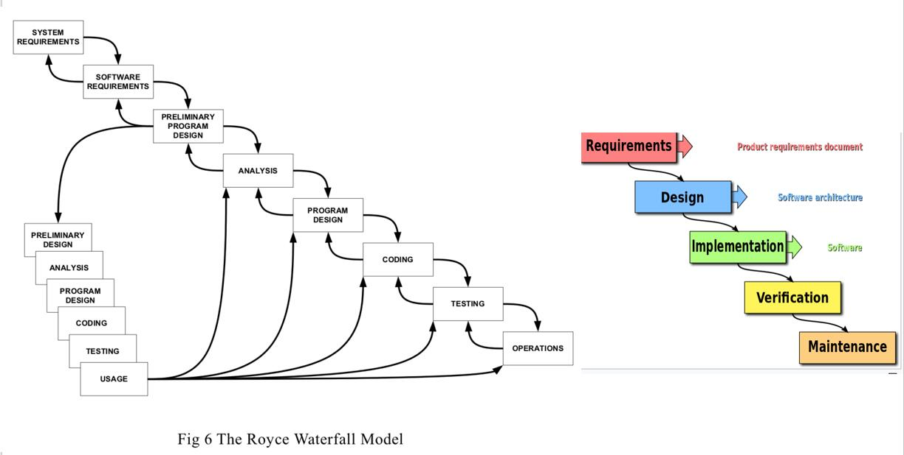

## 过程管理

CMM、CMMI

 **过程管理和过程改进是类似的**  

 在公司导入敏捷过程是我们今年过程改进的主要目标  （对）

### 过程管理/改进模型

#### CMM 与 CMMI

定义：CMM 是一种用于评价软件承包能力并帮助其改善软件质量的方法，侧重于软件开发过程的管理及工程能力的提高与评估。
级别：分五个级别，一级为初始级，二级为可重复级，三级为已定义级，四级为已管理级，五级为优化级

1. 初始级 Initial：处于该级别的组织基本上没有健全的软件工程管理制度。要精确地预测产品的开发实践和费用之类重要的项目，是不可能的。 

1.  CMMI: 开发相对混乱，依赖个人英雄主义，没有过程概念，救火文化盛行  
2. 每件事情都用特殊的方法去做：如果特定工程遇到有能力的管理员和一个优秀的软件开发组来做，则可能是成功的。 
3. 大多数的行动只是应付危机，而非事先计划好的任务。通常的情况是，由于缺乏健全的总体管理 和详细计划，时间和费用经常超支。
4. 软件过程完全取决于当前的人员配置，具有不可预测性。

1. 可重复级 Repeatable：有些基本的软件项目的管理行为、设计和管理技术是基于相似产品中的经验。

1. CMMI : 已管理级 项目小组体现出项目管理的特征，有项目计划和跟踪、需求管理、配置管理等  
2. 采取了一些措施，这些措施是实现一个完备过程所必不可缺少的第一步。
3. 典型措施包括：

1. 仔细地追踪费用和进度。 

1. 不像第一级那样，在危机状态下才行动，管理人员在问题出现时便可发现，并立即采取修正行动，防止它们变成危机
2. 关键一点：没有这些措施，要在问题变得无法收拾前发现它们是不可能的。在一个项目中财务的 措施也可以为未来的项目拟定实现的期限和费用计划。

1.  从 2 级升级到 3 级的原因：固化最佳实践，对小组而言是能够更快地学习其他的做法  

1. 已定义级 Defined：为软件生产的过程编制了完整的文档：软件过程管理方面和技术方面已经做了明确的定义，并且按需要不断地改进过程。采用评审的方法来保证软件的质量。 

1. CMMI： 公司层面有标准流程和相应的规范，每个项目小组可以基于此定义自己的过程，使得优秀的做法可以在 公司内分享  
2. 这个级别可以引用 CASE 环境来进一步提高质量和产生率。
3. 在第一级的过程中，高技术会使得该危机驱动过程更加混乱。

1. 已管理级 Managed：公司对每个项目都设定质量和生产目标。

1.  CMMI:  定量管理级   构建预测模型，以统计过程控制的手段来管理过程  
2. 这两个量将被不断地测量，当偏离目标太多时，就采取行动来修正。
3. 利用统计质量控制，管理部门能区分出随机偏离和有深刻含义的质量或生产目标的偏离。 
4. 统计质量控制措施的一个简单例子：是每千行代码的错误率，相应的目标就是随时间推移减少这个量。

1. 优化级 Optimizing：连续地改进软件过程。

1. CMMI: 继续应用统计方法识别过程偏差，找到问题根源并消除，避免未来继续发生类似问题  
2.  使用统计质量和过程控制技术作为指导。
3.  从各方面获得的知识将被运用在以后的项目中，从而使软件过程融入正反馈循环，使生产率和质量得到稳步的改进。  

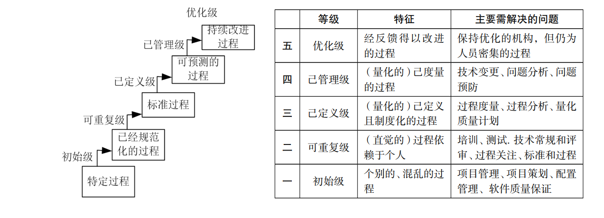

#### CMMI

 CMMI (Capability Maturity Model Integration) 能力成熟度集成模型 

刻画了软件团队/组织从不成熟到成熟的每个阶段的特征（也就是 roadmap

等级 2 和等级 3 关注的是当前状态 

等级 4 和等级 5 是根据结果（未来）来进行管理  

 CMM/CMMI 不适用于软件开发的原因 

- CMM/CMMI 并不是一种具体的软件过程或者软件开发方法

- CMM/CMMI 建立了一组有效地描述成熟软件组织特征的准则 
- CMMI 是**过程改进模型**而**非软件过程或者软件过程模型**：CMMI 指导软件过程改进，不指导开 发 – 按照 CMM/CMMI 模型的要求，一个软件组织应当定义使用本软件组织特点的软件过程，并且不断优化该过程，来更好地实现软件组织的商业目标 
- CMM/CMMI 并不能作为检验软件过程优劣的标准：过程改进对不同企业的含义不一样，成熟度等级无法脱离企业环境直接横向比较 
- CMM/CMMI 与其他软件过程或者软件开发方法的比较是没有任何意义的 

 一些误解：

- CMMI 模型需要适当裁剪以适应公司的实际情况：需要裁剪的是公司内部定义的组织级开发流程和开发规范 
- CMMI 模型太重了，不适合互联网时代的轻量级开发：这个说法的错误之处在于，**不一定是 CMMI 重或者轻**，而是，CMMI 根本就不是开发模型 
-  CMMI 模型只适合大公司、大项目，不适合小项目：首先没人检验过；其次，项目的大小衡量本身 也缺乏值得信赖的参考依据；最后，接受这种说法的人还是把 CMMI 当成是一种特殊的开发模型 
- CMMI 模型只适合需求不变或者很少变化的场合，不适合需求不确定，变化很多的场合：CMMI 不 是开发模型，与需求变化与否无关，谈不上适应或者不适应  

#### PDCA 模型

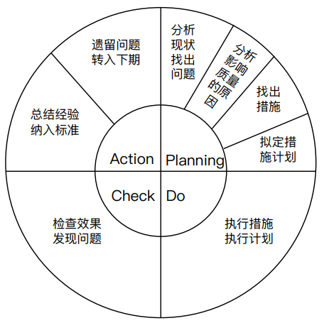

PDCA 模型的步骤：

1. 分析现状，找出问题
2. 分析影响质量的原因
3. 找出措施
4. 拟定措施计划
5. 执行措施，执行计划
6. 检查效果，发现问题
7. 总结经验，纳入标准
8. 遗留问题转入下期 PDCA 循环

#### IDEAL

 IDEAL 模型解决了软件组织在各种质量改进环境下的需要。它包括了软件过程改进周期中的五个阶段， IDEAL 是代表这五个阶段的单词的首字母 

- I: Initiating 初始 
- D: Diagnosing 诊断
-  E: Establishing 建立 
- A: Acting 执行  

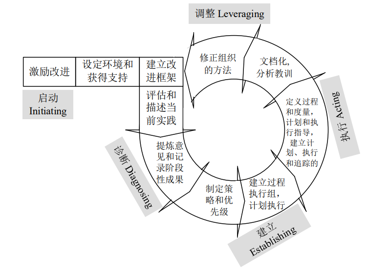

## 历史视角

危机和软件工程

三个阶段、敏捷宣言

软件工程演变的驱动力：本质难题，在不同历史阶段凸显的程度

### 四个难题

- 不可见
- 复杂
- 可变
- 一致性

不可见性 

- 软件是一种“看不见、摸不着”的逻辑实体、不具有空间的形体特征
- 开发人员可以直接看到程序源代码，但是源代码本身并不是软件本身 
- 软件是以机器代码的形式运行，但是开发人员无法看到源代码是如何运行的 

复杂性 

- 对于软件复杂的需求导致了软件的复杂性 

可变性 

- 软件的变化（随时间推移）对其失效率的影响，软件的可变性体现在软件本身升级，功能的变化等

 一致性

- 软件不能独立存在，要依附于一定的环境（如硬件、网络、以及其他软件）
- 软件必须遵循从人为的惯例并适应已有的技术和系统
- 软件需要随从接口不同而变化，随着时间推移而变化，而这些变化是不同人设计的结果  

### 危机

 软件发展的两个趋势： 

- 软件项目规模日益扩大：使得软件越来越难做
- 软件在整个系统中的比重日益增加：将软件质量问题的影响上升到前所未有的高度 

软件危机：指落后的软件生产方式无法满足迅速增长的计算机软件需求，从而导致软件开发与维护过程中出现一系列严重问题的现象。

主要体现有： 

- 软件开发费用和进度失控 
- 软件可靠性差 
- 生产出来的软件难以维护
-  用户对“已完成”系统不满意现象经常发现 

### 软件发展的三大阶段

#### 软硬件一体化阶段：软件完全依附于硬件，软件作坊（50 年代到 70 年代）

-   软件完全依赖于硬件 

- 软件应用典型特征：软件支持硬件完成计算任务、功能单一、复杂度有限、几乎不需要需求变更。 
- 软件开发典型特征：硬件太贵、团队以硬件工程师和数学家为主。 
- 典型软件过程和实践：非常线性、**三思而后行 (measure twice, cut once)**  

-   软件作坊 软件应用典型特征：功能简单、规模小 

- 软件开发典型特征：很多非专业领域人员涌入软件、高级程序语言出现、质疑权威文化盛行 
- 典型软件过程和实践：**Code and Fix**、编码 + 改错  

#### 软件成为独立的产品（70 年代到 90 年代） 

-   软件应用典型特征：摆脱了硬件的束缚 (OS)、功能强大、个人电脑出现 → 普通人成为软件用户 → **需求多变和兼容性要求、来自市场的压力** 
- 典型软件过程和实践：

- 形式化方法：将所有的方法当作数学方法，**做数学化的检验**，主要解决质量和正确性问题
- 结构化程序设计和瀑布模型：自顶向下，逐步求精
- 问题和不足（效率和质量）  

#### 网络化和服务化（90 年代中期至今）  

- 软件应用典型特征：功能更复杂、规模更大、用户数量急剧增加、**快速演化和需求不确定**、分发方法的变化 (SaaS) 
- 典型软件过程和实践：

- **迭代式**（90 年代中后期）大型软件系统的开发过程也是一个逐步学习和交流的过程，软件系统的交 付不是一次完成，而是通过多个迭代周期，逐步来交付。 
- 雪鸟会议和敏捷宣言 

- 个体和互动胜过流程和工具 
- 可以工作的软件胜过详尽的文档 
- 客户合作胜过合同谈判
- 响应变化胜过遵循计划 
- 也就是说，尽管右项有其价值，我们更重视左项的价值 

- XP(eXtreme Programming) 方法：偏重于一些工程实践的描述 
- Scrum: 管理框架和管理实践 
- KanBan 

- 精益生产（丰田制造法）的具体实现 
- 可视化工作流、限定 WIP、管理周期时间 

- 开源软件开发方式： 

- 一种基于并行开发模式的软件开发的组织与管理方式 
-  Linus 定律：如果有足够多的 beta 测试者和合作开发者，几乎所有问题都会很快显现，然后自 然有人会把它解决
- “早发布，常发布，倾听用户的反馈”、“把你的用户当作开发合作者对待，如果想让代码质量快 速提升并有效排错，这是最省心的途径”、“设计上的完美不是没有东西可以再加，而是没有东 西可以再减” 
- 代码管理：严格的代码提交社区审核制度、内部开源 (inner source)、众包 (Crowdsourcing)  

## 敏捷开发

### 敏捷原则

1. 最重要的是通过尽早和不断交付有价值的软件 满足客户需要
2. 欢迎需求的变化
3. 经常交付可以工作的软件，从几星期到几个月， 时间尺度越短越好
4. 业务人员和开发者应该在整个项目过程中始终 朝夕在一起工作
5. 最好的信息传达方式是面对面的交谈

## XP 方法

 极限的含义是指把好的开发实践运用到极致  

 极限编程的有效实践 

- 客户作为开发团队的成员——**客户代表**
- 使用用户素材
- **短交付周期** 
- 验收测试
- **结对编程**——结对编程就是由两名开发人员在 同一台计算机上共同编写解决同一个问题的程 序代码，通常一个人编码，另一个人对代码进行审查与测试，以保证代码的正确性与可读性。 结对编程是加强开发人员相互沟通与评审的一 种方式
- **测试驱动开发**——极限编程强调“测试先行”。 在编码之前，应该首先设计好测试方案，然后再编程，直至所有测试都获得通过之后才可以 结束工作 
- 集体所有
- **持续集成**
- **可持续的开发速度 ≤40h/week** 
- 开放的工作空间
- 重构
- 使用隐喻  

##  Scrum  

 迭代式增量软件开发过程：  

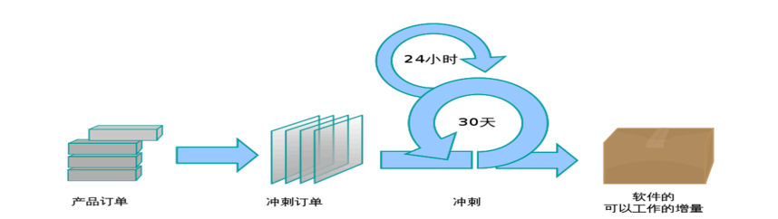

### Scrum 中的文档：

- 产品订单 (product backlog)：整个项目的概要文档，包含了已划分优先等级的、项目要开发的系统或产品的需求清单，是动态的 
- 冲刺订单 (sprint backlog)：细化了的文档，包含了团队如何实现下一个冲刺的需求信息 

- 哪些产品订单会加入一次冲刺由冲刺计划会议决定。会议中，产品负责人告诉开发团队他们需要完成产品订单中的哪些订单项，开发团队决定在下一次冲刺中承诺完成多少订单项
- 在冲刺的过程中，没有人能够变更冲刺订单，这意味着在一个冲刺中需求是被冻结的 

-  燃尽图 (burn down chart) 

### Scrum 中角色：

- **产品负责人**，代表利益所有者 

- 产品负责人的职责是将开发团队开发的产品价值最大化 
- **产品负责人是负责管理产品待办列表的唯一负责人**。
- 产品待办列表的管理包括：

-  清晰地表述产品待办列表项
- 对产品待办列表项进行排序，使其最好地实现目标和使命
- 优化开发团队所执行工作的价值 
- 确保产品待办列表对所有人是可见、透明和清晰的，同时显示 Scrum 团队下一步要做的工 作
- 确保开发团队对产品待办列表项有足够深的了解

-  **Scrum Master,** 类似于项目经理，负责**维护过程和任务** 

-  促进和支持 SCRUM

- 帮助每个人理解 SCRUM 理论、实践、规则和价值 

- SCRUM Master 是一位**服务型领导** 

- 帮助 SCRUM 团队之外的人了解如何与 SCRUM 团队交互是有益的 
- 改变 SCRUM 团队之外的人与 SCRUM 团队的互动方式来最大化 SCRUM 团队所创造的 价值

- **Scrum Master 服务于产品负责人**，包括：

- 确保 Scrum 团队中的每个人都尽可能地理解目标、范围和产品域 
- 找到有效管理产品待办列表的技巧
- 帮助 Scrum 团队理解为何需要清晰且简明的产品待办列表项 ∗ 理解在经验主义的环境中的产品规划
- 确保产品负责人懂得如何来安排产品待办列表使其达到最大化价值 
- 理解并实践敏捷性
- 当被请求或需要时，引导 Scrum 事件

- Scrum Master 以各种方式服务于开发团队，包括： 

- 作为教练在自组织和跨职能方面给予开发团队以指导 
- 帮助开发团队创造高价值的产品 
- 移除开发团队工作进展中的障碍
- 按被请求或需要时，引导 Scrum 事件
- 在 Scrum 还未完全采纳和理解的组织环境中，作为教练指导开发团队

- Scrum Master 以各种方式服务于组织，包括：

- 带领并作为教练指导组织采纳 Scrum 
- 在组织范围内规划 Scrum 的实施 
- 帮助员工和利益攸关者理解并实施 Scrum 和经验导向的产品开发
- 引发能够提升 Scrum 团队生产率的改变
- 与其他 Scrum Master 一起工作，增强组织中 Scrum 应用的有效性 

- **开发团队** 

- 负责在每个 Sprint 结束时交付潜在可发布并且“完成”的产品增量。
-  开发团队由组织组建并得到授权，团队自己组织和管理他们的工作。开发团队具有下列特点：

- 他们是自组织的。没有人（即使是 Scrum Master）有权告诉开发团队应该如何把产品待办 列表变成潜在可发布的功能增量
- 开发团队是跨职能的团队，团队作为一个整体，拥有创建产品增量所需的全部技能
-  Scrum 不认可开发团队成员的任何头衔，不管其承担何种工作（他们都叫开发人员）
-  Scrum 不认可开发团队中所谓的“子团队”，无论其需要处理的领域是诸如测试、架构、运 维或业务分析 ∗ 开发团队中的每个成员也许有特长和专注的领域，但是责任属于整个开发团队  

## Scrum VS. XP 

- 迭代周期不同。

- **XP 迭代周期为 1 ∼ 2 周，而 Scrum 迭代周期为 2 ∼ 4 周**

- 迭代中是否允许需求变更。

- **XP 中只要变更需求与原需求所需时间资源相等即可变更，而 Scrum 在 迭代中需求被冻结** 

- 迭代中，需求是否严格按照优先级来实现。

- **XP 中务必遵守优先级别，Scrum 中则比较灵活**，原因是可能有需求依赖问题 

- 过程工程化

- Scrum 开发过程并未工程化，要求开发者自觉保证
- 但 **XP 则对开发流程定义严格，例 如 TDD，结对编程，重构**等  

请结合 SCRUM 这种敏捷方法论述敏捷方法应该具备的特征？同时解释为何常见的若干种描述敏捷方法对立面的方法的特征（例如，严格、重型、计划驱动等等）并不合适？
特征：**1. 小周期迭代；2. 快速响应变更；3. 价值交付；4. 自动化**
特征解释：

1. 严格：所有优秀的工程方法和实践都是严格的
2. 重型：如上，此外，轻量级和重型其实并没有刻画具体方法，何为重型，并没有严格定义；而且，对 于变更这件事情，几乎所有方法都是限制，因此，很难说敏捷方法是轻量级方法
3. 计划驱动：所有正式的项目都是计划驱动的，否则计划的作用无法体现

# Devops

## Devops 的特点，为什么流行？  

1. **自动化**：DevOps强调使用自动化工具来处理重复性的任务，如代码构建、测试、部署和监控。自动化减少了人为错误，提高了效率和一致性。
2. **持续集成和持续部署（CI/CD）**：DevOps鼓励频繁地将代码集成到共享仓库中，并通过自动化测试来验证集成。持续部署则确保代码的任何变更都可以快速、安全地部署到生产环境中。
3. **协作文化**：DevOps打破了开发（Dev）和运维（Ops）之间的壁垒，鼓励跨部门协作和沟通。这种文化促进了更快的问题解决和更好的软件交付。
4. **基础设施即代码（IaC）**：在DevOps中，基础设施的管理（如服务器、网络和存储）是通过代码来完成的，这使得基础设施的配置和管理可以版本化、自动化和重复使用。
5. **监控和告警**：DevOps实践包括对应用程序和基础设施的持续监控，以便及时发现问题并自动告警，从而快速响应和解决问题。
6. **迭代改进**：DevOps鼓励不断的实验和改进。通过反馈循环，团队可以学习、调整和优化他们的工作流程和产品。

DevOps之所以流行，主要是因为它解决了传统软件开发和运维过程中的许多痛点：

- **缩短上市时间**：通过自动化和协作，DevOps能够加快软件开发和发布的速度，帮助企业在竞争中保持领先。
- **提高质量和可靠性**：自动化的测试和部署流程减少了人为错误，提高了软件的质量和稳定性。
- **增强可伸缩性**：DevOps实践使得应用程序和基础设施的管理更加灵活，能够快速适应不断变化的需求。
- **促进创新**：DevOps文化鼓励快速迭代和实验，这有助于创新想法的快速实现和验证。
- **改善工作环境**：DevOps通过自动化减少了枯燥的重复工作，让开发者和运维人员可以专注于更有价值的任务，提高了工作满意度。

## Devops 三个步骤

1. 持续集成（Continuous Integration, CI） 持续集成是指开发人员将代码频繁地合并到共享的主干分支中。每次合并后，自动化的构建和测试流程会被触发，以确保新提交的代码不会破坏现有的功能。持续集成的目标是快速发现和解决集成过程中的冲突和错误，确保代码库的稳定性。
2. 持续交付（Continuous Delivery, CD） 持续交付是在持续集成的基础上，确保每次代码提交到主干分支后，都能够生成一个随时可以部署到生产环境中的软件版本。这意味着除了自动化测试外，还需要自动化部署脚本和配置管理，以便在通过所有测试后，软件可以快速且可靠地被部署。
3. 持续部署（Continuous Deployment, CD） 持续部署是持续交付的进一步发展，指的是自动将软件部署到生产环境的过程。与持续交付不同的是，持续部署不依赖于手动触发部署，而是完全自动化。这意味着每当有新的代码通过所有测试并被推送到主干分支，自动化流程就会将其部署到生产环境，实现快速迭代和持续改进。

##  什么是云原生？相关的重要的概念  

云原生（Cloud Native）是指构建和运行应用程序的方法，它**充分利用了云计算的灵活性、可扩展性和弹性。**云原生应用程序专为在云环境中部署和运行而设计，它们通常由微服务组成，容器化，动态管理，并通过持续集成和持续部署（CI/CD）管道进行自动化部署。

云原生相关的重要概念包括：

1. **微服务架构（Microservices）**：微服务是一种设计方法，它将应用程序分解为一组小的、独立的、松散耦合的服务。每个服务都围绕特定的业务功能构建，可以独立部署、升级和扩展。
2. **容器化（Containerization）**：容器是一种轻量级的运行时环境，它将应用程序及其依赖项打包在一起，确保在不同的计算环境中有一致的运行行为。Docker是容器化技术的一个流行示例。
3. **容器编排（Container Orchestration）**：随着容器数量的增加，需要工具来管理这些容器的生命周期，包括部署、扩展、网络和存储管理。Kubernetes是目前最流行的容器编排工具。
4. **服务网格（Service Mesh）**：服务网格是一种管理服务间通信的基础设施层。它通常以sidecar模式运行，与主应用程序容器并行部署，处理服务发现、负载均衡、故障恢复和安全性等问题。Istio和Linkerd是流行的服务网格实现。
5. **基础设施即代码（Infrastructure as Code, IaC）**：基础设施即代码是一种使用代码来管理和配置基础设施的方法。通过定义文件和自动化工具，可以版本化、测试和重复使用基础设施配置。Terraform和Ansible是IaC工具的示例。
6. **持续集成和持续部署（CI/CD）**：持续集成是指频繁地将代码更改集成到共享仓库中，并通过自动化构建和测试来验证它们。持续部署则确保经过验证的代码可以自动部署到生产环境中。
7. **声明式APIs**：声明式APIs允许用户指定他们希望达到的状态，而不是指定达到该状态所需的步骤。在云原生环境中，声明式APIs使得应用程序和基础设施的管理更加简洁和可重复。
8. **不可变基础设施（Immutable Infrastructure）**：不可变基础设施是指一旦创建就不会被更改的基础设施。如果需要更新或修复，不是在原有实例上打补丁，而是替换为新的实例。这种方法可以确保环境的可重复性和一致性。
9. **云服务提供商（Cloud Service Providers, CSPs）**：云服务提供商如Amazon Web Services (AWS), Microsoft Azure, Google Cloud Platform (GCP)等，提供了云原生应用程序所需的计算、存储、网络和其他服务。

##  精益屋的两大支柱？  

准时化是在生产系统的所有阶段和流程中按时按需生产和交付产品。自动化与自働化的不同之处在于，前者需要人工操作员在机器出现故障时将其停止，而后者机器本身可以确定是否需要自动停止以应对异常情况。

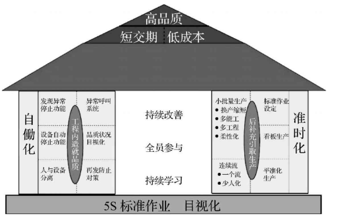

##  JIT 及时生产，价值流和价值拉动的关系  

目标：消除不必要的生产流程，专注于增值步骤，以提高效率和质量。

需以下二者实现。

价值流：将产品或服务从开发到交付所需的步骤和活动。

价值拉动：协调部门之间的材料和信息流，以确保只生产所需的产品。

## 概念解释

1. **CI（Continuous Integration，持续集成）**： 持续集成是一种软件开发实践，其中开发人员会定期将他们的代码更改合并到共享的主干分支中。每次合并后，自动化的构建和测试流程会被触发，以确保新提交的代码不会破坏现有的功能。持续集成的目标是快速发现和解决集成过程中的冲突和错误，确保代码库的稳定性。
2. **CI/CD（Continuous Integration/Continuous Deployment，持续集成/持续部署）**： CI/CD是一组实践，它结合了持续集成（CI）和持续部署（CD）或持续交付（Continuous Delivery）。持续部署或持续交付是指自动将经过集成的代码部署到生产环境的过程。CI/CD的目的是实现更快、更可靠的软件交付，同时保持高质量。
3. **Pipeline Orchestration（管道编排）**： 管道编排是指管理和自动化软件交付管道中各个步骤的过程。这包括源代码控制、构建、测试、部署等。编排工具如Jenkins、GitLab CI/CD、Argo CD等，可以帮助组织自动化这些流程，确保它们按照预定的顺序和条件执行。
4. **Container（容器）**： 容器是一种轻量级的运行时环境，它将应用程序及其依赖项打包在一起，确保在不同的计算环境中有一致的运行行为。容器与虚拟机相比，具有更快的启动时间、更高的资源效率和更好的可移植性。Docker是容器化技术的一个流行示例。
5. **Micro Service（微服务）**： 微服务是一种设计方法，它将应用程序分解为一组小的、独立的、松散耦合的服务。每个服务都围绕特定的业务功能构建，可以独立部署、升级和扩展。微服务架构有助于提高应用程序的灵活性和可维护性，但也带来了服务间通信和协调的复杂性。
6. **A/B Testing（A/B测试）**： A/B测试是一种实验方法，用于比较两个或多个版本的网页或应用程序的性能。通过向不同的用户群体展示不同的版本，并测量各个版本的性能指标（如转化率、点击率等），可以确定哪个版本更有效。A/B测试有助于优化用户体验和提高业务成果。
7. **GitFlow**： GitFlow是一个围绕Git的扩展工作流程，它为项目的版本控制提供了一套规范的操作流程。GitFlow使用多个分支来管理不同类型的工作，包括主分支（master）、开发分支（develop）、功能分支（feature）、发布分支（release）和修复分支（hotfix）。每个分支都有其特定的用途，有助于管理大型项目和团队协作。

#  项目管理

## 概念

管理的三大目标

成本、时间、质量

## 团队动力学

### 自主团队

 一个团队必须包括至少两个成员，他们为了**共同的目标和愿景而**努力工作，他们每个人都有**明确的角色 和相应的职责定义**，任务的完成需要团队成员**互相依赖和支持**  

#### 自主团队的特点

1. **自行定义项目的目标**
2. **自行决定团队组成形式以及 成员的角色**
3. **自行决定项目的开发策略**
4. **自行决定项目的开发过程**
5. **自行制定项目的开发计划**
6. **自行度量、管理和控制项目 工作**

####  自主团队的必要性

1. 自主团队可以形成“胶冻态团队”。在这样的团队中存在一种神奇的力量，这种神奇力量弥漫于该团 队做的所有工作
2. 团队成员互相支持，更为重要的是，团队成员在任何时刻都知道应该以怎样的方式帮助别人；团队成 员相互信任，有强烈的归属感
3.  团队在适当的知道会聚集在一起，研究现状，讨论策略  

####  自主团队的外部环境 

项目启动阶段获得管理层的支持 

1. 项目小组应当表现出已经尽最大的可能在满足 管理层的需求的工作态度
2.  项目小组应当在计划中体现定期需要向管理层 报告的内容
3.  项目小组应当向管理层证明他们所制定的工作 计划是合理的 
4. 项目小组应当在项目中体现为了追求高质量而 开展的工作 
5. 项目小组应当在工作计划中允许必要项目变更
6. 项目小组应当向管理层寻求必要的帮助 

在项目进展过程中获得管理层的支持 

1. 项目小组应当严格遵循定义好的开发过程开展 项目开发过程
2.  项目小组应当维护和更新项目成员的个人计划 和团队计划
3.  项目小组应当对产品质量进行管理 
4. 项目小组应当跟踪项目进展，并定期向管理层 报告
5.  项目小组应当持续地向管理层展现优异的项目 表现  

### 知识工作的特点

知识工作者只能自我管理不能被管理

 管理者无法管理工作者，知识工作者必须实现并学会自我管理  

## 领导者和普通经理的差异

- 经理倾向于**告知**团队成员该做什么以及该怎么做；领导者则善于**倾听**团队成员的想法并加以分析和改进。
- 经理倾向于**指导**团队成员的工作方式；而领导者则善于通过**询问**来诱导团队成员向着正确的方向前进。
- 经理倾向于**说服**团队成员；而领导者则善于通过**激励以及设定挑战目标**等方式吸引团队成员努力表现。
- 当出现不一致意见的时候，经理倾向于做出**决定**；而领导者则善于**提供各种沟通方式**促成团队达成一致意见。
- 经理倾向于**控制**团队成员；而领导者则**培养**团队成员技能。
- 经理倾向于**监督**团队成员；而领导者则**鼓励**建立起合理的授权机制。
- 经理倾向于**设定目标**；而领导者则通过**挑战**建立目标，确定团队努力方向。

倾听、询问、激励、沟通、培养、鼓励、挑战

## 激励手段

### 三种主要的激励方式

- 威逼
- 利诱
- 鼓励承诺：位于马斯洛需求理论的4级以上，应当是主要的方式，并且最好以团队为单位做承诺

前两者对应交易型领导方式；第三种对应转变型领导方式

### 马斯洛

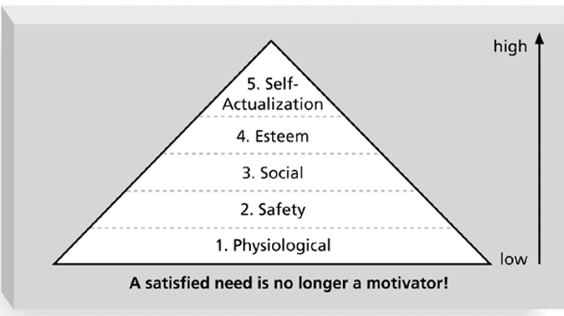

- 自我实现是最高的层次
- 激励来自为没有满足的需求而努力奋斗
- 低层次的需求必须在高层次需求满足之前得到满足
- 满足高层次的需求的途径比满足低层次的途径更为广泛

### 如何维持激励（和激励区分）

需要及时的绩效反馈。包含：

- 根据一个详细计划衡量进度
- 当前计划不准确时重做计划
- 为漫长而富有挑战性的项目提供中间反馈，即里程碑

## 期望理论

 人们在下列情况下能够收到激励并且产生出大量成果 M = V × E 

1. 相信他们的努力很可能会产生成功的结果 (V) 
2. 相信自己因为成功而得到相应的回报 (E) Motivation = Valence × Expectancy(Instrumentality)，即激发力量 = 效价 × 期望值
3. M 表示激发力量，是指调动一个人的积极性，激发人内部潜力的强度
4.  V 表示目标价值（效价），这是一个心理学概念，是指达到目标对于满足他个人需要的价值。同一目 标，由于各个人所处的环境不同，需求不同，其需要的目标价值也就不同。同一个目标对每一个人可 能有三种效价：正、零、负。效价越高，激励力量就越大
5.  E 是期望值，是人们根据过去经验判断自己达到某种目标的可能性是大还是小，即能够达到目标的 概率。目标价值大小直接反映人的需要动机强弱，期望概率反映人实现需要和动机的信心强弱  

## X-Y 理论

 麦克勒格的 X-理论：

人性本恶，独裁式的管理风格 

1. 不喜欢他们的工作并努力逃避工作
2. 缺乏进取心，没有解决问题与创造的能力
3.  更喜欢经常的指导，避免承担责任，缺乏主动 性
4.  自我中心，对组织需求反应淡漠，反对变革
5.  用马斯洛的底层需求（生理和安全）进行激励 

麦克勒格的 Y-理论：

人性本善，民主式的管理风格

1. 如果给予适当的激励和支持性的工作氛围，会 达到很高的绩效预期 
2. 具有创造力，想象力，雄心和信心来实现组织 目标
3. 能够自我约束，自我导向与控制，渴望承担责 任
4. 用马斯洛的高层需求（自尊和自我实现）进行 激励  

## TSP Launch 九次会议

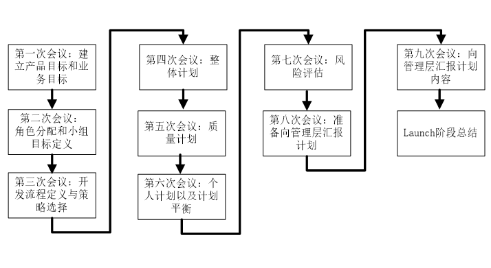

## SCRUM的角色与职责

一名产品负责人、开发团队和一名SCRUM Master

稍微看下各自职责

- 产品负责人：将开发团队开发的产品价值最大化
- 开发团队：在每个Sprint结束时交付潜在可发布并且“完成”的产品增量
- SCRUM Master：相当于项目经理，促进和支持SCRUM、帮助每个人理解SCRUM理论、实践、规则和价值

## TSP的角色以及对应的简单职责

1. **项目组长**

1. 激励团队成员努力工作
2. 主持项目周例会
3. 每周汇报项目状态
4. 分配工作任务
5. 维护项目资料
6. 组织项目总结

1. **计划经理**

1. 带领项目小组**开发项目计划**
2. 带领项目小组**平衡计划**
3. **跟踪项目进度**
4. 参与项目总结

1. **开发经理**

1. 带领团队制定**开发策略**。
2. 带领团队开展产品**规模估算**和所需时间资源的估算。
3. 带领团队开发**需求规格说明**。
4. 带领团队开发**高层设计**。
5. 带领团队开发**设计规格说明**。
6. 带领团队**实现软件产品**。
7. 带领团队开展**集成测试和系统测试。**
8. 带领团队开发**用户支持文档**。
9. 参与项目总结

1. 质量经理

1. 带领团队**开发和跟踪质量计划**
2. 向项目组长警示质量问题
3. 软件产品提交配置管理之前，对其进行**评审**，以消除质量问题
4. 项目小组评审的组织者和协调者
5. 参与项目总结

1. 过程经理

1. 带领团队定义和**记录开发过程并且支持过程改进**。
2. 建立和维护团队的开发标准。
3. 记录和维护项目的会议记录。
4. 参与项目总结。

1. 支持经理

1. 带领团队识别开发过程中所需要的各类工具和设施。
2. 主持配置管理委员会，管理配置管理系统。
3. 维护软件项目的词汇表。
4. 维护项目风险和问题跟踪系统。
5. 支持软件开发过程中复用策略的应用。
6. 参与项目总结。

1. 开发人员

## 估算与计划

- 估算要点：不是准确数字而是达成共识的过程

- 抽象的相对的估算
- 设置合理的代理作为**精确度量**和**早期规划**需要的度量之间的桥梁：相对大小矩阵
- 相对大小而非绝对大小

- PROBE方法：相对大小矩阵
- SCRUM故事点：斐波那契
- 通用计划框架：哪些自动化哪些人为
- 各类计划：

- 质量
- 风险

- 定量管理计划（构建模型，x，y，z）

- 过程模型
- 过程能力基线
- 过程组合：

- 关键子过程性能目标
- 整体过程性能目标

## PROBE

1. 以 LOC VS. FP 为例

1. **精确度量**方式往往不便于**早期规划**/估算；
2. 有助于**早期规划**/估算的度量往往难以产生**精确度量**结果；

1. PROBE(PROxy Based Estimation)的作用：**精确度量**和**早期规划**之间的桥梁

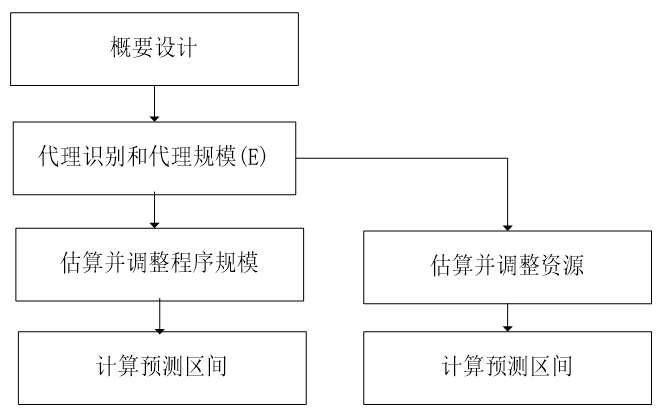

### 估算的四个要点

1. **尽可能划分详细一些**
2. **建立对结果的信心**
3. **依赖数据**
4. **估算要的是过程，而非结果；估算的过程是相关干系人达成一致共识的过程**

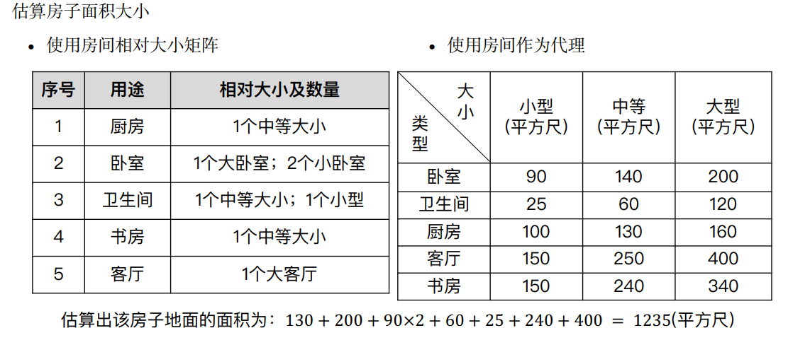

###  PROBE 方法思想 

在 PROBE 估算中，需要建立自己的代码库，以跟踪所有程序的规模和工作量，而代码库中的每个组件 都有设定的类型（计算、逻辑或数据等）和规模（非常小、小、中、大、非常大） 

- 如果新建立的组件与以前建立的组件类似，那么新组件所需的工作量与旧组件一样 
- 当开始一个新项目时，我们可以将任务划分成与代码库中组件相似的类型和规模，然后利用线性回归方法来估算项目的工作量 

估算本质上是一种猜测，追求的目标是一致性以及估算结果的使用者对估算结果的信心

- PROBE 方法通过定义估算过程和数据收集以及使用的框架，使得估算结果可以尽可能一致，从而使得一些统计方法可以用来调整估算结果，增强用户对估算结果的信心 
- PROBE 方法非常依赖高质量的历史数据，一旦数据不完整或缺失，会导致估算结果有明显偏差  
-  时间估算  ：

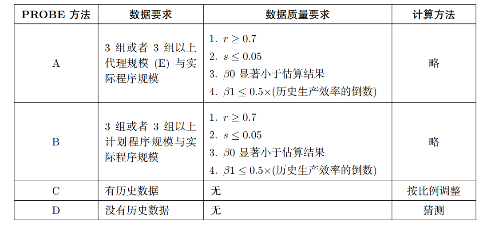

-  规模估算：  
- 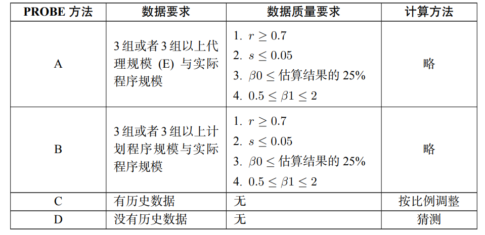

1. 谈谈你对项目估算的认识，并简要解释应用 PROBE 方法估算的优缺点  

估算四要点：划分详细、相信结果、依赖数据、重要的是过程

1. PROBE 估算的原理

1. PROBE 估算的基本流程

- 概要设计：  

-  确定产品功能，以及产生这些功能所需的程序组件/模块 
- 将程序组件/模板与你之前写的程序相比较，估 算它们的规模
-  最后将程序组件/模块估算综合给出总规模  

1.  请简要描述按照通用计划框架，为了开发合理的项目计划，应该要做哪些估算？PROBE 方法充当什么角色。  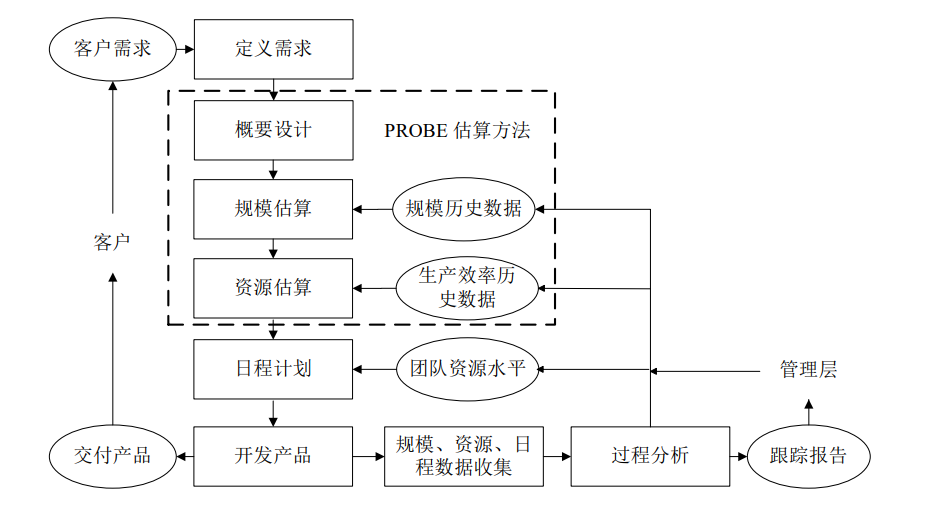

 估算框架如上图，虚线框即为 PROBE，用来完成规模和资源的评估  

规模和资源估算，PROBE 充当早期规划和精确度量的桥梁

1.  使用 PROBE 方法估算时间的时候，为什么不使用历史数据中的生产效率数据？

 在估算资源需求（例如，人时）的时候，生产效率一般在分母上，考虑到个体软件工程师生产效率波动， 容易导致估算偏差范围变大。

1.  请解释规模估算和资源估算中估算偏差含义之间的差异，并据此简要列举对软件开发活动的启发？ 

基于风险分析平衡敏捷与规范

敏捷风险 > 计划驱动风险，启用基于风险的计划驱动方法

 计划驱动风险 > 敏捷风险，启用基于风险的敏捷方法

不能判断，则通过架构把敏捷部分封装起来，在敏捷部分使用基于风险的敏捷方法，在其他地方启用 基于风险的计划驱动方法  

### SCRUM 的故事点

度量实现一个故事（Story）需要付出的工作量

抽象：混合了对于开发特性（feature）所要付出的努力、开发复杂度、个中风险以及类似东西

相对：设定标准之后，考虑其他特性（feature）与标准之间的相对大小关系

Fibonacci: 0, 1, 1, 2, 3, 5, 8, 13, 21,34, 55, 89

拆分

## 通用计划

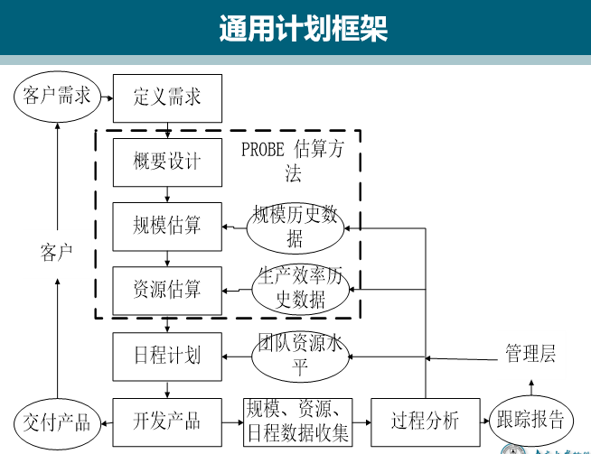

## 跟踪

- 挣值管理体系 ：只能管理成本和工期

- 天然支持软件工程：支持动态变更
- 相对保守的策略：彻底完成
- 燃尽图

- 定量管理的跟踪（自底而上）

### EVM的三种不同的实现

 项目的挣值管理方法 (EVM, Earned Value Managerment) 是用来客观度量项目进度的一种项目管理方法

- 每项任务实现附以一定价值 (credit)
- 100% 完成该项任务，就获得相应的价值  

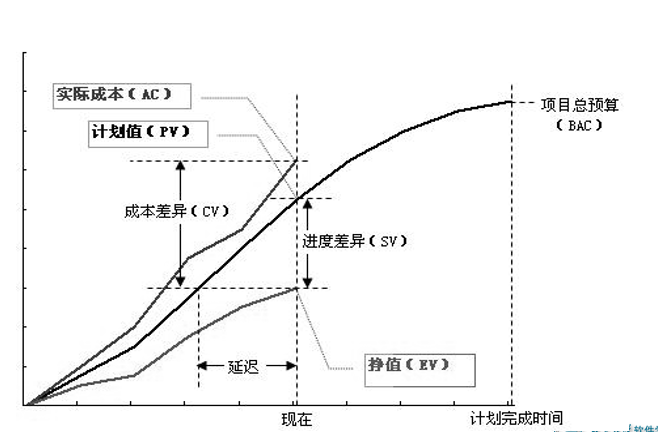

简单实现： 仅仅关注进度信息  

-  实现方式

-  首先需要建立 WBS，定义工作范围
-  其次为 WBS 中每一项工作定义一个计划价值 (PV, Planned Value)
- 最后按照一定的规则将某一数值赋给已经完成的工作或者正在进行的工作，该值成为挣值 (EV, Earned Value)

-  常用规则

- 0-100 原则：只有当某项任务完成时，该任务的 PV 值将转化成 EV 值
-  50-50 原则：只需要开始某项任务，即可以赋原 PV 值的 50% 作为 EV 值，完成时，再加上另 外的 50% 
- 实际完成的工作所需成本 AC 不对 EV 值产生任何影响  

中级实现： 在简单实现的基础上，加入日程偏差的计算，加入了成本线 (AC) 

- 典型计算方式有
- 日程偏差 SV = EV − PV
- 日程偏差指数 SPI = EV/PV；  

高级实现： 添加预测线 (BAC)，当任务足够多的时候，我们就可以让预测线尽可能平直，同时我们延伸 挣值 (EV)，找到与预测线 (BAC) 的交点，我们就可以明确项目的落后时间  

1. BAC表示按照PV值的曲线，当项⽬完成的时候所需预算或者时间
2. 成本差异CV = EV-AC，表示的是已经完成的⼯作与所消耗的成本的差异。可以表示为消耗的时间，也可以表示为消耗的资⾦。
3. 成本差异指数CPI = EV/AC，表示单位成本创造的价值

1. CPI<1说明成本超⽀
2. CPI=1说明成本与预期⼀致
3. CPI>1说明成本低于预期。

1. ⽇程偏差SV = EV – PV，表示进度偏差。

1. SV<0表示进度落后；SV=0表示进度正常
2. SV>0表示进度超前。

1. ⽇程偏差指数SPI = EV/PV
2. 预计完成成本EAC = AC+(BAC-EV)/CPI = BAC/CPI，表示的是按照⽬前的进展已经成本消耗情况，整个项⽬完成的时候所需消耗的成本。

### 燃尽图

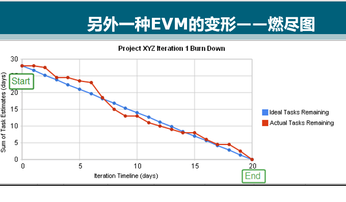

什么时候比进度快，什么时候比进度慢

1. 燃尽图是**简单的挣值管理的变形。**
2. 他是剩下的工作占的百分比

### EVM的局限性

- **一般不能应用软件项目的质量管理**：智能管理成本和工期
- 需要定量化的管理机制，这就使其在一些探索型项目以及常用的敏捷开发方法中的应用受到限制
- **完全依赖项目的准确估算**，然而在项目早期，很难对项目进行非常准确的估算

 下列关于挣值管理方法的描述中错误的是？C

A. 这是一种可以用来跟踪项目预算消耗的方法 

B. 这种方法高度依赖估算准确性 

C. 这种方法可以支持质量管理 

D. 这种方法可以用来跟踪项目进度  

### 定量管理

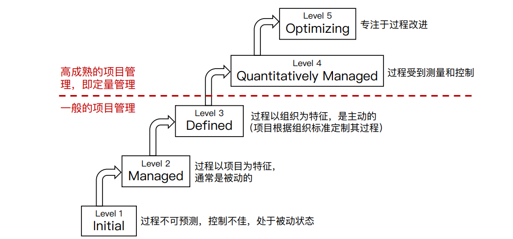

 基于数据，主要关心

- 你对当前状态理解是否有足够信心？
- 对偏差的理解 

回答如下典型问题

- 项目最后能否成功？多大把握？是否需要预防？
- 如果某些方面进行调整，会有什么不同的结果？  

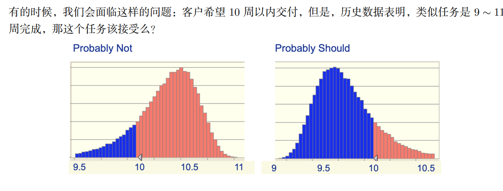

####  定量管理基本范式 

构建定量模型 

- 子过程能力基线
-  过程模型 

应用模型：监控影响子过程的关键因素  

####  定量模型构建的关键实践  

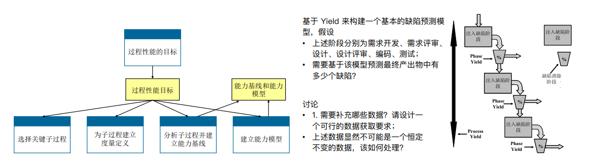

####  定量模型应用（定量管理）的关键实践  

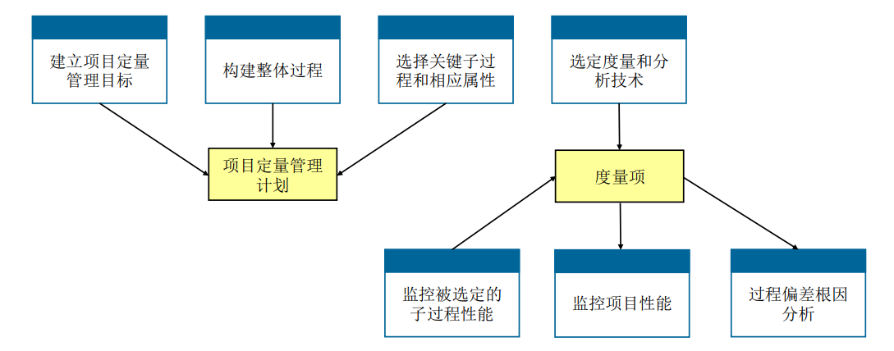

####  常用定量管理技术

定量管理技术通常被分为非统计技术和统计技术，这些技术的使用能帮助解决软件项目管理中多种问题  

- 非： 检查表（或列联表），帕累托图，直方图  
- 统计： 统计过程控制图，回归分析，方差分析，预测区间，假设检验，敏感性分析  

# 质量管理

## 概念

挑战：三要素

软件项目的日程、成本以及质量三大目标统一于质量目标  

### 什么是软件质量？

与软件产品满足规定的和隐含的需求能力有关的特征或者特征的全体 

PSP 中定义质量为满足用户需求的程度，需要明确用户需求的**范围、优先级、度量方式**  

软件质量分为**内外两部分的特性**

- 其外部质量特性面向软件产品的最终用户
- 其内部质量特性不直接面向最终用户  

### PSP质量策略

**用缺陷管理代替质量管理 ：**高质量产品也就意味着要求组成软件产品的各个组件基本无缺陷

各个组件的高质量是通过**高质量评审**来实现的

#### 为什么有效？

提高生产效率，通过关注每个组件的质量，往往可以避免在集成测试和系统测试消除

大量缺陷，减少消除代价，提升生产效率  

### 面向用户的质量观

考虑需求优先级：第一是功能性

### 测试消除缺陷的典型流程

1. 发现待测程序的一个异常行为
2. 理解程序的工作方式
3. 调试程序，找到出错的位置，确定出错的原因： 非常耗时，在项目后期可能会消耗数天甚至数 周的时间
4. 确定修改方案，修改缺陷
5. 回归测试，以确认修改有效

### 

## 评审

###  评审的具体形式 

个人评审 → 小组评审 

小组评审的意义

- 有利于更好地发现缺陷，预防风险，提高 Process Yield 进而确保质量
- 在个人评审之后安排小组评审，也有利于提升个人的技能。特别是那些个人评审未发现而小组评审 发现的缺陷，往往都需要引起足够的注意。软件工程师通过对这些缺陷的分析，往往可以学到很多东 西  

###  评审的考虑 

- 设计的时候采用的策略是自顶向下、逐层精化，这有利于建立系统的整体观  
-  实现的时候为了方便对实现结果评审，建议采用自底向上的方式进行，首先实现底层的内容，然后对 这些底层的模块进行评审，有利于复用策略的应用  

### 评审检查表

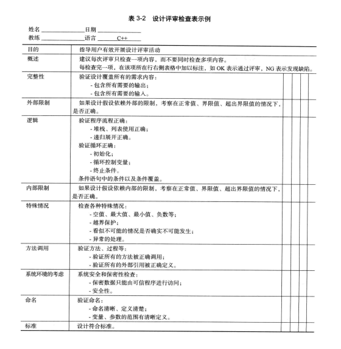

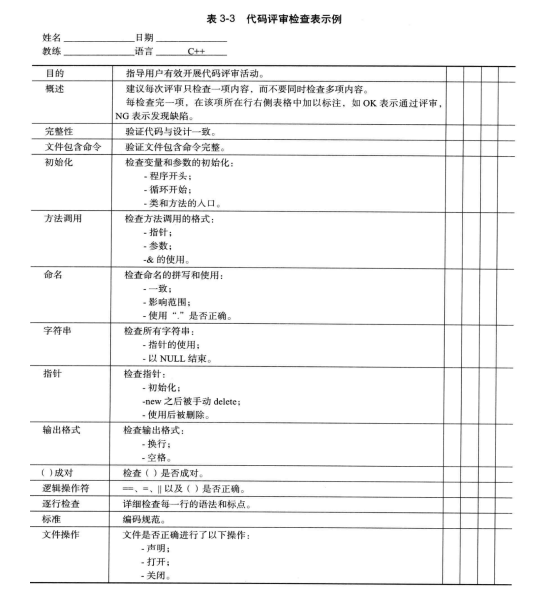

###  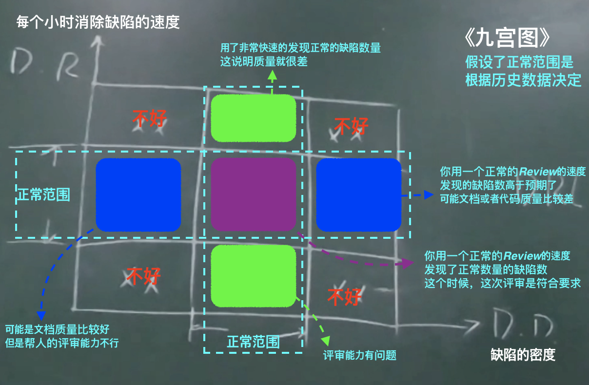

### 评审形式 

打印后评审效果更好

单个屏幕可以展现的内容比较有限（评审对象比较复杂的时候，单个屏幕往往不能体现评审对象的整体结构、整体安全、整体性能以及其他整体属性） 

评审人员的注意力：基于屏幕的评审往往容易受到干扰，从而影响评审人员的注意力  

### 评审时机 

#### 编译、评审 

- 对于某些类型的缺陷而言，**通过编译发现并消除的效率往往是通过评审发现并消除的数倍** 
- 越来越强大的编译器一般可以发现超过 90% 的拼写错误 
-  不管怎么努力，评审还有会遗漏约 20 ∼ 50% 的语法错误 
- 即便编译器遗漏了一些类似语法的错误，这些错误也不难通过单元测试消除 

#### 评审、编译

- 编译器发现问题的能力是不变的。是否有测试，代码评审的时间是一样的，因为必须找出所有错误，只要评审速度不变，代码评审时间也就不会变。先做代码评审再做测试，总时间会更少；同时可以提升代码评审的技能。
- 评审必须保持一个态度：期望通过代码评审找到所有的错误
- 如果代码经过测试了，可能评审过程中会认可代码没什么问题。如果没经过测试在代码评审的过程中会更加谨慎。

- 编译器会大概会遗漏 9% 左右的缺陷，从前面讨论可知，为了有较高的质量，这些缺陷仍然期望通过评审加以消除
- 有数据表明，**编译过程中缺陷较多，往往意味着单元测试中缺陷也较多**
-  即便单元测试也可以发现一些类似语法的错误，但是，毕竟还有些很难发现，而单元测试之后的一些缺陷消除环节的 Pahse Yield 往往还低于单元测试 
- 编译之前评审也是一种自我学习的好机会
- **干净的编译，即编译过程没有缺陷对于软件工程师来说，也有极大的成就感**  

### 评审发现缺陷的典型流程 

在如下的步骤中，每一步消耗的时间都不会太多。尽管评审的技能因人而异，但是，通过适当培训和积 累，有经验的评审者可以发现 80% 左右的缺陷 

- 遵循评审者的逻辑来理解程序流程 
- 发现缺陷的同时，也知道了缺陷的位置和原因
- 修正缺陷  

## Yield

### Yield计算方法

Yield指标用以度量每个阶段在消除缺陷方面的效率

- 
- 

- 【编译不会注入缺陷】

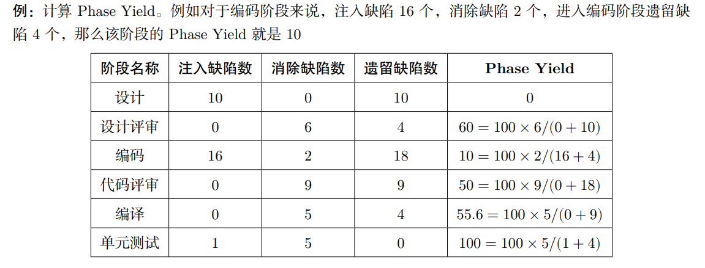

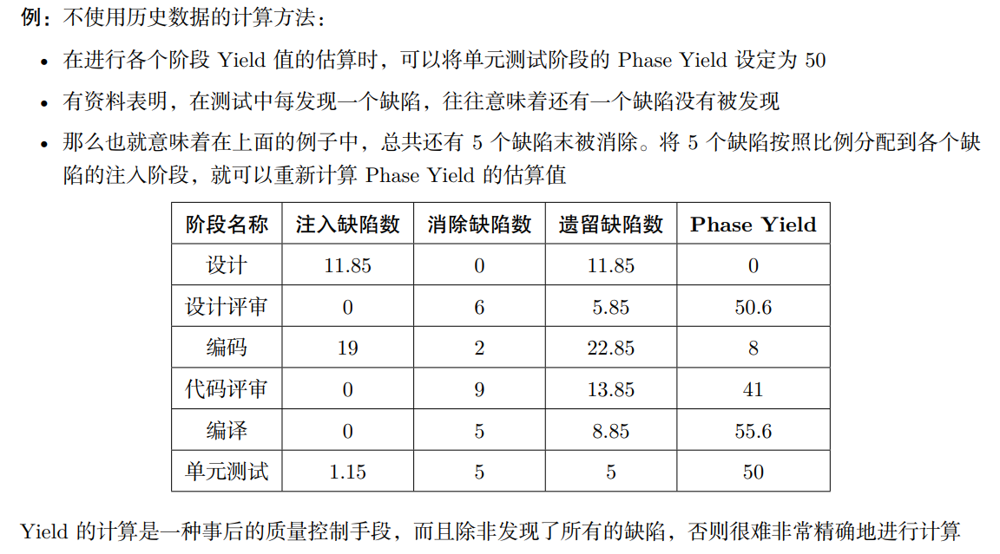

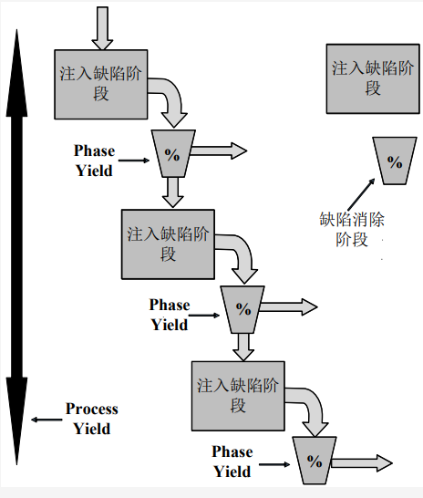

### A/FR

**A/FR = PSP质检成本/PSP失效成本；（期望值是2.0）**

PSP中定义的质检成本为**设计评审时间与代码评审时间之和**。

PSP中定义的失效成本为**编译时间和单元测试时间之和**。

- 理论上，A/FR的值越大，往往意味着越高的质量。
- 过高的A/FR往往意味着做了过多的评审，反而会导致开发效率的下降

### PQI计算方法

5个数据乘积

设计质量：设计的时间应该大于编码的时间

设计评审质量：设计评审的时间应该大于设计时间的50%

代码评审质量：代码评审时间应该大于编码时间的50%

代码质量：代码的编译缺陷密度应当小于10个/千行

程序质量：代码单元测试缺陷密度应当小于5个/千行

#### 用途： 

- 判断模块开发质量 
- 规划质量活动计划
- 过程改进  

### Review Rate计算方法

PSP的实践中，代码评审速度小于200 LOC/小时，文档评审速度小于4 Page/小时

### DRL计算方法  Defect-Removal-Leverage  

**缺陷消除效率比**度量的是不同缺陷消除阶段消除缺陷的效率。

 计算方法：以某个测试阶段（一般为单元测试）每小时发现的缺陷数为基础，其他阶段每小时发现缺陷数与该测试阶段每小时发现的缺陷的比值就是 DRL  

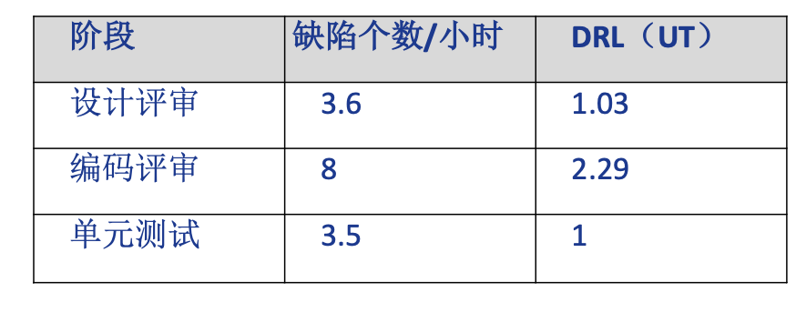

## 质量路线图

### 质量路径  journey

Step1：各种测试

Step2：进入测试之前的产物质量提升

Step3：评审过程度量和稳定

Step4：质量意识和主人翁态度

Step5：个体review的度量和稳定

Step6：诉诸设计

Step7：缺陷预防

Step8：用户质量观——其他质量属性

步骤

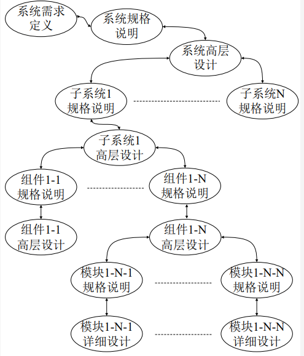

## 设计

要设计哪些信息：模板

1. 设计目标程序在整个应用系统中的**位置**
2. 设计目标程序的**使用方式**
3. 设计目标程序与**其他组件以及模块之间的关系**
4. 设计目标程序**外部可见的变量和方法**
5. 设计目标程序**内部运作机制**
6. 设计目标程序**内部静态逻辑**

###  设计内容  

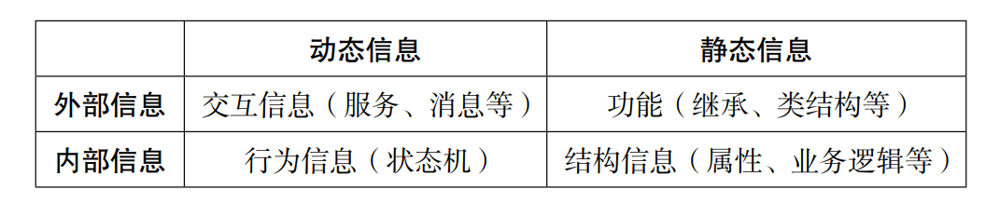

###  PSP 设计模板 

- 操作规格模板 (Operational Specification Template, OST)
- 功能规格模板 (Functional Specification Template, FST)
- 状态规格模板 (State Specification Template, SST)
- 逻辑规格模板 (Logical Specification Template, LST)  

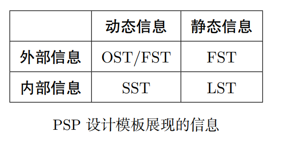

####  操作规格模板 OST

描述系统与外界的交互，用于场景描述：也就是用户与待设计系统的正常情况和异常情况下的交互

- 定义测试场景和测试用例，用来与用户讨论需求的基础，特别是操作相关的需求描述
-  与 UML 比较：用例图、时序图 

#### 功能规格模板 FST 

描述系统的对外接口，是一种静态信息的展现

- 提供的典型信息有类和继承关系、外部可见的 属性和方法等
- 用形式化符号等方法描述方法等行为，消除二义性 
- 与 UML 对比：UML 类图，但类图的方法的行为没有描述 

####  状态规格模板 SST 

可以精确定义程序的所有状态、状态之间的转换以及伴随着每次状态转换的动作 

SST 模板中，需要描述如下的信息

- 所有状态的名称 
- 所有状态的简要描述 
- 在 SST 中需要使用的参数和 方法的名称与描述
- 状态转换的条件
- 状态转换是发生的动作 
- 与 UML 对比：UML 状态图

####  逻辑规格模板 LST 

可以精确描述系统的内部静态逻辑。为了消除描述的二义性，一般建议使用伪代码配合形式化符号来描述设计结果 LST 模板中，需要描述如下的信息

- 关键方法的静态逻辑
- 方法的调用
- 外部引用
- 关键数据的类型和定义 
- 与 UML 对比：没有对应图  

### 设计的过程

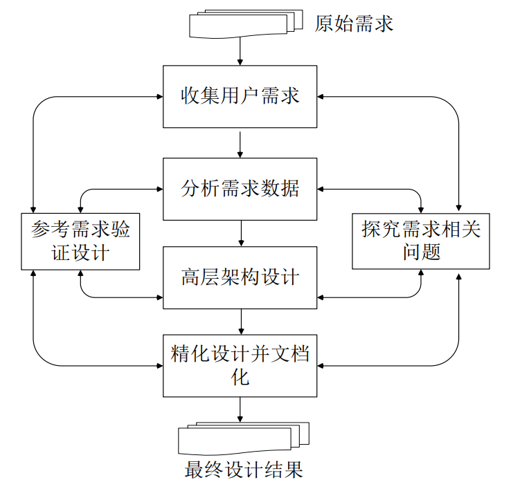

设计的层次：内部外部静态动态，自顶向下

###  PSP 设计验证方法  

**符号化验证是唯一一种提供全面设计验证的手段**

**符号化执行容易引入人为错误**

**状态机验证、符号化验证是提供一般意义的上的正确性检验的验证手段**

**执行表的对设计缺陷的验证能力强于跟踪表（弱于跟踪表，跟踪表是执行表的扩展）**

**正确性检验是唯一可靠的设计验证手段（真值表也是）**

#### 状态机

 检查状态机的**完整性**和**正交性**

- 完整性：对于状态机中任何一个状态，对应的所有条件组合，下一个状态的转换都有定义
- 正交性：对于状态机中任何一个状态，其所有下一个状态的转换条件都不能相同 

验证步骤：  

1. 检查状态机，消除死循环和陷阱状态
2. 检查状态转换，验证完整性和正交性
3. 评价状态机，检验是否体现设计意图

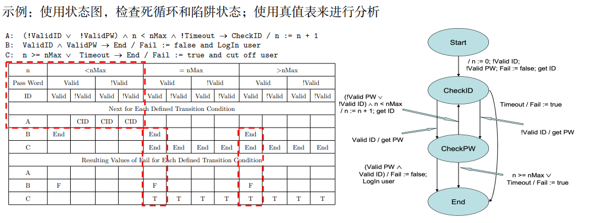

#### 符号化验证

将描述设计的逻辑规格（一般用伪代码程序表示）用代数符号来表示，然后系统地开展分析和验证
验证步骤：

1. 识别伪码程序中的关键变量
2. 将这些变量使用代数符号表示，重写伪码程序
3. 分析伪码程序的行为

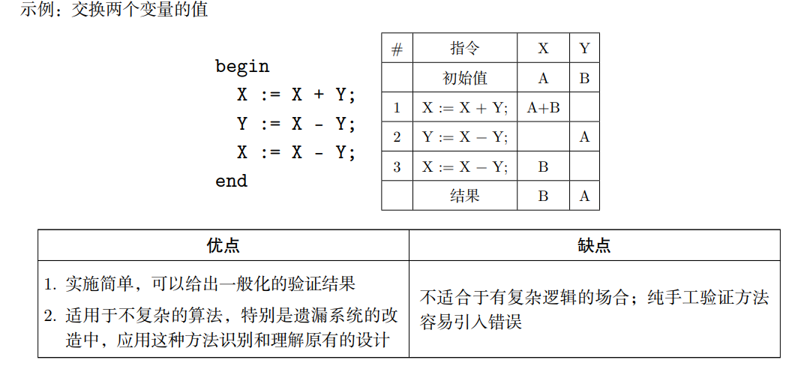

#### 执行表验证

步骤：

1. 识别伪码程序的关键变量
2. 构建表格，表格左侧填入主要程序步骤，右侧 填入关键变量
3. 初始化被选定的变量
4. 跟踪被选择的关键变量的变化情况，从而判断 程序行为 

优点：实施简单；结果可靠，可用于**复杂逻辑的验证** 

缺点：每次只能验证一个用例；**手工**验证比较耗时，**容易引入错误**

#### 跟踪表验证

步骤：

1. **识别**伪码程序的**关键变量**
2. 构建表格，表格左侧填入主要程序步骤，右侧 填入关键变量
3. 初始化被选定的变量
4. 识别将**伪码程序**符号化的机会，并**加以符号化**
5. **定义并且优化用例组合**
6. **跟踪被选择的关键变量的变化情况**，从而判断程序行动 

跟踪表应用符号化以及用例识别等方法，对**程序的一般化行为进行验证**，是执行表验证的补充，可以每次验证多个用例，从而提供更加高效地开展验证工作

#### 正确性验证 

**将伪码程序当做数字定理，采用形式化方法加以推理和验证** 

步骤：

1. 分析和识别用例
2. 对于复杂伪码程序的结构，应用正确性验证的 标准问题逐项加以验证
3. 对于不能明确判断的复杂程序结果，使用跟踪 表等辅助验证 

While-Do 循环的验证

1. 条件 1：condition 是否最终一定会为“假”，从而使得循环可以结束。
2. 条件 2：condition 为“真”的时候，单独的循环结构执行结果与循环体再加一个循环结构，其执行 结果是否一致？
3. 条件 3：condition 为“假”的时候，循环体内所有变量是否未被修改？

# 工程技术

## 需求

 需求开发包含需求获取、需求汇总、需求验证  

客户需求

产品需求

产品经理

**客户需求**描述的是**客户的期望，是客户解决问题的愿望**

- 客户需求可能很简单，也可能很复杂；可能很清晰，也可能模糊

- 比如，客户希望有一种快速进行数据计算的工具帮助其完成繁琐的计算工作 

**产品需求**描述的是**开发团队所提供的解决方案**。即针对上述的客户需求，开发团队设计出一个可以帮助 客户解决工作当中碰到的问题的方案。

**产品组件需求**描述的是**组成产品的各个组件的需求规格。**

- 与产品需求相比，这是更低层次，更为细致的描述了上述解决方案中的某个组件的功能、性能与形式等。  

请解释需求开发中客户需求和产品需求的差别，并设计一个流程来完成需求开发工作  

### 需求获取 

需求是采用“诱导”式方法获取客户的显式需求和隐式需求，尽可能的识别客户的期望与所受到的限制 

- “诱导”不仅仅是普通的需求采集，隐含了更加积极地、前瞻性地识别那些客户没有明确提供的额外需求 
- 客户所受到的限制也应当作为需求开发过后需要关注的内容。限制包括技术、成本、时间、风险、行业规则、法律等等  

###  需求汇总 

- **整理各种来源的信息，识别缺失的信息**
- 解决冲突的需求

- 需求的整理和转化：我们需要将客户的需求转换为产品需求和产品组件的需求 
- 推导未显式描述的需求内容，例如采用某项技术的附属需求  

###  需求验证 

对需求进行分析和确认，以确保符合使用者预期，典型活动包括：

- **建立和维护操作概念和相关的场景**；场景一般而言是指使用产品时可能发生的时间顺序  
- **分析需求**，以确保其必要性、充分性和平衡性
- **确认需求**，以确保将要产生的产品能在预期的用户环境中运行并且工作正常  

## 设计

自顶向下

###  复用性支持 

在设计阶段必须要充分考虑复用的可能。为了支持复用，软件项目团队需要建立一套复用管理流程，具体 而言，包括：

- 复用接口标准
- 复用文档标准
- 复用质量保证机制  

###  可测试性考虑 

设计可测试性考虑主要体现在两方面： 

- 要尽可能减少测试代码的数量
- 要制作合理的测试计划

### 可用性考虑 

- 可用性的问题应当在设计阶段就开始考虑，而不能推延到实现阶段
- 针对每一个关键功能都定义操作概念和操作场景 
-  分析操作场景以确保软件系统开发完成之后，系统使用者会满意
- 必要时，可以邀请最终用户参与场景的评审，使用模拟、原型等技术，更好的把握用户真实意图  

## 实现

### 评审的考虑 

- 设计的时候采用的策略是自顶向下、逐层精化，这有利于建立系统的整体观  
-  实现的时候为了方便对实现结果评审，建议采用自底向上的方式进行，首先实现底层的内容，然后对 这些底层的模块进行评审，有利于复用策略的应用  

###  可测试性考虑 

实现计划必须与测试计划一致，不能出现集体测试的时候部分模块未实现的情况  

###  复用策略 

采用自底向上的开发策略有利于进行复用，几个经典的复用策略： 

- 编码注释的应用：编码注释采用统一格式，标明功能，调用方式。异常信息等有利于复用的信息 
- **站立式会议**：在会上，团队成员可以讨论实现计划，识别可复用组件，了解现有的复用组件库的内容  

## 集成

cicd是哪一种 ：逐一添加？

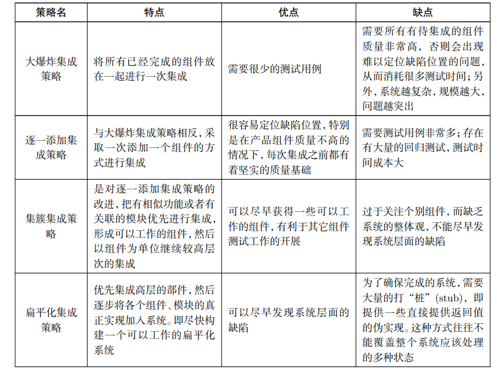

##  团队工程开发：验证与确认  V&V

-  **验证 (Verification) 活动**也是检验获得的产品和产品组件能不能满足各自事先定义好的需求规格 
- **确认 (Validation) 活动**是为了确保产品可以满足客户的需求以及实际操作场景的要求
- 验证 (Verification) 和确认 (Validation) 都是为了提升最终产品的质量而采取的措施  

### 验证和确认的目的不同：

验证的目的是确保选定的工作产品与事先指定给该工作产品的**需求（即产品需求或产品组件需求）一致**

确认的目的则是确保**开发完成的产品**或者产品组件在即将要使用该产品或者产品组件的**环境中工作正确**，关注的是**客户需求的满足**

验证和确认又是相互依存、关系紧密的两个活动

**验证活动的依据来源于确认的目标**，即产品组件需求必须与客户需求一致

**验证活动为确认活动提供了前提条件**，在完成产品需求和产品组件需求之前，考虑客户需求是否满 足是没有意义的  

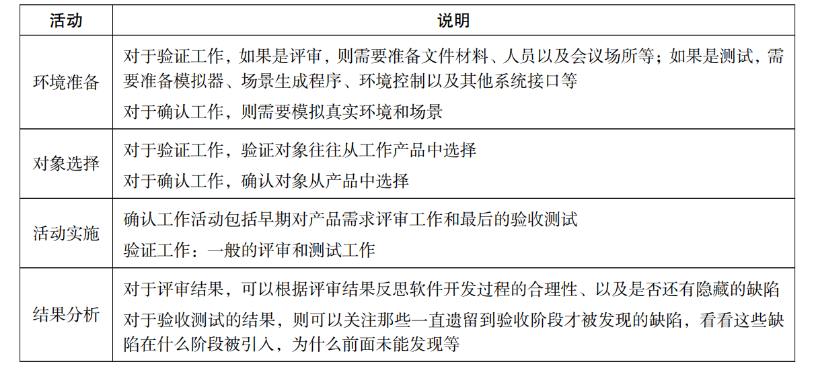

- 单元测试：验证 
- 集成：验证 
- 详细设计评审：验证
- 需求评审：确认
- 验收测试：确认  

**需要向客户提交的工作产品是确认的对象**

##  团队项目规划：WBS 与范围管理  

 工作分解结构 (WBS, Work Breakdown Structure) 是以可交付成果为导向对满足项目目标和开发交付产物的项目相关工作进行的分解

- 它归纳和定义了项目的整个工作范围
- 每下降一层代表对项目工作的更详细定义  

###  创建 WBS 

将复杂的项目逐步分解为一系列明确定义的工作任务并作为随后计划活动的指导文档 要将整个项目分解成工作包： 

1. 识别和分析可交付成果以及相关工作 
2. 确定工作分解结构的结构与编排方法 
3. 自上而下逐层细化分解 
4. **为工作分解结构组成部分制定和分配标志编码** 
5. 核实工作分解的程度是必要且充分的  

###  范围管理 

包括确保项目做且只做成功完成项目所需的全部工作的各过程，WBS 为范围管理提供了基础： 

- 收集需求 
- 定义范围
- 创建 WBS 
-  核实范围 
- 控制范围变更  

##  生命周期模型选择  

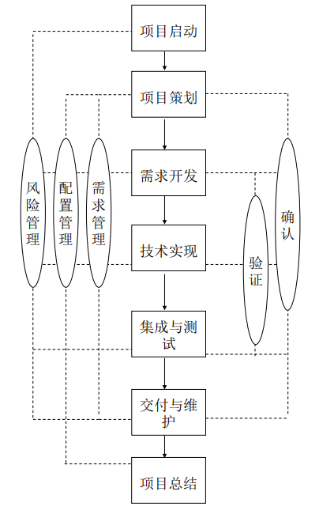

## 计划

**任务计划**描述了项目所有的任务清单，任务之间的先后顺序以及每个任务所需时间资源

**日程计划**描述了每个任务在日志上的安排，即每个任务计划哪天开始和计划哪天结束  

 典型计划流程回顾 

- 估算规模
- 估算资源 
- 规划日程  

###  质量计划原理和方法 

项目的质量计划中应当确定需要开展的质量保证活动 

- 典型的质量保证活动包括了个人评审、 团队评审、单元测试、集成测试以及验收 测试等
- 在质量计划中需要解决的关键问题是该 开展哪些活动，以及这些活动开展的程度，如时间、人数和目标是什么  

###  风险计划  

 风险管理的目标是：在风险发生前，识别出潜在的问题，以便在产品或项目的生命周期中规划和实施风险 管理活动，以消除潜在问题对项目产生的负面影响  

 风险管理大致分为两部分，即风险识别和风险应对  

典型的识别方法：

1. 检查 WBS 的每个组件以找出相应的风险
2. 使用定义好的风险分类表上来评估风险
3. 访谈相关的领域专家
4. 与类似项目进行比较来审查风险管理
5. 检查以往项目的总结报告或组织级数据库
6. 检查设计规格和协议书需求 

典型的风险识别活动包括：

1. 识别与**成本、进度及绩效**相关的风险
2. 审查可能影响项目的**环境因素**
3. 审查工作**分解结构的所有组件**，作为风险识别 的一部分，以协助确保所有的工作投入均已考 虑
4. 审查**项目计划的所有组件**，作为风险识别的一 部分，以确保项目在各方面均已考虑
5. 记录风险的内容、条件及可能的结果
6. 识别每一风险相关的干系人
7. 利用**已定义的风险参数**，评估已识别的风险
8. 依照定义的风险类别，将风险分类并分组 

1. 可能性很低，但是发生影响程度很大：政策变化、领导层大规模变动、公司倒闭
2. [𝑃（可能性）, 𝐼（影响程度）, 𝑇（阈值）]

####  风险应对  

# 其他

## 配置管理

目的： 建立与维护工作产品的完整性  

 配置项：

- 在配置管理当中作为单独实体进行管理和控制的**工作产品集合** 
- 典型的可能作为配置项纳入配置管理的工作产品包含**过程说明文档、项目开发计划文档、需求规格 说明书、设计规格说明书、设计图表、产品规格说明书、程序代码、开发环境，如特定版本的编译器** 等、**产品数据文件、产品技术文件、用户支持文档** 

基线：

基线是**一个或多个配置项及相关的标识符的代表**，是一组**经正式审查同意**的规格或工作产品集合， 是**未来开发工作或交付的基础**，而且只能经**由严格的变更控制程序才能改变** 

- 发布一个基线包括该基线所有的配置项以及这些配置项的最新变更，因此，可以将基线作为接下来 工作的基础
- 典型的发布基线时间点为需求分析之后、设计完成之后、单元测试之后以及最终产品发布
- 是配置项持续演进的稳定基础  

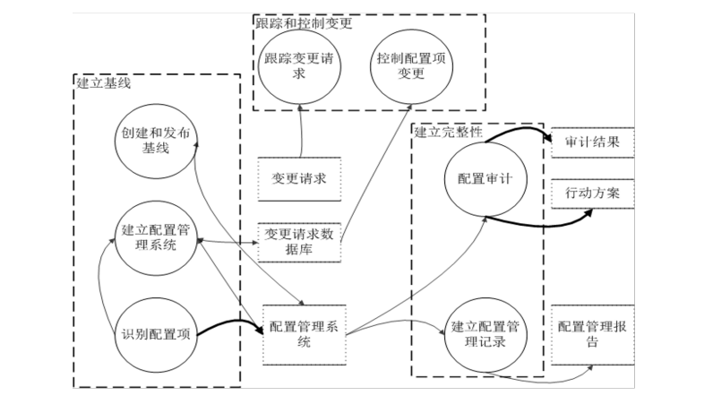

1. 识别配置项
2. 建立配置管理系统
3. 创建和发布基线
4. 跟踪变更请求
5. 控制配置项变更
6. 建立配置管理记录
7. 配置审计

 跟踪变更请求 

- 启动变更请求处理程序，将变更情况保存在变更请求数据库中
- 分析变更建议和所需进行的修改将对工作产品、进度、日程等造成的影响

- 如果变更请求影响到其他基线，则与相关的干系人一起审查这些变更请求，并取得他们的同意 – 跟踪变更申请直到结项 

控制配置项变更 

- 确认这些修订已得授权 
-  更新配置项
-  将旧基线归档保存，并获取新基线
-  执行审查，确保该变更没有对基线造成意料外的影响
- 上当记录配置项的变更内容和变更理由  

## 度量和分析

 目的：建立与维持度量能力，以支持管理的信息需要  

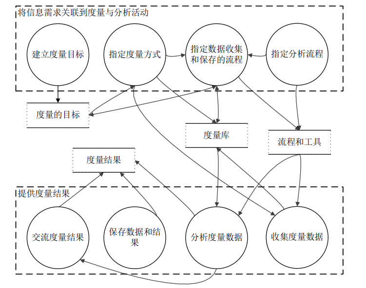

1. 建立度量目标
2. 指定度量方式
3. 指定数据收集和保存的流程
4. 指定分析流程
5. 收集度量数据
6. 分析度量数据
7. 保存数据和结果
8. 交流度量结果

###  GQM(Goal Question Metric)

 是一种 应用非常广泛的建立软件度量体系的方法，从管理的目标出发，将目标归纳、分解为度量的指标，并把这些指标提炼成可以测量的值，是一种科 学的、系统的思考问题的方式

- 概念层（目标）：目标是为某个特定的对象而定义的。这里的对象是指软件产品、软件过程以及相关的资源等。定义的目标基于不同原因和不同质量模型，也要参考不同的角色视图与特定的环境
- 操作层（问题）：基于一定的刻画上述目标是否达成或者目标达成的进展情况的模型，使用一系列问题来定义所研究的对象, 然后得出评价或评估特定目标达成进展情况。所选择的问题应当尽量体现 质量相关的话题
- 量化层（度量）：试图以量化的方式回答上述操作层识别出来的问题  

 例：GQM 示例：

- G: 确保稳定性、可预测性的开发过程来满足计 划的里程碑。
-  Q: 我的项目是否按照计划的轨迹前进，计划的 里程碑都能实现吗？
- M: 软件项目开发工作的挥发性（分支、流、变 更管理 (UCM) 活动）。 

例：GQM 示例：DM 

- G: 最大化所有团队贡献者的生产力。
- Q: 开发人员能够完成分配给他们的任务吗，或 者他们遇到障碍了吗？
-  M: 由个体或者工作组产生的项目工件的数量  

## 决策分析和解决方案

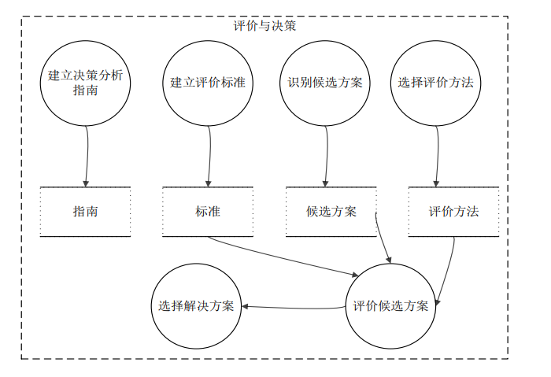

1. 建立决策分析指南
2. 建立**评价标准（关键）**
3. 识别候选方案
4. 选择评价方法
5. 评价候选方案
6. 选择解决方案

## 根因分析和解决方案

2-8法则：用来选择问题、选出分析想

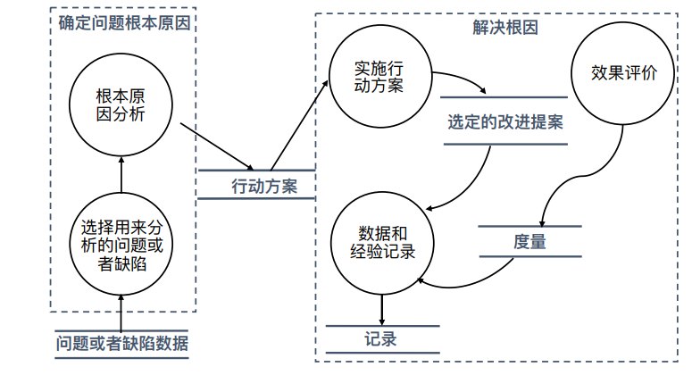

鱼骨图：归因

典型角度：技术、人员、过程、培训

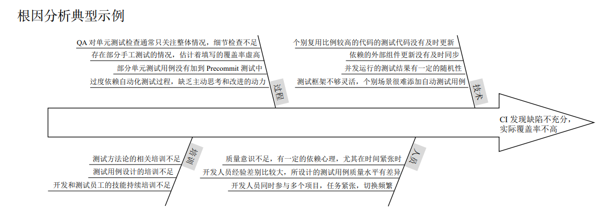

# 课件习题

[2024软件质量管理复习+2024回忆 | wbl-z’s Blog](https://wbl-z.github.io/软件质量管理/软件质量管理复习/#1-6-lec7)