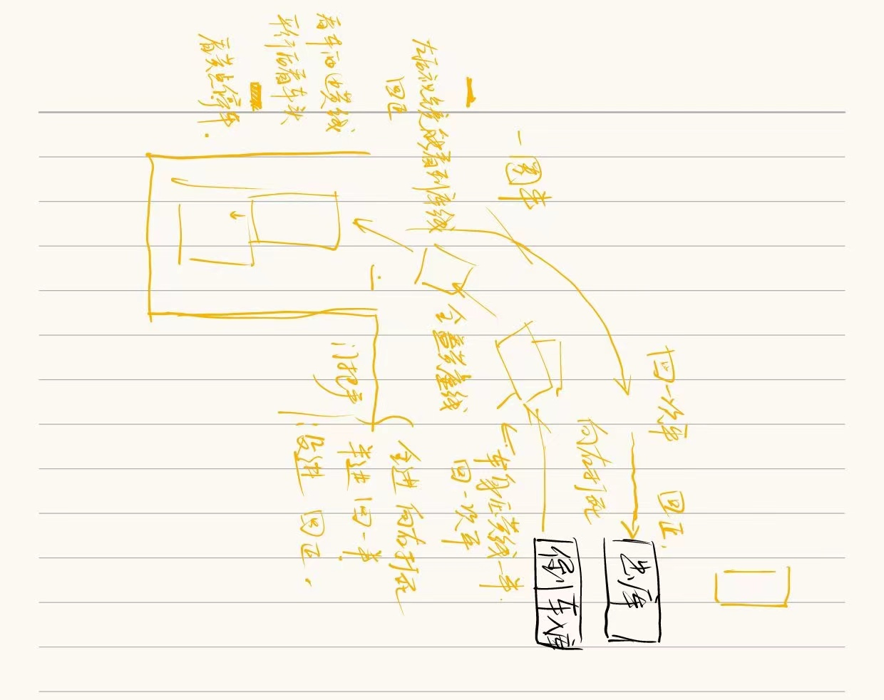

# 驾考-科目二

## 右倒车入库

小黄点 一圈半

车身快要正 回一次平

肩膀到黄线并且车头回正 回正

倒车 

肩膀快要到白点 向右打死

右后视镜 车身压黄线一半 回一次平

车身全盖黄虚线

门把手

全进 向右打死

半进 回一半

没进 回正

看左后视镜能看到库线 回正

看车两边黄线 哪边大往哪边大

平行后看车头 哪边偏往哪打 迅速回正

看黄点停车

[项目详细讲解：上车准备步骤及细节。_哔哩哔哩_bilibili](https://www.bilibili.com/video/BV1f34y1i7To/?spm_id_from=333.788&vd_source=c4821631e200ec0159f2f2930dd99556)